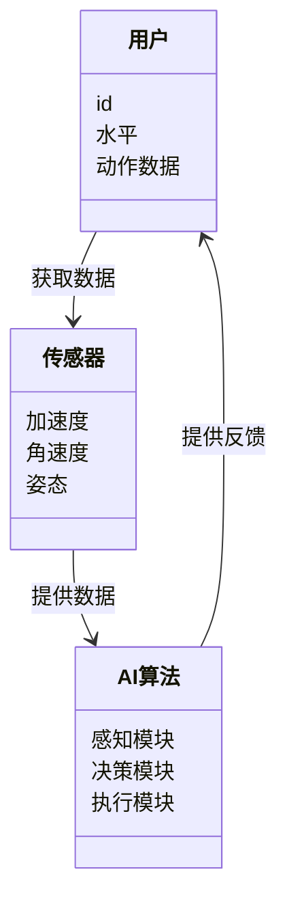
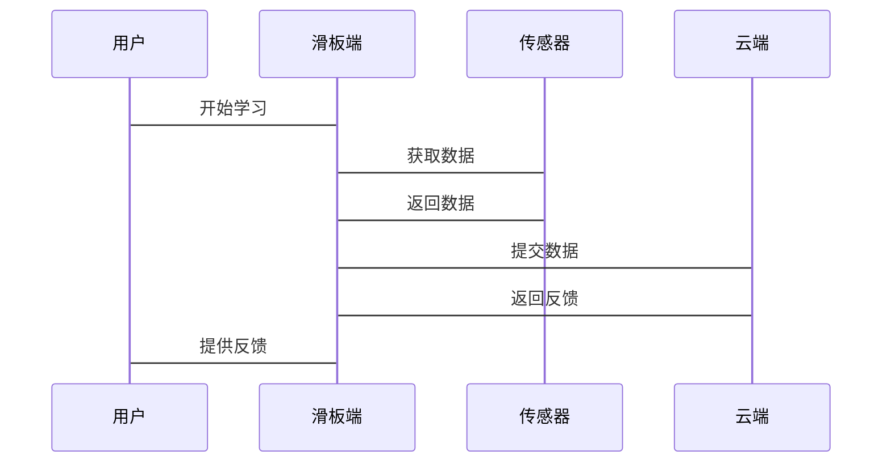
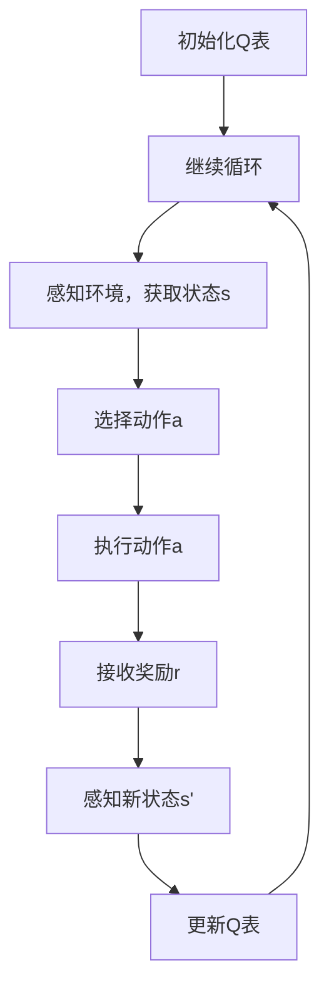
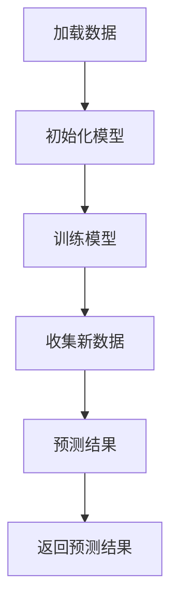

                 


# AI Agent在智能滑板中的技巧学习指导

## 关键词
AI Agent, 智能滑板, 人工智能, 机器学习, 强化学习, 滑板技巧, 技术博客

## 摘要
本文将探讨AI Agent在智能滑板中的应用，特别是如何通过AI技术提升滑板技巧的学习效率。文章首先介绍了AI Agent的基本概念和智能滑板的特点，然后详细讲解了AI Agent的核心算法和系统架构，最后通过项目实战展示了如何在实际中应用这些技术。文章内容涵盖了从理论到实践的各个方面，帮助读者全面理解AI Agent在智能滑板中的作用和实现方式。

---

# 第一部分: AI Agent在智能滑板中的背景与基础

## 第1章: AI Agent与智能滑板概述

### 1.1 AI Agent的基本概念

#### 1.1.1 人工智能代理（AI Agent）的定义
人工智能代理（AI Agent）是指能够感知环境、做出决策并执行动作的智能实体。它可以是一个软件程序，也可以是一个物理设备，通过传感器和执行器与环境交互。AI Agent的核心目标是通过自主学习和优化，实现特定任务的高效完成。

#### 1.1.2 AI Agent的核心特征
- **自主性**：AI Agent能够在没有外部干预的情况下自主运行。
- **反应性**：能够实时感知环境并做出反应。
- **学习能力**：通过数据和经验不断优化自身的性能。
- **决策能力**：基于当前状态和目标，做出最优决策。

#### 1.1.3 AI Agent在滑板中的应用背景
滑板是一项需要精准控制和协调的运动，AI Agent可以通过实时分析滑板的运动数据、用户的动作以及环境信息，帮助用户优化技巧、避免受伤并提高学习效率。

### 1.2 智能滑板的定义与特点

#### 1.2.1 智能滑板的定义
智能滑板是一种结合了传感器、执行器和AI技术的滑板，能够通过内置的传感器收集用户的动作数据，并通过AI算法提供实时反馈和优化建议。

#### 1.2.2 智能滑板的核心技术
- **传感器技术**：用于收集滑板的运动数据，如加速度、角速度、姿态等。
- **AI算法**：用于分析数据并生成反馈或优化建议。
- **执行器技术**：用于根据AI算法的决策调整滑板的运动，例如通过震动或声音提示用户。

#### 1.2.3 智能滑板与传统滑板的区别
智能滑板的核心区别在于其内置的AI技术，能够实时分析用户的动作并提供反馈，而传统滑板仅是一个物理工具，无法提供智能化的指导。

### 1.3 AI Agent在滑板技巧学习中的作用

#### 1.3.1 AI Agent如何辅助滑板技巧学习
AI Agent可以通过以下方式辅助滑板技巧学习：
- **实时反馈**：通过传感器收集用户的动作数据，并通过AI算法分析，实时提供反馈。
- **动作优化**：根据用户的动作数据，AI Agent可以识别出不规范的动作，并提供优化建议。
- **个性化训练计划**：基于用户的学习进度和水平，AI Agent可以制定个性化的训练计划。

#### 1.3.2 滑板技巧学习中的常见问题
- **动作不标准**：用户在学习过程中容易出现动作不规范的问题。
- **学习效率低**：传统学习方式效率较低，用户难以快速掌握技巧。
- **受伤风险**：不规范的动作可能导致用户在练习过程中受伤。

#### 1.3.3 AI Agent如何解决这些问题
AI Agent通过实时分析用户的动作数据，识别出不规范的动作并提供优化建议，从而提高学习效率并降低受伤风险。

### 1.4 本章小结
本章介绍了AI Agent的基本概念和智能滑板的特点，重点探讨了AI Agent在滑板技巧学习中的作用。通过AI技术，滑板学习变得更加智能化和高效。

---

## 第2章: AI Agent的核心概念

### 2.1 AI Agent的感知、决策与执行

#### 2.1.1 感知模块的作用与实现
感知模块是AI Agent的核心部分，负责收集环境中的数据。在智能滑板中，感知模块主要通过传感器收集滑板的运动数据，如加速度、角速度、姿态等。

#### 2.1.2 决策模块的原理与算法
决策模块是AI Agent的核心部分，负责根据感知模块提供的数据，做出最优决策。在智能滑板中，决策模块可以通过强化学习算法优化用户的动作。

#### 2.1.3 执行模块的实现方式
执行模块是AI Agent的执行部分，负责根据决策模块的决策，调整滑板的运动。在智能滑板中，执行模块可以通过震动或声音提示用户。

### 2.2 AI Agent与滑板技巧学习的关系

#### 2.2.1 滑板技巧学习中的AI Agent应用场景
AI Agent可以在滑板技巧学习的各个环节中发挥作用，例如动作识别、实时反馈、个性化训练等。

#### 2.2.2 AI Agent如何优化滑板技巧学习过程
通过实时分析用户的动作数据，AI Agent可以识别出不规范的动作，并提供优化建议，从而提高学习效率。

#### 2.2.3 AI Agent在滑板技巧学习中的优势
- **高效性**：AI Agent可以通过数据驱动的方式快速识别问题。
- **个性化**：AI Agent可以根据用户的水平制定个性化的训练计划。
- **安全性**：AI Agent可以实时监测用户的动作，降低受伤风险。

### 2.3 AI Agent的核心要素对比

#### 2.3.1 不同AI技术的对比分析
以下是几种常见AI技术的对比：

| 技术         | 优点                     | 缺点                     |
|--------------|--------------------------|--------------------------|
| 规则引擎     | 实现简单                 | 无法应对复杂情况         |
| 机器学习     | 可以处理复杂问题         | 需要大量数据             |
| 强化学习     | 可以通过试错优化决策       | 需要大量的训练时间       |

#### 2.3.2 AI Agent与其他AI技术的区别
AI Agent的核心区别在于其具有自主性和反应性，能够根据环境的变化做出实时决策。

#### 2.3.3 核心要素对比表格（见附录）
以下是核心要素对比表格：

| 核心要素   | 定义                     | 作用                     |
|------------|--------------------------|--------------------------|
| 感知模块   | 收集环境数据             | 提供决策依据             |
| 决策模块   | 根据感知数据做出决策     | 优化用户动作             |
| 执行模块   | 根据决策调整滑板运动     | 提供实时反馈             |

### 2.4 本章小结
本章详细讲解了AI Agent的核心概念，包括感知、决策和执行模块的作用与实现方式，并对比了不同AI技术的优缺点。

---

## 第3章: AI Agent的核心算法

### 3.1 强化学习算法

#### 3.1.1 强化学习的基本原理
强化学习是一种通过试错机制优化决策的算法。AI Agent通过与环境交互，不断尝试不同的动作，并根据反馈调整策略，最终找到最优解。

#### 3.1.2 Q-learning算法的实现
以下是Q-learning算法的伪代码：

```python
def q_learning():
    初始化Q表
    while True:
        状态s = 环境感知
        动作a = 选择动作（基于Q表）
        执行动作a
        奖励r = 环境反馈
        新状态s' = 环境感知
        Q[s][a] = Q[s][a] + α*(r + γ*max(Q[s'][a']) - Q[s][a])
```

#### 3.1.3 算法流程图（见附录）

### 3.2 监督学习算法

#### 3.2.1 监督学习的基本原理
监督学习是一种通过标注数据训练模型的算法。AI Agent可以通过监督学习算法识别用户的动作。

#### 3.2.2 分类算法的实现
以下是监督学习分类算法的伪代码：

```python
def supervised_learning():
    训练数据集 = 加载数据
    模型 = 初始化模型
    模型.fit(训练数据集)
    测试数据 = 收集新数据
    预测结果 = 模型.predict(测试数据)
    返回预测结果
```

#### 3.2.3 算法流程图（见附录）

### 3.3 深度学习算法

#### 3.3.1 深度学习的基本原理
深度学习是一种通过多层神经网络学习数据特征的算法。AI Agent可以通过深度学习算法识别复杂的用户动作。

#### 3.3.2 神经网络的实现
以下是深度学习算法的伪代码：

```python
def deep_learning():
    训练数据集 = 加载数据
    神经网络模型 = 初始化模型
    模型.fit(训练数据集)
    测试数据 = 收集新数据
    预测结果 = 模型.predict(测试数据)
    返回预测结果
```

#### 3.3.3 算法流程图（见附录）

### 3.4 算法选择与优化

#### 3.4.1 不同算法的对比分析
以下是几种常见算法的对比：

| 算法         | 优点                     | 缺点                     |
|--------------|--------------------------|--------------------------|
| 强化学习     | 可以通过试错优化决策       | 需要大量的训练时间       |
| 监督学习     | 实现简单                 | 无法处理动态环境         |
| 深度学习     | 可以处理复杂数据         | 计算资源消耗大           |

#### 3.4.2 算法选择的建议
在实际应用中，应根据具体问题选择合适的算法。例如，如果需要实时反馈，强化学习可能是更好的选择。

### 3.5 本章小结
本章详细讲解了AI Agent的核心算法，包括强化学习、监督学习和深度学习的实现方式和优缺点。

---

## 第四部分: 系统分析与架构设计方案

### 第4章: 系统分析与架构设计

#### 4.1 问题场景介绍
智能滑板的系统架构需要考虑传感器数据的采集、AI算法的实现以及用户反馈的交互。

#### 4.2 项目介绍
本项目旨在通过AI Agent优化滑板技巧学习过程，实现实时反馈和个性化训练。

#### 4.3 系统功能设计

##### 4.3.1 领域模型（领域模型 mermaid 类图）
以下是领域模型的类图：



#### 4.4 系统架构设计

##### 4.4.1 系统架构（系统架构 mermaid 架构图）
以下是系统架构图：


#### 4.5 系统接口设计
系统接口设计包括滑板端与用户端的交互接口，以及滑板端与云端的接口。

#### 4.6 系统交互设计（系统交互 mermaid 序列图）
以下是系统交互序列图：



### 4.7 本章小结
本章通过系统分析与架构设计，展示了如何将AI Agent应用于智能滑板中，包括系统功能设计和交互设计。

---

## 第五部分: 项目实战

### 第5章: 项目实战

#### 5.1 环境安装

##### 5.1.1 安装Python
```bash
python --version
pip install --upgrade pip
```

##### 5.1.2 安装相关库
```bash
pip install numpy
pip install scikit-learn
pip install tensorflow
```

#### 5.2 系统核心实现

##### 5.2.1 动作识别代码
```python
import numpy as np
from sklearn import neighbors

# 数据预处理
X = np.array([[加速度, 角速度, 姿态]])
y = np.array([动作标签])

# 训练模型
model = neighbors.KNeighborsClassifier()
model.fit(X, y)

# 预测新数据
new_data = np.array([[新的加速度, 新的角速度, 新的姿态]])
预测结果 = model.predict(new_data)
```

##### 5.2.2 实时反馈代码
```python
import tensorflow as tf
from tensorflow import keras

# 加载模型
model = keras.load_model('滑板技巧模型.h5')

# 预测新数据
new_data = np.array([[新的加速度, 新的角速度, 新的姿态]])
预测结果 = model.predict(new_data)
```

#### 5.3 代码应用解读与分析
通过上述代码，可以实现动作识别和实时反馈功能。AI Agent通过传感器数据，实时分析用户的动作，并提供反馈或优化建议。

#### 5.4 实际案例分析
以下是实际案例分析：

1. **案例1**：用户在学习“Ollie”动作时，AI Agent通过传感器数据识别出用户的动作不规范，并提供优化建议。
2. **案例2**：用户在学习“Kickflip”动作时，AI Agent通过强化学习算法优化用户的动作。

#### 5.5 项目小结
本章通过项目实战，展示了如何将AI Agent应用于智能滑板中，包括环境安装、代码实现和实际案例分析。

---

## 第六部分: 总结与展望

### 第6章: 总结与展望

#### 6.1 总结
通过本文的介绍，我们可以看到AI Agent在智能滑板中的应用潜力。AI Agent可以通过实时分析用户的动作数据，提供反馈和优化建议，从而提高滑板技巧的学习效率。

#### 6.2 展望
未来，随着AI技术的不断发展，智能滑板将变得更加智能化和个性化。AI Agent可以通过更多的数据和更复杂的算法，进一步优化用户的滑板技巧学习过程。

---

## 附录

### 附录A: 核心要素对比表格
以下是核心要素对比表格：

| 核心要素   | 定义                     | 作用                     |
|------------|--------------------------|--------------------------|
| 感知模块   | 收集环境数据             | 提供决策依据             |
| 决策模块   | 根据感知数据做出决策     | 优化用户动作             |
| 执行模块   | 根据决策调整滑板运动     | 提供实时反馈             |

### 附录B: 算法流程图

#### 强化学习流程图


#### 监督学习流程图


#### 深度学习流程图


### 附录C: 系统架构图


### 附录D: 系统交互图


---

## 参考文献
1. Russell, S., & Norvig, P. (2010). Artificial Intelligence: A Modern Approach.
2. LeCun, Y., Bengio, Y., & Hinton, G. (2015). Deep learning.
3. Sutton, R. S., & Barto, A. G. (2018). Reinforcement learning: An introduction.

---

# 结语
通过本文的详细讲解，读者可以全面了解AI Agent在智能滑板中的应用，包括核心概念、算法原理、系统架构和项目实战。希望本文能为读者提供有价值的参考，帮助他们在滑板技巧学习中更好地利用AI技术。

