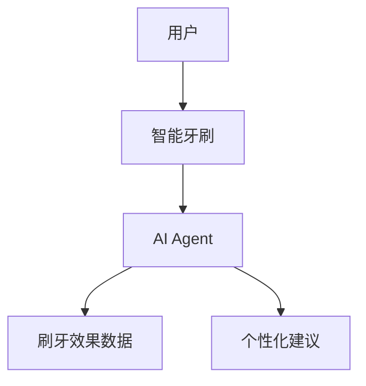
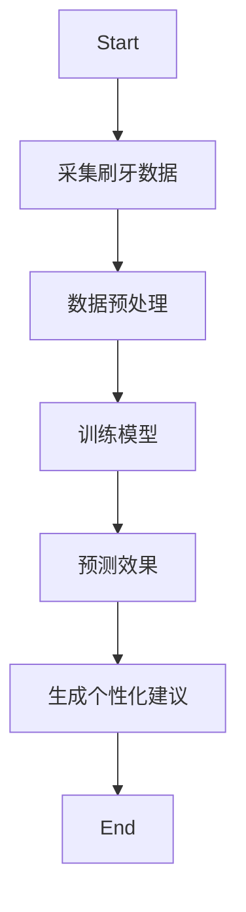
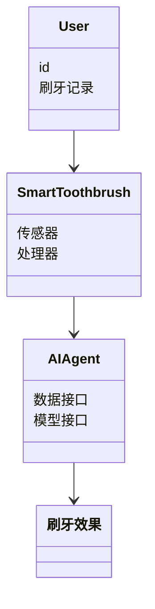
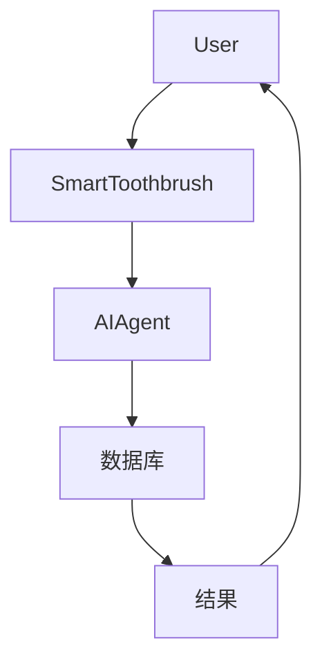
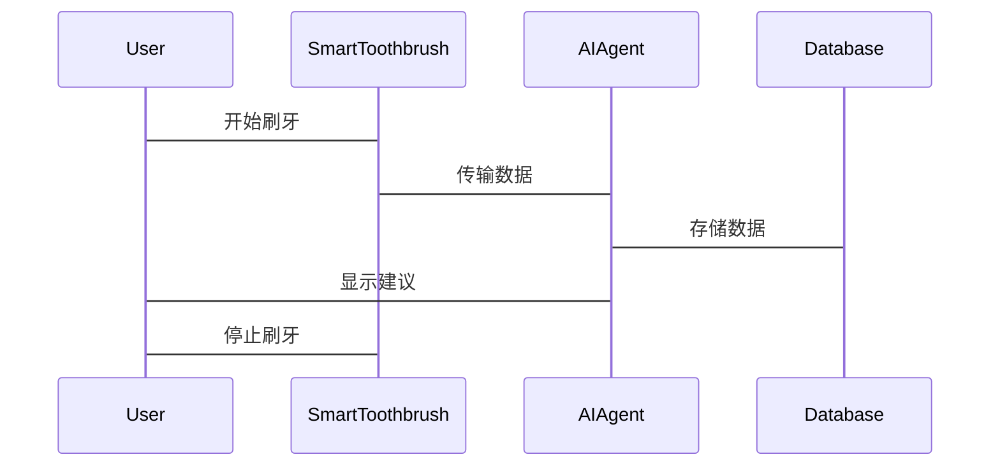

                 


# AI Agent在智能牙刷中的刷牙效果分析

> 关键词：AI Agent，智能牙刷，刷牙效果分析，算法原理，系统架构，项目实战

> 摘要：本文详细分析了AI Agent在智能牙刷中的应用，从背景介绍、核心概念、算法原理到系统架构、项目实战和最佳实践，全面探讨了AI Agent如何优化刷牙效果，提升用户体验。

---

# 第一部分: AI Agent与智能牙刷的背景与概念

## 第1章: AI Agent与智能牙刷的背景介绍

### 1.1 问题背景与描述

#### 1.1.1 刷牙效果分析的重要性
刷牙是日常生活中不可或缺的卫生习惯，但传统的刷牙方式难以量化和优化。AI Agent可以通过实时数据分析，提供个性化的刷牙建议，帮助用户提高刷牙效果。

#### 1.1.2 AI Agent在智能牙刷中的应用价值
AI Agent能够通过传感器数据，实时分析用户的刷牙动作、力度和时间，从而优化刷牙效果，避免过度清洁或清洁不足的问题。

#### 1.1.3 问题解决的必要性与可行性
通过AI Agent，智能牙刷可以实现精准的刷牙指导，减少用户因错误刷牙方式导致的口腔问题，提升用户体验。

### 1.2 问题的边界与外延

#### 1.2.1 刷牙效果的定义与衡量标准
刷牙效果包括清洁度、力度适中性、时间合理性等多维度指标。AI Agent需要综合这些指标进行分析。

#### 1.2.2 AI Agent的功能边界
AI Agent的功能包括数据采集、分析、反馈和个性化建议，但不涉及硬件设计和生产。

#### 1.2.3 智能牙刷的使用场景与限制
智能牙刷适用于家庭和个人使用，但受限于传感器精度和算法复杂度，目前仍无法完全替代专业牙医的建议。

### 1.3 核心概念与组成要素

#### 1.3.1 AI Agent的定义与特征
AI Agent是一种能够感知环境、自主决策的智能体，具备学习、推理和自适应能力。

#### 1.3.2 智能牙刷的系统构成
智能牙刷由传感器、处理器、AI模块和用户界面组成，能够采集和分析刷牙数据。

#### 1.3.3 刷牙效果分析的数学模型
刷牙效果分析模型包括特征提取、数据预处理和模型训练三个步骤。

---

## 第2章: AI Agent与智能牙刷的核心概念与联系

### 2.1 核心概念原理

#### 2.1.1 AI Agent的工作原理
AI Agent通过传感器采集数据，利用机器学习算法进行分析，生成个性化建议。

#### 2.1.2 智能牙刷的数据采集机制
智能牙刷通过压力传感器、加速度传感器等采集用户的刷牙数据。

#### 2.1.3 刷牙效果分析的算法流程
数据采集 → 特征提取 → 模型训练 → 效果预测 → 反馈建议。

### 2.2 核心概念属性对比

#### 2.2.1 AI Agent与传统牙刷的功能对比
| 特性         | 传统牙刷 | 智能牙刷（含AI Agent） |
|--------------|----------|-------------------------|
| 数据采集     | 无       | 有                     |
| 个性化建议   | 无       | 有                     |
| 实时反馈     | 无       | 有                     |

#### 2.2.2 不同AI技术的特征分析
| 技术         | 特征         | 优缺点                 |
|--------------|--------------|------------------------|
| 机器学习     | 数据驱动     | 需大量数据             |
| 深度学习     | 高精度       | 计算资源需求高         |

#### 2.2.3 刷牙效果的多维度评价指标
- 清洁度：牙垢去除率
- 力度适中性：刷牙力度的均匀性
- 时间合理性：刷牙时间是否符合建议

### 2.3 实体关系架构



---

## 第3章: 刷牙效果分析的算法原理

### 3.1 算法流程图



### 3.2 算法实现

#### 3.2.1 数据预处理
```python
import numpy as np
from sklearn.preprocessing import StandardScaler

# 示例数据
data = np.array([[10, 20, 30], [40, 50, 60]])

# 标准化处理
scaler = StandardScaler()
scaled_data = scaler.fit_transform(data)
print(scaled_data)
```

#### 3.2.2 模型训练
```python
from sklearn.linear_model import LinearRegression

# 示例特征和目标
X = [[1], [2], [3]]
y = [2, 4, 6]

# 训练模型
model = LinearRegression()
model.fit(X, y)

# 预测
print(model.predict([[4]]))  # 输出: [[8]]
```

#### 3.2.3 数学模型
线性回归模型：
$$ y = \beta_0 + \beta_1 x + \epsilon $$

其中：
- $y$ 是目标变量（刷牙效果）
- $x$ 是特征变量（刷牙时间）
- $\beta_0$ 是截距
- $\beta_1$ 是回归系数
- $\epsilon$ 是误差项

---

## 第4章: 系统分析与架构设计

### 4.1 问题场景介绍
智能牙刷的使用场景包括家庭和个人护理，用户希望通过AI Agent实时获得刷牙建议。

### 4.2 系统功能设计

#### 4.2.1 领域模型


#### 4.2.2 系统架构


#### 4.2.3 接口设计
- 数据接口：传感器数据采集接口
- 模型接口：AI Agent预测接口

#### 4.2.4 交互流程


---

## 第5章: 项目实战

### 5.1 环境安装
- 安装Python和相关库（如scikit-learn、mermaid）
- 配置开发环境

### 5.2 核心代码实现

#### 5.2.1 刷牙效果分析代码
```python
from sklearn.metrics import accuracy_score
from sklearn.datasets import make_classification
from sklearn.ensemble import RandomForestClassifier

# 示例数据
X, y = make_classification(n_samples=100, n_features=5, random_state=42)

# 训练模型
model = RandomForestClassifier()
model.fit(X, y)

# 预测
y_pred = model.predict(X)
print("准确率:", accuracy_score(y, y_pred))
```

#### 5.2.2 个性化建议生成代码
```python
def generate_advice(cleanliness, pressure, time):
    advice = []
    if cleanliness < 0.7:
        advice.append("建议增加刷牙时间")
    if pressure > 200:
        advice.append("建议减小刷牙力度")
    if time < 2:
        advice.append("建议延长刷牙时间")
    return advice

# 示例输入
cleanliness = 0.6
pressure = 150
time = 1.5

print(generate_advice(cleanliness, pressure, time))
```

### 5.3 项目总结
通过AI Agent优化刷牙效果，用户可以显著提高口腔健康水平。然而，仍需进一步优化算法和提升硬件精度。

---

## 第6章: 最佳实践

### 6.1 小结
AI Agent在智能牙刷中的应用为用户提供了个性化和科学的刷牙指导，值得进一步推广和优化。

### 6.2 注意事项
- 数据隐私保护
- 算法的可解释性
- 硬件的可靠性和稳定性

### 6.3 拓展阅读
- 探索更复杂的AI算法（如深度学习）
- 研究多模态数据融合技术
- 优化用户交互界面设计

---

通过以上分析，AI Agent在智能牙刷中的应用展现了巨大的潜力，未来可以进一步结合更多先进技术，为用户提供更优质的服务。

