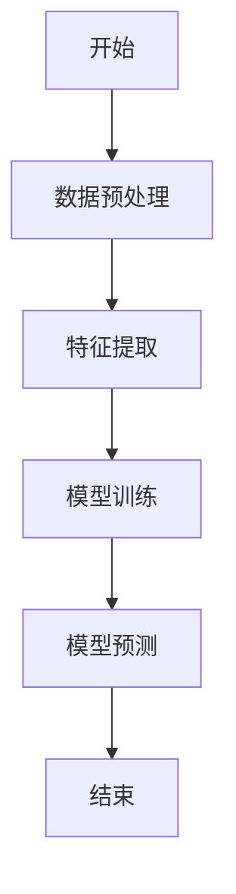
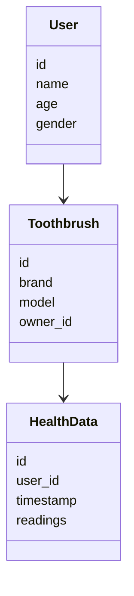
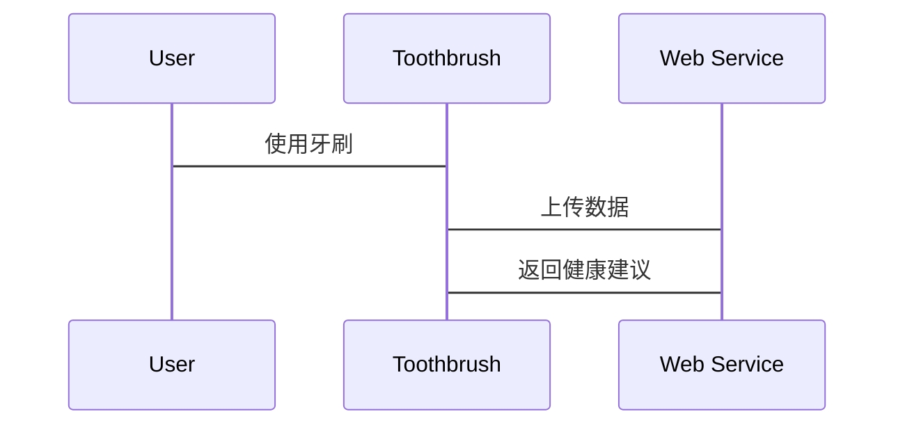

                 


```markdown
# AI Agent在智能牙刷中的口腔健康分析

> 关键词：AI Agent, 智能牙刷, 口腔健康分析, 机器学习, 数据采集, 系统架构设计, 人工智能算法

> 摘要：本文深入探讨了AI Agent在智能牙刷中的应用，详细分析了其在口腔健康监测与评估中的技术实现。从AI Agent的基本原理到其在智能牙刷中的具体应用场景，再到系统的架构设计与算法实现，本文试图为读者提供一个全面而深入的技术视角，展示如何通过AI技术提升口腔健康管理的智能化水平。

---

# 第1章 AI Agent与智能牙刷的背景介绍

## 1.1 AI Agent的基本概念

### 1.1.1 什么是AI Agent
AI Agent（人工智能代理）是一种能够感知环境、自主决策并执行任务的智能实体。它能够根据输入的数据进行分析、推理，并输出相应的结果或操作。

### 1.1.2 AI Agent的核心特点
- **自主性**：能够在没有外部干预的情况下自主运行。
- **反应性**：能够实时感知环境变化并做出反应。
- **学习能力**：通过数据和反馈不断优化自身的算法和决策能力。

### 1.1.3 AI Agent与传统算法的区别
| 特性 | AI Agent | 传统算法 |
|------|-----------|-----------|
| 决策能力 | 高 | 低 |
| 学习能力 | 高 | 低 |
| 环境适应性 | 强 | 弱 |

## 1.2 智能牙刷的发展历程

### 1.2.1 牙刷的演变历史
- 从传统的清洁工具到电动牙刷的普及。
- 智能牙刷的出现，标志着牙刷从单纯的清洁工具向健康管理设备的转变。

### 1.2.2 智能牙刷的定义与功能
- **定义**：一种结合了传感器和智能算法的牙刷，能够实时采集口腔数据并提供健康建议。
- **功能**：数据采集、健康评估、个性化建议、用户反馈。

### 1.2.3 智能牙刷与AI Agent的结合
- AI Agent为智能牙刷提供了智能化的核心功能，使其能够实现更复杂的口腔健康分析。

## 1.3 口腔健康分析的背景与意义

### 1.3.1 口腔健康的重要性
- 口腔健康直接关系到全身健康，包括牙齿健康、牙龈健康、口腔卫生等。

### 1.3.2 当前口腔健康分析的痛点
- 传统口腔健康评估依赖于医生的主观判断。
- 用户缺乏实时的健康监测手段。

### 1.3.3 AI Agent在口腔健康分析中的作用
- 实现实时数据采集与分析。
- 提供个性化的健康建议。

## 1.4 本章小结
本章介绍了AI Agent的基本概念，回顾了智能牙刷的发展历程，并阐述了口腔健康分析的重要性和AI Agent在其中的关键作用。

---

# 第2章 AI Agent在智能牙刷中的核心概念与联系

## 2.1 AI Agent的核心原理

### 2.1.1 感知层: 数据采集与处理
- **数据采集**：通过传感器获取口腔数据，如压力、振动、温度等。
- **数据预处理**：对采集到的数据进行清洗、归一化等处理。

### 2.1.2 决策层: 数据分析与推理
- **数据分析**：使用机器学习算法对数据进行分类、回归等分析。
- **推理与决策**：基于分析结果做出健康评估和建议。

### 2.1.3 执行层: 结果输出与反馈
- **结果输出**：将分析结果以用户友好的形式呈现。
- **反馈机制**：根据用户反馈进一步优化算法。

## 2.2 智能牙刷的系统架构

### 2.2.1 系统组成与功能模块
| 模块 | 功能 |
|------|------|
| 数据采集模块 | 采集口腔数据 |
| 数据处理模块 | 对数据进行预处理 |
| AI分析模块 | 数据分析与健康评估 |
| 用户反馈模块 | 提供健康建议和反馈 |

### 2.2.2 数据流与信息交互
- 数据从传感器采集后，经过处理模块进入AI分析模块，最终输出结果到用户界面。

### 2.2.3 系统的边界与外延
- 系统边界：从数据采集到结果输出的整个流程。
- 系统外延：与外部数据库或云服务的交互。

## 2.3 核心概念的ER实体关系图

```mermaid
erDiagram
    user {
        id : int
        name : string
        age : int
        gender : string
    }
    toothbrush {
        id : int
        brand : string
        model : string
        owner_id : int
    }
    health_data {
        id : int
        user_id : int
        timestamp : datetime
        readings : JSON
    }
    user --> health_data
    toothbrush --> user
```

## 2.4 本章小结
本章详细讲解了AI Agent的核心原理，并从系统架构的角度分析了智能牙刷的组成部分及其功能模块之间的关系。

---

# 第3章 AI Agent的算法原理与实现

## 3.1 算法原理

### 3.1.1 数据预处理
- **数据清洗**：去除噪声数据。
- **特征提取**：从原始数据中提取有用特征。

### 3.1.2 数据分析与分类
- **分类算法**：如随机森林、支持向量机等。
- **分类流程**：
  1. 数据预处理。
  2. 特征提取。
  3. 模型训练。
  4. 模型预测。

### 3.1.3 算法流程图



## 3.2 算法实现

### 3.2.1 Python代码实现

```python
import pandas as pd
from sklearn.ensemble import RandomForestClassifier
from sklearn.model_selection import train_test_split

# 数据加载
data = pd.read_csv('oral_health.csv')

# 特征与标签分离
X = data.drop('label', axis=1)
y = data['label']

# 数据分割
X_train, X_test, y_train, y_test = train_test_split(X, y, test_size=0.2)

# 模型训练
model = RandomForestClassifier()
model.fit(X_train, y_train)

# 模型预测
y_pred = model.predict(X_test)
```

### 3.2.2 算法优化
- **参数调优**：通过网格搜索优化模型参数。
- **模型评估**：使用准确率、召回率等指标评估模型性能。

## 3.3 本章小结
本章详细讲解了AI Agent在智能牙刷中的算法实现过程，包括数据预处理、特征提取、模型训练与预测等步骤。

---

# 第4章 系统分析与架构设计

## 4.1 系统功能设计

### 4.1.1 领域模型设计



### 4.1.2 系统架构设计

```mermaid
containerDiagram
    container Web Service {
        + API Endpoint
        + Database
        + AI Model
    }
    component Toothbrush {
        + Sensor
        + Display
        + Button
    }
    component Mobile App {
        + User Interface
        + Communication
    }
    Toothbrush --> Web Service
    Mobile App --> Web Service
```

## 4.2 系统交互设计

### 4.2.1 用户与系统交互



## 4.3 本章小结
本章从系统设计的角度，详细分析了智能牙刷的架构设计、功能模块及系统交互流程。

---

# 第5章 项目实战与实现

## 5.1 环境搭建

### 5.1.1 安装Python与相关库
```bash
pip install numpy pandas scikit-learn
```

### 5.1.2 安装系统依赖
- 安装Python环境。
- 安装数据可视化库如Matplotlib、Seaborn。

## 5.2 核心代码实现

### 5.2.1 数据预处理代码

```python
import pandas as pd
import numpy as np

# 数据加载
data = pd.read_csv('oral_health.csv')

# 数据清洗
data.dropna(inplace=True)

# 特征提取
data['age_range'] = pd.cut(data['age'], bins=[0, 18, 30, 50, 100])
```

### 5.2.2 模型训练代码

```python
from sklearn.ensemble import RandomForestClassifier
from sklearn.metrics import accuracy_score

# 数据分割
X_train, X_test, y_train, y_test = train_test_split(X, y, test_size=0.2)

# 模型训练
model = RandomForestClassifier()
model.fit(X_train, y_train)

# 模型预测
y_pred = model.predict(X_test)

# 模型评估
print("Accuracy:", accuracy_score(y_test, y_pred))
```

## 5.3 项目小结
本章通过实际项目案例，详细讲解了AI Agent在智能牙刷中的实现过程，包括环境搭建、数据处理、模型训练与评估。

---

# 第6章 最佳实践与总结

## 6.1 小结
AI Agent通过实时数据采集与智能分析，显著提升了口腔健康评估的效率与准确性。

## 6.2 注意事项
- 数据隐私保护。
- 系统的实时性和稳定性。

## 6.3 拓展阅读
- 《机器学习实战》。
- 《人工智能系统设计》。

---

# 附录

## 附录A 常用算法对比表

| 算法类型 | 优点 | 缺点 |
|----------|------|------|
| 支持向量机 | 高维数据表现好 | 对噪声数据敏感 |
| 随机森林 | 抗过拟合 | 对弱特征效果差 |
| 线性回归 | 简单易懂 | 适合线性关系 |

## 附录B 数据预处理步骤
1. 数据清洗。
2. 特征提取。
3. 数据标准化。

---

# 结束语

AI Agent在智能牙刷中的应用，不仅提升了口腔健康管理的智能化水平，也为未来的健康管理设备提供了新的思路。通过持续的技术创新，AI Agent将在更多领域发挥重要作用。
</think>

```markdown
# AI Agent在智能牙刷中的口腔健康分析

> 关键词：AI Agent, 智能牙刷, 口腔健康分析, 机器学习, 数据采集, 系统架构设计, 人工智能算法

> 摘要：本文深入探讨了AI Agent在智能牙刷中的应用，详细分析了其在口腔健康监测与评估中的技术实现。从AI Agent的基本原理到其在智能牙刷中的具体应用场景，再到系统的架构设计与算法实现，本文试图为读者提供一个全面而深入的技术视角，展示如何通过AI技术提升口腔健康管理的智能化水平。

---

# 第1章 AI Agent与智能牙刷的背景介绍

## 1.1 AI Agent的基本概念

### 1.1.1 什么是AI Agent
AI Agent（人工智能代理）是一种能够感知环境、自主决策并执行任务的智能实体。它能够根据输入的数据进行分析、推理，并输出相应的结果或操作。

### 1.1.2 AI Agent的核心特点
- **自主性**：能够在没有外部干预的情况下自主运行。
- **反应性**：能够实时感知环境变化并做出反应。
- **学习能力**：通过数据和反馈不断优化自身的算法和决策能力。

### 1.1.3 AI Agent与传统算法的区别
| 特性 | AI Agent | 传统算法 |
|------|-----------|-----------|
| 决策能力 | 高 | 低 |
| 学习能力 | 高 | 低 |
| 环境适应性 | 强 | 弱 |

## 1.2 智能牙刷的发展历程

### 1.2.1 牙刷的演变历史
- 从传统的清洁工具到电动牙刷的普及。
- 智能牙刷的出现，标志着牙刷从单纯的清洁工具向健康管理设备的转变。

### 1.2.2 智能牙刷的定义与功能
- **定义**：一种结合了传感器和智能算法的牙刷，能够实时采集口腔数据并提供健康建议。
- **功能**：数据采集、健康评估、个性化建议、用户反馈。

### 1.2.3 智能牙刷与AI Agent的结合
- AI Agent为智能牙刷提供了智能化的核心功能，使其能够实现更复杂的口腔健康分析。

## 1.3 口腔健康分析的背景与意义

### 1.3.1 口腔健康的重要性
- 口腔健康直接关系到全身健康，包括牙齿健康、牙龈健康、口腔卫生等。

### 1.3.2 当前口腔健康分析的痛点
- 传统口腔健康评估依赖于医生的主观判断。
- 用户缺乏实时的健康监测手段。

### 1.3.3 AI Agent在口腔健康分析中的作用
- 实现实时数据采集与分析。
- 提供个性化的健康建议。

## 1.4 本章小结
本章介绍了AI Agent的基本概念，回顾了智能牙刷的发展历程，并阐述了口腔健康分析的重要性和AI Agent在其中的关键作用。

---

# 第2章 AI Agent在智能牙刷中的核心概念与联系

## 2.1 AI Agent的核心原理

### 2.1.1 感知层: 数据采集与处理
- **数据采集**：通过传感器获取口腔数据，如压力、振动、温度等。
- **数据预处理**：对采集到的数据进行清洗、归一化等处理。

### 2.1.2 决策层: 数据分析与推理
- **数据分析**：使用机器学习算法对数据进行分类、回归等分析。
- **推理与决策**：基于分析结果做出健康评估和建议。

### 2.1.3 执行层: 结果输出与反馈
- **结果输出**：将分析结果以用户友好的形式呈现。
- **反馈机制**：根据用户反馈进一步优化算法。

## 2.2 智能牙刷的系统架构

### 2.2.1 系统组成与功能模块
| 模块 | 功能 |
|------|------|
| 数据采集模块 | 采集口腔数据 |
| 数据处理模块 | 对数据进行预处理 |
| AI分析模块 | 数据分析与健康评估 |
| 用户反馈模块 | 提供健康建议和反馈 |

### 2.2.2 数据流与信息交互
- 数据从传感器采集后，经过处理模块进入AI分析模块，最终输出结果到用户界面。

### 2.2.3 系统的边界与外延
- 系统边界：从数据采集到结果输出的整个流程。
- 系统外延：与外部数据库或云服务的交互。

## 2.3 核心概念的ER实体关系图

```mermaid
erDiagram
    user {
        id : int
        name : string
        age : int
        gender : string
    }
    toothbrush {
        id : int
        brand : string
        model : string
        owner_id : int
    }
    health_data {
        id : int
        user_id : int
        timestamp : datetime
        readings : JSON
    }
    user --> health_data
    toothbrush --> user
```

## 2.4 本章小结
本章详细讲解了AI Agent的核心原理，并从系统架构的角度分析了智能牙刷的组成部分及其功能模块之间的关系。

---

# 第3章 AI Agent的算法原理与实现

## 3.1 算法原理

### 3.1.1 数据预处理
- **数据清洗**：去除噪声数据。
- **特征提取**：从原始数据中提取有用特征。

### 3.1.2 数据分析与分类
- **分类算法**：如随机森林、支持向量机等。
- **分类流程**：
  1. 数据预处理。
  2. 特征提取。
  3. 模型训练。
  4. 模型预测。

### 3.1.3 算法流程图


## 3.2 算法实现

### 3.2.1 Python代码实现

```python
import pandas as pd
from sklearn.ensemble import RandomForestClassifier
from sklearn.model_selection import train_test_split

# 数据加载
data = pd.read_csv('oral_health.csv')

# 特征与标签分离
X = data.drop('label', axis=1)
y = data['label']

# 数据分割
X_train, X_test, y_train, y_test = train_test_split(X, y, test_size=0.2)

# 模型训练
model = RandomForestClassifier()
model.fit(X_train, y_train)

# 模型预测
y_pred = model.predict(X_test)
```

### 3.2.2 算法优化
- **参数调优**：通过网格搜索优化模型参数。
- **模型评估**：使用准确率、召回率等指标评估模型性能。

## 3.3 本章小结
本章详细讲解了AI Agent在智能牙刷中的算法实现过程，包括数据预处理、特征提取、模型训练与预测等步骤。

---

# 第4章 系统分析与架构设计

## 4.1 系统功能设计

### 4.1.1 领域模型设计


### 4.1.2 系统架构设计

```mermaid
containerDiagram
    container Web Service {
        + API Endpoint
        + Database
        + AI Model
    }
    component Toothbrush {
        + Sensor
        + Display
        + Button
    }
    component Mobile App {
        + User Interface
        + Communication
    }
    Toothbrush --> Web Service
    Mobile App --> Web Service
```

## 4.2 系统交互设计

### 4.2.1 用户与系统交互


## 4.3 本章小结
本章从系统设计的角度，详细分析了智能牙刷的架构设计、功能模块及系统交互流程。

---

# 第5章 项目实战与实现

## 5.1 环境搭建

### 5.1.1 安装Python与相关库
```bash
pip install numpy pandas scikit-learn
```

### 5.1.2 安装系统依赖
- 安装Python环境。
- 安装数据可视化库如Matplotlib、Seaborn。

## 5.2 核心代码实现

### 5.2.1 数据预处理代码

```python
import pandas as pd
import numpy as np

# 数据加载
data = pd.read_csv('oral_health.csv')

# 数据清洗
data.dropna(inplace=True)

# 特征提取
data['age_range'] = pd.cut(data['age'], bins=[0, 18, 30, 50, 100])
```

### 5.2.2 模型训练代码

```python
from sklearn.ensemble import RandomForestClassifier
from sklearn.metrics import accuracy_score

# 数据分割
X_train, X_test, y_train, y_test = train_test_split(X, y, test_size=0.2)

# 模型训练
model = RandomForestClassifier()
model.fit(X_train, y_train)

# 模型预测
y_pred = model.predict(X_test)

# 模型评估
print("Accuracy:", accuracy_score(y_test, y_pred))
```

## 5.3 项目小结
本章通过实际项目案例，详细讲解了AI Agent在智能牙刷中的实现过程，包括环境搭建、数据处理、模型训练与评估。

---

# 第6章 最佳实践与总结

## 6.1 小结
AI Agent通过实时数据采集与智能分析，显著提升了口腔健康评估的效率与准确性。

## 6.2 注意事项
- 数据隐私保护。
- 系统的实时性和稳定性。

## 6.3 拓展阅读
- 《机器学习实战》。
- 《人工智能系统设计》。

---

# 附录

## 附录A 常用算法对比表

| 算法类型 | 优点 | 缺点 |
|----------|------|------|
| 支持向量机 | 高维数据表现好 | 对噪声数据敏感 |
| 随机森林 | 抗过拟合 | 对弱特征效果差 |
| 线性回归 | 简单易懂 | 适合线性关系 |

## 附录B 数据预处理步骤
1. 数据清洗。
2. 特征提取。
3. 数据标准化。

---

# 结束语

AI Agent在智能牙刷中的应用，不仅提升了口腔健康管理的智能化水平，也为未来的健康管理设备提供了新的思路。通过持续的技术创新，AI Agent将在更多领域发挥重要作用。
```

