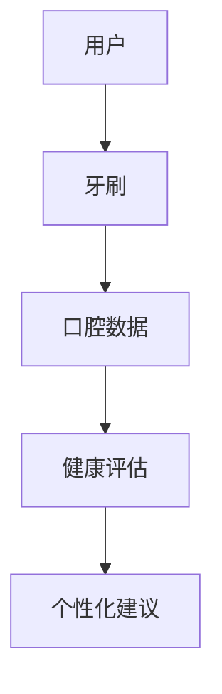
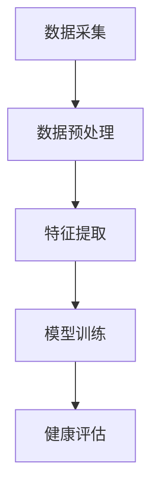
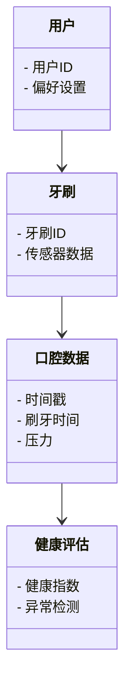
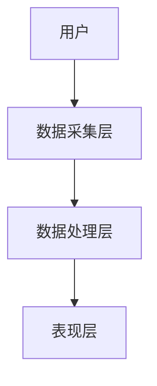
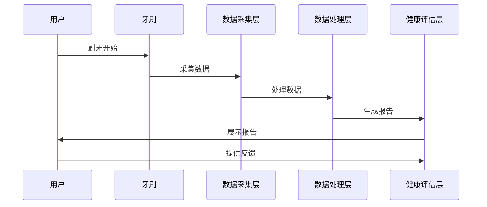

                 


# AI Agent在智能牙刷中的口腔健康追踪

**关键词：** AI Agent, 智能牙刷, 口腔健康, 数据分析, 机器学习, 个性化建议

**摘要：** 本文深入探讨AI Agent在智能牙刷中的应用，分析其如何通过数据采集、分析和个性化建议实现口腔健康监测。文章从背景、原理、算法到系统设计和项目实战，全面解析AI Agent在智能牙刷中的功能与实现，最后总结并展望未来发展。

---

## 第一章: AI Agent与智能牙刷的背景介绍

### 1.1 AI Agent的基本概念
#### 1.1.1 AI Agent的定义
AI Agent（人工智能代理）是能够感知环境并采取行动以实现目标的智能实体。它通过传感器获取数据，利用算法处理信息，做出决策并执行操作。

#### 1.1.2 AI Agent的核心特点
- **自主性**：能够在无外部干预下执行任务。
- **反应性**：能实时感知环境变化并调整行为。
- **学习能力**：通过数据和反馈不断优化性能。

#### 1.1.3 AI Agent与传统算法的区别
AI Agent不仅能执行预定义任务，还能根据环境变化自适应调整，具有更强的自主性和学习能力。

### 1.2 智能牙刷的发展历程
#### 1.2.1 智能牙刷的定义
智能牙刷是一种结合了传感器、数据处理和反馈机制的口腔清洁工具，能通过蓝牙或Wi-Fi连接到手机或其他设备，提供实时反馈和健康建议。

#### 1.2.2 智能牙刷的发展阶段
1. **传统牙刷阶段**：仅提供物理清洁功能。
2. **电动牙刷阶段**：加入电动驱动和定时功能。
3. **智能牙刷阶段**：集成传感器和数据处理，提供健康监测和个性化建议。

#### 1.2.3 智能牙刷的市场现状
随着人们对健康的关注增加，智能牙刷市场迅速增长，预计未来几年将保持较高增长率。

### 1.3 口腔健康监测的重要性
#### 1.3.1 口腔健康的基本概念
口腔健康包括牙齿、牙龈和口腔黏膜的健康状况，直接影响整体健康和生活质量。

#### 1.3.2 口腔健康监测的意义
及时发现口腔问题，如牙龈炎、蛀牙等，有助于早期治疗，避免严重健康问题。

#### 1.3.3 口腔健康监测的技术挑战
需要高精度传感器和高效的算法处理复杂数据，确保准确性和实时性。

---

## 第二章: AI Agent在智能牙刷中的应用

### 2.1 AI Agent在智能牙刷中的功能
#### 2.1.1 数据采集与处理
智能牙刷通过压力传感器、加速度计等采集刷牙数据，如力度、时间、频率等。

#### 2.1.2 数据分析与健康评估
AI Agent分析数据，评估口腔健康状况，识别异常情况如牙龈出血。

#### 2.1.3 个性化健康建议
根据分析结果，提供定制化建议，如调整刷牙力度、时间或建议就医。

### 2.2 AI Agent与智能牙刷的结合方式
#### 2.2.1 硬件与软件的集成
AI Agent运行于牙刷中的微控制器，通过传感器采集数据，软件处理并反馈结果。

#### 2.2.2 数据传输与处理
数据通过蓝牙传输到手机应用，AI Agent在云端或本地处理数据，生成健康报告。

#### 2.2.3 用户界面设计
直观的用户界面显示健康状况和建议，提升用户体验。

---

## 第三章: AI Agent与智能牙刷的核心概念与联系

### 3.1 核心概念原理
#### 3.1.1 AI Agent的工作原理
AI Agent通过感知环境、分析数据、制定策略并执行动作，实现目标。

#### 3.1.2 智能牙刷的数据采集原理
传感器采集刷牙数据，通过模数转换器（ADC）将模拟信号转换为数字信号。

#### 3.1.3 数据分析与健康评估的原理
使用机器学习算法，如随机森林或神经网络，分析数据特征，评估口腔健康。

### 3.2 核心概念属性特征对比
| 属性 | AI Agent | 智能牙刷 |
|------|-----------|----------|
| 数据源 | 多传感器 | 牙刷传感器 |
| 处理方式 | 算法分析 | 实时处理 |
| 输出结果 | 健康报告 | 用户反馈 |

### 3.3 ER实体关系图


---

## 第四章: AI Agent的算法原理与实现

### 4.1 数据采集与预处理
#### 4.1.1 数据采集方法
使用加速度计、压力传感器等采集刷牙数据。

#### 4.1.2 数据预处理步骤
- 去噪处理：消除干扰信号。
- 数据归一化：标准化数据范围，便于模型处理。
$$归一化公式：x' = \frac{x - \min(x)}{\max(x) - \min(x)}$$

#### 4.1.3 数据归一化处理
通过归一化处理，确保不同传感器数据的可比性，提升模型性能。

### 4.2 特征提取与选择
#### 4.2.1 特征提取方法
- 时间域特征：如刷牙时间、频率。
- 频率域特征：如FFT分析。

#### 4.2.2 特征选择标准
选择对口腔健康影响显著的特征，如牙龈出血频率、刷牙压力等。

#### 4.2.3 常用特征提取算法
- 主成分分析（PCA）：降低维度，提取主要特征。
- 线性判别分析（LDA）：用于分类任务。

### 4.3 算法实现
#### 4.3.1 机器学习模型
使用支持向量机（SVM）或随机森林进行分类，评估口腔健康状况。

#### 4.3.2 算法流程图


---

## 第五章: 口腔健康数据的分析与应用

### 5.1 口腔健康数据的特征分析
#### 5.1.1 数据特征提取
从刷牙数据中提取特征，如刷牙时间、压力、频率等。

#### 5.1.2 数据特征的可视化
使用折线图、柱状图等展示特征分布，帮助理解数据。

### 5.2 健康评估模型的建立
#### 5.2.1 数据分割
将数据分为训练集、验证集和测试集，比例通常为7:1:2。

#### 5.2.2 模型训练
使用训练数据训练机器学习模型，如XGBoost或神经网络。

#### 5.2.3 模型评估
通过准确率、召回率等指标评估模型性能，调整参数优化表现。

### 5.3 个性化健康建议的生成
#### 5.3.1 建议规则
基于模型预测结果，生成个性化建议，如调整刷牙力度、时间或推荐就诊。

#### 5.3.2 建议展示
通过手机应用直观展示，提供用户友好的界面和建议。

---

## 第六章: 系统分析与架构设计

### 6.1 系统功能设计
#### 6.1.1 功能模块
- 数据采集模块：采集刷牙数据。
- 数据处理模块：预处理和特征提取。
- 健康评估模块：模型训练与评估。
- 用户界面模块：展示结果和建议。

#### 6.1.2 领域模型图


### 6.2 系统架构设计
#### 6.2.1 分层架构
- 数据层：存储原始数据。
- 逻辑层：处理数据和业务逻辑。
- 表现层：用户界面展示结果。

#### 6.2.2 架构图


### 6.3 接口设计与交互流程
#### 6.3.1 接口设计
- 数据采集接口：接收传感器数据。
- 健康评估接口：提供健康报告。
- 用户反馈接口：收集用户反馈。

#### 6.3.2 交互流程图


---

## 第七章: 项目实战

### 7.1 环境安装
#### 7.1.1 安装Python
```bash
python --version
pip install numpy pandas scikit-learn
```

#### 7.1.2 安装依赖库
```bash
pip install numpy scikit-learn matplotlib
```

### 7.2 系统核心实现
#### 7.2.1 数据预处理代码
```python
import numpy as np
from sklearn.preprocessing import MinMaxScaler

# 归一化处理
scaler = MinMaxScaler()
data_normalized = scaler.fit_transform(data)
```

#### 7.2.2 模型训练代码
```python
from sklearn.ensemble import RandomForestClassifier

# 训练模型
model = RandomForestClassifier(n_estimators=100)
model.fit(X_train, y_train)
```

#### 7.2.3 健康评估代码
```python
# 预测健康状况
y_pred = model.predict(X_test)
print("预测准确率:", accuracy_score(y_test, y_pred))
```

### 7.3 实际案例分析
#### 7.3.1 数据分析
分析用户的刷牙数据，识别异常情况如牙龈出血。

#### 7.3.2 模型优化
通过交叉验证调整模型参数，提升预测准确率。

#### 7.3.3 个性化建议
根据模型结果，生成定制化健康建议，如调整刷牙方式。

### 7.4 项目小结
通过实际项目，验证了AI Agent在智能牙刷中的有效性，展示了如何通过数据和技术改善口腔健康。

---

## 第八章: 小结、注意事项与未来展望

### 8.1 小结
本文详细介绍了AI Agent在智能牙刷中的应用，从理论到实践，展示了如何利用技术实现口腔健康监测。

### 8.2 注意事项
- 数据隐私保护：确保用户数据的安全。
- 设备兼容性：支持多种操作系统和设备。
- 用户教育：提升用户对智能牙刷的认识和使用。

### 8.3 未来展望
随着AI技术进步，智能牙刷将提供更多健康监测功能，如实时诊断和远程医疗支持。

---

通过以上结构，文章系统地介绍了AI Agent在智能牙刷中的应用，从背景、原理到系统设计和实战，帮助读者全面理解和应用相关技术。

