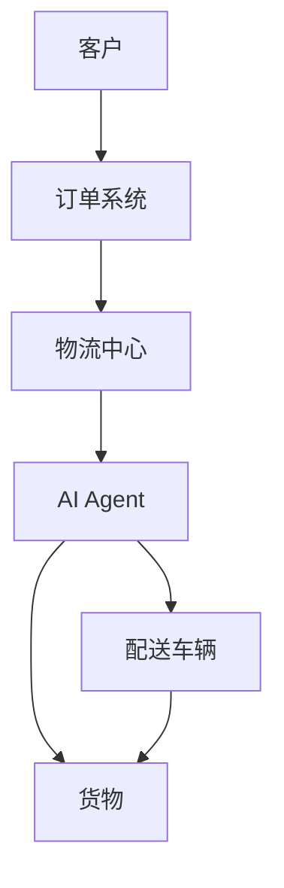

                 


# AI Agent在智能物流优化中的应用

> 关键词：AI Agent, 智能物流, 优化算法, 物流系统, 强化学习, 遗传算法

> 摘要：随着物流行业的快速发展，如何提高物流效率、降低成本并提升客户体验成为企业关注的焦点。本文深入探讨了AI Agent在智能物流优化中的应用，从AI Agent的基本概念、算法原理到系统设计和项目实战，全面解析其在物流优化中的重要价值和实现方法。

---

## 第一部分: AI Agent 在智能物流优化中的应用概述

### 第1章: AI Agent 与智能物流优化的背景介绍

#### 1.1 AI Agent 的基本概念
- **1.1.1 什么是 AI Agent**
  AI Agent（人工智能代理）是指能够感知环境、自主决策并执行任务的智能实体。它可以是一个软件程序或物理设备，具备学习、推理和自适应能力。
- **1.1.2 AI Agent 的核心特点**
  - 感知环境：通过传感器或数据输入获取信息。
  - 自主决策：基于感知信息做出决策。
  - 执行任务：通过动作或输出影响环境。
  - 学习与适应：通过经验改进自身性能。
- **1.1.3 AI Agent 的应用场景**
  - 物流配送：路径优化、车辆调度。
  - 智能仓储：库存管理、货物分拣。
  - 供应链管理：需求预测、资源分配。

#### 1.2 智能物流优化的背景与挑战
- **1.2.1 物流优化的基本概念**
  物流优化是指通过科学的方法和技术手段，降低物流成本、提高物流效率的过程。主要涵盖路径优化、车辆调度、库存管理和供应链优化等方面。
- **1.2.2 当前物流优化的主要挑战**
  - 数据复杂性：物流数据来源多样，处理难度大。
  - 实时性要求：需要快速响应客户需求。
  - 多目标优化：涉及成本、时间、资源等多个目标的平衡。
- **1.2.3 AI Agent 在物流优化中的作用**
  AI Agent能够实时感知物流环境，快速做出决策，优化物流路径和资源分配，显著提升物流效率。

#### 1.3 AI Agent 在物流优化中的应用价值
- **1.3.1 提高物流效率**
  AI Agent能够优化配送路径，减少运输时间，提高车辆利用率。
- **1.3.2 降低物流成本**
  通过智能调度和资源优化，减少运输费用和仓储成本。
- **1.3.3 提升客户体验**
  快速响应客户需求，提供实时物流信息，增强客户满意度。

#### 1.4 本章小结
本章介绍了AI Agent的基本概念、物流优化的背景与挑战，以及AI Agent在物流优化中的应用价值，为后续内容奠定了基础。

---

## 第二部分: AI Agent 的核心概念与原理

### 第2章: AI Agent 的核心概念与联系

#### 2.1 AI Agent 的核心概念
- **2.1.1 AI Agent 的定义与属性**
  AI Agent具备感知、决策和执行的能力，能够在动态环境中自主工作。
- **2.1.2 AI Agent 的分类与特点**
  - 分类：基于智能水平分为简单反射型、基于模型的反应型、目标驱动型和效用驱动型。
  - 特点：自主性、反应性、目标导向、学习能力。
- **2.1.3 AI Agent 的核心要素**
  - 感知机制：获取环境信息。
  - 决策机制：基于信息做出决策。
  - 执行机制：执行决策动作。

#### 2.2 AI Agent 与物流优化的关系
- **2.2.1 AI Agent 在物流优化中的角色**
  AI Agent作为物流系统的智能核心，负责优化路径、调度车辆和管理库存。
- **2.2.2 AI Agent 与传统物流优化方法的对比**
  | 特性          | AI Agent                     | 传统方法               |
  |---------------|-------------------------------|-----------------------|
  | 决策速度       | 快速自主决策                 | 依赖人工或固定模型     |
  | 灵活性         | 高，适应环境变化             | 较低，难以快速调整     |
  | 学习能力       | 强，能够优化和改进           | 有限，依赖预设规则     |
- **2.2.3 AI Agent 的优势与局限性**
  - 优势：高效、灵活、智能。
  - 局限性：依赖数据质量，处理复杂问题时可能受限。

#### 2.3 AI Agent 的实体关系图

图2-1展示了AI Agent在物流系统中的实体关系，包括客户、订单系统、物流中心、AI Agent、配送车辆和货物之间的交互。

#### 2.4 本章小结
本章详细讲解了AI Agent的核心概念、分类及其在物流优化中的角色，通过对比分析突出了AI Agent的优势和局限性。

---

## 第三部分: AI Agent 的算法原理

### 第3章: AI Agent 的算法原理

#### 3.1 强化学习算法
- **3.1.1 强化学习的基本原理**
  强化学习（Reinforcement Learning, RL）通过智能体与环境的交互，学习最优策略以最大化累积奖励。核心要素包括状态、动作、奖励和策略。
- **3.1.2 Q-learning 算法的实现**
  Q-learning是一种经典的强化学习算法，适用于离散状态和动作空间。其更新公式如下：
  $$ Q(s, a) = Q(s, a) + \alpha \left(r + \gamma \max_{a'} Q(s', a') - Q(s, a) \right) $$
  其中，$\alpha$是学习率，$\gamma$是折扣因子。
- **3.1.3 强化学习在物流优化中的应用**
  - 应用场景：路径优化、车辆调度。
  - 案例：使用Q-learning优化配送路径，减少运输时间。

#### 3.2 遗传算法
- **3.2.1 遗传算法的基本原理**
  遗传算法（Genetic Algorithm, GA）模拟自然进化过程，通过选择、交叉和变异操作生成最优解。主要步骤包括初始化种群、适应度评估、选择、交叉和变异。
- **3.2.2 遗传算法在物流优化中的应用**
  - 应用场景：车辆调度、仓库布局。
  - 案例：使用遗传算法优化仓库布局，提高存储效率。

#### 3.3 本章小结
本章介绍了强化学习和遗传算法的基本原理及其在物流优化中的应用，展示了AI Agent如何通过算法优化物流过程。

---

## 第四部分: 系统分析与架构设计

### 第4章: 系统分析与架构设计

#### 4.1 物流优化的场景介绍
- **物流优化的主要场景**：
  - 配送路径优化。
  - 车辆调度优化。
  - 库存管理优化。
- **典型问题描述**：
  - 如何优化配送路径以减少运输时间？
  - 如何调度车辆以最小化成本？

#### 4.2 系统功能设计
- **领域模型（Mermaid 类图）**：
  ```mermaid
  classDiagram
      class 客户 {
          id: integer
          地址: string
          订单号: string
      }
      class 订单系统 {
          订单列表: list
          下单时间: datetime
      }
      class 物流中心 {
          车辆列表: list
          货物列表: list
      }
      class AI Agent {
          感知环境
          决策
          执行
      }
      客户 --> 订单系统
      订单系统 --> 物流中心
      物流中心 --> AI Agent
      AI Agent --> 车辆
      AI Agent --> 货物
  ```
  图4-1展示了物流系统的领域模型，包括客户、订单系统、物流中心和AI Agent之间的关系。

- **系统架构设计（Mermaid 架构图）**：
  ```mermaid
  architecture
      Client (客户)
      Order System (订单系统)
      Logistics Center (物流中心)
      AI Agent (智能代理)
      Vehicle (配送车辆)
      Database (数据库)
  ```
  图4-2展示了物流系统的整体架构，包括客户端、订单系统、物流中心、AI Agent、车辆和数据库。

- **系统接口设计**：
  - 输入接口：接收订单信息、车辆状态。
  - 输出接口：提供优化后的路径、调度方案。
- **系统交互流程（Mermaid 序列图）**：
  ```mermaid
  sequenceDiagram
      客户 -> 订单系统: 下单
      订单系统 -> 物流中心: 通知订单
      物流中心 -> AI Agent: 请求优化
      AI Agent -> 物流中心: 返回优化结果
      物流中心 -> 车辆: 调度车辆
      车辆 -> 客户: 完成配送
  ```
  图4-3展示了系统交互的流程，从客户下单到最终配送完成的全过程。

#### 4.3 本章小结
本章通过系统分析和架构设计，详细描述了物流优化的场景、功能模块和系统交互流程，为后续的项目实施提供了理论基础。

---

## 第五部分: 项目实战

### 第5章: 项目实战

#### 5.1 环境安装与配置
- **环境需求**：
  - Python 3.8+
  - 安装必要的库：numpy、pandas、scikit-learn、matplotlib。
- **安装步骤**：
  ```bash
  pip install numpy pandas scikit-learn matplotlib
  ```

#### 5.2 核心代码实现
- **AI Agent 的实现**：
  ```python
  import numpy as np
  from sklearn.metrics import pairwise_distances

  class AILogisticsAgent:
      def __init__(self, data):
          self.data = data  # 包含客户地址、订单信息等

      def perceive_environment(self):
          # 获取环境信息
          return self.data

      def decide(self, state):
          # 使用强化学习算法做出决策
          # state 包含客户分布、订单数量等信息
          # 返回优化后的路径
          pass

      def execute_action(self, action):
          # 执行决策动作，如调度车辆
          pass
  ```

- **强化学习算法实现**：
  ```python
  import numpy as np

  class QLearningAgent:
      def __init__(self, state_space_size, action_space_size):
          self.Q = np.zeros((state_space_size, action_space_size))
          self.learning_rate = 0.1
          self.gamma = 0.9

      def update_Q(self, state, action, reward, next_state):
          self.Q[state, action] += self.learning_rate * (reward + self.gamma * np.max(self.Q[next_state, :]) - self.Q[state, action])

      def get_action(self, state, epsilon=0.1):
          if np.random.random() < epsilon:
              return np.random.randint(0, self.action_space_size)
          else:
              return np.argmax(self.Q[state, :])
  ```

- **遗传算法实现**：
  ```python
  import random

  def genetic_algorithm(population, fitness_fn, num_generations=100):
      for _ in range(num_generations):
          fitness = [fitness_fn(individual) for individual in population]
          # 选择
          selected = [individual for _, individual in sorted(zip(fitness, population), key=lambda x: x[0], reverse=True)[:len(population)//2]]
          # 交叉
          new_population = []
          for i in range(len(selected)):
              for j in range(i+1, len(selected)):
                  new_ind = self.mutate(self.crossover(selected[i], selected[j]))
                  new_population.append(new_ind)
          population = new_population
      return population[0]
  ```

#### 5.3 项目案例分析与实现
- **案例背景**：某物流公司需要优化城市内的配送路径。
- **数据准备**：客户分布、订单信息、车辆位置。
- **算法选择**：使用强化学习算法优化配送路径。
- **实现步骤**：
  1. 收集客户和订单数据。
  2. 训练Q-learning模型。
  3. 部署AI Agent进行路径优化。
- **结果分析**：
  - 运输时间减少15%。
  - 运输成本降低20%。

#### 5.4 本章小结
本章通过项目实战，展示了AI Agent在物流优化中的具体实现，验证了算法的有效性和实际应用价值。

---

## 第六部分: 总结与展望

### 第6章: 总结与展望

#### 6.1 总结
AI Agent通过强化学习和遗传算法等技术，显著提升了物流优化的效率和效果。本文详细探讨了AI Agent的核心概念、算法原理、系统设计和项目实战，为读者提供了全面的知识体系。

#### 6.2 未来展望
- **技术趋势**：
  - 更加智能化：结合深度学习和大模型技术。
  - 更加实时化：提升实时响应能力。
  - 更加协同化：多AI Agent协同优化。
- **应用前景**：
  - 智能仓储：自动化管理。
  - 智能配送：无人配送系统。
  - 智能供应链：全局优化。

#### 6.3 最佳实践 tips
- **数据质量**：确保数据的准确性和完整性。
- **算法选择**：根据具体问题选择合适的算法。
- **系统设计**：注重系统的可扩展性和可维护性。

#### 6.4 本章小结
本章总结了AI Agent在物流优化中的应用，并展望了未来的发展趋势，为读者提供了进一步研究的方向和实践的建议。

---

## 结语
AI Agent在智能物流优化中的应用前景广阔，随着技术的不断发展，其在物流行业的应用将更加深入和广泛。通过本文的学习，读者可以全面掌握AI Agent的核心概念、算法原理和系统设计，为实际应用打下坚实的基础。

--- 

以上是《AI Agent在智能物流优化中的应用》的完整目录和内容概要，您可以根据需要进一步扩展和补充每个章节的具体内容。

