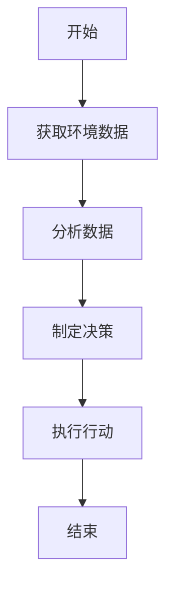
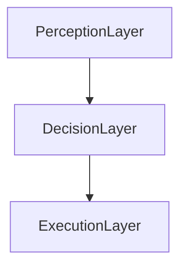
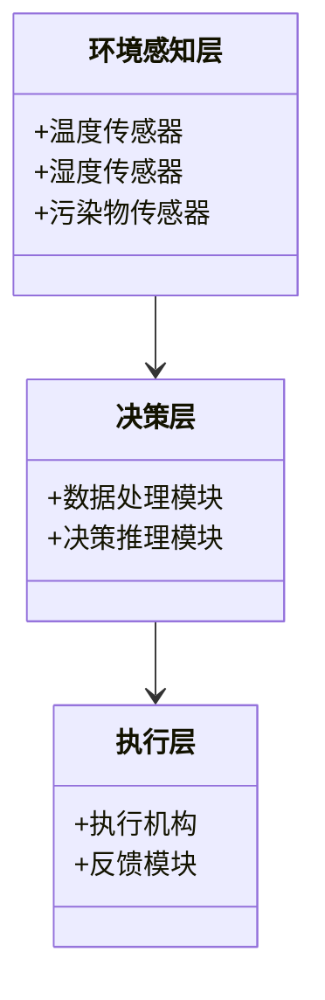

                 


# AI Agent在智能环境保护中的实践

## 关键词：AI Agent, 智能环境保护, 环境监测, 环境治理, 人工智能

## 摘要：  
本文探讨AI Agent在智能环境保护中的实践应用，涵盖AI Agent的基本概念、算法原理、系统架构设计及实际案例分析。通过系统化的理论分析与实践指导，本文旨在为环境保护领域的技术实践者提供深度的技术洞察与实践指南。

---

# 第一部分: AI Agent与智能环境保护的背景与概念

# 第1章: AI Agent与智能环境保护的引言

## 1.1 AI Agent的基本概念

### 1.1.1 AI Agent的定义
AI Agent（人工智能代理）是指能够感知环境、自主决策并执行任务的智能实体。它可以是一个软件程序、机器人或智能系统，具备学习、推理、规划和自适应能力。

### 1.1.2 AI Agent的核心特征
- **自主性**：AI Agent能够在没有外部干预的情况下自主运行。
- **反应性**：能够实时感知环境变化并做出响应。
- **学习性**：通过数据和经验不断优化自身行为。
- **协作性**：能够与其他AI Agent或人类进行协作。

### 1.1.3 AI Agent与智能环境保护的关系
AI Agent通过实时数据分析、自主决策和智能协作，为环境保护提供了高效、精准的技术支持，能够显著提升环境监测、污染治理和资源管理的效率。

---

## 1.2 智能环境保护的背景与挑战

### 1.2.1 环境保护的重要性
环境保护是全球关注的焦点，关系到生态平衡、人类健康和可持续发展。传统环境保护方式效率低下，难以应对复杂多变的环境问题。

### 1.2.2 智能化环境保护的需求
随着技术的进步，智能化环境保护能够实现实时监测、智能分析和精准治理，是解决传统环境保护问题的重要手段。

### 1.2.3 当前环境保护的主要挑战
- **数据孤岛**：不同系统之间的数据难以共享，导致信息碎片化。
- **计算资源不足**：复杂环境问题需要大量计算资源支持。
- **实时性要求高**：环境问题往往需要快速响应，否则可能引发严重后果。

---

## 1.3 AI Agent在环境保护中的应用前景

### 1.3.1 AI Agent在环境监测中的作用
AI Agent能够实时收集和分析环境数据，如空气质量、水质监测等，帮助及时发现异常情况。

### 1.3.2 AI Agent在环境治理中的潜力
AI Agent可以通过智能决策优化污染治理方案，降低治理成本，提高治理效率。

### 1.3.3 AI Agent在环境管理中的创新
通过AI Agent实现环境数据的智能分析和决策支持，推动环境管理从传统模式向智能化转变。

---

## 1.4 本章小结

通过本章的介绍，我们了解了AI Agent的基本概念及其在智能环境保护中的重要性。AI Agent作为一种智能实体，能够显著提升环境保护的效率和精准度，是未来环境保护领域的重要技术手段。

---

# 第二部分: AI Agent的核心概念与技术原理

# 第2章: AI Agent的核心概念与联系

## 2.1 AI Agent的核心概念

### 2.1.1 AI Agent的定义与分类
AI Agent可以根据功能、应用场景和技术实现方式分为多种类型，如基于规则的AI Agent、基于模型的AI Agent和基于学习的AI Agent。

### 2.1.2 AI Agent的属性特征对比
| 属性 | 描述 |
|------|------|
| 自主性 | 能够自主运行和决策 |
| 反应性 | 能够实时感知环境变化并做出响应 |
| 学习性 | 能够通过数据和经验优化自身行为 |
| 协作性 | 能够与其他系统或人类进行协作 |

### 2.1.3 AI Agent的ER实体关系图
```mermaid
er
  actor: 环境监测系统
  agent: AI Agent
  environment_data: 环境数据
  action: 行动
  actor --> environment_data: 提供
  environment_data --> agent: 分析
  agent --> action: 执行
```

---

## 2.2 AI Agent的算法原理

### 2.2.1 AI Agent的算法流程


### 2.2.2 AI Agent的数学模型
AI Agent的核心算法可以通过以下数学模型表示：
$$ \text{损失函数} = \sum_{i=1}^{n} (y_i - \hat{y}_i)^2 $$
其中，$y_i$ 是真实值，$\hat{y}_i$ 是预测值。

### 2.2.3 AI Agent的算法实现
AI Agent的实现通常包括数据预处理、模型训练和决策推理三个主要步骤。

---

## 2.3 AI Agent的系统架构

### 2.3.1 AI Agent的系统组成
AI Agent系统通常由感知层、决策层和执行层组成。

### 2.3.2 AI Agent的系统架构图


### 2.3.3 AI Agent的通信机制
AI Agent之间可以通过消息队列或事件总线进行通信，确保信息的高效传递和处理。

---

## 2.4 本章小结

本章详细介绍了AI Agent的核心概念和系统架构，分析了其在环境保护中的重要作用和实现原理，为后续章节的深入探讨奠定了基础。

---

# 第三部分: AI Agent的算法原理与数学模型

# 第3章: AI Agent的算法原理

## 3.1 AI Agent的算法流程

### 3.1.1 算法输入与输出
- **输入**：环境数据、历史数据、目标函数
- **输出**：决策指令、优化方案

### 3.1.2 算法的主要步骤
1. 数据预处理：清洗、归一化
2. 模型训练：选择算法、优化参数
3. 决策推理：生成决策、执行行动

### 3.1.3 算法的优化方法
- **参数调整**：通过梯度下降优化模型参数
- **模型改进**：引入强化学习提升决策能力

---

## 3.2 AI Agent的数学模型

### 3.2.1 模型的输入变量
- 环境特征：温度、湿度、污染物浓度
- 时间信息：实时数据、历史数据

### 3.2.2 模型的输出变量
- 预测结果：污染物浓度预测、污染源定位
- 决策指令：减排措施、应急响应

### 3.2.3 模型的数学公式
$$ \text{预测值} = \sum_{i=1}^{n} w_i x_i + b $$
其中，$w_i$ 是权重，$x_i$ 是输入特征，$b$ 是偏置。

---

## 3.3 AI Agent的算法实现

### 3.3.1 算法的代码实现
```python
class AI-Agent:
    def __init__(self, data):
        self.data = data

    def process_data(self):
        # 数据预处理
        pass

    def make_decision(self):
        # 决策推理
        pass

    def execute_action(self):
        # 执行行动
        pass
```

### 3.3.2 算法的运行流程
1. 初始化：加载环境数据
2. 数据预处理：清洗、归一化
3. 模型训练：选择算法、优化参数
4. 决策推理：生成决策、执行行动

### 3.3.3 算法的测试与验证
- **测试数据**：验证模型的准确率
- **验证结果**：评估模型的性能指标

---

## 3.4 本章小结

本章详细介绍了AI Agent的算法原理和数学模型，分析了其在环境保护中的实现步骤和优化方法，为后续章节的系统设计提供了理论支持。

---

# 第四部分: AI Agent的系统分析与架构设计

# 第4章: AI Agent的系统分析

## 4.1 AI Agent的系统分析

### 4.1.1 系统组成
AI Agent系统通常包括感知层、决策层和执行层。

### 4.1.2 系统功能设计


### 4.1.3 系统架构图


### 4.1.4 系统接口设计
- **输入接口**：接收环境数据
- **输出接口**：发送决策指令
- **反馈接口**：接收执行结果

### 4.1.5 系统交互流程
```mermaid
sequenceDiagram
    actor 环境监测系统
    agent AI Agent
    环境监测系统 -> agent: 提供环境数据
    agent -> 环境监测系统: 获取数据
    agent -> 环境监测系统: 发出决策指令
    环境监测系统 -> agent: 返回执行结果
```

---

## 4.2 本章小结

本章通过系统分析，详细介绍了AI Agent在环境保护中的系统组成、功能设计和架构设计，为后续章节的项目实战提供了系统化的指导。

---

# 第五部分: AI Agent的项目实战

# 第5章: AI Agent的项目实战

## 5.1 环境安装与配置

### 5.1.1 环境需求
- **编程语言**：Python 3.8+
- **开发框架**：TensorFlow、PyTorch
- **依赖库**：numpy、pandas、scikit-learn

### 5.1.2 安装步骤
```bash
pip install numpy pandas scikit-learn
```

---

## 5.2 系统核心实现

### 5.2.1 环境数据预处理
```python
import numpy as np
import pandas as pd

# 数据加载
data = pd.read_csv('environment_data.csv')

# 数据清洗
data.dropna(inplace=True)

# 数据归一化
data = (data - data.min()) / (data.max() - data.min())
```

### 5.2.2 模型训练与优化
```python
from sklearn.model_selection import train_test_split
from sklearn.linear

