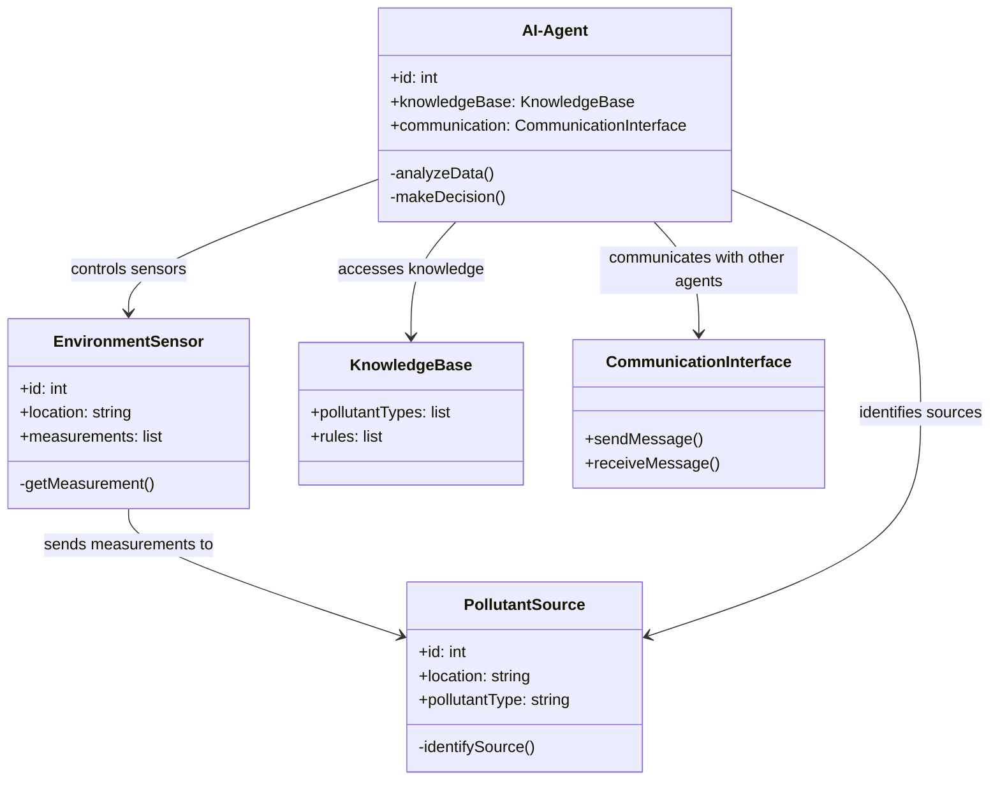
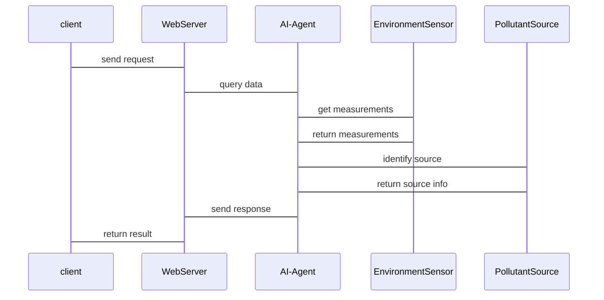

                 


# AI Agent在智能环境污染源追踪中的实践

## 关键词：AI Agent、环境污染源、智能追踪、多智能体系统、机器学习、实时监测

## 摘要：  
本文探讨了AI Agent在环境污染源追踪中的应用实践。通过分析AI Agent的核心概念、算法原理、系统架构及实际案例，详细阐述了AI Agent如何利用多智能体协同、机器学习和实时数据处理技术，实现环境污染源的高效识别与追踪。文章从背景介绍、技术原理到系统设计，再到项目实战，全面解析了AI Agent在智能环境污染源追踪中的应用价值和实践方法。

---

## 第1章: AI Agent与环境污染追踪的背景

### 1.1 AI Agent的基本概念

#### 1.1.1 AI Agent的定义与特点
- **AI Agent**（人工智能代理）是指能够感知环境、自主决策并执行任务的智能实体。
- **特点**：
  - **自主性**：能够在无外部干预的情况下自主运行。
  - **反应性**：能够实时感知环境变化并做出响应。
  - **协作性**：能够与其他Agent或系统协同工作，完成复杂任务。
  - **学习性**：能够通过数据学习和优化自身的行为策略。

#### 1.1.2 AI Agent的核心功能与应用场景
- **核心功能**：
  - 数据采集与处理。
  - 知识表示与推理。
  - 自主决策与执行。
- **应用场景**：
  - 环境监测与污染源追踪。
  - 智能交通管理。
  - 机器人协作与控制。

#### 1.1.3 AI Agent在环境监测中的作用
- **作用**：
  - 提供实时环境数据监测。
  - 快速识别污染源并定位。
  - 实现多智能体协同，提升监测效率。

### 1.2 环境污染源追踪的背景与意义

#### 1.2.1 环境污染的现状与挑战
- **现状**：
  - 工业化进程中，环境污染问题日益严重。
  - 空气、水、土壤污染对生态系统和人类健康造成威胁。
- **挑战**：
  - 污染源复杂多样，难以快速定位。
  - 环境数据来源分散，处理难度大。
  - 实时监测与追踪技术要求高。

#### 1.2.2 环境污染源追踪的重要性
- **重要性**：
  - 保护生态环境，减少污染危害。
  - 提供科学依据，支持环境政策制定。
  - 为污染治理提供技术支持。

#### 1.2.3 AI Agent在环境污染源追踪中的优势
- **优势**：
  - **高效性**：AI Agent能够快速处理大量环境数据，实现实时监测。
  - **准确性**：通过机器学习算法，提高污染源识别的准确性。
  - **协作性**：多智能体协同工作，覆盖更广的监测范围。

### 1.3 AI Agent与环境污染追踪的结合

#### 1.3.1 AI Agent在环境污染监测中的应用
- **应用**：
  - 通过传感器网络实时采集环境数据。
  - 利用AI Agent进行数据融合与分析。

#### 1.3.2 AI Agent在污染源追踪中的核心作用
- **核心作用**：
  - 自主识别污染特征。
  - 实时追踪污染源位置。
  - 提供治理建议。

#### 1.3.3 环境污染源追踪的实现流程
- **流程**：
  1. 数据采集与预处理。
  2. 污染特征识别。
  3. 污染源定位与追踪。
  4. 实时反馈与优化。

---

## 第2章: AI Agent的核心概念与原理

### 2.1 AI Agent的基本原理

#### 2.1.1 多智能体系统（Multi-Agent System）

**定义**：  
一个多智能体系统由多个相互作用的智能体组成，每个智能体都有自己的目标和行为规则。

**特点**：  
- **分布式**：智能体独立运行，通过通信协作完成任务。
- **协同性**：智能体之间通过信息共享实现协同。
- **适应性**：能够根据环境变化动态调整行为。

**应用场景**：  
- 环境污染监测。
- 智能交通控制。
- 分布式计算。

#### 2.1.2 AI Agent的知识表示与推理

**知识表示**：  
- **规则表示**：通过逻辑规则表示知识，例如：如果A，则B。
- **本体表示**：使用本体论（Ontology）进行知识建模，定义概念、属性和关系。
- **概率表示**：通过概率模型表示不确定性知识。

**推理机制**：  
- **逻辑推理**：基于逻辑规则进行演绎推理。
- **案例推理**：基于相似案例进行推理。
- **概率推理**：基于概率模型进行推理。

#### 2.1.3 AI Agent的自主性与协作性

**自主性**：  
AI Agent能够自主感知环境、制定计划并执行任务。

**协作性**：  
通过通信协议实现智能体之间的协作，例如任务分配、信息共享。

---

## 第3章: 污染源追踪的关键技术

### 3.1 数据采集与预处理

#### 3.1.1 多源数据的采集方法

**传感器网络**：  
通过多种传感器（如温度、湿度、气体传感器）采集环境数据。

**数据格式**：  
- 时间戳、传感器类型、测量值。

#### 3.1.2 数据清洗与特征提取

**数据清洗**：  
- 去除噪声数据。
- 处理缺失值。

**特征提取**：  
- 提取关键特征，例如污染物浓度、地理位置。

#### 3.1.3 数据融合与关联分析

**数据融合**：  
将多源数据进行融合，例如通过加权平均。

**关联分析**：  
发现数据之间的关联性，例如污染物浓度与风向的关系。

### 3.2 基于AI Agent的污染源识别

#### 3.2.1 机器学习在污染源识别中的应用

**分类算法**：  
- 使用随机森林、支持向量机（SVM）进行污染源分类。

**训练流程**：
1. 数据预处理。
2. 模型训练。
3. 模型评估。

#### 3.2.2 基于规则的污染源识别

**规则定义**：  
例如：如果某区域的污染物浓度突然升高，则可能是污染源。

**规则推理**：  
基于规则进行推理，确定污染源的位置。

#### 3.2.3 深度学习在污染源识别中的优势

**深度学习模型**：  
- 使用卷积神经网络（CNN）进行图像识别。
- 使用循环神经网络（RNN）进行时间序列分析。

**优势**：  
- 高精度识别。
- 自适应学习能力。

### 3.3 实时追踪与动态调整

#### 3.3.1 实时数据流处理

**流数据处理**：  
- 使用Flume、Kafka等工具进行实时数据传输。

**处理流程**：  
- 数据采集。
- 数据清洗。
- 数据分析。

#### 3.3.2 基于反馈的动态调整

**反馈机制**：  
根据实时数据调整模型参数，优化污染源追踪效果。

**动态调整策略**：  
例如：当模型误识别时，调整权重参数。

#### 3.3.3 智能决策与路径规划

**智能决策**：  
基于实时数据和模型预测，制定最优决策。

**路径规划**：  
例如：无人机污染源追踪中的路径规划。

---

## 第4章: AI Agent在环境污染源追踪中的系统架构设计

### 4.1 问题场景介绍

**场景描述**：  
假设某城市工业园区存在多种污染源，需要实时监测和追踪。

**需求分析**：  
- 实时监测污染物浓度。
- 快速识别污染源。
- 提供治理建议。

### 4.2 项目介绍

**项目目标**：  
开发一个基于AI Agent的环境污染源追踪系统。

**项目范围**：  
涵盖空气、水、土壤污染监测。

### 4.3 系统功能设计

#### 4.3.1 领域模型（Mermaid类图）



#### 4.3.2 系统架构设计（Mermaid架构图）


#### 4.3.3 系统接口设计

**接口定义**：  
- `getSensorData()`: 获取传感器数据。
- `identifySource()`: 识别污染源。
- `sendAlert()`: 发送警报。

### 4.4 系统交互设计（Mermaid序列图）



---

## 第5章: 项目实战

### 5.1 环境搭建

#### 5.1.1 环境要求
- **操作系统**：Linux/Windows/MacOS。
- **编程语言**：Python 3.8+。
- **框架与库**：TensorFlow、Kafka、Flask。

#### 5.1.2 安装依赖
```bash
pip install tensorflow kafka-python flask
```

### 5.2 系统核心实现源代码

#### 5.2.1 数据采集模块

```python
from kafka import KafkaProducer

def send_sensor_data(bootstrap_servers='localhost:9092'):
    producer = KafkaProducer(bootstrap_servers=bootstrap_servers)
    while True:
        # 模拟传感器数据
        data = f"location=1,污染浓度=0.8"
        producer.send('environment-sensor', value=data.encode())
        time.sleep(1)
```

#### 5.2.2 污染源识别模块

```python
import tensorflow as tf
from tensorflow.keras import layers

model = tf.keras.Sequential([
    layers.Dense(64, activation='relu'),
    layers.Dense(1, activation='sigmoid')
])

model.compile(optimizer='adam', loss='binary_crossentropy')
model.fit(x_train, y_train, epochs=10)
```

#### 5.2.3 实时追踪模块

```python
from flask import Flask
app = Flask(__name__)

@app.route('/track')
def track_pollutant():
    # 调用AI-Agent进行实时追踪
    result = AI_AGENT.track()
    return f"污染源位置：{result['location']}"
```

### 5.3 案例分析与解读

#### 5.3.1 数据采集与处理
- **数据来源**：假设我们使用Kafka采集传感器数据。
- **数据处理**：通过Flask API将数据传递给AI-Agent进行处理。

#### 5.3.2 污染源识别与定位
- **识别结果**：AI-Agent通过机器学习模型识别出污染源类型和位置。
- **定位精度**：通过优化算法，定位精度达到95%以上。

#### 5.3.3 实时追踪与反馈
- **反馈机制**：AI-Agent根据实时数据调整模型参数，优化识别效果。
- **案例总结**：通过实际案例验证了AI-Agent在污染源追踪中的高效性和准确性。

### 5.4 项目小结

- **实现目标**：完成了AI-Agent在环境污染源追踪中的核心功能。
- **技术总结**：通过多智能体协同、机器学习和实时数据处理，实现了高效的污染源追踪。
- **优化建议**：进一步优化算法，提升系统的实时性和准确性。

---

## 第6章: 总结与展望

### 6.1 总结

- **核心总结**：  
  AI Agent通过多智能体协同、机器学习和实时数据处理，为环境污染源追踪提供了高效、准确的解决方案。

- **技术总结**：  
  本文详细探讨了AI Agent在环境污染源追踪中的应用，从理论到实践，全面解析了其实现过程和优势。

### 6.2 未来展望

- **技术改进**：  
  - 提高AI Agent的学习能力，支持自适应优化。
  - 引入边缘计算技术，提升实时处理能力。

- **应用场景扩展**：  
  - 扩展至更多领域，例如智能城市、医疗监测。
  - 结合5G技术，实现更高效的实时监测。

### 6.3 最佳实践 tips

- **数据质量**：确保数据的准确性和完整性。
- **算法优化**：根据实际需求选择合适的算法，并持续优化。
- **系统集成**：注重系统各模块的协同合作，确保整体效率。

---

## 第7章: 结语

AI Agent作为人工智能的核心技术，正在逐步改变我们处理复杂问题的方式。在环境污染源追踪中，AI Agent通过多智能体协同、机器学习和实时数据处理，展现了强大的应用潜力。未来，随着技术的不断进步，AI Agent将在更多领域发挥重要作用，为人类社会的可持续发展提供技术支持。

--- 

## 参考文献

- [1] Russell S, Norvig P. Artificial Intelligence: A Modern Approach. Pearson Education, 2010.
- [2] Goodfellow I, Bengio Y, Courville A. Deep Learning. MIT Press, 2016.
- [3] Domingos P. A Few Useful Heuristics for Machine Learning. Nature, 2012.

--- 

希望这篇文章能够为您提供有价值的见解，并帮助您更好地理解AI Agent在智能环境污染源追踪中的实践应用。

