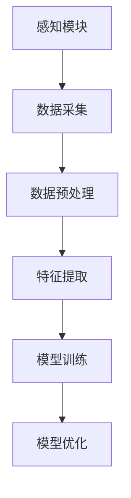
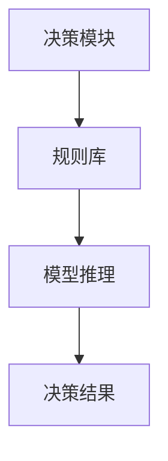
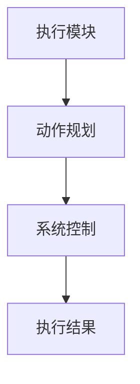
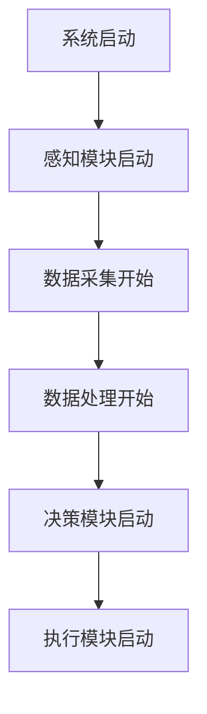
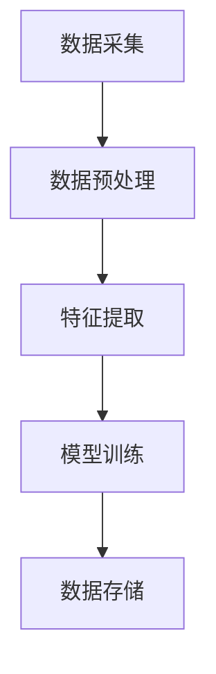
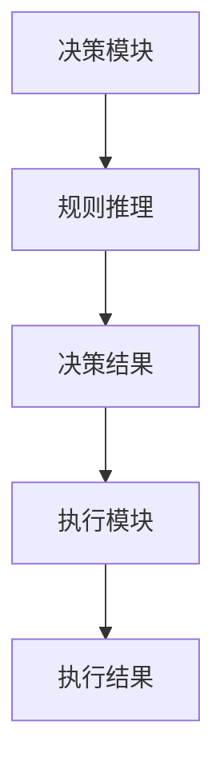

                 


# AI Agent在智能环境监测中的应用

## 关键词：AI Agent，智能环境监测，算法原理，系统架构，项目实战

## 摘要：AI Agent作为一种智能体，能够通过感知、推理和行动来实现对环境的监测与管理。本文将详细介绍AI Agent在智能环境监测中的应用，包括其核心概念、算法原理、系统架构设计以及实际项目案例分析。通过本文，读者将能够理解AI Agent在环境监测中的优势，并掌握其实际应用的实现方法。

---

# 第一部分: AI Agent在智能环境监测中的应用概述

## 第1章: AI Agent与智能环境监测概述

### 1.1 AI Agent的基本概念

#### 1.1.1 AI Agent的定义与特点

AI Agent（人工智能代理）是一种能够感知环境、自主决策并采取行动的智能实体。它能够通过传感器获取环境信息，利用算法进行分析和推理，并根据结果执行相应的操作。AI Agent的特点包括自主性、反应性、目标导向和学习能力。

#### 1.1.2 AI Agent的核心要素

AI Agent的核心要素包括感知模块、推理模块、决策模块和执行模块。感知模块负责获取环境信息；推理模块对信息进行分析和处理；决策模块根据推理结果制定行动计划；执行模块负责将决策转化为具体操作。

#### 1.1.3 智能环境监测的定义与目标

智能环境监测是指通过AI Agent对环境进行实时监测、分析和管理的过程。其目标是实现环境信息的高效采集、处理和应用，从而提高环境监测的准确性和效率。

---

### 1.2 AI Agent在环境监测中的应用背景

#### 1.2.1 环境监测的现状与挑战

传统环境监测方法依赖于人工操作，存在效率低、覆盖面小、实时性差等问题。随着环境问题的日益严重，对高效、智能的环境监测系统需求迫切。

#### 1.2.2 AI Agent在环境监测中的优势

AI Agent能够实时感知环境信息，通过智能算法进行分析和决策，具有高效性、自主性和适应性。它能够处理大量数据，快速响应环境变化，为环境监测提供有力支持。

#### 1.2.3 典型应用场景分析

AI Agent在环境监测中的典型应用场景包括空气质量监测、水质监测、噪声监测和地质灾害监测等。

---

### 1.3 本章小结

本章介绍了AI Agent的基本概念和核心要素，并分析了其在环境监测中的应用背景和优势。通过这些内容，读者可以理解AI Agent在智能环境监测中的重要性。

---

# 第二部分: AI Agent的核心概念与原理

## 第2章: AI Agent的核心概念与联系

### 2.1 AI Agent的定义与分类

#### 2.1.1 AI Agent的定义

AI Agent是一种能够感知环境、自主决策并执行任务的智能实体。它能够通过与环境的交互实现目标。

#### 2.1.2 AI Agent的分类

AI Agent可以分为基于规则的AI Agent、基于机器学习的AI Agent和基于强化学习的AI Agent。基于规则的AI Agent通过预定义的规则进行决策；基于机器学习的AI Agent通过学习数据进行决策；基于强化学习的AI Agent通过与环境的交互优化决策策略。

---

### 2.2 AI Agent与环境监测的关系

#### 2.2.1 环境监测中的信息感知

AI Agent通过传感器和数据采集设备获取环境信息，如温度、湿度、空气质量等。

#### 2.2.2 AI Agent的决策与执行

AI Agent根据感知到的信息，利用算法进行分析和推理，制定相应的决策，并通过执行模块实现对环境的干预。

---

### 2.3 AI Agent的核心原理

#### 2.3.1 知识表示与推理

知识表示是将环境信息以某种形式存储的过程，推理是根据知识进行逻辑推理的过程。

#### 2.3.2 感知与学习

AI Agent通过感知环境信息并学习这些信息，提高自身的认知能力。

#### 2.3.3 决策与规划

AI Agent根据感知和学习结果，制定行动计划，并通过规划模块优化决策过程。

---

### 2.4 本章小结

本章详细介绍了AI Agent的核心概念和其在环境监测中的应用，分析了AI Agent的分类、感知与学习以及决策与规划的原理。

---

# 第三部分: AI Agent的算法原理与数学模型

## 第3章: AI Agent的算法原理

### 3.1 感知算法

#### 3.1.1 数据采集与预处理

AI Agent通过传感器采集环境数据，并对数据进行预处理，去除噪声和冗余信息。

#### 3.1.2 模型训练与优化

AI Agent利用机器学习算法对数据进行训练，优化模型参数，提高感知精度。

---

### 3.2 决策算法

#### 3.2.1 基于规则的决策

基于规则的决策是通过预定义的规则进行决策，适用于规则明确的场景。

#### 3.2.2 基于机器学习的决策

基于机器学习的决策是通过训练模型进行预测和分类，适用于复杂场景。

#### 3.2.3 基于强化学习的决策

基于强化学习的决策是通过与环境的交互优化决策策略，适用于动态变化的场景。

---

### 3.3 执行算法

#### 3.3.1 动作规划

动作规划是根据决策结果制定具体的执行动作，确保行动的可行性和最优性。

#### 3.3.2 系统控制

系统控制是通过执行模块对环境进行干预，实现对环境的实时控制。

---

### 3.4 算法流程图

#### 3.4.1 感知模块流程图



#### 3.4.2 决策模块流程图



#### 3.4.3 执行模块流程图



---

### 3.5 本章小结

本章详细讲解了AI Agent的算法原理，包括感知算法、决策算法和执行算法，并通过流程图展示了算法的执行过程。

---

# 第四部分: AI Agent在环境监测中的系统架构

## 第4章: 系统分析与架构设计

### 4.1 系统需求分析

#### 4.1.1 功能需求

系统需要实现环境数据的采集、分析、决策和执行功能。

#### 4.1.2 性能需求

系统需要具备高实时性、高准确性和高可靠性。

#### 4.1.3 接口需求

系统需要与传感器、执行机构以及人机交互界面进行接口对接。

---

### 4.2 系统架构设计

#### 4.2.1 分层架构设计

系统采用分层架构，包括感知层、决策层和执行层。

#### 4.2.2 模块化设计

系统分为数据采集模块、数据处理模块、决策模块和执行模块。

---

### 4.3 系统接口设计

#### 4.3.1 数据接口

系统需要与传感器和数据存储模块进行数据交互。

#### 4.3.2 控制接口

系统需要与执行机构进行控制信号的交互。

#### 4.3.3 人机交互接口

系统需要提供人机交互界面，供用户查看和控制系统。

---

### 4.4 系统交互流程图

#### 4.4.1 系统启动流程



#### 4.4.2 数据采集与处理流程



#### 4.4.3 决策与执行流程



---

### 4.5 本章小结

本章分析了AI Agent在环境监测中的系统架构，包括系统需求分析、架构设计和交互流程。

---

# 第五部分: 项目实战与案例分析

## 第5章: 项目实战

### 5.1 环境监测系统搭建

#### 5.1.1 环境搭建

安装必要的软件和硬件设备，配置开发环境。

#### 5.1.2 数据采集模块实现

编写代码实现传感器数据的采集和预处理。

#### 5.1.3 AI Agent核心算法实现

基于机器学习算法实现环境数据的分析和决策。

---

### 5.2 系统核心实现源代码

#### 5.2.1 数据采集代码

```python
import numpy as np
import pandas as pd

# 数据采集函数
def collect_data():
    # 模拟传感器数据
    data = np.random.randn(100, 5)
    return pd.DataFrame(data, columns=['温度', '湿度', '空气质量', '光照强度', '噪声水平'])
```

#### 5.2.2 决策算法代码

```python
from sklearn import tree

# 决策树模型训练
def train_model(X, y):
    clf = tree.DecisionTreeClassifier()
    clf.fit(X, y)
    return clf

# 模拟数据
X = [[1, 2, 3, 4, 5], [6, 7, 8, 9, 10]]
y = ['正常', '异常']

model = train_model(X, y)
```

---

### 5.3 项目实战小结

通过本节的项目实战，读者可以了解AI Agent在环境监测系统中的具体实现方法，包括系统搭建、数据采集和算法实现。

---

# 总结

本文详细介绍了AI Agent在智能环境监测中的应用，从基本概念到算法原理，再到系统架构设计和项目实战，全面剖析了AI Agent在环境监测中的优势和实现方法。通过本文的学习，读者可以掌握AI Agent的核心原理，并能够将其应用于实际的环境监测项目中。

---

# 参考文献

1. Russell, S., & Norvig, P. (2010). Artificial Intelligence: A Modern Approach.
2. Goodfellow, I., Bengio, Y., & Courville, A. (2016). Deep Learning.

---

# 注意事项

在实际应用中，需注意数据的实时性和准确性，确保系统的稳定运行。同时，需遵守相关法律法规，保护环境和用户隐私。

---

# 最佳实践 Tips

- 在实际项目中，建议使用开源的机器学习框架（如TensorFlow、PyTorch）进行算法实现。
- 系统部署时，需考虑计算资源的分配，确保系统的高效运行。
- 定期更新模型参数，提高系统的适应性和准确性。

---

# 拓展阅读

- AI Agent在智能交通系统中的应用
- 基于强化学习的环境监测算法研究
- 大数据分析在环境监测中的应用

---

通过本文的学习，读者可以全面了解AI Agent在智能环境监测中的应用，并能够在实际项目中灵活运用这些知识。

