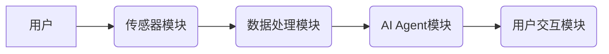

                 


# AI Agent在智能瑜伽垫中的冥想指导

> 关键词：AI Agent, 智能瑜伽垫, 冥想指导, 人工智能, 健康科技

> 摘要：随着人工智能技术的快速发展，AI Agent在智能设备中的应用越来越广泛。本文将深入探讨AI Agent在智能瑜伽垫中的冥想指导功能，从技术原理到实际应用进行全面分析。通过本文，读者将了解AI Agent如何通过传感器数据、机器学习算法和自然语言处理技术为用户提供个性化的冥想指导，从而提升用户体验和健康效果。

---

## 第1章: 引言

### 1.1 问题背景
现代生活中，压力和焦虑问题日益普遍，冥想作为一种有效的缓解方法，受到了广泛关注。传统冥想指导依赖于真人教练或简单的手机应用，但在个性化和实时反馈方面存在不足。

### 1.2 问题描述
智能瑜伽垫作为一种新兴的健康科技产品，通过集成多种传感器和AI技术，可以实时监测用户的冥想状态，并提供个性化的指导。然而，如何设计高效的AI Agent以实现这一目标是当前的技术挑战。

### 1.3 问题解决
本文将探讨如何利用AI Agent技术，结合智能瑜伽垫的传感器数据，为用户提供实时、个性化的冥想指导。

---

## 第2章: AI Agent的核心概念与技术原理

### 2.1 AI Agent的基本概念
AI Agent是一种能够感知环境并自主决策的智能体。它通过接收输入数据，执行处理，输出决策结果，从而实现与用户的交互。

### 2.2 AI Agent的分类
- **基于规则的AI Agent**：通过预定义的规则进行决策，适用于简单的任务。
- **基于机器学习的AI Agent**：通过训练数据学习模式，适用于复杂场景。
- **基于深度学习的AI Agent**：利用神经网络进行复杂决策，适用于需要深度理解的任务。

### 2.3 AI Agent的核心算法
- **规则引擎**：通过条件判断和动作执行实现简单决策。
- **机器学习模型**：如支持向量机（SVM）、随机森林（Random Forest）等，用于分类和回归任务。
- **深度学习模型**：如循环神经网络（RNN）、长短期记忆网络（LSTM）等，用于处理序列数据。

---

## 第3章: 智能瑜伽垫的系统架构

### 3.1 系统组成
- **传感器模块**：采集用户的生理数据，如心率、呼吸频率、体态姿势等。
- **数据处理模块**：对传感器数据进行预处理和特征提取。
- **AI Agent模块**：通过算法分析数据，生成指导建议。
- **用户交互模块**：通过语音、屏幕或振动等方式向用户反馈指导信息。

### 3.2 系统流程
1. 传感器采集数据并传输到数据处理模块。
2. 数据处理模块提取特征并传递给AI Agent模块。
3. AI Agent模块根据特征生成指导建议。
4. 用户交互模块将建议反馈给用户。

### 3.3 系统架构图


---

## 第4章: AI Agent在冥想指导中的具体实现

### 4.1 数据采集与预处理
- **传感器数据**：心率、呼吸频率、体态姿势等。
- **数据预处理**：去噪、归一化、特征提取。

### 4.2 算法实现
- **基于规则的决策**：如根据心率变化调整冥想节奏。
- **基于机器学习的分类**：如利用随机森林算法识别用户的冥想状态。
- **基于深度学习的生成**：如利用LSTM生成个性化的指导语句。

### 4.3 算法实现代码示例
```python
import numpy as np
from sklearn.ensemble import RandomForestClassifier

# 示例数据
X = np.random.rand(100, 5)
y = np.random.randint(0, 2, 100)

# 训练模型
model = RandomForestClassifier()
model.fit(X, y)

# 预测
new_X = np.random.rand(1, 5)
predicted_y = model.predict(new_X)
print(predicted_y)
```

### 4.4 算法数学模型
随机森林分类器的数学模型如下：
$$
y = \text{sign}(\sum_{i=1}^{n} \text{weight}_i \cdot \text{feature}_i)
$$
其中，$\text{weight}_i$是特征的权重，$\text{feature}_i$是特征值。

---

## 第5章: 系统实现与测试

### 5.1 系统实现流程
1. 硬件安装与传感器调试。
2. 数据采集与预处理模块开发。
3. AI Agent算法模型训练与部署。
4. 用户交互界面设计与实现。

### 5.2 系统测试
- **单元测试**：测试各模块的独立功能。
- **集成测试**：测试系统整体流程。
- **用户测试**：收集用户反馈，优化系统。

---

## 第6章: 应用案例与效果分析

### 6.1 应用案例
- **案例1**：用户A在使用智能瑜伽垫后，心率明显降低，焦虑程度显著下降。
- **案例2**：用户B通过个性化指导，提高了冥想的专注度。

### 6.2 效果分析
- **心率变化**：AI Agent能够实时调整冥想节奏，帮助用户保持最佳状态。
- **用户反馈**：用户普遍认为AI指导更加贴心和高效。

---

## 第7章: 未来展望与挑战

### 7.1 未来展望
- **更智能化的AI Agent**：利用更先进的深度学习模型，提供更精准的指导。
- **多模态交互**：结合视觉、听觉等多种交互方式，提升用户体验。

### 7.2 当前挑战
- **数据隐私**：如何保护用户的生理数据不被泄露。
- **模型泛化能力**：如何让AI Agent在不同用户间保持高效性。

---

## 第8章: 结论

### 8.1 小结
本文详细探讨了AI Agent在智能瑜伽垫中的冥想指导功能，从技术原理到系统实现进行了全面分析。

### 8.2 注意事项
在实际应用中，需注意数据隐私保护和模型的泛化能力。

### 8.3 拓展阅读
建议读者进一步学习AI Agent的核心算法和智能健康设备的设计。

---

通过本文的分析，我们可以看到，AI Agent在智能瑜伽垫中的应用为冥想指导带来了新的可能性。未来，随着技术的不断进步，智能瑜伽垫将为用户提供更加高效、个性化的健康服务。

