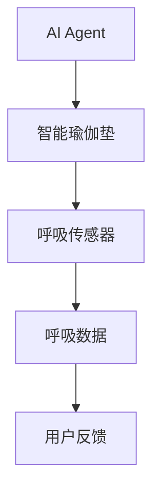
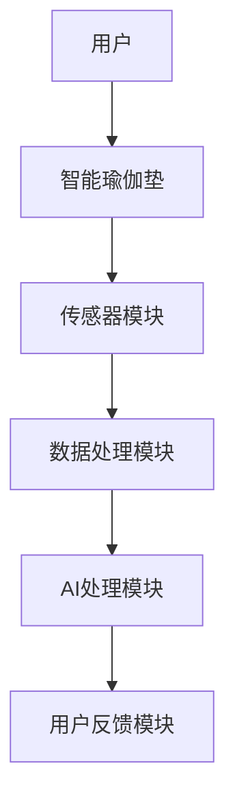
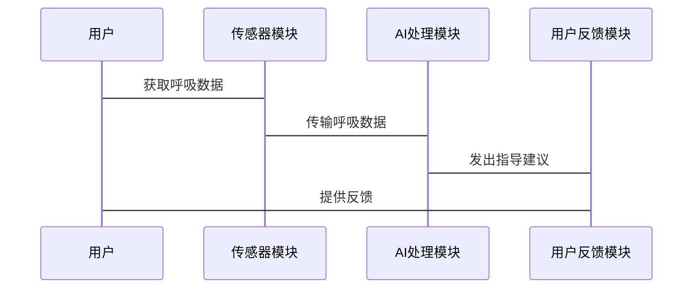

                 


# AI Agent在智能瑜伽垫中的呼吸指导

> 关键词：AI Agent，智能瑜伽垫，呼吸指导，时间序列分析，传感器技术，算法实现

> 摘要：本文详细探讨了AI Agent在智能瑜伽垫中的应用，特别是其在呼吸指导方面的作用。文章从AI Agent的基本概念出发，分析了其与智能瑜伽垫的结合方式，详细讲解了呼吸指导算法的数学模型和实现方法，并通过系统架构设计和项目实战展示了AI技术在瑜伽领域的实际应用。最后，文章总结了AI Agent在智能瑜伽垫中的优势和未来发展方向。

---

## 第1章: AI Agent的基本概念

### 1.1 什么是AI Agent
AI Agent（人工智能代理）是一种能够感知环境、自主决策并采取行动的智能实体。它通过传感器获取信息，利用算法处理数据，并根据目标执行任务。AI Agent的核心特点包括自主性、反应性、目标导向性和学习能力。

### 1.2 智能瑜伽垫的定义与特点
智能瑜伽垫是一种结合了传感器技术和AI算法的智能设备，能够实时监测用户的动作、呼吸频率和姿势，并通过反馈指导用户完成瑜伽练习。其特点包括：
- **传感器技术**：集成压力传感器、加速度计等，实时采集用户数据。
- **AI算法**：通过AI Agent分析数据，提供个性化的呼吸指导和姿势调整建议。
- **用户交互**：通过语音或震动反馈，与用户进行实时互动。

### 1.3 AI Agent与传统AI的区别
传统AI通常是指基于规则或预设模型的自动化系统，而AI Agent具有更强的自主性和适应性，能够根据实时数据动态调整行为。AI Agent在智能瑜伽垫中的应用，使其能够根据用户的实时反馈优化呼吸指导策略。

---

## 第2章: 呼吸指导的重要性

### 2.1 呼吸在瑜伽中的作用
呼吸是瑜伽练习的核心要素之一，正确的呼吸方式能够帮助用户放松身心、提高柔韧性和专注力。在瑜伽中，呼吸与动作的协调至关重要，错误的呼吸方式可能导致身体不适或练习效果不佳。

### 2.2 AI在呼吸指导中的应用
AI Agent能够通过传感器实时监测用户的呼吸频率和深度，结合预设的算法模型，提供个性化的呼吸指导。例如：
- **实时反馈**：当用户呼吸过快或过浅时，AI Agent会通过语音或震动提醒用户调整呼吸节奏。
- **个性化建议**：根据用户的呼吸模式，AI Agent会推荐适合的呼吸练习，帮助用户达到最佳状态。

### 2.3 AI呼吸指导的优势与局限性
**优势**：
- **实时性**：AI Agent能够实时监测用户的呼吸数据，并立即提供反馈。
- **个性化**：基于用户的个体差异，提供定制化的呼吸指导方案。
- **高效性**：通过AI算法优化呼吸练习，提高练习效率。

**局限性**：
- **依赖传感器**：AI呼吸指导的高度依赖传感器数据，传感器的精度和稳定性直接影响指导效果。
- **用户接受度**：部分用户可能对AI反馈的实时性产生抵触，影响用户体验。

---

## 第3章: AI Agent的核心原理

### 3.1 AI Agent的基本原理
AI Agent的工作流程可以分为以下几个步骤：
1. **感知环境**：通过传感器获取用户的呼吸数据。
2. **数据处理**：将传感器数据输入AI算法模型，进行分析和处理。
3. **决策与反馈**：根据分析结果，生成呼吸指导建议，并通过交互界面反馈给用户。

### 3.2 AI Agent与智能瑜伽垫的结合
AI Agent在智能瑜伽垫中的应用主要体现在以下几个方面：
- **数据采集**：通过压力传感器和加速度计采集用户的呼吸频率、深度和姿势。
- **数据处理**：利用时间序列分析模型，对呼吸数据进行建模和预测。
- **用户反馈**：根据分析结果，通过语音或震动反馈指导用户调整呼吸节奏。

---

## 第4章: 核心概念的属性特征对比

### 4.1 AI Agent与智能瑜伽垫的对比分析
| 特性 | AI Agent | 智能瑜伽垫 |
|------|-----------|------------|
| 核心功能 | 数据处理与决策 | 数据采集与反馈 |
| 技术实现 | 依赖算法模型 | 依赖传感器技术 |
| 应用场景 | 多领域适用 | 专注于瑜伽指导 |

### 4.2 实体关系图


---

## 第5章: 呼吸指导算法的数学模型与实现

### 5.1 时间序列分析模型
时间序列分析是一种用于预测未来数据的算法，常用于呼吸数据的处理与分析。以下是一个简单的时间序列模型：

$$
y_t = \alpha y_{t-1} + \beta x_t + \epsilon_t
$$

其中：
- $y_t$ 表示当前时刻的呼吸数据。
- $\alpha$ 表示自回归系数。
- $\beta$ 表示外回归系数。
- $x_t$ 表示外部输入数据。
- $\epsilon_t$ 表示误差项。

### 5.2 算法实现
以下是基于时间序列分析的Python实现示例：

```python
import numpy as np
from sklearn.metrics import mean_squared_error

# 示例数据
data = np.array([5, 7, 6, 8, 7, 9, 8, 10, 9, 11])

# 模型参数
alpha = 0.5
beta = 0.3

# 预测值
predictions = []
for i in range(1, len(data)):
    prev_pred = predictions[-1] if predictions else data[0]
    pred = alpha * data[i-1] + beta * data[i-2]
    predictions.append(pred)

# 计算均方误差
mse = mean_squared_error(data[1:], predictions)
print("均方误差:", mse)
```

---

## 第6章: 系统架构设计与实现

### 6.1 系统功能设计
智能瑜伽垫的系统功能模块包括：
- **传感器模块**：采集用户的呼吸数据。
- **AI处理模块**：分析呼吸数据并生成指导建议。
- **用户反馈模块**：通过语音或震动反馈指导用户。

### 6.2 系统架构设计


### 6.3 系统接口设计
系统接口设计需要考虑传感器数据的采集、AI算法的调用以及用户反馈的输出。以下是接口设计示例：



---

## 第7章: 项目实战

### 7.1 环境安装
需要安装以下环境：
- Python 3.8+
- NumPy
- scikit-learn
- Mermaid

### 7.2 核心代码实现
以下是呼吸指导算法的核心代码：

```python
import numpy as np
from sklearn import linear_model

# 示例数据
X = np.array([[1, 2], [3, 4], [5, 6], [7, 8], [9, 10]])
y = np.array([2, 3, 4, 5, 6])

# 训练模型
model = linear_model.LinearRegression()
model.fit(X, y)

# 预测值
new_X = np.array([[11, 12]])
predicted_y = model.predict(new_X)
print("预测值:", predicted_y)
```

### 7.3 实际案例分析
通过实际案例分析，验证算法的有效性。例如，用户在进行瑜伽练习时，AI Agent能够实时监测其呼吸频率，并根据模型预测结果提供个性化的呼吸指导。

---

## 第8章: 最佳实践与总结

### 8.1 小结
本文详细探讨了AI Agent在智能瑜伽垫中的应用，特别是其在呼吸指导方面的优势。通过时间序列分析模型和系统架构设计，展示了如何利用AI技术优化用户的瑜伽练习体验。

### 8.2 注意事项
- **数据隐私**：用户数据的采集和处理需要遵守相关隐私保护法规。
- **用户体验**：AI反馈的实时性和准确性直接影响用户的接受度。
- **传感器精度**：传感器的精度和稳定性是AI呼吸指导的关键因素。

### 8.3 拓展阅读
- **时间序列分析**：深入学习ARIMA模型和LSTM网络在时间序列预测中的应用。
- **AI在健身领域的应用**：探索AI在跑步、瑜伽等健身领域的更多可能性。

---

通过本文的详细讲解，读者可以全面理解AI Agent在智能瑜伽垫中的呼吸指导技术，并能够将其应用到实际项目中。

