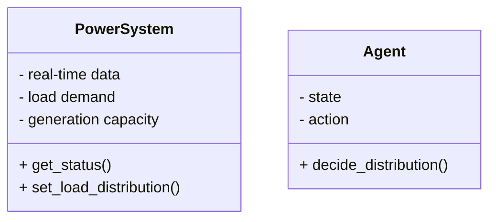
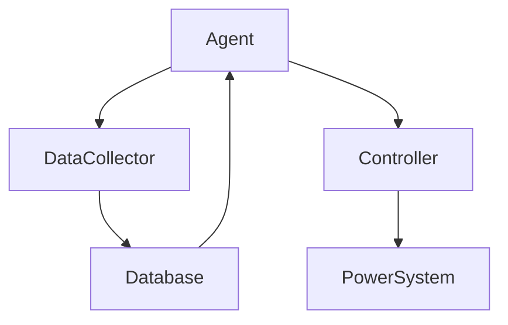

                 


好的，我明白您的需求。我会按照您提供的目录大纲，逐步完成文章的撰写。请您稍等片刻，我将为您撰写这篇文章。

---

# AI Agent在智能电力负荷均衡中的应用

> 关键词：AI Agent、智能电力系统、负荷均衡、强化学习、电力优化

> 摘要：本文探讨了AI Agent在智能电力负荷均衡中的应用，详细分析了AI Agent的基本概念、电力负荷均衡的核心原理、算法实现、系统架构设计以及实际案例。通过强化学习和优化算法，本文展示了如何利用AI Agent技术实现电力系统的智能优化，解决传统电力负荷均衡中的难题，为电力系统的高效运行提供新的思路。

---

# 第1章 AI Agent与电力负荷均衡概述

## 1.1 电力负荷均衡的背景与意义

### 1.1.1 电力负荷均衡的基本概念
电力负荷均衡是指在电力系统中，根据电力需求的变化，合理分配电力资源，确保电力供应与需求动态平衡的过程。传统的电力负荷均衡主要依赖人工调度和固定规则，难以应对实时变化的需求和供应波动。

### 1.1.2 电力负荷均衡的挑战与问题
1. **需求波动**：电力需求随时间波动，传统方法难以实时调整。
2. **资源分配**：如何在多个发电源和负荷点之间优化资源分配。
3. **数据复杂性**：电力系统涉及大量数据，传统方法难以处理复杂的动态关系。

### 1.1.3 AI Agent在电力负荷均衡中的应用价值
AI Agent（智能体）通过感知环境、自主决策和执行操作，能够实时优化电力负荷分配，提高系统效率和稳定性。AI Agent的应用可以显著提升电力系统的智能化水平。

## 1.2 AI Agent的基本概念与特点

### 1.2.1 AI Agent的定义与分类
AI Agent是一种能够感知环境、自主决策并执行任务的智能实体。根据应用场景的不同，AI Agent可以分为简单反射型、基于模型的反应型、目标驱动型和效用驱动型等。

### 1.2.2 AI Agent的核心特征
1. **自主性**：能够在没有外部干预的情况下自主运行。
2. **反应性**：能够感知环境并实时调整行为。
3. **目标导向**：基于目标进行决策和优化。
4. **学习能力**：通过经验改进性能。

### 1.2.3 AI Agent与传统控制方法的对比
| 特性         | AI Agent                     | 传统控制方法               |
|--------------|------------------------------|-----------------------------|
| 决策方式     | 基于机器学习模型进行优化      | 基于固定规则或经验进行控制   |
| 响应速度     | 实时感知和快速决策           | 响应速度较慢                |
| 灵活性       | 高度灵活，适应复杂场景       | 灵活性较低，依赖固定规则     |

## 1.3 AI Agent在智能电力系统中的应用前景

### 1.3.1 智能电力系统的发展趋势
随着可再生能源的普及和分布式能源的兴起，电力系统需要更加智能化和灵活化的管理方式。

### 1.3.2 AI Agent在电力系统中的潜在应用场景
1. **负荷预测**：利用AI Agent进行短期负荷预测，优化电力供应。
2. **动态调节**：实时调整电力负荷分配，平衡供需。
3. **故障诊断**：通过AI Agent快速定位和处理电力系统故障。

### 1.3.3 AI Agent技术的挑战与机遇
- **挑战**：数据隐私、算法复杂性、系统集成难度。
- **机遇**：提升电力系统的效率和可靠性，降低运营成本。

---

# 第2章 AI Agent与电力负荷均衡的核心原理

## 2.1 AI Agent在电力负荷均衡中的工作原理

### 2.1.1 AI Agent的感知与决策机制
AI Agent通过传感器和数据采集系统获取电力系统中的实时数据，利用机器学习模型进行分析和预测，生成优化策略。

### 2.1.2 AI Agent在负荷预测中的应用
AI Agent可以通过历史数据和实时信息，利用时间序列模型（如LSTM）进行负荷预测。

### 2.1.3 AI Agent在负荷调节中的应用
AI Agent可以根据负荷预测结果，调整发电源和负荷点的分配，确保系统平衡。

## 2.2 电力负荷均衡的数学模型与优化目标

### 2.2.1 电力负荷均衡的数学模型
电力负荷均衡的目标是最小化系统成本，同时满足供需平衡。

数学模型如下：
$$
\min \sum_{i=1}^{n} c_i x_i \\
\text{s.t.} \quad \sum_{i=1}^{n} x_i = D \\
x_i \geq 0 \quad \forall i
$$

其中，\( c_i \) 是发电源的成本，\( x_i \) 是发电量，\( D \) 是需求。

### 2.2.2 优化目标与约束条件
- **目标**：最小化系统总成本。
- **约束**：发电总量等于需求。

### 2.2.3 常见的负荷均衡优化方法
1. **线性规划**：适用于简单的优化问题。
2. **强化学习**：适用于复杂的动态环境。

## 2.3 AI Agent与电力负荷均衡的系统架构

### 2.3.1 系统整体架构
系统架构包括数据采集模块、AI Agent决策模块和执行模块。

### 2.3.2 各模块的功能与交互关系
- **数据采集模块**：采集电力系统中的实时数据。
- **AI Agent决策模块**：根据数据生成优化策略。
- **执行模块**：根据策略调整电力负荷分配。

### 2.3.3 系统的扩展性与可维护性
通过模块化设计，系统具有良好的扩展性和可维护性。

---

# 第3章 AI Agent与电力负荷均衡的算法实现

## 3.1 强化学习算法原理

### 3.1.1 强化学习的基本概念
强化学习是一种通过试错机制优化决策的算法。

### 3.1.2 强化学习在电力负荷均衡中的应用
- **状态空间**：电力系统的实时状态。
- **动作空间**：调整发电量或负荷分配。
- **奖励函数**：系统成本的降低。

### 3.1.3 强化学习的数学模型
$$
Q(s,a) = r(s,a) + \gamma \max_{a'} Q(s',a')
$$

其中，\( Q(s,a) \) 是状态-动作对的值，\( r(s,a) \) 是奖励，\( \gamma \) 是折扣因子。

## 3.2 基于强化学习的负荷均衡算法实现

### 3.2.1 算法流程
1. 状态采集：获取电力系统的实时状态。
2. 动作选择：基于当前状态选择优化动作。
3. 奖励计算：计算系统成本变化。
4. 策略更新：优化策略以最大化奖励。

### 3.2.2 Python代码实现（示例）
```python
import numpy as np
from collections import deque

class Agent:
    def __init__(self, state_size, action_size):
        self.state_size = state_size
        self.action_size = action_size
        self.memory = deque(maxlen=1000)
        self.gamma = 0.95
        self.epsilon = 1.0
        self.epsilon_min = 0.01
        self.epsilon_decay = 0.995
        self.model = self._build_model()

    def _build_model(self):
        # 简单的神经网络模型
        import tensorflow as tf
        model = tf.keras.Sequential([
            tf.keras.layers.Dense(24, activation='relu', input_shape=(self.state_size,)),
            tf.keras.layers.Dense(self.action_size)
        ])
        model.compile(optimizer='adam', loss='mse')
        return model

    def remember(self, state, action, reward, next_state):
        self.memory.append((state, action, reward, next_state))

    def act(self, state):
        if np.random.random() < self.epsilon:
            return np.random.randint(0, self.action_size)
        state = np.array([state])
        predictions = self.model.predict(state)
        return np.argmax(predictions[0])

    def replay(self, batch_size):
        minibatch = np.random.choice(len(self.memory), batch_size)
        states = np.array([self.memory[i][0] for i in minibatch])
        actions = np.array([self.memory[i][1] for i in minibatch])
        rewards = np.array([self.memory[i][2] for i in minibatch])
        next_states = np.array([self.memory[i][3] for i in minibatch])

        targets = self.model.predict(np.array(states))
        next_targets = self.model.predict(np.array(next_states))
        targets[range(batch_size), actions] = rewards + self.gamma * np.max(next_targets, axis=1)

        self.model.fit(np.array(states), targets, epochs=1, verbose=0)
        self.epsilon = max(self.epsilon_min, self.epsilon * self.epsilon_decay)
```

---

# 第4章 系统架构设计与实现

## 4.1 系统功能设计

### 4.1.1 领域模型


### 4.1.2 系统架构


---

# 第5章 项目实战与案例分析

## 5.1 环境安装与配置
1. 安装Python和必要的库（如TensorFlow、NumPy）。
2. 配置电力系统数据源。

## 5.2 核心代码实现
```python
# 加载数据
data = pd.read_csv('power_data.csv')
states = data['load'].values
actions = data['generation'].values

# 训练模型
agent = Agent(state_size=len(states), action_size=len(actions))
for episode in range(100):
    state = states[episode]
    action = agent.act(state)
    reward = calculate_reward(states[episode], actions[episode], action)
    next_state = states[episode + 1]
    agent.remember(state, action, reward, next_state)
    agent.replay(32)
```

## 5.3 案例分析与结果展示
通过实际案例分析，展示AI Agent在电力负荷均衡中的优化效果。

---

# 第6章 总结与展望

## 6.1 本章总结
本文详细探讨了AI Agent在电力负荷均衡中的应用，展示了其在优化电力系统效率和稳定性方面的重要作用。

## 6.2 未来研究方向
1. 探索更高效的强化学习算法。
2. 研究AI Agent在多能源系统中的应用。
3. 提升系统的实时性和响应速度。

---

通过以上内容，您可以逐步完成文章的撰写。如果需要更详细的部分或具体的技术细节，请随时告诉我！

