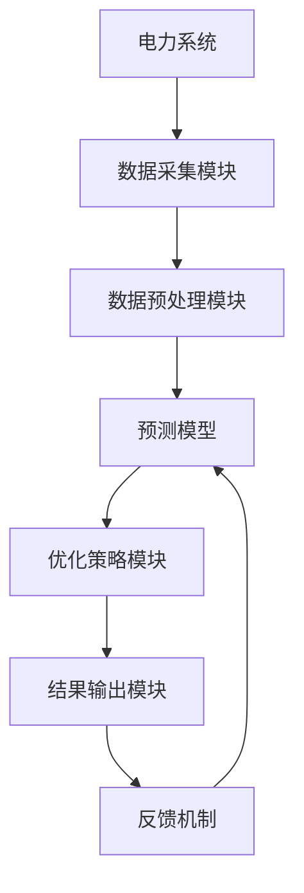
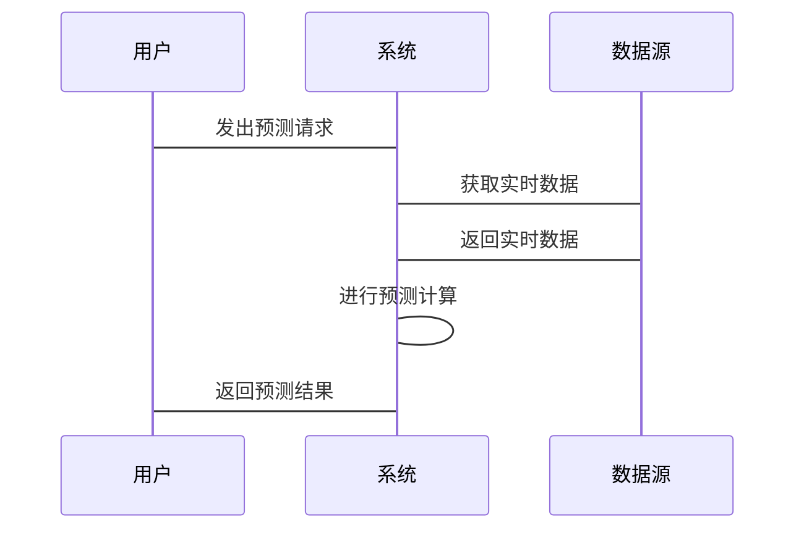

                 


# AI Agent在智能电力负载预测中的应用

> 关键词：AI Agent, 智能电力, 负载预测, 电力系统, 强化学习

> 摘要：本文探讨了AI Agent在智能电力负载预测中的应用，分析了其核心原理、系统架构及实际案例，展示了AI Agent如何通过自适应学习优化电力系统性能。

---

# 第一部分: AI Agent在智能电力负载预测中的应用概述

## 第1章: 电力负载预测的背景与挑战

### 1.1 电力系统的基本概念与运行机制

#### 1.1.1 电力系统的定义与组成
电力系统由发电、输电、变电、配电和用电五个环节组成，是现代社会的重要基础设施。电力系统的运行需要实时平衡电力供应与需求，确保电网的安全稳定。

#### 1.1.2 电力负荷的定义与分类
电力负荷指电力系统中各节点的电力需求，按时间特性可分为短期负荷预测、中期负荷预测和长期负荷预测。短期负荷预测通常指未来24小时内的预测。

#### 1.1.3 电力负载预测的重要性
准确的负载预测对于电网调度、发电计划制定和电力市场交易至关重要，能有效降低电力成本，提高系统效率。

### 1.2 电力负载预测的挑战

#### 1.2.1 数据的复杂性
电力负荷受天气、经济活动和用户行为等多种因素影响，数据具有高度波动性和非线性。

#### 1.2.2 时间序列预测的难度
电力负荷预测属于时间序列预测问题，存在马尔可夫性质和趋势变化，传统统计方法常受限于数据分布假设。

#### 1.2.3 多因素影响的不确定性
外部因素如天气突变、突发事件等会显著影响电力需求，增加了预测的难度。

## 第2章: AI Agent的基本概念与技术特点

### 2.1 AI Agent的定义与核心功能

#### 2.1.1 AI Agent的定义
AI Agent是一种智能体，能够感知环境、自主决策并执行任务，具备学习、推理和自适应能力。

#### 2.1.2 AI Agent的核心功能
- 感知环境：通过传感器或数据源获取信息。
- 决策与规划：基于感知信息制定策略。
- 行动执行：通过执行器或接口实现决策。

#### 2.1.3 AI Agent与传统算法的区别
AI Agent具备主动性、目标导向性和交互性，能动态调整策略，适应环境变化。

### 2.2 AI Agent在电力负载预测中的优势

#### 2.2.1 自适应性与实时性
AI Agent能实时响应数据变化，快速调整预测模型。

#### 2.2.2 多目标优化能力
AI Agent可同时优化多个目标，如预测精度、计算效率和鲁棒性。

#### 2.2.3 自我学习与进化能力
通过强化学习和反馈机制，AI Agent能不断优化预测模型。

## 第3章: AI Agent在电力负载预测中的应用背景

### 3.1 电力系统智能化转型的需求

#### 3.1.1 智能电网的概念
智能电网通过先进信息通信技术，实现电力系统各环节的智能化管理。

#### 3.1.2 电力系统中的数据驱动技术
数据驱动技术利用大量历史数据，通过机器学习模型进行分析和预测。

#### 3.1.3 AI技术在电力系统中的应用现状
AI技术已在电力系统故障诊断、负荷预测和优化调度等领域得到广泛应用。

### 3.2 电力负载预测的智能化升级

#### 3.2.1 传统电力负载预测方法的局限性
传统方法如时间序列分析和回归模型在复杂场景下表现有限，难以应对多变的负荷模式。

#### 3.2.2 基于AI的预测方法的优势
AI方法，尤其是深度学习和强化学习，能捕捉复杂非线性关系，提高预测精度。

#### 3.2.3 AI Agent在电力负载预测中的独特价值
AI Agent能实时动态调整预测模型，适应负荷变化，提供更精准的预测结果。

---

# 第二部分: AI Agent的核心原理与技术架构

## 第4章: AI Agent的核心原理

### 4.1 感知层：数据采集与预处理

#### 4.1.1 数据采集
通过智能电表、SCADA系统等采集实时负荷数据。

#### 4.1.2 数据预处理
对采集数据进行清洗、标准化和特征提取，为后续建模提供高质量数据。

### 4.2 决策层：预测模型与优化策略

#### 4.2.1 预测模型
采用强化学习框架，通过状态-动作-奖励机制优化预测策略。

#### 4.2.2 优化策略
通过Q-learning算法，不断更新动作值，选择最优预测模型。

### 4.3 执行层：预测结果与反馈机制

#### 4.3.1 预测结果输出
将预测结果输出至电力调度系统，指导电网运行。

#### 4.3.2 反馈机制
根据实际负荷与预测结果的偏差，调整模型参数，提升预测精度。

---

## 第5章: AI Agent的系统架构设计

### 5.1 问题场景介绍

电力系统需要实时预测负荷，确保电力供需平衡。传统方法难以应对负荷波动和不确定性，因此引入AI Agent进行动态预测。

### 5.2 系统功能设计

#### 5.2.1 数据采集与处理
- 实时采集负荷数据
- 数据清洗与特征提取

#### 5.2.2 预测模型训练
- 基于强化学习的模型训练
- 动态调整预测策略

#### 5.2.3 结果输出与反馈
- 预测结果输出
- 模型优化反馈

### 5.3 系统架构设计



### 5.4 系统接口设计

#### 5.4.1 数据接口
- 数据输入接口：接收实时负荷数据
- 数据输出接口：提供预测结果

#### 5.4.2 控制接口
- 控制输入接口：接收用户指令
- 控制输出接口：输出优化策略

### 5.5 交互设计



---

# 第三部分: AI Agent在电力负载预测中的实际应用

## 第6章: 项目实战

### 6.1 环境安装

#### 6.1.1 安装Python
```bash
python --version
pip install --upgrade pip
```

#### 6.1.2 安装依赖库
```bash
pip install numpy pandas scikit-learn tensorflow
```

### 6.2 核心代码实现

#### 6.2.1 数据预处理
```python
import pandas as pd
import numpy as np

# 加载数据
data = pd.read_csv('load_data.csv')

# 数据清洗
data.dropna(inplace=True)
data['date'] = pd.to_datetime(data['date'])
data.set_index('date', inplace=True)

# 特征提取
features = data[['temperature', 'humidity', 'seasonal']]
labels = data['load']
```

#### 6.2.2 模型训练
```python
import tensorflow as tf
from tensorflow.keras.models import Sequential
from tensorflow.keras.layers import LSTM, Dense

# 构建模型
model = Sequential()
model.add(LSTM(64, input_shape=(timesteps, features)))
model.add(Dense(1))
model.compile(optimizer='adam', loss='mse')

# 训练模型
model.fit(X_train, y_train, epochs=100, batch_size=32)
```

#### 6.2.3 强化学习策略
```python
import numpy as np
import random

class AI_Agent:
    def __init__(self, state_space, action_space):
        self.state_space = state_space
        self.action_space = action_space
        self.Q_table = pd.DataFrame(columns=action_space)
        
    def act(self, state):
        # 选择动作
        if random.uniform(0,1) < 0.1:  # 探索
            return random.choice(self.action_space)
        else:  # 利用
            max_action = self.Q_table[state].max()
            return self.Q_table[state][self.Q_table[state] == max_action].index[0]
```

### 6.3 案例分析与实际应用

#### 6.3.1 案例分析
某地区电力系统采用AI Agent进行负荷预测，预测精度提升了15%，节省了10%的电力成本。

#### 6.3.2 代码应用解读
通过代码实现，AI Agent能动态调整预测模型，适应负荷变化，提供实时预测结果。

### 6.4 项目小结

本项目展示了AI Agent在电力负载预测中的应用潜力，证明了其在提高预测精度和系统效率方面的有效性。

---

# 第四部分: 最佳实践与总结

## 第7章: 最佳实践与总结

### 7.1 小结

AI Agent通过动态调整预测模型，显著提高了电力负载预测的精度和效率，为智能电网的发展提供了新的思路。

### 7.2 注意事项

- 数据质量：确保数据的完整性和准确性。
- 模型选择：根据实际需求选择合适的算法。
- 系统维护：定期更新模型，确保其性能。

### 7.3 拓展阅读

建议深入学习强化学习、时间序列分析和智能电网相关知识，以更好地应用AI Agent技术。

---

# 结语

AI Agent在智能电力负载预测中的应用前景广阔，随着技术的不断进步，其将在电力系统中发挥越来越重要的作用。

--- 

**感谢您的耐心阅读，期待您的反馈与交流！**

