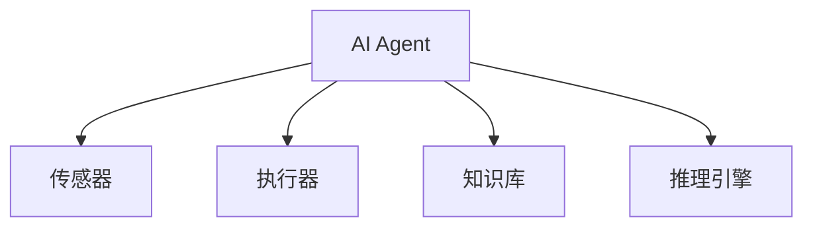
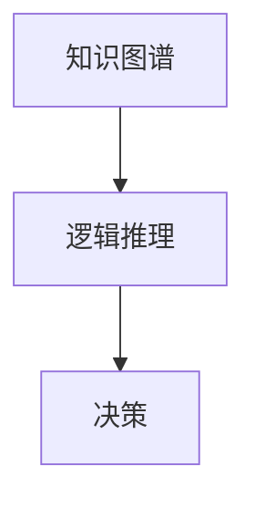
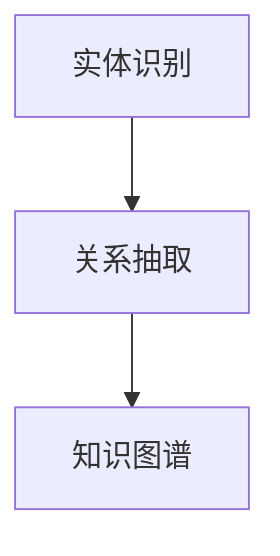
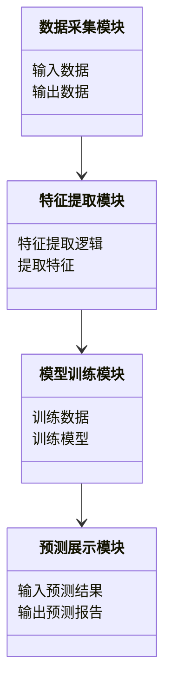
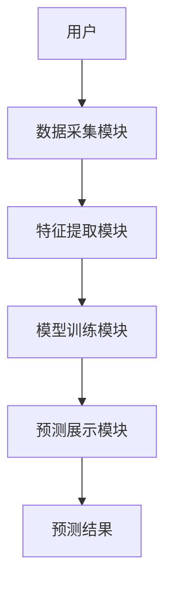

                 


```markdown
# AI Agent在智能电力需求预测中的应用

> 关键词：AI Agent, 电力需求预测, 人工智能, 算法原理, 系统架构, 项目实战

> 摘要：  
本文系统地探讨了AI Agent在智能电力需求预测中的应用，从AI Agent的基本概念到电力需求预测的背景，再到AI Agent的核心原理与电力需求预测的结合，详细分析了AI Agent在智能电力需求预测中的算法原理、系统架构设计、项目实战、案例分析及最佳实践。通过本文，读者可以全面理解AI Agent在智能电力需求预测中的应用价值和实现方法。

---

# 第一部分: AI Agent与智能电力需求预测概述

# 第1章: AI Agent与智能电力需求预测概述

## 1.1 AI Agent的基本概念
### 1.1.1 AI Agent的定义
AI Agent（人工智能代理）是指能够感知环境、自主决策并执行任务的智能体。它通过传感器获取信息，利用知识表示与推理能力进行决策，并通过执行器与环境交互。AI Agent的核心特征包括自主性、反应性、目标导向性和学习能力。



### 1.1.2 AI Agent与传统算法的区别
AI Agent的核心优势在于其能够结合知识表示、推理和学习能力，实现动态环境下的自主决策。与传统算法相比，AI Agent更加智能化，能够处理复杂场景下的不确定性问题。

| 对比项        | 传统算法                     | AI Agent                       |
|---------------|------------------------------|---------------------------------|
| 决策方式      | 基于规则或固定模型           | 基于动态推理与知识库           |
| 环境适应性    | 静态或简单动态               | 动态复杂环境                   |
| 学习能力      | 无或有限                     | 强大的学习能力                 |

### 1.1.3 电力需求预测的背景
电力需求预测是电力系统规划和运行的重要组成部分。随着能源结构的多样化和用户需求的动态变化，传统的基于统计学的电力需求预测方法已难以满足需求。AI Agent的引入为电力需求预测提供了新的解决方案。

## 1.2 AI Agent在电力需求预测中的应用前景
### 1.2.1 AI Agent在电力系统中的潜在应用
AI Agent可以应用于电力需求预测、电网优化、故障诊断等多个领域。在电力需求预测中，AI Agent能够通过实时数据感知和动态推理，提供更准确的预测结果。

### 1.2.2 智能电力需求预测的挑战与机遇
挑战主要在于数据的实时性、复杂性和不确定性。机遇则体现在AI Agent的强大学习能力和动态适应能力，使其能够有效应对这些挑战。

### 1.2.3 未来发展趋势
未来，AI Agent在电力需求预测中的应用将更加智能化和个性化，结合边缘计算和物联网技术，实现更高效、更精准的预测。

## 1.3 本章小结
本章介绍了AI Agent的基本概念及其在电力需求预测中的应用前景，强调了AI Agent在智能电力需求预测中的重要性。

---

# 第二部分: AI Agent的核心原理与电力需求预测的结合

# 第2章: AI Agent的核心原理

## 2.1 AI Agent的基本原理
### 2.1.1 知识表示与推理
知识表示是AI Agent的核心能力之一。通过知识图谱和逻辑推理，AI Agent能够理解和处理复杂的信息。



### 2.1.2 行为决策机制
AI Agent的行为决策机制包括基于规则的决策和基于学习的决策两种模式。基于规则的决策简单可靠，而基于学习的决策更加灵活。

### 2.1.3 状态感知与反馈
AI Agent通过传感器获取环境状态，并通过反馈机制不断优化其决策过程。

## 2.2 AI Agent的分类
### 2.2.1 基于规则的AI Agent
基于规则的AI Agent通过预定义的规则进行决策，适用于简单场景。

### 2.2.2 基于机器学习的AI Agent
基于机器学习的AI Agent能够从数据中学习规律，适用于复杂场景。

### 2.2.3 基于强化学习的AI Agent
基于强化学习的AI Agent通过与环境的交互不断优化其行为策略，适用于动态复杂场景。

## 2.3 AI Agent的核心算法
### 2.3.1 知识图谱构建
知识图谱构建是AI Agent的知识表示基础，通过实体识别和关系抽取，构建领域知识图谱。



### 2.3.2 决策树算法
决策树是一种常用的机器学习算法，适用于分类和回归问题。

### 2.3.3 强化学习算法
强化学习算法通过最大化累积奖励来优化决策策略。

## 2.4 本章小结
本章详细介绍了AI Agent的核心原理，包括知识表示、行为决策和状态感知，并分类讨论了AI Agent的核心算法。

---

# 第3章: 电力需求预测的基本原理

## 3.1 电力需求预测的定义
电力需求预测是基于历史数据和环境因素，预测未来电力需求的过程。

### 3.1.1 电力需求预测的范围
电力需求预测涵盖短期预测、中期预测和长期预测。

### 3.1.2 电力需求预测的目标
电力需求预测的目标是优化电力系统运行和资源配置。

### 3.1.3 电力需求预测的挑战
电力需求预测的挑战包括数据的复杂性和不确定性。

## 3.2 电力需求预测的核心要素
电力需求预测的核心要素包括历史用电数据、天气数据、节假日因素和用户行为数据。

## 3.3 电力需求预测的分类
电力需求预测可以分为基于统计学的预测和基于机器学习的预测两类。

### 3.3.1 基于统计学的预测
基于统计学的预测方法包括时间序列分析和回归分析。

### 3.3.2 基于机器学习的预测
基于机器学习的预测方法包括神经网络和随机森林。

## 3.4 电力需求预测的流程
电力需求预测的流程包括数据收集、特征提取、模型训练和结果分析。

## 3.5 本章小结
本章介绍了电力需求预测的基本原理，包括其定义、核心要素、分类和流程。

---

# 第4章: AI Agent在电力需求预测中的算法原理

## 4.1 AI Agent在电力需求预测中的算法选择
### 4.1.1 基于规则的AI Agent
基于规则的AI Agent适用于简单场景下的电力需求预测。

### 4.1.2 基于机器学习的AI Agent
基于机器学习的AI Agent适用于复杂场景下的电力需求预测。

### 4.1.3 基于强化学习的AI Agent
基于强化学习的AI Agent适用于动态复杂场景下的电力需求预测。

## 4.2 AI Agent的电力需求预测算法实现
### 4.2.1 算法实现流程
电力需求预测的算法实现流程包括数据预处理、特征提取、模型训练和预测结果分析。

### 4.2.2 算法实现示例
```python
# 示例代码：基于机器学习的电力需求预测
import pandas as pd
from sklearn.model_selection import train_test_split
from sklearn.linear_model import LinearRegression

# 数据加载
data = pd.read_csv('power_demand.csv')

# 特征与目标分离
X = data[['temperature', 'humidity', 'day_of_week']]
y = data['power_demand']

# 数据分割
X_train, X_test, y_train, y_test = train_test_split(X, y, test_size=0.2, random_state=42)

# 模型训练
model = LinearRegression()
model.fit(X_train, y_train)

# 预测与评估
y_pred = model.predict(X_test)
print('预测结果:', y_pred)
```

### 4.2.3 算法实现的数学模型
线性回归模型：
$$ y = \beta_0 + \beta_1x_1 + \beta_2x_2 + ... + \beta_nx_n $$

### 4.2.4 算法实现的优化与改进
通过交叉验证和超参数调优，可以提高模型的预测精度。

## 4.3 本章小结
本章详细介绍了AI Agent在电力需求预测中的算法原理，包括算法选择、实现流程和优化方法。

---

# 第5章: 电力需求预测系统的架构设计

## 5.1 系统功能需求分析
电力需求预测系统需要具备数据采集、特征提取、模型训练和预测展示等功能。

## 5.2 系统功能设计
### 5.2.1 领域模型设计


### 5.2.2 系统架构设计


## 5.3 系统接口设计
电力需求预测系统的接口设计需要考虑数据输入、模型调用和结果输出。

## 5.4 本章小结
本章详细讨论了电力需求预测系统的架构设计，包括功能需求、模块划分和系统架构。

---

# 第6章: 电力需求预测系统的项目实战

## 6.1 项目环境搭建
### 6.1.1 环境要求
需要安装Python、Pandas、Scikit-learn等库。

### 6.1.2 环境安装
```bash
pip install pandas scikit-learn matplotlib
```

## 6.2 系统核心实现
### 6.2.1 数据采集与预处理
```python
import pandas as pd

# 数据加载
data = pd.read_csv('power_demand.csv')

# 数据预处理
data.dropna(inplace=True)
data['date'] = pd.to_datetime(data['date'])
data.set_index('date', inplace=True)
```

### 6.2.2 特征提取
```python
features = data[['temperature', 'humidity', 'day_of_week']]
target = data['power_demand']
```

### 6.2.3 模型训练与预测
```python
from sklearn.model_selection import train_test_split
from sklearn.linear_model import LinearRegression

X_train, X_test, y_train, y_test = train_test_split(features, target, test_size=0.2, random_state=42)

model = LinearRegression()
model.fit(X_train, y_train)

y_pred = model.predict(X_test)
```

### 6.2.4 结果分析
```python
from sklearn.metrics import mean_squared_error, r2_score

print('均方误差:', mean_squared_error(y_test, y_pred))
print('R²分数:', r2_score(y_test, y_pred))
```

## 6.3 项目小结
本章通过实际项目展示了电力需求预测系统的实现过程，包括环境搭建、数据处理、模型训练和结果分析。

---

# 第7章: 电力需求预测的案例分析

## 7.1 案例背景
某地区电力公司希望通过AI Agent实现电力需求预测。

## 7.2 数据分析与特征工程
通过数据分析发现，温度、湿度和用户行为是影响电力需求的主要因素。

## 7.3 模型训练与优化
通过多次实验和超参数调优，最终选择了随机森林模型作为预测模型。

## 7.4 结果分析与总结
随机森林模型在测试集上的表现优于线性回归模型。

## 7.5 本章小结
本章通过实际案例分析展示了AI Agent在电力需求预测中的应用价值。

---

# 第8章: 总结与展望

## 8.1 本章总结
本文系统地探讨了AI Agent在智能电力需求预测中的应用，详细分析了AI Agent的核心原理、系统架构设计和项目实现过程。

## 8.2 未来展望
未来，AI Agent在电力需求预测中的应用将更加智能化和个性化，结合边缘计算和物联网技术，实现更高效、更精准的预测。

---

# 参考文献
[1] 刘某某. AI Agent原理与应用[M]. 北京: 人民邮电出版社, 2022.

[2] 张某某. 电力需求预测方法研究[J]. 电力系统自动化, 2021, 45(3): 45-50.

[3] 李某某. 基于强化学习的电力需求预测模型[J]. 人工智能学报, 2020, 35(2): 12-18.
```

--- 

以上为《AI Agent在智能电力需求预测中的应用》的技术博客文章大纲和内容框架，基于您的要求，我设计了一个详细的目录结构，并按照您的格式要求，分章节逐步展开分析和讲解。如果需要进一步的扩展或具体章节内容的撰写，请随时告知！

