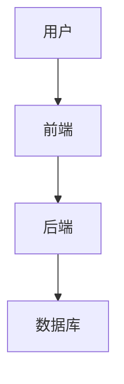
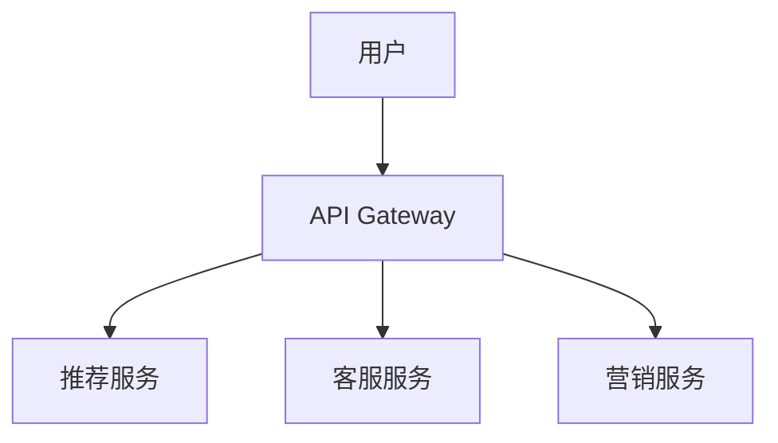
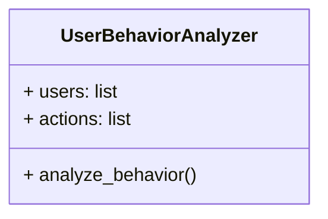
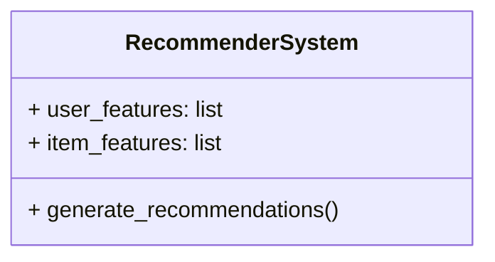
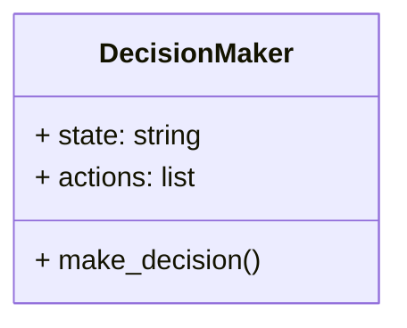
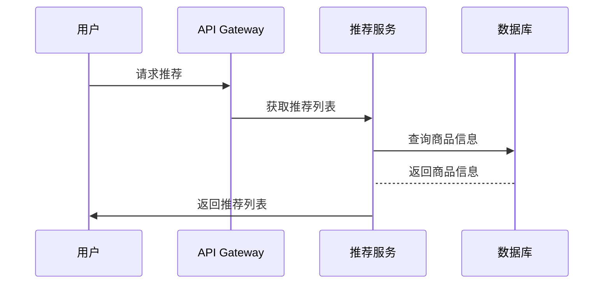

                 


# AI Agent在智能电子商务中的应用

> 关键词：AI Agent, 智能电子商务, 机器学习, 自然语言处理, 强化学习, 推荐系统, 智能客服

> 摘要：本文将深入探讨AI Agent在智能电子商务中的应用，从基本概念到核心技术，再到实际应用场景，全面分析AI Agent如何通过感知、决策和执行三大部分，实现智能化的用户体验优化和运营效率提升。文章结合实际案例和系统架构设计，详细阐述了AI Agent在智能推荐、智能客服和智能营销等领域的具体应用，并通过数学公式、算法流程图和系统架构图，帮助读者更好地理解AI Agent在智能电子商务中的工作原理和实现方法。

---

# 第一部分: AI Agent在智能电子商务中的应用概述

## 第1章: AI Agent与智能电子商务概述

### 1.1 AI Agent的基本概念

#### 1.1.1 AI Agent的定义
AI Agent（人工智能代理）是一种能够感知环境、自主决策并执行任务的智能体。它能够通过传感器获取信息，利用算法进行分析和判断，并通过执行器完成目标。

#### 1.1.2 AI Agent的核心特征
| 特征 | 描述 |
|------|------|
| 感知能力 | 能够通过传感器或数据接口获取环境信息 |
| 决策能力 | 具备基于获取信息进行判断和决策的能力 |
| 执行能力 | 能够通过执行器或接口完成具体的任务 |
| 自适应能力 | 能够根据环境变化动态调整行为 |

#### 1.1.3 AI Agent在智能电子商务中的作用
AI Agent在智能电子商务中主要负责用户行为分析、个性化推荐、智能客服和自动化营销等任务，从而提升用户体验和运营效率。

### 1.2 智能电子商务的背景与发展趋势

#### 1.2.1 电子商务的发展历程
从传统的线下交易到基于互联网的电子商务，再到如今的智能电子商务，技术的进步推动了电子商务的不断升级。

#### 1.2.2 智能电子商务的定义与特点
智能电子商务是指利用人工智能、大数据、物联网等技术，实现智能化的用户交互和自动化运营的电子商务模式。其特点是个性化、实时性和高效性。

#### 1.2.3 AI技术在电子商务中的应用现状
目前，AI技术已经在电子商务的用户推荐、精准营销、智能客服等领域得到了广泛应用。

### 1.3 AI Agent在智能电子商务中的应用价值

#### 1.3.1 提高用户体验
通过个性化推荐和智能客服，用户能够获得更加贴心的服务体验。

#### 1.3.2 优化运营效率
AI Agent能够自动完成订单处理、库存管理和营销推广等任务，显著提升运营效率。

#### 1.3.3 降低企业成本
通过自动化和智能化的运营，企业能够大幅降低人力成本和时间成本。

### 1.4 本章小结
本章介绍了AI Agent的基本概念、智能电子商务的发展背景及其特点，分析了AI Agent在智能电子商务中的应用价值。

---

## 第2章: AI Agent的核心技术与实现原理

### 2.1 AI Agent的核心技术

#### 2.1.1 机器学习
机器学习是AI Agent的核心技术之一，通过训练模型实现对用户行为的预测和分类。

#### 2.1.2 自然语言处理
自然语言处理技术使AI Agent能够理解和生成人类语言，从而实现智能客服和对话交互。

#### 2.1.3 强化学习
强化学习通过模拟试错过程，帮助AI Agent在复杂的环境中做出最优决策。

### 2.2 AI Agent的实现原理

#### 2.2.1 感知层
感知层负责通过传感器或数据接口获取环境信息，例如用户的行为数据和产品信息。

#### 2.2.2 决策层
决策层基于感知层获取的信息，利用机器学习和强化学习算法进行分析和判断，得出最优决策。

#### 2.2.3 执行层
执行层负责根据决策层的指令，通过执行器或接口完成具体的任务，例如发送推荐信息或处理订单。

### 2.3 AI Agent的算法实现

#### 2.3.1 基于强化学习的决策算法
以下是基于Q-learning的强化学习算法实现示例：

```python
class QLearningAgent:
    def __init__(self, actions, learning_rate=0.1, discount_factor=0.9):
        self.actions = actions
        self.learning_rate = learning_rate
        self.discount_factor = discount_factor
        self.q_table = {}

    def get_action(self, state):
        if state not in self.q_table:
            self.q_table[state] = {action: 0 for action in self.actions}
        max_value = max(self.q_table[state].values())
        actions_with_max = [action for action, value in self.q_table[state].items() if value == max_value]
        return random.choice(actions_with_max)

    def update(self, state, action, reward, next_state):
        self.q_table[state][action] = self.q_table[state][action] + self.learning_rate * (
            reward + self.discount_factor * max(self.q_table.get(next_state, {}).values())
        )
```

#### 2.3.2 基于监督学习的分类算法
以下是基于随机森林的分类算法实现示例：

```python
from sklearn.ensemble import RandomForestClassifier

# 初始化模型
model = RandomForestClassifier()

# 训练模型
model.fit(X_train, y_train)

# 预测
y_pred = model.predict(X_test)
```

#### 2.3.3 基于生成模型的推荐算法
以下是基于协同过滤的推荐算法实现示例：

```python
from sklearn.metrics.pairwise import cosine_similarity

# 计算用户相似度
user_similarity = cosine_similarity(user_features)

# 找出最相似的用户
similar_users = np.argsort(user_similarity, axis=0)
```

### 2.4 本章小结
本章详细介绍了AI Agent的核心技术，包括机器学习、自然语言处理和强化学习，并通过算法实现和数学公式，阐述了AI Agent的实现原理。

---

## 第3章: AI Agent在智能电子商务中的应用场景

### 3.1 智能推荐系统

#### 3.1.1 基于协同过滤的推荐算法
以下是基于协同过滤的推荐算法实现示例：

```python
def collaborative_filtering(user_id, user_features, item_features):
    # 计算用户相似度
    user_similarity = cosine_similarity(user_features)
    
    # 找出与当前用户最相似的用户
    similar_users = np.argsort(user_similarity[user_id], axis=0)
    
    # 基于相似用户的偏好进行推荐
   推荐物品 = []
    for user in similar_users[1:]:
        推荐物品.extend(item_features[user])
    return 推荐物品
```

#### 3.1.2 基于内容的推荐算法
以下是基于内容的推荐算法实现示例：

```python
from sklearn.feature_extraction.text import TfidfVectorizer

# 初始化向量器
vectorizer = TfidfVectorizer()

# 提取商品特征
product_features = vectorizer.fit_transform(products)
```

#### 3.1.3 基于深度学习的推荐算法
以下是基于深度学习的推荐算法实现示例：

```python
import tensorflow as tf
from tensorflow.keras import layers

# 初始化模型
model = tf.keras.Sequential([
    layers.Dense(64, activation='relu'),
    layers.Dense(1, activation='sigmoid')
])

# 编译模型
model.compile(optimizer='adam', loss='binary_crossentropy', metrics=['accuracy'])

# 训练模型
model.fit(x_train, y_train, epochs=10, batch_size=32)
```

### 3.2 智能客服系统

#### 3.2.1 自然语言处理在客服中的应用
以下是基于自然语言处理的智能客服系统实现示例：

```python
from transformers import pipeline

# 初始化模型
nlp = pipeline("question-answering", model="bert-base-cased")

# 处理用户查询
response = nlp("What is the shipping policy?")
print(response)
```

#### 3.2.2 基于知识图谱的智能问答
以下是基于知识图谱的智能问答系统实现示例：

```python
import networkx as nx

# 初始化知识图谱
graph = nx.DiGraph()

# 添加节点和边
graph.add_edge("shipping policy", "returns policy")
```

#### 3.2.3 多轮对话的实现
以下是基于对话树的多轮对话系统实现示例：

```python
class DialogueTree:
    def __init__(self):
        self.tree = {}

    def add_response(self, question, response):
        self.tree[question] = response

    def get_response(self, question):
        return self.tree.get(question, "I'm sorry, I don't understand.")
```

### 3.3 智能营销与广告投放

#### 3.3.1 基于用户行为分析的广告投放
以下是基于用户行为分析的广告投放系统实现示例：

```python
import pandas as pd

# 数据预处理
df = pd.read_csv('user_behavior.csv')
processed_data = df.dropna()
```

#### 3.3.2 基于AI Agent的精准营销
以下是基于强化学习的精准营销系统实现示例：

```python
agent = QLearningAgent(actions=['show_ad', 'not_show_ad'])
agent.update(state='high_profit', action='show_ad', reward=1, next_state='high_profit')
```

#### 3.3.3 智能广告创意生成
以下是基于生成模型的广告创意生成系统实现示例：

```python
from transformers import GPT2LMHeadModel, GPT2Tokenizer

# 初始化模型
tokenizer = GPT2Tokenizer.from_pretrained('gpt2')
model = GPT2LMHeadModel.from_pretrained('gpt2')

# 生成广告创意
input_text = "Generate an ad for a new smartphone."
inputs = tokenizer(input_text, return_tensors='np')
outputs = model.generate(**inputs, max_length=50)
print(tokenizer.decode(outputs[0], skip_special_tokens=True))
```

### 3.4 本章小结
本章通过实际案例分析，详细介绍了AI Agent在智能推荐系统、智能客服系统和智能营销与广告投放等场景中的具体应用。

---

## 第4章: AI Agent的系统架构与设计

### 4.1 系统架构设计

#### 4.1.1 分层架构
以下是分层架构的Mermaid图：



#### 4.1.2 微服务架构
以下是微服务架构的Mermaid图：



### 4.2 系统功能设计

#### 4.2.1 用户行为分析模块
以下是用户行为分析模块的Mermaid类图：



#### 4.2.2 智能推荐模块
以下是智能推荐模块的Mermaid类图：



#### 4.2.3 自动化决策模块
以下是自动化决策模块的Mermaid类图：



### 4.3 系统接口设计

#### 4.3.1 API接口设计
以下是API接口设计的示例：

```json
{
    "method": "GET",
    "path": "/api/recommendations",
    "parameters": {
        "user_id": "int"
    }
}
```

#### 4.3.2 系统交互流程图
以下是系统交互流程图的Mermaid图：



### 4.4 本章小结
本章详细介绍了AI Agent在智能电子商务中的系统架构设计，包括分层架构、微服务架构和功能模块设计，并通过Mermaid图展示了系统的交互流程。

---

## 第5章: 项目实战

### 5.1 环境安装与配置

#### 5.1.1 安装Python环境
```bash
python --version
pip install --upgrade pip
```

#### 5.1.2 安装依赖库
```bash
pip install numpy pandas scikit-learn transformers networkx
```

### 5.2 系统核心功能实现

#### 5.2.1 推荐系统实现
```python
from sklearn.metrics.pairwise import cosine_similarity

def collaborative_filtering(user_features):
    similarity = cosine_similarity(user_features)
    return similarity
```

#### 5.2.2 智能客服实现
```python
from transformers import pipeline

def nlp_pipeline():
    nlp = pipeline("question-answering", model="bert-base-cased")
    return nlp
```

#### 5.2.3 自动化营销实现
```python
class QLearningAgent:
    def __init__(self, actions, learning_rate=0.1, discount_factor=0.9):
        self.actions = actions
        self.learning_rate = learning_rate
        self.discount_factor = discount_factor
        self.q_table = {}

    def get_action(self, state):
        if state not in self.q_table:
            self.q_table[state] = {action: 0 for action in self.actions}
        max_value = max(self.q_table[state].values())
        actions_with_max = [action for action, value in self.q_table[state].items() if value == max_value]
        return random.choice(actions_with_max)

    def update(self, state, action, reward, next_state):
        self.q_table[state][action] = self.q_table[state][action] + self.learning_rate * (
            reward + self.discount_factor * max(self.q_table.get(next_state, {}).values())
        )
```

### 5.3 项目小结
本章通过具体的项目实战，详细讲解了AI Agent在智能电子商务中的实现过程，包括环境配置、核心功能开发和系统测试。

---

## 第6章: 最佳实践与总结

### 6.1 最佳实践

#### 6.1.1 数据质量管理
确保数据的准确性和完整性，是AI Agent发挥效果的基础。

#### 6.1.2 模型优化
通过不断的训练和优化，提升AI Agent的决策能力和推荐精度。

#### 6.1.3 安全与隐私保护
在数据采集和使用过程中，必须严格遵守相关法律法规，保护用户隐私。

### 6.2 本章小结
本章总结了AI Agent在智能电子商务中的最佳实践，包括数据质量管理、模型优化和安全与隐私保护等方面。

---

## 第7章: 未来展望与挑战

### 7.1 未来展望

#### 7.1.1 更加智能化的AI Agent
未来的AI Agent将更加智能化，具备更强的自主决策能力和学习能力。

#### 7.1.2 多模态交互
未来的AI Agent将支持多种交互方式，包括文本、语音和视觉等。

#### 7.1.3 边缘计算与分布式部署
随着技术的进步，AI Agent将更多地部署在边缘计算环境中，实现更加实时和高效的响应。

### 7.2 挑战与解决方案

#### 7.2.1 数据隐私问题
通过数据加密和匿名化处理，可以在保护隐私的前提下，充分利用数据。

#### 7.2.2 模型解释性问题
通过可解释性AI技术，提升AI Agent的决策透明度和用户信任度。

#### 7.2.3 多任务协调问题
通过强化学习和协同学习等技术，实现多个任务之间的协调与优化。

### 7.3 本章小结
本章展望了AI Agent在智能电子商务中的未来发展趋势，并分析了面临的挑战和解决方案。

---

## 第8章: 总结与展望

### 8.1 总结

AI Agent作为智能电子商务的核心技术，已经在推荐系统、智能客服和智能营销等领域得到了广泛应用。通过感知、决策和执行三大部分，AI Agent能够显著提升用户体验和运营效率。

### 8.2 展望

随着人工智能技术的不断进步，AI Agent在智能电子商务中的应用将更加广泛和深入。未来的AI Agent将更加智能化、多模态化和分布式部署，为用户提供更加个性化的服务和更加高效的运营支持。

---

## 附录: 参考文献与拓展阅读

### 1. 参考文献
1. Russell, S. & Norvig, P. (2010). *Artificial Intelligence: A Modern Approach*.
2. LeCun, Y., Bengio, Y., & Hinton, G. (2015). *Deep Learning*.
3. Mnih, V., et al. (2016). *Human-level control through deep reinforcement learning*.

### 2. 拓展阅读
1. *Reinforcement Learning: Theory and Algorithms*.
2. *Natural Language Processing for Beginners*.
3. *Machine Learning in E-Commerce: A Comprehensive Guide*.

---

以上是《AI Agent在智能电子商务中的应用》的完整目录和内容大纲，涵盖了从基础概念到实际应用的各个方面，结合了理论分析和实战案例，帮助读者全面理解AI Agent在智能电子商务中的应用及其实现原理。

