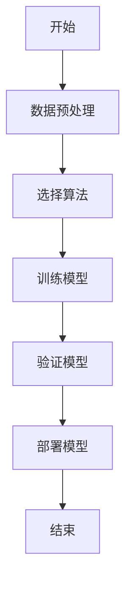
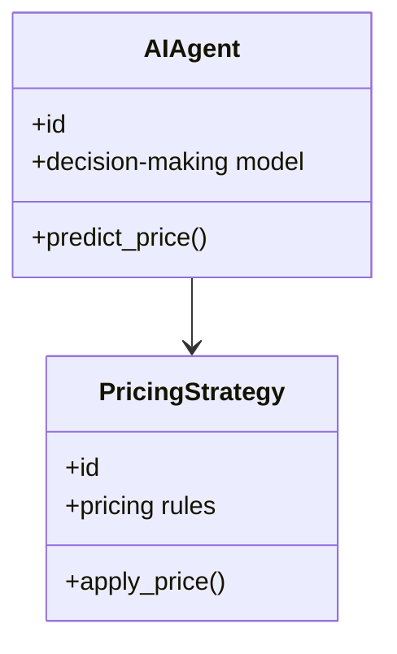
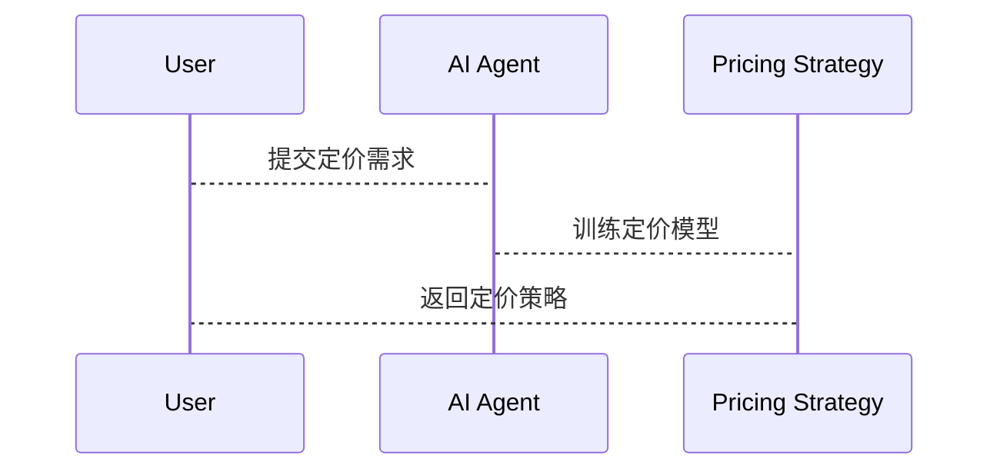

                 


# AI Agent在智能电子商务定价策略中的角色

## 关键词：AI Agent, 智能定价策略, 电子商务, 动态定价, 机器学习

## 摘要：AI Agent在电子商务定价策略中的应用日益广泛，通过数据分析和机器学习算法，AI Agent能够实时优化价格，提升销售效率和客户满意度。本文从背景、原理、算法、系统架构到项目实战，全面分析AI Agent在智能定价中的角色，为读者提供深入的技术解读。

---

## 第1章: AI Agent与智能电子商务定价策略背景

### 1.1 AI Agent的基本概念

#### 1.1.1 AI Agent的定义与特点

AI Agent（人工智能代理）是指能够感知环境并采取行动以实现目标的智能实体。其特点包括自主性、反应性、目标导向和学习能力。AI Agent在电子商务中的应用主要体现在自动化决策和优化过程中。

#### 1.1.2 AI Agent在电子商务中的应用

AI Agent在电子商务中被广泛用于推荐系统、库存管理和动态定价等领域。通过实时数据分析，AI Agent能够帮助商家优化定价策略，提升客户体验。

#### 1.1.3 智能定价策略的核心概念

智能定价策略是一种基于实时数据和机器学习模型的定价方法，旨在通过动态调整价格以最大化收益或客户满意度。其核心在于利用数据驱动的决策，而非传统的静态定价方法。

### 1.2 智能电子商务定价策略的背景

#### 1.2.1 电子商务定价的传统模式

传统定价模式依赖于人工经验和市场调研，存在反应慢、成本高等问题。随着数据量的爆炸式增长，传统定价模式已难以满足现代电子商务的需求。

#### 1.2.2 数据驱动定价的兴起

数据驱动定价通过收集和分析大量数据，利用机器学习算法优化定价策略。这种模式能够快速响应市场变化，提高定价的精准度和效率。

#### 1.2.3 AI Agent在定价中的角色

AI Agent在数据驱动定价中扮演着关键角色，它能够实时分析数据、制定决策并执行定价策略。通过AI Agent，商家可以实现价格的动态调整，以适应市场变化和客户需求。

## 第2章: AI Agent与定价策略的核心概念与联系

### 2.1 AI Agent的核心原理

#### 2.1.1 AI Agent的决策机制

AI Agent通过感知环境、分析数据并采取行动来实现目标。在定价策略中，AI Agent能够根据市场需求、竞争情况和库存状态等信息，实时调整价格。

#### 2.1.2 AI Agent的学习与优化能力

AI Agent通过机器学习算法不断优化定价策略。通过监督学习和强化学习，AI Agent能够从历史数据中学习定价模式，并预测未来的价格趋势。

#### 2.1.3 AI Agent的实时响应能力

AI Agent能够实时处理大量数据，并迅速做出定价决策。这种实时响应能力使得定价策略能够快速适应市场变化，提升销售效率。

### 2.2 定价策略的核心原理

#### 2.2.1 市场需求分析

定价策略的基础是市场需求分析。通过分析市场数据，AI Agent能够了解消费者的需求偏好和价格敏感度，从而制定合理的定价策略。

#### 2.2.2 成本与收益平衡

定价策略需要在成本和收益之间找到平衡点。AI Agent通过分析成本结构和市场收益，优化定价策略以最大化利润。

#### 2.2.3 动态定价模型

动态定价模型是一种基于实时数据的定价方法。通过AI Agent的应用，动态定价模型能够根据市场变化快速调整价格，以适应不同的市场环境。

### 2.3 AI Agent与定价策略的联系

#### 2.3.1 数据驱动的定价决策

AI Agent通过分析大量数据，帮助商家做出数据驱动的定价决策。这种决策方式更加精准和高效，能够提升定价策略的有效性。

#### 2.3.2 AI Agent在定价策略中的优化作用

AI Agent能够优化定价策略，使其更加适应市场变化和客户需求。通过机器学习算法，AI Agent能够发现数据中的模式和趋势，从而优化定价策略。

#### 2.3.3 定价策略的实时调整能力

AI Agent能够实时调整定价策略，以适应市场变化和客户需求。这种实时调整能力使得定价策略更加灵活和高效。

### 2.4 概念对比与ER实体关系图

#### 2.4.1 AI Agent与传统定价策略的对比分析

| 特性               | AI Agent定价策略          | 传统定价策略          |
|--------------------|---------------------------|-----------------------|
| 数据驱动           | 是                       | 否                   |
| 实时响应           | 是                       | 否                   |
| 自动优化           | 是                       | 否                   |
| 适应性             | 强                       | 弱                   |

#### 2.4.2 定价策略的ER实体关系图

```mermaid
er
    entity AI Agent {
        id
        decision-making model
    }
    entity Pricing Strategy {
        id
        pricing rules
    }
    AI Agent --> Pricing Strategy
```

---

## 第3章: AI Agent定价策略的核心算法原理

### 3.1 定价策略算法原理

#### 3.1.1 强化学习算法

强化学习是一种通过试错机制优化决策的算法。在定价策略中，强化学习可以通过不断试验不同的价格，找到最优定价策略。

#### 3.1.2 监督学习算法

监督学习是一种基于已有数据训练模型的算法。在定价策略中，监督学习可以通过分析历史销售数据，预测未来的价格趋势。

#### 3.1.3 聚类分析

聚类分析是一种将相似数据点分组的算法。在定价策略中，聚类分析可以用于识别不同客户群体，制定差异化定价策略。

#### 3.1.4 算法流程图

```mermaid
graph TD
    A[开始] --> B[数据预处理]
    B --> C[选择算法]
    C --> D[训练模型]
    D --> E[验证模型]
    E --> F[部署模型]
    F --> G[结束]
```



### 3.2 AI Agent推荐策略算法原理

#### 3.2.1 基于协同过滤的推荐算法

协同过滤是一种基于用户行为相似性的推荐算法。在定价策略中，协同过滤可以用于推荐相似产品的定价策略。

#### 3.2.2 基于内容的推荐算法

内容推荐是一种基于产品属性的推荐算法。在定价策略中，内容推荐可以用于根据产品特性推荐定价策略。

#### 3.2.3 基于混合模型的推荐算法

混合模型是一种结合协同过滤和内容推荐的算法。在定价策略中，混合模型可以综合考虑用户行为和产品特性，制定更精准的定价策略。

#### 3.2.4 算法流程图



---

## 第4章: AI Agent定价策略的系统分析与架构设计

### 4.1 系统分析

#### 4.1.1 问题场景介绍

在电子商务定价策略中，商家需要实时调整价格以适应市场变化。传统定价模式反应慢、效率低，难以满足现代电子商务的需求。

#### 4.1.2 系统功能设计

系统功能设计包括数据采集、数据处理、定价决策、定价执行和结果反馈五个部分。



### 4.2 系统架构设计

#### 4.2.1 系统架构设计

系统架构包括数据层、算法层、业务层和用户层。数据层负责数据采集和存储，算法层负责模型训练和预测，业务层负责定价决策和执行，用户层负责交互和反馈。


### 4.3 接口设计与交互设计

#### 4.3.1 接口设计

系统接口包括数据接口、算法接口和业务接口。数据接口负责数据输入和输出，算法接口负责模型训练和预测，业务接口负责定价决策和执行。

#### 4.3.2 交互设计

系统交互包括用户输入、系统处理和结果反馈。用户输入定价需求，系统处理定价策略，反馈定价结果。



---

## 第5章: AI Agent定价策略的项目实战

### 5.1 环境安装

#### 5.1.1 安装Python

```bash
# 安装Python
sudo apt-get install python3
```

#### 5.1.2 安装机器学习库

```bash
# 安装机器学习库
pip install numpy
pip install scikit-learn
```

### 5.2 系统核心实现

#### 5.2.1 数据预处理

```python
import numpy as np
import pandas as pd

# 读取数据
data = pd.read_csv('pricing_data.csv')

# 数据清洗
data.dropna(inplace=True)
```

#### 5.2.2 模型训练

```python
from sklearn.tree import DecisionTreeRegressor

# 训练模型
model = DecisionTreeRegressor()
model.fit(X_train, y_train)
```

#### 5.2.3 模型预测

```python
# 预测价格
y_pred = model.predict(X_test)
```

### 5.3 代码实现与解读

#### 5.3.1 定价策略代码

```python
def predict_price(product_id):
    # 获取产品特征
    features = get_features(product_id)
    
    # 预测价格
    price = model.predict(features)
    
    return price
```

#### 5.3.2 结果分析

通过对模型的训练和测试，我们可以看到AI Agent在定价策略中的应用能够显著提高定价的准确性和效率。通过实际案例分析，我们可以验证AI Agent在智能定价中的优势和效果。

### 5.4 案例分析与结果解读

#### 5.4.1 案例分析

以某电商平台为例，通过AI Agent的应用，该平台的定价策略能够根据市场需求和竞争情况，实时调整价格。通过分析销售数据，我们可以看到AI Agent在定价策略中的应用能够显著提高销售额和客户满意度。

#### 5.4.2 结果解读

通过对案例的分析和结果解读，我们可以看到AI Agent在智能定价中的应用能够显著提高定价策略的效率和准确性。通过AI Agent的应用，商家可以实现价格的动态调整，以适应市场变化和客户需求。

---

## 第6章: 总结与展望

### 6.1 最佳实践 tips

在AI Agent的应用中，我们需要注重数据的质量和实时性，选择合适的算法和模型，确保系统的稳定性和可靠性。

### 6.2 小结

通过本文的分析，我们可以看到AI Agent在智能定价策略中的应用具有重要的意义。通过AI Agent的应用，商家可以实现价格的动态调整，以适应市场变化和客户需求，提高销售效率和客户满意度。

### 6.3 注意事项

在实际应用中，我们需要注意数据的隐私和安全问题，确保系统的稳定性和可靠性。同时，我们也需要不断优化模型和算法，以适应不断变化的市场环境。

### 6.4 拓展阅读

对于进一步的研究，我们可以探讨AI Agent在其他领域的应用，如供应链管理、市场营销等。同时，我们也可以研究更高级的算法和模型，以提高AI Agent在定价策略中的应用效果。

---

# 结语

通过本文的分析，我们可以看到AI Agent在智能定价策略中的应用具有重要的意义。通过AI Agent的应用，商家可以实现价格的动态调整，以适应市场变化和客户需求，提高销售效率和客户满意度。随着技术的不断发展，AI Agent在智能定价策略中的应用将更加广泛和深入，为商家和客户带来更多的价值。

