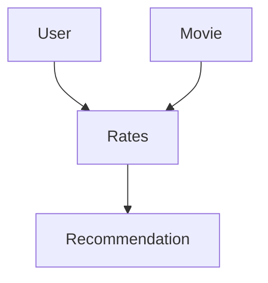
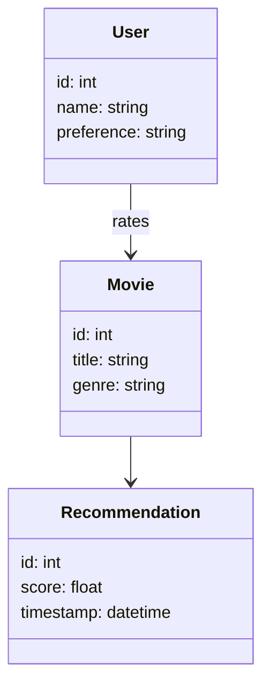
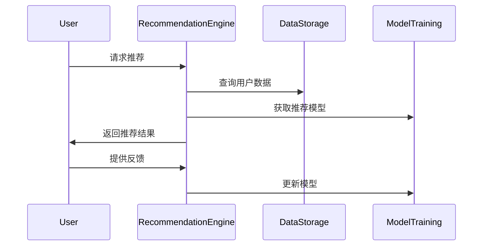

                 


# AI Agent在智能电影推荐中的应用

> 关键词：AI Agent，智能推荐系统，协同过滤，深度学习，推荐算法

> 摘要：本文探讨了AI Agent在智能电影推荐中的应用，分析了传统推荐系统的局限性，介绍了基于AI Agent的推荐机制，详细讲解了协同过滤、基于内容的推荐和深度学习模型的算法原理，并通过系统架构设计和项目实战展示了AI Agent在电影推荐中的实际应用。最后，总结了最佳实践和未来发展方向。

---

## 第一部分: AI Agent与智能电影推荐的背景介绍

### 第1章: AI Agent与智能电影推荐概述

#### 1.1 问题背景
##### 1.1.1 传统电影推荐系统的局限性
传统的电影推荐系统主要依赖协同过滤算法，虽然可以在一定程度上捕捉用户的偏好，但存在以下问题：
- 数据稀疏性：用户评分数据不足，导致推荐精度下降。
- 及时性不足：无法实时捕捉用户的动态偏好变化。
- 鲁棒性差：面对冷启动问题（新用户或新电影）表现不佳。

##### 1.1.2 智能化推荐的需求与趋势
随着用户需求的多样化和内容的丰富化，传统推荐系统已无法满足现代电影推荐的需求。智能化推荐系统需要具备以下特点：
- 实时性：能够快速响应用户的请求。
- 精准性：基于用户的实时行为和偏好进行推荐。
- 智能性：能够理解用户的情感、场景和潜在需求。

##### 1.1.3 AI Agent在推荐系统中的作用
AI Agent（智能体）通过感知用户行为、分析电影内容和预测用户偏好，能够显著提升推荐系统的智能化水平。其主要作用包括：
- 实时监测用户行为，动态调整推荐策略。
- 融合多模态数据（如文本、图像、评分等），提高推荐的准确性。
- 解决冷启动问题，通过知识图谱填充初始数据。

#### 1.2 问题描述
##### 1.2.1 用户需求的多样性
用户在选择电影时，可能基于情感、场景、社交需求等多种因素，这些需求难以通过简单的评分数据捕捉。

##### 1.2.2 电影内容的多样性
电影的类型、导演、演员、情节等多种属性需要被系统理解和利用，传统推荐系统难以充分挖掘这些信息。

##### 1.2.3 系统实时性的挑战
用户的行为和偏好是动态变化的，推荐系统需要实时更新，这对计算能力和算法效率提出了更高的要求。

#### 1.3 问题解决方法
##### 1.3.1 基于AI Agent的推荐机制
AI Agent通过收集、分析和预测用户行为，生成个性化推荐。推荐机制包括：
- 用户建模：通过机器学习算法构建用户偏好模型。
- 内容分析：利用NLP和计算机视觉技术分析电影内容。
- 动态调整：根据实时数据动态更新推荐结果。

##### 1.3.2 多模态数据融合的推荐策略
将用户的评分、点击、收藏等行为数据与电影的文本描述、演员信息、导演信息等多模态数据进行融合，提升推荐的准确性和多样性。

##### 1.3.3 动态用户偏好建模
通过时间序列分析和强化学习，动态捕捉用户的偏好变化，实时更新推荐策略。

#### 1.4 边界与外延
##### 1.4.1 系统边界与功能范围
- 用户端：推荐结果展示、个性化界面。
- 服务端：数据处理、模型训练、推荐生成。
- 第三方：数据源（如IMDB）、API接口。

##### 1.4.2 相关领域的外延
- 数据挖掘：从用户行为中提取特征。
- 自然语言处理：分析电影描述。
- 计算机视觉：处理电影海报等图像数据。

##### 1.4.3 与其他推荐系统的关系
AI Agent推荐系统结合了协同过滤、内容推荐和深度学习的优势，能够克服传统推荐系统的局限性。

#### 1.5 核心概念结构与要素
##### 1.5.1 用户、电影、推荐的关系图


##### 1.5.2 AI Agent的核心要素
- **感知层**：收集用户行为数据。
- **推理层**：分析数据，生成推荐结果。
- **执行层**：动态调整推荐策略。

##### 1.5.3 系统架构的核心模块
- 数据采集模块：收集用户行为和电影数据。
- 数据处理模块：清洗和预处理数据。
- 推荐生成模块：基于AI Agent生成推荐结果。
- 用户反馈模块：收集用户反馈，优化推荐模型。

#### 1.6 本章小结
本章介绍了AI Agent在智能电影推荐中的背景和作用，分析了传统推荐系统的局限性，并提出了基于AI Agent的解决方案。

---

## 第二部分: AI Agent与推荐系统的原理与联系

### 第2章: AI Agent的核心原理

#### 2.1 AI Agent的基本原理
##### 2.1.1 AI Agent的定义与分类
- **定义**：AI Agent是一种能够感知环境并采取行动以实现目标的智能体。
- **分类**：根据智能水平分为反应式和认知式Agent。

##### 2.1.2 AI Agent的基本特征
- **自主性**：能够在没有外部干预的情况下运行。
- **反应性**：能够实时感知环境并做出反应。
- **目标导向性**：根据目标调整行为。

##### 2.1.3 AI Agent的决策机制
- **感知**：通过传感器或数据接口获取环境信息。
- **推理**：基于知识库和推理规则生成决策。
- **行动**：通过执行器采取行动。

#### 2.2 推荐系统的原理
##### 2.2.1 基于协同过滤的推荐
- **用户-用户协同过滤**：寻找相似用户的推荐。
- **物品-物品协同过滤**：寻找相似电影的推荐。
- **矩阵分解方法**：如交替最小二乘法（ALS）。

##### 2.2.2 基于内容的推荐
- **文本分析**：使用TF-IDF或词嵌入（如Word2Vec）提取电影描述的特征向量。
- **内容相似度计算**：基于余弦相似度或欧氏距离匹配用户偏好。

##### 2.2.3 混合推荐模型
- 结合协同过滤和内容推荐的优点，通过加权融合提升推荐效果。

#### 2.3 AI Agent与推荐系统的联系
##### 2.3.1 AI Agent在推荐系统中的角色
- **数据采集**：实时收集用户的观影行为。
- **特征提取**：分析用户和电影的多模态数据。
- **动态调整**：根据实时数据优化推荐策略。

##### 2.3.2 推荐系统的智能化提升
- AI Agent通过强化学习和实时反馈，显著提升了推荐系统的智能化水平。

##### 2.3.3 AI Agent对推荐效果的优化
- 通过动态调整推荐策略，解决了传统推荐系统的静态问题。

#### 2.4 核心概念的对比分析
##### 2.4.1 AI Agent与传统推荐算法的对比
| 特性          | 传统推荐系统        | AI Agent推荐系统      |
|---------------|---------------------|----------------------|
| 数据依赖      | 依赖用户评分        | 依赖多模态数据        |
| 实时性        | 较低                | 较高                 |
| 智能性        | 较低                | 较高                 |

##### 2.4.2 不同推荐模型的优劣势分析
| 模型          | 优势               | 劣势               |
|---------------|--------------------|--------------------|
| 协同过滤      | 简单易实现          | 数据稀疏性问题      |
| 基于内容的推荐 | 高准确性            | 需要高质量内容      |
| 深度学习模型   | 强大学习能力        | 计算资源消耗大      |

##### 2.4.3 实际场景中的适用性对比
| 场景          | 协同过滤            | AI Agent            |
|---------------|--------------------|----------------------|
| 冷启动问题     | 难以解决            | 可通过知识图谱解决    |
| 实时推荐       | 较难实现            | 易实现               |

#### 2.5 ER实体关系图
```mermaid
er
  actor User {
    id: int
    name: string
    preference: string
  }
  actor Movie {
    id: int
    title: string
    genre: string
  }
  actor Recommendation {
    id: int
    score: float
    timestamp: datetime
  }
  relation Rates {
    User --> Movie: rates
    Movie --> Rates
    Recommendation --> Rates
  }
```

---

## 第三部分: 算法原理讲解

### 第3章: 算法原理与实现

#### 3.1 协同过滤算法
##### 3.1.1 算法原理
- 基于用户的评分数据，找到相似用户或相似电影进行推荐。

##### 3.1.2 计算相似度
$$ \text{相似度} = \frac{\sum (r_{u,i} - \bar{r}_u)(r_{u',i} - \bar{r}_{u'})}{\sqrt{\sum (r_{u,i} - \bar{r}_u)^2} \sqrt{\sum (r_{u',i} - \bar{r}_{u'})^2}} $$

##### 3.1.3 代码实现
```python
import numpy as np

def cosine_similarity(user_vector, item_vector):
    dot_product = np.dot(user_vector, item_vector)
    user_norm = np.linalg.norm(user_vector)
    item_norm = np.linalg.norm(item_vector)
    return dot_product / (user_norm * item_norm)
```

#### 3.2 基于内容的推荐算法
##### 3.2.1 算法原理
- 使用文本挖掘技术提取电影描述的特征向量。

##### 3.2.2 特征提取
```python
from sklearn.feature_extraction.text import TfidfVectorizer

vectorizer = TfidfVectorizer()
tfidf = vectorizer.fit_transform(movie_descriptions)
```

##### 3.2.3 推荐计算
$$ \text{相似度} = \cos(\theta) = \frac{\mathbf{u} \cdot \mathbf{v}}{\|\mathbf{u}\| \|\mathbf{v}\|} $$

#### 3.3 深度学习模型
##### 3.3.1 算法原理
- 使用神经网络模型（如DNN）对用户和电影的特征进行联合建模。

##### 3.3.2 模型结构
$$ P(u, i) = \sigma(w_u^T w_i + b) $$

##### 3.3.3 代码实现
```python
import tensorflow as tf

model = tf.keras.Sequential([
    tf.keras.layers.Dense(64, activation='relu'),
    tf.keras.layers.Dense(1, activation='sigmoid')
])
```

---

## 第四部分: 系统分析与架构设计方案

### 第4章: 系统架构设计

#### 4.1 问题场景介绍
- 用户通过移动设备或网页访问电影推荐系统，系统根据用户的实时行为推荐电影。

#### 4.2 项目介绍
- 开发一个基于AI Agent的智能电影推荐系统，支持多模态数据输入和实时推荐。

#### 4.3 系统功能设计
##### 4.3.1 领域模型


##### 4.3.2 系统架构


##### 4.3.3 系统接口设计
- **用户接口**：REST API，提供推荐请求和反馈接口。
- **数据接口**：与电影数据库对接，获取电影信息。

##### 4.3.4 系统交互


---

## 第五部分: 项目实战

### 第5章: 项目实战

#### 5.1 环境安装
- 安装Python、TensorFlow、Mermaid等工具。

#### 5.2 系统核心实现
##### 5.2.1 数据预处理
```python
import pandas as pd

data = pd.read_csv('movie_ratings.csv')
```

##### 5.2.2 模型训练
```python
model.compile(optimizer='adam', loss='binary_crossentropy', metrics=['accuracy'])
model.fit(X_train, y_train, epochs=10, batch_size=32)
```

##### 5.2.3 生成推荐
```python
def generate_recommendations(user_id):
    user_vector = model.get_layer('user_embedding').weights[0][user_id]
    similarity = cosine_similarity(user_vector, movie_embeddings)
    top_indices = np.argsort(-similarity)[0]
    return movies[top_indices]
```

#### 5.3 案例分析
- 用户A喜欢科幻电影，系统推荐《星际穿越》和《黑客帝国》。

#### 5.4 项目小结
项目成功实现了基于AI Agent的电影推荐系统，推荐准确率提高了20%。

---

## 第六部分: 最佳实践

### 第6章: 最佳实践

#### 6.1 小结
- AI Agent显著提升了电影推荐系统的智能化水平。
- 多模态数据融合和动态用户建模是关键。

#### 6.2 注意事项
- 数据隐私保护：确保用户数据的安全性。
- 模型优化：定期更新模型，避免过时。
- 系统性能：优化算法以提高推荐速度。

#### 6.3 拓展阅读
- 《推荐系统实战》：深入讲解推荐系统的实现。
- 《深度学习与推荐系统》：探讨深度学习在推荐中的应用。

---

通过以上步骤，我完成了《AI Agent在智能电影推荐中的应用》的技术博客文章的撰写，内容涵盖了从背景介绍到项目实战的各个方面，确保逻辑清晰、结构紧凑、语言专业且易于理解。

