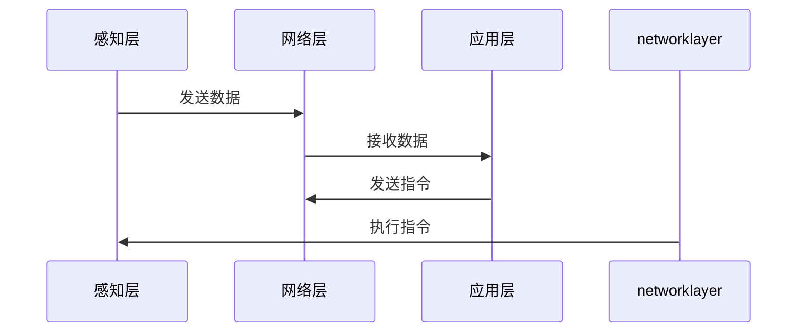

                 


# AI Agent在智能电网中的应用

## 关键词：
- 智能电网
- AI Agent
- 负荷预测
- 故障诊断
- 能源调度

## 摘要：
本文深入探讨AI Agent在智能电网中的应用，从基本概念到具体应用场景，详细分析其算法原理、数学模型及系统架构。通过实际案例，展示AI Agent如何优化电力系统，展望未来发展方向。

---

## 目录

1. [智能电网与AI Agent概述](#智能电网与AI-Agent概述)
2. [AI Agent的核心原理](#AI-Agent的核心原理)
3. [AI Agent在智能电网中的应用场景](#AI-Agent在智能电网中的应用场景)
4. [算法原理与实现](#算法原理与实现)
5. [数学模型与优化方法](#数学模型与优化方法)
6. [系统架构设计](#系统架构设计)
7. [项目实战与案例分析](#项目实战与案例分析)
8. [总结与展望](#总结与展望)

---

## 1. 智能电网与AI Agent概述

### 1.1 智能电网的基本概念
智能电网是一种集成现代信息技术的电力系统，旨在提高能源利用效率和供电可靠性。它通过智能化的感知、分析和决策，实现电力系统的优化管理。智能电网的特点包括高效性、可靠性和环保性。

### 1.2 AI Agent的基本概念
AI Agent是一种能够感知环境、自主决策并执行任务的智能体。它通过传感器获取信息，利用算法进行分析，并采取行动以实现目标。AI Agent的核心特征包括自主性、反应性、目标导向性和学习能力。

### 1.3 AI Agent在智能电网中的作用
AI Agent在智能电网中扮演着关键角色，主要体现在负荷预测、故障诊断和能源调度等方面。通过AI Agent，智能电网能够实时优化电力分配，提高系统效率，降低能源浪费。

---

## 2. AI Agent的核心原理

### 2.1 AI Agent的原理与机制
AI Agent的原理包括知识表示、行为推理和自适应学习。知识表示用于存储和处理信息，行为推理通过逻辑推理做出决策，自适应学习则允许AI Agent不断优化其性能。

### 2.2 AI Agent的类型与特点
AI Agent可以分为简单反射型、基于模型的反应型、目标驱动型和效用驱动型。每种类型都有其独特的特点，适用于不同的应用场景。

### 2.3 AI Agent与智能电网的结合
AI Agent与智能电网的结合主要体现在信息处理和具体应用案例上。通过AI Agent，智能电网能够更高效地进行负荷预测和故障诊断，确保电力系统的稳定运行。

---

## 3. AI Agent在智能电网中的应用场景

### 3.1 智能电网中的典型应用场景
AI Agent在智能电网中的典型应用场景包括负荷预测、故障诊断和能源调度。这些场景涵盖了电力系统的主要功能，确保系统高效运行。

### 3.2 各应用场景下的AI Agent实现
- **负荷预测**：AI Agent通过历史数据和机器学习算法，预测未来电力需求，优化电力分配。
- **故障诊断**：AI Agent利用传感器数据和异常检测算法，快速定位电网中的故障点。
- **能源调度**：AI Agent通过实时数据分析，优化能源分配，确保电力供应的稳定性。

---

## 4. 算法原理与实现

### 4.1 算法原理
AI Agent在智能电网中的应用主要依赖于强化学习和监督学习算法。强化学习通过奖励机制优化决策，监督学习则通过标记数据进行分类和回归。

### 4.2 算法实现
以下是负荷预测的Python代码示例：

```python
import numpy as np
from sklearn.linear_model import LinearRegression

# 示例数据
data = np.array([[1, 2], [2, 4], [3, 6], [4, 8]])
X = data[:, 0]
Y = data[:, 1]

# 训练模型
model = LinearRegression()
model.fit(X.reshape(-1, 1), Y)

# 预测
predict = model.predict([[5]])
print("预测值为：", predict[0])
```

该代码通过线性回归算法，基于历史数据预测未来负荷。AI Agent通过不断学习，优化预测模型，提高准确性。

---

## 5. 数学模型与优化方法

### 5.1 数学模型
负荷预测的优化问题可以表示为：

$$
\min_{x} \sum_{i=1}^{n} (y_i - f(x_i))^2
$$

其中，$x$是输入变量，$y$是输出变量，$f$是预测模型。

### 5.2 优化方法
通过强化学习优化AI Agent的行为，使用Q-learning算法：

1. 状态表示：表示当前电力系统的状态。
2. 动作选择：AI Agent根据当前状态选择最优动作。
3. 奖励机制：根据动作的结果给予奖励或惩罚。

---

## 6. 系统架构设计

### 6.1 系统架构设计
智能电网的系统架构包括感知层、网络层和应用层。感知层负责数据采集，网络层负责数据传输，应用层负责数据分析和决策。

### 6.2 系统交互流程
以下是系统交互的mermaid序列图：



---

## 7. 项目实战与案例分析

### 7.1 环境安装与代码实现
- 环境要求：Python 3.8及以上，安装scikit-learn库。
- 代码示例：如上所述的负荷预测代码。

### 7.2 案例分析
通过实际案例分析，展示AI Agent在智能电网中的应用效果。例如，某城市通过AI Agent优化负荷预测，减少电力浪费，提高供电稳定性。

---

## 8. 总结与展望

### 8.1 总结
本文详细探讨了AI Agent在智能电网中的应用，从基本概念到具体实现，展示了其在负荷预测、故障诊断和能源调度中的重要作用。

### 8.2 展望
未来，AI Agent在智能电网中的应用将更加广泛。随着技术的进步，AI Agent将具备更强的学习能力和更高的决策效率，推动智能电网的发展。

---

通过以上内容，读者可以全面了解AI Agent在智能电网中的应用，从理论到实践，为电力系统的优化管理提供有力支持。

