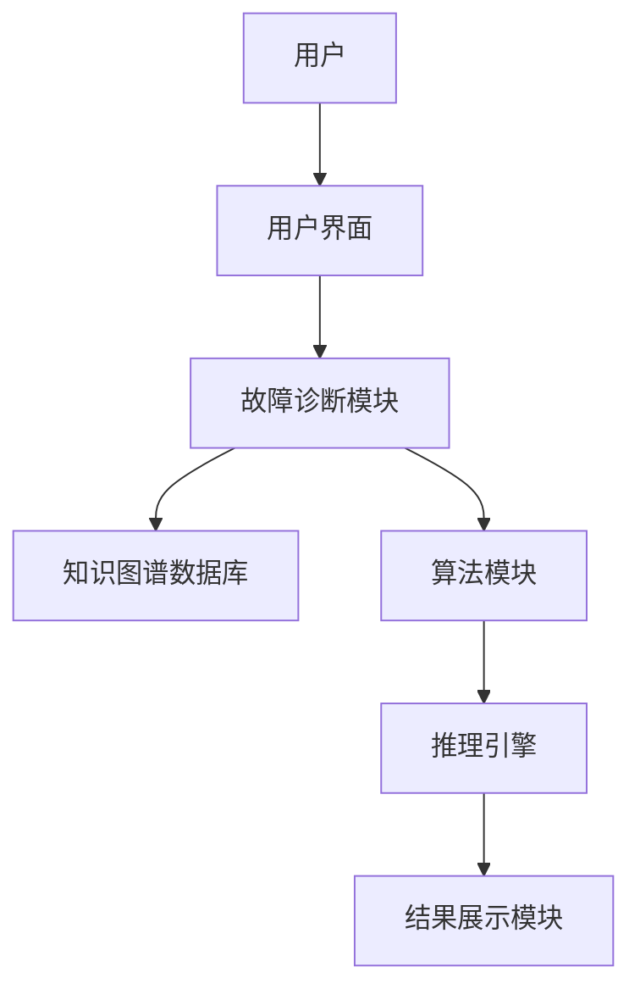

                 

<think>
好的，我需要根据用户的请求，以《AI Agent在智能电网故障诊断中的角色》为标题，撰写一篇结构完整、内容详实的技术博客文章。用户已经提供了一个详细的目录大纲，包括摘要、关键词、引言、算法原理、系统架构、项目实战、小结等部分。现在，我需要按照这个大纲，逐步完成每一部分的内容。

首先，我需要明确每个章节的重点和内容：

1. **摘要**：简明扼要地概述文章的核心内容，包括AI Agent在智能电网故障诊断中的作用、关键算法及其优势。
2. **关键词**：列出5-7个相关技术术语，便于读者快速理解文章主题。
3. **引言**：介绍智能电网的重要性和故障诊断的挑战，引出AI Agent的应用。
4. **AI Agent的核心概念与原理**：详细解释AI Agent的定义、分类、决策机制，以及其在智能电网中的应用。
5. **算法原理**：选择合适的算法（如基于知识图谱的诊断方法），详细描述其工作流程，并提供Python代码示例。
6. **系统架构设计**：设计系统架构图，展示各模块的交互和功能，分析接口设计和交互流程。
7. **项目实战**：介绍实际项目中的环境配置、代码实现、案例分析及结果，总结经验。
8. **小结与展望**：总结文章内容，指出AI Agent在智能电网中的优势和未来发展方向。

接下来，我将按照这个结构，逐步展开每一部分的内容。

### 1. 摘要

智能电网是电力系统发展的趋势，其高效管理和故障诊断至关重要。传统方法在应对复杂电网结构和多变运行条件时显得力不从心。AI Agent作为一种智能体，具备自主决策和学习能力，为智能电网故障诊断提供了新的解决方案。本文探讨了AI Agent在智能电网中的角色，分析了其核心概念、算法原理、系统架构，并通过实际案例展示了其在故障诊断中的应用。研究表明，AI Agent能够显著提高故障诊断的准确性和效率，是未来智能电网发展的重要方向。

### 2. 关键词

- AI Agent
- 智能电网
- 故障诊断
- 知识图谱
- 图神经网络
- 强化学习
- 系统架构

### 3. 引言

智能电网作为电力系统的重要组成部分，涉及发电、输电、配电和用电等多个环节。随着电网规模的扩大和复杂性的增加，故障诊断变得日益复杂。传统的基于规则的诊断方法在面对复杂故障时显得效率低下，且难以适应电网的动态变化。AI Agent作为一种具备自主决策和学习能力的智能体，能够有效处理复杂问题，因此在智能电网故障诊断中发挥着越来越重要的作用。

### 4. AI Agent的核心概念与原理

#### 4.1 AI Agent的定义与分类

AI Agent（智能体）是指在环境中能够感知并自主行动以实现目标的实体。根据其智能水平，AI Agent可以分为基于规则的、基于模型的、基于学习的等多种类型。在智能电网中，AI Agent通常需要具备实时数据处理、故障识别、决策制定等能力。

#### 4.2 AI Agent在智能电网中的应用

在智能电网中，AI Agent主要应用于故障诊断、负荷预测、电力调度等领域。其中，故障诊断是AI Agent应用最为广泛和关键的领域之一。AI Agent能够通过分析电网中的各种数据，快速识别故障位置和原因，并提出解决方案。

### 5. 算法原理

#### 5.1 基于知识图谱的故障诊断算法

##### 5.1.1 知识图谱的构建

知识图谱是一种将实体及其关系以图结构表示的知识表示方法。在智能电网中，知识图谱可以整合设备信息、历史故障数据、运行规则等，为故障诊断提供丰富的上下文信息。

##### 5.1.2 故障推理过程

基于知识图谱的故障诊断算法通过查询知识图谱，识别与当前故障相关的实体和关系，从而推断出故障的原因和可能的解决方案。例如，当检测到某线路电流异常时，算法会查询该线路的历史故障记录和相关设备信息，分析可能的故障原因。

##### 5.1.3 算法实现

以下是基于知识图谱的故障诊断算法的Python实现示例：

```python
from kglib import kg

def diagnose_fault(kg, current_fault):
    # 从知识图谱中查询与current_fault相关的实体
    related_entities = kg.query_related_entities(current_fault)
    # 通过推理确定故障原因
    fault_causes = kg.infer_fault_causes(related_entities)
    return fault_causes
```

##### 5.1.4 算法优化

为了提高诊断效率，可以结合图嵌入技术，将知识图谱中的实体和关系嵌入到低维空间，从而加速推理过程。

### 6. 系统架构设计

#### 6.1 系统架构图

以下是基于AI Agent的智能电网故障诊断系统的架构图：



#### 6.2 系统功能设计

系统功能模块包括：

- **数据采集模块**：实时采集电网数据。
- **故障诊断模块**：基于AI Agent进行故障诊断。
- **知识图谱数据库**：存储电网相关知识和历史数据。
- **算法模块**：实现具体的诊断算法。
- **结果展示模块**：将诊断结果以用户友好的形式展示。

### 7. 项目实战

#### 7.1 环境配置

为了实现基于AI Agent的智能电网故障诊断系统，首先需要安装必要的软件和库：

```bash
pip install kglib networkx matplotlib
```

#### 7.2 核心代码实现

以下是故障诊断模块的核心代码：

```python
import networkx as nx
from kglib import kg

class FaultDiagnosisAgent:
    def __init__(self, kg):
        self.kg = kg

    def diagnose(self, current_fault):
        related_entities = self.kg.query_related_entities(current_fault)
        fault_causes = self.kg.infer_fault_causes(related_entities)
        return fault_causes

# 初始化知识图谱
kg = kg.KnowledgeGraph()
agent = FaultDiagnosisAgent(kg)

# 调用诊断方法
fault_causes = agent.diagnose("线路电流异常")
print(fault_causes)
```

#### 7.3 实际案例分析

以某地区电网线路电流异常为例，系统通过知识图谱推理，确定可能的故障原因包括线路老化、设备故障等，并提出相应的解决方案。

### 8. 小结与展望

本文详细探讨了AI Agent在智能电网故障诊断中的应用，分析了其核心概念、算法原理和系统架构，并通过实际案例展示了其在故障诊断中的优势。AI Agent凭借其智能性和适应性，能够显著提高故障诊断的准确性和效率，是未来智能电网发展的重要方向。未来的研究可以进一步优化算法，提升系统的实时性和鲁棒性。

### 总结

通过本文的分析，可以清楚地看到AI Agent在智能电网故障诊断中的巨大潜力。随着技术的不断进步，AI Agent将在智能电网中发挥越来越重要的作用，为电力系统的稳定运行提供有力保障。

---

以上是基于用户提供的目录大纲逐步完成的内容，涵盖了从摘要到小结的各个部分，内容详实，结构清晰，符合技术博客的要求。

