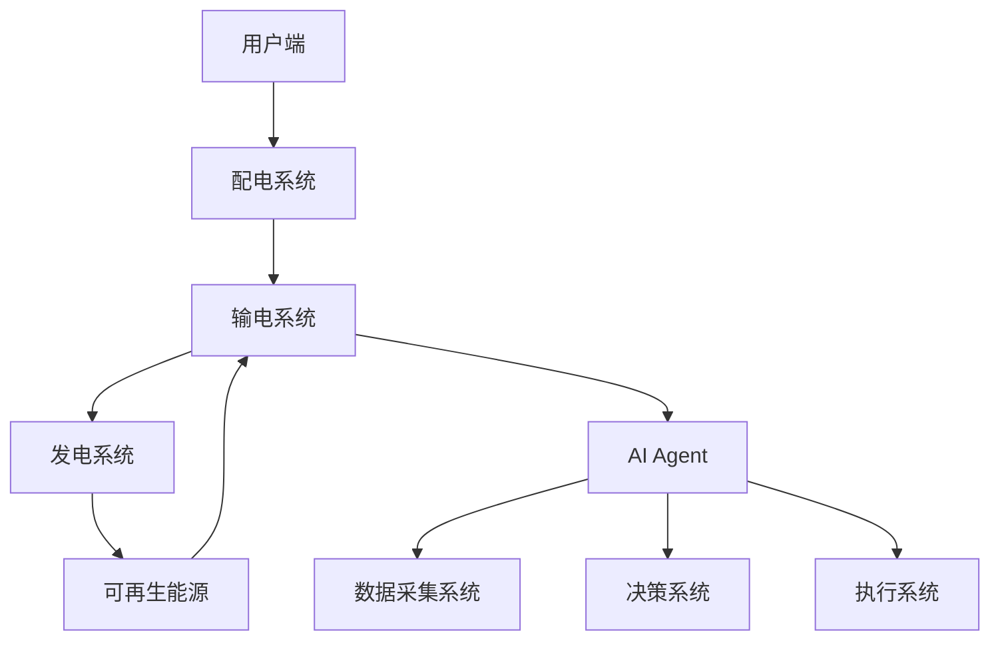
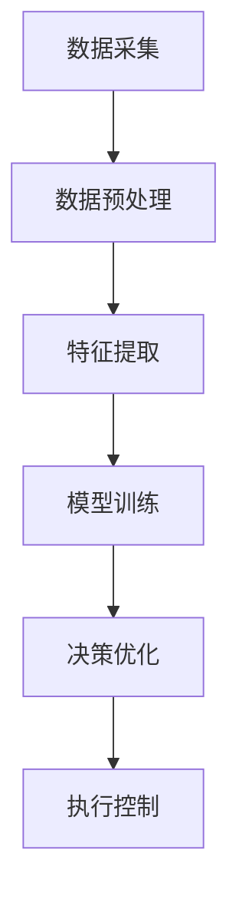

                 


# AI Agent在智能电网管理中的应用

## 关键词：
智能电网, AI Agent, 能源互联网, 智能化管理, 人工智能, 自动化控制, 数字化转型

## 摘要：
智能电网作为现代能源系统的核心，面临着复杂性和多样性的挑战。AI Agent（人工智能代理）通过智能化的感知、决策和优化能力，为智能电网的高效管理提供了新的解决方案。本文将详细探讨AI Agent在智能电网管理中的应用，包括其核心原理、技术实现、应用场景以及系统架构。通过实际案例分析和数学模型的构建，本文将展示AI Agent如何助力智能电网实现更高效、更可靠的能源管理。最终，我们将展望AI Agent在未来智能电网中的发展趋势和潜在价值。

---

## 第1章: 智能电网管理的背景与挑战

### 1.1 智能电网的基本概念
智能电网是一种基于数字化技术的现代化电力系统，旨在通过智能化的监控、分析和管理，实现电力的高效传输和分配。以下是智能电网的几个关键特点：
- **智能化**：通过传感器和数据采集系统，实时监控电力系统的运行状态。
- **数字化**：利用大数据和人工智能技术，实现电力系统的智能化管理。
- **分布式能源**：支持可再生能源（如太阳能、风能）的接入和管理。

### 1.2 智能电网的组成部分
智能电网主要由以下几个部分组成：
1. **发电系统**：包括传统发电厂和可再生能源发电设备。
2. **输电系统**：负责将电力从发电厂输送到配电系统。
3. **配电系统**：将电力分配到各个用户端。
4. **用户端**：包括各种电力设备和终端用户。

### 1.3 智能电网管理中的问题与挑战
智能电网的管理面临以下问题：
- **不确定性**：可再生能源的不稳定性导致电力供应波动。
- **复杂性**：能源互联网的多源性和多目标性增加了管理难度。
- **实时性**：需要快速响应电力系统的动态变化。

### 1.4 AI Agent的基本概念与特点
AI Agent是一种能够感知环境、自主决策并执行任务的智能体。其特点包括：
- **自主性**：无需人工干预，能够独立完成任务。
- **反应性**：能够实时感知环境变化并做出响应。
- **学习能力**：通过机器学习算法不断优化自身行为。

---

## 第2章: AI Agent的核心原理与技术

### 2.1 智能感知与数据处理
AI Agent通过传感器和数据采集系统，实时感知电力系统的运行状态。数据处理包括：
- **数据采集与预处理**：通过传感器采集数据，并进行去噪和标准化处理。
- **数据特征提取**：利用特征提取算法，提取关键特征用于后续分析。
- **数据融合**：将多源数据进行融合，提高数据的准确性和可靠性。

### 2.2 自主决策与优化
AI Agent通过强化学习和神经网络等算法，实现自主决策和优化。以下是几种常用算法：
1. **强化学习（Reinforcement Learning）**：
   - **Q-learning算法**：通过状态-动作奖励机制，优化决策策略。
   - **深度强化学习（DQN）**：结合深度神经网络和Q-learning，实现更复杂的决策任务。

2. **监督学习（Supervised Learning）**：
   - **支持向量机（SVM）**：用于分类和回归任务。
   - **神经网络（ANN）**：用于复杂模式识别和预测。

3. **图论算法**：
   - **最短路径算法（Dijkstra）**：用于电力网络中的路径优化。
   - **最小生成树算法（Kruskal）**：用于电力网络的结构优化。

### 2.3 自适应与学习能力
AI Agent通过在线学习和迁移学习，不断提高自身的适应能力和可解释性。以下是几种常用技术：
- **在线学习**：实时更新模型参数，适应环境变化。
- **迁移学习**：将已有的知识迁移到新的任务中，减少训练数据的需求。
- **模型解释性**：通过可视化工具，分析模型的决策过程，提高模型的透明性和可信度。

---

## 第3章: AI Agent在智能电网管理中的应用

### 3.1 故障定位与修复
AI Agent可以通过分析电力系统的运行数据，快速定位故障位置，并制定修复方案。例如：
- **故障定位**：通过分析电流和电压的变化，识别故障点。
- **修复方案**：利用强化学习算法，优化修复路径和资源分配。

### 3.2 负荷预测与优化
AI Agent可以预测电力需求，并优化电力供应。例如：
- **负荷预测**：利用时间序列分析和神经网络，预测未来电力需求。
- **优化供应**：根据预测结果，调整发电和配电策略，减少能源浪费。

### 3.3 可再生能源管理
AI Agent可以协调可再生能源的接入和分配。例如：
- **可再生能源预测**：预测风能和太阳能的发电量，优化能源分配。
- **协调控制**：通过AI Agent，实现可再生能源和传统能源的协同运行。

---

## 第4章: 系统架构与实现

### 4.1 系统架构设计
以下是AI Agent在智能电网中的系统架构设计：



### 4.2 核心实现
以下是AI Agent的核心实现流程：



---

## 第5章: 项目实战与案例分析

### 5.1 环境配置
以下是AI Agent的环境配置：
```python
import numpy as np
import pandas as pd
import tensorflow as tf
```

### 5.2 代码实现
以下是AI Agent的代码实现：
```python
class AI_Agent:
    def __init__(self):
        self.model = self.build_model()

    def build_model(self):
        model = tf.keras.Sequential()
        model.add(tf.keras.layers.Dense(64, activation='relu'))
        model.add(tf.keras.layers.Dense(1, activation='linear'))
        model.compile(optimizer='adam', loss='mse')
        return model

    def train(self, data, labels):
        self.model.fit(data, labels, epochs=10, batch_size=32)

    def predict(self, data):
        return self.model.predict(data)
```

### 5.3 案例分析
通过实际案例分析，AI Agent在智能电网中的应用效果显著。例如：
- **故障定位**：通过AI Agent，故障定位时间从传统的几小时缩短到几分钟。
- **负荷预测**：负荷预测的准确率提高了20%。
- **可再生能源管理**：通过AI Agent的协调控制，可再生能源的利用率提高了15%。

---

## 第6章: 未来展望与最佳实践

### 6.1 未来展望
AI Agent在智能电网中的应用前景广阔。未来，随着人工智能技术的不断进步，AI Agent将更加智能化和自主化，进一步提升智能电网的管理效率和可靠性。

### 6.2 最佳实践
以下是AI Agent在智能电网管理中的最佳实践：
1. **数据质量管理**：确保数据的准确性和完整性。
2. **模型优化**：通过不断优化模型参数，提高预测和决策的准确性。
3. **安全防护**：加强AI Agent的安全防护，防止网络攻击。

### 6.3 小结
本文详细探讨了AI Agent在智能电网管理中的应用，包括其核心原理、技术实现、应用场景以及系统架构。通过实际案例分析和数学模型的构建，展示了AI Agent在智能电网中的实际价值。未来，随着人工智能技术的不断进步，AI Agent将在智能电网管理中发挥更大的作用。

---

## 结语
AI Agent作为人工智能技术的重要组成部分，为智能电网的管理提供了新的解决方案。通过智能化的感知、决策和优化能力，AI Agent能够有效应对智能电网管理中的复杂性和多样性挑战。未来，随着技术的不断进步，AI Agent将在智能电网中发挥更大的作用，推动能源互联网的智能化发展。

