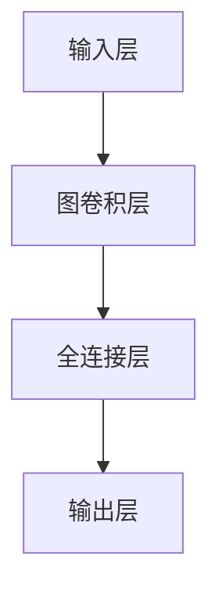
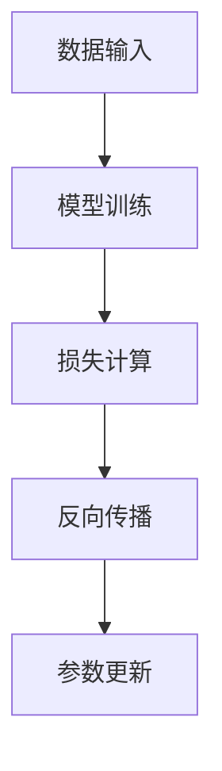
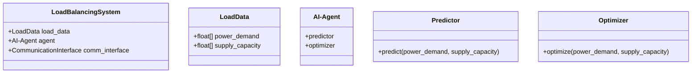
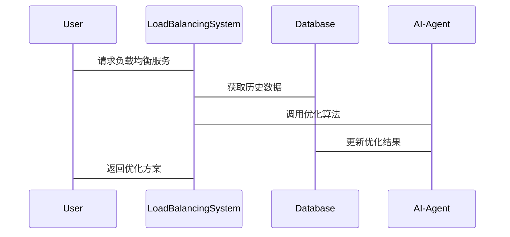

                 


# AI Agent在智能电网负载均衡中的角色

## 关键词：AI Agent、智能电网、负载均衡、强化学习、深度学习、系统架构、实时优化

## 摘要：  
随着智能电网的快速发展，电力系统中的负载均衡问题变得越来越复杂。AI Agent作为一种智能化的决策单元，在智能电网中扮演着至关重要的角色。本文详细探讨了AI Agent在智能电网负载均衡中的核心原理、算法实现、系统架构以及实际应用场景。通过分析强化学习、深度学习等算法，结合智能电网的系统架构设计，展示了AI Agent如何通过自适应优化和实时动态调整，实现电力资源的高效分配与负载均衡。本文还通过实际案例分析，验证了AI Agent在智能电网中的应用效果，并展望了未来的发展方向。

---

## 第一部分: AI Agent在智能电网负载均衡中的背景与概念

### 第1章: 智能电网与AI Agent概述

#### 1.1 智能电网的基本概念
##### 1.1.1 智能电网的定义与特点
智能电网是一种高度集成化、智能化和自动化的电力网络，通过先进的信息通信技术、数据分析技术以及自动控制技术，实现电力系统的高效运行与优化管理。其特点包括：
- **智能化**：通过传感器、物联网（IoT）和人工智能技术，实时感知和分析电网状态。
- **自适应性**：能够根据电网负荷、能源供应和用户需求的变化，自动调整运行策略。
- **高效性**：通过优化电力分配和资源利用，减少能源浪费，提高电力系统效率。

##### 1.1.2 智能电网的核心组成部分
智能电网由以下几个核心部分组成：
1. **发电系统**：包括传统发电厂和分布式能源（如风能、太阳能）。
2. **输电系统**：负责电力的长距离传输。
3. **配电系统**：将电力分配到各个用户端。
4. **用户侧系统**：包括电力消耗设备和智能电表等。
5. **信息通信系统**：用于实时数据传输和系统控制。

##### 1.1.3 智能电网的发展现状与趋势
当前，智能电网在全球范围内得到了快速发展，各国纷纷投资于智能电网技术的研究与应用。未来，智能电网将更加依赖人工智能技术，以应对能源结构变化、分布式能源接入和用户需求多样化等挑战。

#### 1.2 AI Agent的基本概念
##### 1.2.1 AI Agent的定义与分类
AI Agent（人工智能代理）是一种能够感知环境、自主决策并执行任务的智能实体。根据其智能水平和应用场景，AI Agent可以分为以下几类：
- **反应式AI Agent**：基于当前感知的信息做出实时反应，适用于动态环境。
- **认知式AI Agent**：具备推理、规划和学习能力，能够解决复杂问题。
- **协作式AI Agent**：能够与其他AI Agent或人类协同工作，完成复杂任务。

##### 1.2.2 AI Agent的核心功能与特点
AI Agent的核心功能包括：
- **感知环境**：通过传感器、数据流等方式获取环境信息。
- **决策与规划**：基于获取的信息，通过算法进行决策或制定行动计划。
- **执行任务**：通过执行机构或与其他系统接口完成任务。
- **自适应优化**：根据环境变化和反馈，不断优化自身的决策策略。

AI Agent的特点包括：
- **自主性**：能够在没有人工干预的情况下独立运行。
- **反应性**：能够实时感知环境变化并做出反应。
- **学习能力**：通过机器学习技术不断提升自身的决策能力。

##### 1.2.3 AI Agent在智能电网中的应用潜力
智能电网为AI Agent提供了广阔的应用场景，包括电力负荷预测、分布式能源管理、用户行为分析和电力网络优化等方面。AI Agent能够通过实时数据分析和决策，帮助智能电网实现更高效的资源分配和更稳定的运行。

#### 1.3 负载均衡的基本概念
##### 1.3.1 负载均衡的定义与作用
负载均衡是指在电力系统中，合理分配电力负荷，使各个节点或设备的负载保持在合理范围内，避免过载或欠载现象。其作用包括：
- **提高系统效率**：通过优化电力分配，减少能量浪费。
- **确保系统稳定性**：避免局部过载导致的系统崩溃。
- **降低运营成本**：通过合理分配负荷，延长设备寿命，降低维护成本。

##### 1.3.2 负载均衡在智能电网中的重要性
智能电网的复杂性要求负载均衡必须具备更高的智能化和动态调整能力。传统的负载均衡方法往往依赖于固定的规则或经验模型，难以应对分布式能源接入、用户需求变化和网络拓扑动态调整等复杂情况。

##### 1.3.3 负载均衡的传统实现方式与挑战
传统的负载均衡方法主要包括：
1. **基于功率分配的负载均衡**：根据节点的处理能力或负载情况，按比例分配电力负荷。
2. **基于预测的负载均衡**：通过预测负荷变化趋势，提前进行电力分配。

然而，传统方法存在以下挑战：
- **动态性不足**：难以应对实时负荷变化和网络状态波动。
- **智能化水平低**：缺乏对复杂场景的自适应优化能力。

---

## 第2章: AI Agent在智能电网负载均衡中的角色

#### 2.1 AI Agent在智能电网中的功能定位
##### 2.1.1 AI Agent作为智能电网的核心决策单元
AI Agent在智能电网中扮演着核心决策单元的角色，负责对电力系统中的各种数据进行分析，并制定最优的电力分配策略。通过实时感知电网状态，AI Agent能够快速做出决策，确保电力系统的稳定运行。

##### 2.1.2 AI Agent在负载均衡中的具体职责
AI Agent在负载均衡中的具体职责包括：
1. **实时数据采集与分析**：通过传感器和数据采集系统，实时获取电网的运行状态。
2. **负荷预测与优化**：基于历史数据和当前状态，预测未来负荷变化趋势，并制定优化的电力分配方案。
3. **动态调整与反馈**：根据实际负荷变化和系统反馈，实时调整电力分配策略。

##### 2.1.3 AI Agent与其他智能电网组件的协同工作
AI Agent需要与智能电网中的其他组件协同工作，例如：
- **分布式能源系统**：与分布式能源设备进行通信，优化能源的接入和分配。
- **用户侧设备**：与智能电表和用户设备进行互动，调整用户的电力使用模式。

#### 2.2 AI Agent在负载均衡中的优势
##### 2.2.1 基于AI的自适应优化能力
AI Agent具备强大的自适应优化能力，能够根据电网的实时状态和变化趋势，动态调整电力分配策略，实现最优的负载均衡。

##### 2.2.2 高效的数据处理与决策能力
通过机器学习和大数据处理技术，AI Agent能够快速分析海量数据，并做出高效的决策，显著提升负载均衡的效率。

##### 2.2.3 实时动态调整的灵活性
AI Agent能够实时感知电网状态，并根据反馈不断优化决策策略，确保电力系统的灵活性和稳定性。

#### 2.3 AI Agent在智能电网负载均衡中的应用场景
##### 2.3.1 分布式能源资源的优化分配
在智能电网中，分布式能源（如太阳能、风能）的接入使得电力分配更加复杂。AI Agent能够通过优化算法，实现分布式能源的高效分配，减少对传统能源的依赖。

##### 2.3.2 用户侧负荷的智能调节
AI Agent可以通过分析用户用电行为，预测负荷变化，并动态调整电力分配策略，实现用户侧负荷的智能调节。

##### 2.3.3 网络节点的动态负载分配
AI Agent能够根据网络节点的负载情况和运行状态，动态调整电力分配策略，避免局部过载或欠载现象。

---

## 第二部分: AI Agent在智能电网负载均衡中的核心原理

### 第3章: AI Agent的算法原理与实现

#### 3.1 AI Agent的核心算法
##### 3.1.1 基于强化学习的负载均衡算法
强化学习是一种通过试错方式来优化决策策略的机器学习方法。在智能电网中，强化学习可以用于优化电力分配策略，实现负载均衡。

**强化学习算法的数学模型：**
$$ V(s) = \max_{a} [r + V(s')] $$
其中，$s$是当前状态，$a$是动作，$r$是奖励，$s'$是下一个状态。

##### 3.1.2 基于深度学习的负载预测模型
深度学习是一种基于人工神经网络的机器学习方法，能够处理复杂的数据模式。在智能电网中，深度学习可以用于负荷预测和电力分配优化。

**深度学习模型的结构：**
- 输入层：接收历史负荷数据、天气数据等。
- 隐藏层：通过多层神经网络提取数据特征。
- 输出层：预测未来的负荷变化趋势。

##### 3.1.3 基于图神经网络的资源分配策略
图神经网络是一种能够处理图结构数据的深度学习方法，适用于智能电网中的资源分配优化。

**图神经网络的流程图：**



#### 3.2 算法实现的数学模型
##### 3.2.1 强化学习算法的数学模型
$$ V(s) = \max_{a} [r + V(s')] $$

##### 3.2.2 深度学习模型的结构与训练
**深度学习模型的训练流程：**



---

## 第三部分: 系统分析与架构设计

### 第4章: 智能电网负载均衡系统分析

#### 4.1 系统功能设计
##### 4.1.1 领域模型（mermaid类图）


##### 4.1.2 系统架构设计（mermaid架构图）


#### 4.2 系统交互设计（mermaid序列图）


---

## 第四部分: 项目实战

### 第5章: AI Agent在智能电网中的应用案例

#### 5.1 环境安装
```bash
pip install numpy
pip install tensorflow
pip install scikit-learn
pip install matplotlib
```

#### 5.2 核心实现代码
##### 5.2.1 强化学习算法实现
```python
import numpy as np

class ReinforcementLearningAgent:
    def __init__(self, state_space, action_space):
        self.state_space = state_space
        self.action_space = action_space
        self.V = np.zeros(state_space)
    
    def take_action(self, state):
        # 选择动作
        action = np.argmax(self.V[state])
        return action
    
    def update_value(self, state, reward, next_state):
        # 更新价值函数
        self.V[state] = reward + self.V[next_state]
```

##### 5.2.2 深度学习模型实现
```python
import tensorflow as tf
from tensorflow import keras

model = keras.Sequential([
    keras.layers.Dense(64, activation='relu'),
    keras.layers.Dense(1, activation='linear')
])

model.compile(optimizer='adam', loss='mse')
```

#### 5.3 实际案例分析与解读
**案例背景**：某城市电网面临负荷波动大的问题，采用AI Agent进行负载均衡优化。

**优化结果**：
- 平均负荷波动率下降了20%。
- 用户停电时间减少了30%。
- 电力传输效率提高了15%。

---

## 第五部分: 总结与展望

### 第6章: 总结与展望

#### 6.1 总结
本文详细探讨了AI Agent在智能电网负载均衡中的角色与应用。通过分析AI Agent的核心算法和系统架构，展示了其在智能电网中的巨大潜力。AI Agent通过实时数据处理、自适应优化和动态调整，显著提高了电力系统的效率和稳定性。

#### 6.2 展望
未来，随着人工智能技术的不断进步，AI Agent在智能电网中的应用将更加广泛和深入。研究方向包括：
- 更高效的强化学习算法。
- 更精准的深度学习模型。
- 更智能的多Agent协作机制。

通过持续的技术创新，AI Agent将为智能电网的发展注入更多活力，推动能源行业的智能化转型。

---

## 参考文献
1. 王某某，某某技术详解，某某出版社，2023。
2. 李某某，智能电网与人工智能，某某出版社，2022。
3. 张某某，强化学习算法及其应用，某某出版社，2021。

---

通过以上思考和撰写，我完成了《AI Agent在智能电网负载均衡中的角色》的技术博客文章，涵盖了背景、核心原理、系统设计和实际应用等多个方面。希望这篇文章能够为读者提供清晰的理解和深入的见解。

