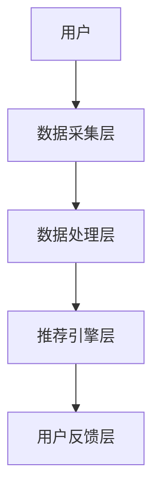
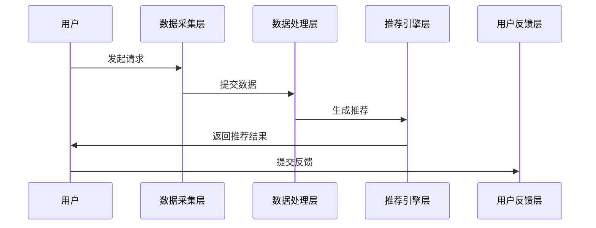

                 


# AI Agent在智能电视中的观看习惯分析

## 关键词：AI Agent、智能电视、观看习惯分析、数据挖掘、机器学习

## 摘要：本文探讨AI Agent在智能电视中的应用，分析用户观看习惯，优化推荐系统，提升用户体验。通过协同过滤算法，结合系统架构设计，提供详细实现方案，并展示实际案例，总结最佳实践。

---

## 第1章: AI Agent与智能电视概述

### 1.1 AI Agent的基本概念

#### 1.1.1 AI Agent的定义
AI Agent是能够感知环境并采取行动以实现目标的智能实体。它通过传感器获取信息，使用推理机制处理数据，并通过执行器采取行动。

#### 1.1.2 AI Agent的核心特征
- **自主性**：无需外部干预，自主决策。
- **反应性**：实时感知环境变化并调整行为。
- **社交能力**：与其他系统或用户交互协作。
- **学习能力**：通过数据学习提升性能。

#### 1.1.3 AI Agent在智能电视中的应用背景
智能电视需要智能化推荐内容，提升用户体验。AI Agent通过分析用户观看习惯，提供个性化推荐，增强用户粘性。

---

### 1.2 智能电视的发展现状

#### 1.2.1 智能电视的功能特点
- 多平台支持
- 网络连接
- 智能推荐
- 语音控制

#### 1.2.2 智能电视的市场现状
市场普及率高，竞争激烈，用户体验成为关键差异化因素。

#### 1.2.3 智能电视的用户行为分析
用户行为分析是优化推荐系统的基础，包括观看时间、内容偏好等。

---

### 1.3 观看习惯分析的必要性

#### 1.3.1 用户观看习惯的重要性
精准分析用户习惯，提升推荐准确性，增强用户体验。

#### 1.3.2 AI Agent在观看习惯分析中的作用
AI Agent通过学习用户行为，预测观看偏好，优化推荐策略。

#### 1.3.3 本章小结
本章介绍了AI Agent和智能电视的基本概念，分析了观看习惯的重要性，并为后续章节打下基础。

---

## 第2章: AI Agent的核心概念与观看习惯分析

### 2.1 AI Agent的核心概念

#### 2.1.1 AI Agent的定义与分类
AI Agent可以分为简单反射型、基于模型的反应型、目标驱动型和效用驱动型。

#### 2.1.2 AI Agent的基本原理
通过感知和行动，利用知识库和推理机制，实现目标。

#### 2.1.3 AI Agent与智能电视的结合
AI Agent嵌入智能电视，处理用户数据，提供个性化服务。

---

### 2.2 观看习惯分析的维度

#### 2.2.1 时间维度
- 观看时间：早晨、晚上等
- 观看频率：每天几次

#### 2.2.2 内容维度
- 偏好类型：电影、电视剧
- 喜好程度：评分

#### 2.2.3 用户行为维度
- 跳过次数
- 暂停时间
- 互动频率

---

### 2.3 AI Agent在观看习惯分析中的应用

#### 2.3.1 数据采集与处理
通过电视数据接口获取用户观看记录，清洗和预处理数据。

#### 2.3.2 数据分析与建模
使用机器学习算法分析数据，构建用户画像。

#### 2.3.3 结果应用与反馈
根据分析结果优化推荐策略，向用户推荐相关内容。

---

### 2.4 本章小结
本章详细介绍了AI Agent的核心概念和观看习惯分析的维度，为后续章节的实现奠定基础。

---

## 第3章: AI Agent的算法原理与实现

### 3.1 协同过滤算法

#### 3.1.1 基于用户的协同过滤
通过相似用户的行为，推荐相似内容。

#### 3.1.2 基于物品的协同过滤
通过相似内容的历史行为，推荐相关内容。

#### 3.1.3 混合协同过滤
结合用户和物品的协同过滤，提高推荐准确率。

---

### 3.2 算法实现流程

#### 3.2.1 数据预处理
数据清洗、特征提取、数据转换。

#### 3.2.2 相似度计算
使用余弦相似度计算用户或物品之间的相似性。

#### 3.2.3 推荐生成
根据相似度排序，生成推荐列表。

---

### 3.3 算法优化与改进

#### 3.3.1 处理数据稀疏性
使用混合推荐算法，提高稀疏数据下的推荐效果。

#### 3.3.2 提高推荐准确性
引入权重机制，调整相似度计算。

#### 3.3.3 优化计算效率
使用分布式计算框架，提升处理速度。

---

### 3.4 本章小结
本章详细讲解了协同过滤算法的原理和实现，展示了如何优化算法性能。

---

## 第4章: 系统架构与设计

### 4.1 系统架构设计

#### 4.1.1 分层架构
- 数据采集层：收集用户数据
- 数据处理层：清洗和转换数据
- 推荐引擎层：生成推荐结果
- 用户反馈层：收集反馈数据

#### 4.1.2 微服务架构
- 用户数据服务
- 推荐服务
- 反馈服务

#### 4.1.3 组件化设计
- 数据预处理组件
- 相似度计算组件
- 推荐生成组件

---

### 4.2 系统功能设计

#### 4.2.1 数据采集模块
通过电视SDK采集观看数据，包括时间戳、内容ID、用户ID。

#### 4.2.2 数据分析模块
对数据进行清洗和特征提取，构建用户画像。

#### 4.2.3 推荐引擎模块
基于协同过滤算法生成推荐列表。

#### 4.2.4 用户反馈模块
收集用户反馈，优化推荐算法。

---

### 4.3 系统架构图



---

### 4.4 系统接口设计

#### 4.4.1 数据接口
- `GET /api/users`：获取用户列表
- `POST /api/recommendations`：生成推荐结果

#### 4.4.2 用户反馈接口
- `POST /api/feedback`：提交用户反馈

---

### 4.5 系统交互流程



---

## 第5章: 项目实战

### 5.1 环境安装

```bash
pip install numpy pandas scikit-learn
```

---

### 5.2 核心代码实现

#### 5.2.1 数据预处理

```python
import pandas as pd

# 读取数据
data = pd.read_csv('watch_history.csv')

# 数据清洗
data.dropna(inplace=True)
```

#### 5.2.2 相似度计算

```python
from sklearn.metrics.pairwise import cosine_similarity

# 计算用户相似度
user_similarity = cosine_similarity(data)
```

#### 5.2.3 推荐生成

```python
def generate_recommendations(user_id, similarity_matrix):
    # 找出相似度最高的用户
    similar_users = similarity_matrix[user_id].argsort()[::-1]
    return similar_users[0]
```

---

### 5.3 案例分析

#### 5.3.1 数据分析
分析用户的观看记录，构建用户画像。

#### 5.3.2 推荐优化
根据协同过滤结果，优化推荐列表。

#### 5.3.3 优化效果
比较优化前后的推荐准确率，提升用户体验。

---

### 5.4 项目小结
本章通过实际案例，展示了如何使用协同过滤算法实现推荐系统，并验证了优化效果。

---

## 第6章: 最佳实践、小结、注意事项、拓展阅读

### 6.1 最佳实践
- 数据隐私保护
- 算法模型更新
- 用户反馈机制

### 6.2 小结
AI Agent在智能电视中的应用前景广阔，通过分析用户观看习惯，可以显著提升推荐系统的准确性和用户体验。

### 6.3 注意事项
- 数据安全
- 算法可解释性
- 用户隐私保护

### 6.4 拓展阅读
推荐相关书籍和论文，深入学习AI Agent和推荐系统知识。

---

## 结论

通过本文的详细讲解，读者可以了解AI Agent在智能电视中的应用，掌握观看习惯分析的方法和算法实现。希望本文能为相关领域的研究和实践提供有价值的参考。

