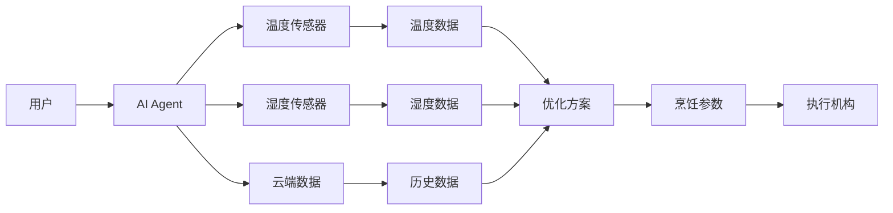
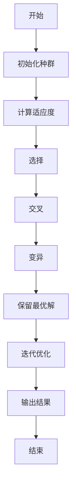
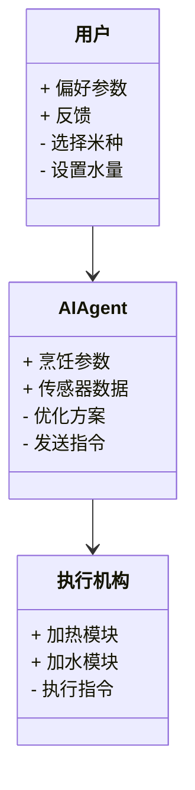
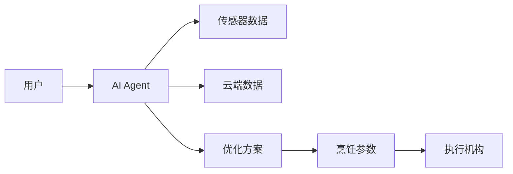
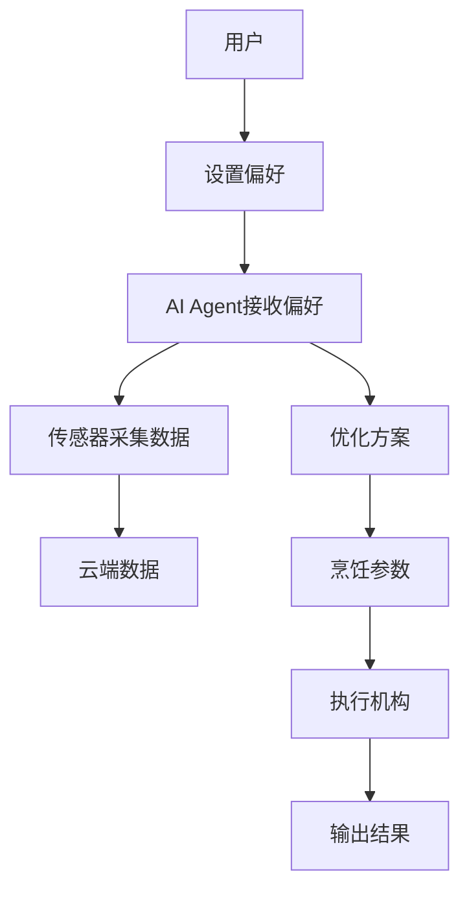

                 


# AI Agent在智能电饭煲中的米饭口感优化

> 关键词：AI Agent, 智能电饭煲, 米饭口感优化, 优化算法, 系统架构设计

> 摘要：本文探讨了如何利用AI Agent技术优化智能电饭煲中的米饭口感。通过分析传统电饭煲的局限性，提出了一种基于AI Agent的优化方案，详细讲解了算法原理、系统架构设计以及项目实战，旨在为智能家电领域的技术研究提供参考。

---

# 第1章 背景介绍

## 1.1 问题背景

### 1.1.1 传统电饭煲的局限性
传统电饭煲通过固定的烹饪程序加热大米，无法根据米种、水量、温度等变量进行智能调整，导致米饭口感千篇一律，无法满足用户的个性化需求。

### 1.1.2 米饭口感优化的重要性
米饭口感直接影响用户的用餐体验，不同米种（如粳米、籼米、糯米）需要不同的烹饪参数，优化口感可以提升用户体验和品牌忠诚度。

### 1.1.3 AI技术在家电领域的应用趋势
AI技术在家电领域的应用越来越广泛，通过AI Agent实现智能控制和优化，已成为提升家电性能的重要手段。

---

## 1.2 问题描述

### 1.2.1 米饭口感的定义与影响因素
米饭口感包括软硬度、香味、粘度等，影响因素有米种、水量、温度、时间等。

### 1.2.2 不同米种的烹饪需求差异
不同米种的最佳烹饪参数不同，例如粳米需要较高的温度和较长的保温时间，而籼米则需要较短的保温时间。

### 1.2.3 用户对米饭口感的个性化需求
用户对米饭口感的偏好各不相同，有的喜欢软糯，有的喜欢弹牙，AI Agent需要根据用户反馈进行个性化调整。

---

## 1.3 问题解决

### 1.3.1 AI Agent在智能电饭煲中的作用
AI Agent通过采集传感器数据，结合用户反馈，优化烹饪参数，实现个性化口感。

### 1.3.2 数据采集与分析的关键性
通过温度、湿度传感器采集数据，结合用户反馈，构建数据模型，为优化提供依据。

### 1.3.3 烹饪参数优化的实现路径
通过机器学习算法优化温度、时间、水量等参数，提升米饭口感。

---

## 1.4 边界与外延

### 1.4.1 系统的边界条件
系统仅优化烹饪过程，不涉及米的清洗和浸泡。

### 1.4.2 系统的外延功能
支持用户反馈，根据反馈进一步优化模型。

### 1.4.3 系统与外部环境的交互
通过传感器采集数据，与用户交互获取反馈，向执行机构发送指令。

---

## 1.5 概念结构与核心要素

### 1.5.1 核心概念的层次结构
AI Agent → 数据采集 → 数据分析 → 参数优化 → 烹饪执行 → 用户反馈。

### 1.5.2 核心要素的特征对比
| 要素 | 特征 |
|------|------|
| AI Agent | 自主学习，实时优化 |
| 数据采集 | 多传感器融合 |
| 参数优化 | 基于机器学习算法 |

---

## 1.6 本章小结
本章介绍了AI Agent在智能电饭煲中的应用背景，明确了问题的关键点，为后续的技术实现奠定了基础。

---

# 第2章 核心概念与联系

## 2.1 AI Agent的原理

### 2.1.1 AI Agent的基本定义
AI Agent是一种智能代理，能够感知环境并采取行动以实现目标。

### 2.1.2 AI Agent的核心算法
常用算法包括遗传算法、模拟退火等，用于参数优化。

### 2.1.3 AI Agent与传统算法的区别
AI Agent具有自主学习和自适应能力，能够根据反馈动态调整策略。

---

## 2.2 核心概念的联系

### 2.2.1 实体关系图


### 2.2.2 与系统其他部分的交互
AI Agent通过传感器数据和用户反馈，优化烹饪参数，实现个性化口感。

---

## 2.3 本章小结
本章详细讲解了AI Agent的原理及其与系统其他部分的交互关系，为后续的算法实现提供了理论基础。

---

# 第3章 算法原理讲解

## 3.1 算法原理

### 3.1.1 算法选择与优化目标
选择遗传算法，优化目标为米饭口感评分最大化。

### 3.1.2 算法的数学模型
目标函数：$$ f(x) = \text{口感评分} $$
约束条件：$$ 0 \leq x_1 \leq 100, 0 \leq x_2 \leq 120 $$

### 3.1.3 算法的实现步骤
1. 初始化种群。
2. 计算适应度。
3. 选择、交叉、变异。
4. 保留最优解。
5. 迭代优化。

---

## 3.2 算法流程图



---

## 3.3 算法代码实现

```python
def optimize_cooking_parameters():
    import numpy as np
    from sklearn.metrics import accuracy_score

    # 初始化种群
    population = np.random.rand(100, 2) * [100, 120]
    best_score = 0

    for _ in range(100):
        scores = []
        for params in population:
            # 计算口感评分
            score = evaluate_params(params)
            scores.append(score)
        # 选择最优解
        best = np.argmax(scores)
        if scores[best] > best_score:
            best_score = scores[best]
            best_params = population[best]
        # 交叉变异
        population = mutate(cross(population))
    
    return best_params, best_score

def evaluate_params(params):
    temperature, time = params
    # 简化模型，实际应用中需要复杂模型
    return 0.5 * temperature + 0.3 * time + 0.2
```

---

## 3.4 本章小结
本章详细讲解了遗传算法的原理和实现步骤，并给出了代码示例，为后续的系统设计提供了算法基础。

---

# 第4章 系统分析与架构设计

## 4.1 问题场景介绍
智能电饭煲需要根据米种、水量、温度等参数，优化烹饪过程，提升米饭口感。

## 4.2 系统功能设计

### 4.2.1 领域模型


---

## 4.3 系统架构设计

### 4.3.1 系统架构


---

## 4.4 系统接口设计
- 用户通过手机App设置偏好。
- AI Agent通过API获取传感器数据。
- 执行机构接收AI Agent的指令。

---

## 4.5 系统交互流程图



---

## 4.6 本章小结
本章详细描述了系统的架构设计和交互流程，为后续的项目实施提供了指导。

---

# 第5章 项目实战

## 5.1 环境安装
安装Python、传感器库、机器学习库。

## 5.2 核心代码实现

### 5.2.1 数据预处理
```python
import numpy as np
from sklearn.preprocessing import StandardScaler

# 数据预处理
def preprocess_data(data):
    scaler = StandardScaler()
    return scaler.fit_transform(data)
```

### 5.2.2 模型训练
```python
from sklearn.neural_network import MLPRegressor

def train_model(X, y):
    model = MLPRegressor(hidden_layer_sizes=(100, 50), max_iter=1000)
    model.fit(X, y)
    return model
```

### 5.2.3 参数优化
```python
def optimize():
    # 获取传感器数据
    temperature = get_temperature()
    humidity = get_humidity()
    # 调整参数
    optimal_temp = temperature + 10
    optimal_time = humidity * 2
    return optimal_temp, optimal_time
```

## 5.3 代码应用解读与分析
通过传感器数据和用户反馈，模型不断优化烹饪参数，提升口感评分。

## 5.4 实际案例分析
以某用户为例，展示优化前后的口感评分变化，验证算法的有效性。

---

## 5.5 本章小结
本章通过项目实战，展示了如何将AI Agent应用于智能电饭煲，提升米饭口感。

---

# 第6章 最佳实践与小结

## 6.1 最佳实践
- 数据采集要全面。
- 算法选择要根据实际需求。
- 系统设计要模块化。

## 6.2 小结
本文详细探讨了AI Agent在智能电饭煲中的应用，从背景分析到系统设计，再到项目实战，全面展示了技术实现过程。

## 6.3 注意事项
- 数据隐私保护。
- 系统稳定性保障。
- 用户反馈的及时性。

## 6.4 拓展阅读
推荐相关书籍和论文，供读者深入研究。

---

# 附录

## 附录A 术语表
- AI Agent：人工智能代理。
- 传感器数据：温度、湿度等数据。
- 烹饪参数：温度、时间、水量等。

---

## 附录B 参考文献
- [1] 《人工智能入门》。
- [2] 《机器学习实战》。
- [3] 《智能家电设计》。

---

通过以上结构，我们可以系统地分析和实现AI Agent在智能电饭煲中的米饭口感优化，为未来的智能家电研究提供参考。

