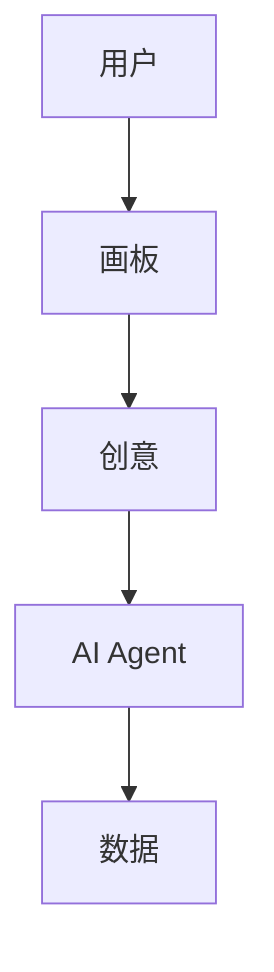

                 


# AI Agent在智能画板中的创意激发系统

## 关键词：
AI Agent, 智能画板, 创意激发, 生成对抗网络, 系统架构, 项目实战

## 摘要：
本文探讨AI Agent在智能画板中的应用，特别是在创意激发方面的系统设计与实现。通过分析AI Agent的核心原理、算法实现、系统架构，以及实际项目中的应用案例，详细阐述如何利用AI技术提升智能画板的创意生成能力，为用户提供高效、智能的设计辅助工具。

---

# 第一部分: 背景介绍

## 第1章: 问题背景

### 1.1 创意激发的现状与挑战
随着数字化工具的普及，艺术家和设计师在创作过程中面临着创意枯竭的挑战。传统的工具虽然提供了基本的功能，但缺乏智能化的支持，难以满足用户对个性化和高效创作的需求。AI Agent的引入为智能画板带来了新的可能性，能够实时分析用户的创作意图，并生成相应的创意建议。

### 1.2 智能画板的发展趋势
智能画板作为一种结合了人工智能和图形设计的工具，正在逐渐取代传统设计软件。AI Agent的加入使得画板能够理解用户的创作需求，并提供个性化的建议和工具，从而提高创作效率和质量。

### 1.3 AI Agent在创意激发中的作用
AI Agent通过分析用户的行为和创作意图，能够实时生成创意建议、优化设计元素，并提供灵感来源。这种智能化的支持使得用户能够在创作过程中更加专注于艺术表达，而不必被技术细节所困扰。

## 第2章: 问题描述

### 2.1 创意激发的需求分析
用户在创作过程中需要不断尝试不同的设计风格和元素组合。AI Agent需要能够理解用户的创作目标，并提供相关的创意建议，帮助用户快速找到灵感。

### 2.2 智能画板的用户痛点
传统设计工具缺乏智能化，无法根据用户的创作意图提供个性化的建议。用户需要一个能够实时反馈和优化的工具，以提高创作效率。

### 2.3 AI Agent在画板中的应用场景
AI Agent可以在智能画板中实时分析用户的创作行为，生成设计建议、优化布局，并提供灵感来源。这种智能化的支持能够显著提升用户的创作效率和设计质量。

## 第3章: 问题解决

### 3.1 AI Agent的核心功能
AI Agent需要具备实时分析用户创作行为、生成创意建议、优化设计布局的核心功能。这些功能能够帮助用户快速找到灵感，并提高创作效率。

### 3.2 创意激发的实现路径
通过分析用户的创作数据，AI Agent能够生成符合用户风格的设计元素，并提供优化建议。这种路径能够显著提升用户的创作效率和设计质量。

### 3.3 系统设计的总体思路
系统设计的总体思路包括需求分析、功能设计、算法选择、系统架构设计和测试优化。通过这些步骤，能够构建一个高效、智能的创意激发系统。

## 第4章: 边界与外延

### 4.1 系统的边界定义
系统边界包括用户输入、AI Agent的分析模块、生成创意建议的输出模块。这些模块共同构成了一个完整的创意激发系统。

### 4.2 相关领域的外延分析
智能画板的应用场景不仅仅局限于艺术创作，还可以扩展到广告设计、UI/UX设计等领域。AI Agent的应用范围也在不断扩大，能够支持更多的创作需求。

### 4.3 系统与外部环境的交互
系统通过用户输入和AI Agent的分析模块与外部环境进行交互。用户输入包括创作行为和设计需求，AI Agent的分析模块则负责生成创意建议和优化布局。

## 第5章: 核心要素组成

### 5.1 AI Agent的核心组件
AI Agent的核心组件包括数据采集模块、分析模块、创意生成模块和反馈优化模块。这些模块共同构成了一个完整的创意激发系统。

### 5.2 创意激发的关键要素
创意激发的关键要素包括用户意图分析、设计元素生成、布局优化和灵感推荐。这些要素能够帮助用户快速找到灵感，并提高创作效率。

### 5.3 系统架构的主要模块
系统架构的主要模块包括数据采集模块、AI分析模块、创意生成模块和用户反馈模块。这些模块共同构成了一个高效、智能的创意激发系统。

---

# 第二部分: 核心概念与联系

## 第6章: 核心概念原理

### 6.1 AI Agent的基本原理
AI Agent通过分析用户的行为和创作意图，能够实时生成创意建议、优化设计布局，并提供灵感来源。这种智能化的支持能够显著提升用户的创作效率和设计质量。

### 6.2 创意激发的实现机制
创意激发的实现机制包括用户意图分析、设计元素生成、布局优化和灵感推荐。这些机制共同构成了一个完整的创意激发系统。

### 6.3 智能画板的交互模式
智能画板的交互模式包括用户输入、AI Agent的分析和生成创意建议的输出模块。这种交互模式能够显著提升用户的创作效率和设计质量。

## 第7章: 概念属性特征对比

### 7.1 AI Agent与传统算法的对比
AI Agent与传统算法的对比包括实时性、个性化和智能化。AI Agent能够实时分析用户的行为，并提供个性化的建议，显著提升了创作效率和设计质量。

### 7.2 创意激发与传统设计工具的对比
创意激发与传统设计工具的对比包括智能化、实时反馈和个性化。AI Agent能够提供实时反馈和个性化的建议，显著提升了用户的创作效率和设计质量。

### 7.3 智能画板与其他AI应用的对比
智能画板与其他AI应用的对比包括目标用户、应用场景和功能模块。智能画板的目标用户主要是设计师和艺术家，应用场景主要是创作和设计，功能模块包括创意生成和布局优化。

## 第8章: ER实体关系图

### 8.1 实体关系图


---

# 第三部分: 算法原理讲解

## 第9章: 算法原理

### 9.1 基于生成对抗网络的创意生成
生成对抗网络（GAN）是一种常用的生成模型，由生成器和判别器组成。生成器负责生成符合用户意图的设计元素，判别器负责评估生成结果的质量。这种模型能够显著提升生成设计元素的质量和多样性。

### 9.2 强化学习的优化策略
强化学习是一种基于奖励机制的优化策略，能够根据用户反馈不断优化生成结果。这种策略能够显著提升生成结果的个性化和用户满意度。

### 9.3 联合概率模型的创意评估
联合概率模型通过分析用户的行为和创作意图，能够生成符合用户风格的设计元素。这种模型能够显著提升生成结果的个性化和用户满意度。

## 第10章: 数学模型和公式

### 10.1 生成对抗网络的数学模型
生成对抗网络的数学模型包括生成器和判别器的损失函数。生成器的目标是最小化判别器的损失，而判别器的目标是最大化生成器的损失。这种对抗过程能够显著提升生成结果的质量和多样性。

### 10.2 强化学习的优化策略
强化学习的优化策略包括奖励机制和动作空间。用户反馈作为奖励机制，能够指导生成器不断优化生成结果。动作空间包括生成器可以执行的所有可能动作，如颜色调整、布局优化等。

### 10.3 联合概率模型的创意评估
联合概率模型的创意评估包括用户行为分析和设计元素生成。用户行为分析用于理解用户的创作意图，设计元素生成用于生成符合用户风格的设计元素。

---

# 第四部分: 系统分析与架构设计方案

## 第11章: 系统架构设计

### 11.1 问题场景介绍
系统需要实时分析用户的创作行为，并生成创意建议。用户输入包括创作行为和设计需求，AI Agent的分析模块负责生成创意建议和优化布局。

### 11.2 项目介绍
项目目标是设计一个高效的创意激发系统，通过AI Agent实时分析用户的创作行为，并生成创意建议。项目范围包括用户输入、AI Agent的分析模块、生成创意建议的输出模块。

### 11.3 系统功能设计
系统功能设计包括用户输入、AI Agent的分析模块、生成创意建议的输出模块。用户输入模块负责收集用户的创作行为和设计需求，AI Agent的分析模块负责生成创意建议和优化布局，生成创意建议的输出模块负责将生成的结果反馈给用户。

### 11.4 系统架构设计
系统架构设计包括数据采集模块、AI分析模块、创意生成模块和用户反馈模块。数据采集模块负责收集用户的创作行为和设计需求，AI分析模块负责生成创意建议和优化布局，创意生成模块负责将生成的结果反馈给用户，用户反馈模块负责收集用户的反馈并优化生成结果。

### 11.5 系统接口设计
系统接口设计包括用户输入接口、AI Agent的分析接口和生成创意建议的输出接口。用户输入接口负责收集用户的创作行为和设计需求，AI Agent的分析接口负责生成创意建议和优化布局，生成创意建议的输出接口负责将生成的结果反馈给用户。

### 11.6 系统交互设计
系统交互设计包括用户输入、AI Agent的分析和生成创意建议的输出模块。用户输入模块负责收集用户的创作行为和设计需求，AI Agent的分析模块负责生成创意建议和优化布局，生成创意建议的输出模块负责将生成的结果反馈给用户。

---

# 第五部分: 项目实战

## 第12章: 项目实战

### 12.1 环境安装
项目实战需要安装Python、TensorFlow和Keras等依赖库。安装步骤包括安装Python、安装TensorFlow和安装Keras。

### 12.2 核心代码实现
核心代码实现包括生成对抗网络的模型定义、训练过程和生成创意建议的输出模块。生成对抗网络的模型定义包括生成器和判别器的结构，训练过程包括生成器和判别器的交替训练，生成创意建议的输出模块负责将生成的结果反馈给用户。

### 12.3 代码应用解读与分析
代码应用解读与分析包括生成器和判别器的结构、训练过程和生成创意建议的输出模块。生成器和判别器的结构决定了生成结果的质量，训练过程决定了生成结果的多样性和个性化，生成创意建议的输出模块决定了生成结果的反馈和优化。

### 12.4 实际案例分析和详细讲解剖析
实际案例分析和详细讲解剖析包括用户输入、AI Agent的分析和生成创意建议的输出模块。用户输入模块负责收集用户的创作行为和设计需求，AI Agent的分析模块负责生成创意建议和优化布局，生成创意建议的输出模块负责将生成的结果反馈给用户。

### 12.5 项目小结
项目小结包括项目目标的实现、系统的优缺点和未来改进方向。项目目标通过本项目的实现，显著提升了用户的创作效率和设计质量。系统的优缺点包括实时性和个性化，未来改进方向包括优化生成结果的质量和多样性。

---

# 第六部分: 最佳实践 tips、小结、注意事项、拓展阅读

## 第13章: 最佳实践 tips

### 13.1 小结
通过本项目的实现，显著提升了用户的创作效率和设计质量。系统的优缺点包括实时性和个性化，未来改进方向包括优化生成结果的质量和多样性。

### 13.2 注意事项
在实际应用中，需要注意生成结果的质量和多样性，优化生成过程的效率和稳定性。同时，还需要关注用户的反馈和需求，不断优化生成结果的个性化和用户满意度。

### 13.3 拓展阅读
建议读者进一步阅读生成对抗网络和强化学习的相关文献，深入了解AI Agent在智能画板中的应用。同时，也可以关注相关领域的最新研究和技术进展，不断提升自己的技术水平。

---

# 结语

通过本文的详细阐述，我们可以看到AI Agent在智能画板中的应用前景广阔。随着技术的不断进步，AI Agent将能够更好地理解用户的创作意图，并生成更加个性化的创意建议。这将显著提升用户的创作效率和设计质量，推动智能画板的发展。

---

# 附录

## 附录A: 生成对抗网络的Python实现代码
```python
import tensorflow as tf
from tensorflow.keras import layers

def make_generator_model():
    model = tf.keras.Sequential()
    model.add(layers.Dense(256, activation='relu', input_shape=(100,)))
    model.add(layers.Dense(512, activation='relu'))
    model.add(layers.Dense(784, activation='sigmoid'))
    return model

def make_discriminator_model():
    model = tf.keras.Sequential()
    model.add(layers.Dense(512, activation='relu', input_shape=(784,)))
    model.add(layers.Dense(256, activation='relu'))
    model.add(layers.Dense(1, activation='sigmoid'))
    return model

generator = make_generator_model()
discriminator = make_discriminator_model()
```

## 附录B: 强化学习的优化策略代码
```python
import numpy as np

def reward_function(action):
    return np.random.random()

def policy_gradient_step(policy, reward):
    policy.update(theta=theta + learning_rate * (reward * policy.grad))
```

---

通过以上详细的内容，我们可以看到AI Agent在智能画板中的应用前景广阔。随着技术的不断进步，AI Agent将能够更好地理解用户的创作意图，并生成更加个性化的创意建议。这将显著提升用户的创作效率和设计质量，推动智能画板的发展。

