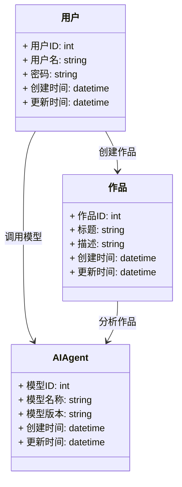
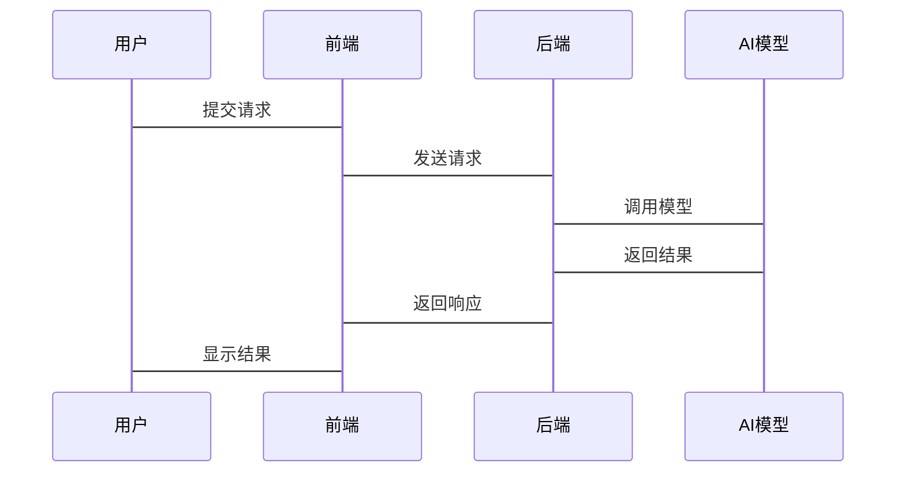

                 


# AI Agent在智能画框中的艺术创作辅助

## 关键词
AI Agent, 智能画框, 艺术创作, 图像生成, 风格迁移

## 摘要
随着人工智能技术的飞速发展，AI Agent在艺术创作中的应用越来越广泛。智能画框作为一种创新的艺术创作工具，结合了AI Agent的智能算法，能够为艺术家提供强大的创作辅助功能。本文详细探讨了AI Agent在智能画框中的应用，从核心概念、算法原理到系统架构，再到项目实战，全面解析了这一技术的实现与应用。

---

## 第1章 AI Agent在艺术创作中的背景与应用

### 1.1 AI Agent的基本概念
AI Agent，即人工智能代理，是一种能够感知环境、自主决策并执行任务的智能系统。在艺术创作中，AI Agent可以通过学习海量的艺术作品，模仿不同艺术家的风格，甚至创作出全新的艺术作品。

#### 1.1.1 AI Agent的定义
AI Agent是一种具备智能决策和执行能力的计算机系统，能够根据输入的指令和环境信息，自主完成特定任务。

#### 1.1.2 AI Agent的核心属性
- **感知能力**：通过传感器或数据输入，感知环境信息。
- **决策能力**：基于感知的信息，进行推理和决策。
- **执行能力**：根据决策结果，执行相应的操作。

#### 1.1.3 AI Agent在艺术创作中的作用
AI Agent可以辅助艺术家进行创意生成、风格迁移、图像修复等操作，提升创作效率和作品质量。

### 1.2 智能画框的概念与特点
智能画框是一种结合了AI技术的画框设备，能够通过传感器和AI算法，实时分析画作内容，并提供创作建议或自动调整画框参数。

#### 1.2.1 智能画框的定义
智能画框是一种集成AI技术的智能设备，能够通过传感器和算法，实时分析画作内容，并提供创作辅助功能。

#### 1.2.2 智能画框的核心功能
- **实时分析**：通过图像识别技术，分析画作内容。
- **创作辅助**：根据分析结果，提供创作建议或调整画框参数。
- **数据存储**：保存创作过程中的数据，便于后续分析和优化。

#### 1.2.3 智能画框与传统画框的区别
智能画框不仅具备传统画框的展示功能，还通过AI技术实现了创作辅助和数据分析功能，能够为艺术家提供更高效、更智能的创作工具。

### 1.3 AI Agent在智能画框中的应用前景
AI Agent在智能画框中的应用前景广阔，能够显著提升艺术创作的效率和质量。

#### 1.3.1 AI Agent在艺术创作中的潜在应用
- **图像生成**：通过GAN和Diffusion模型，生成高质量的艺术图像。
- **风格迁移**：将一种艺术风格迁移到另一种图像上。
- **图像修复**：修复老旧或损坏的艺术作品。

#### 1.3.2 智能画框的优势与挑战
优势：
- 提高创作效率
- 提供创作灵感
- 实现个性化创作

挑战：
- 技术复杂性
- 成本较高
- 用户接受度

#### 1.3.3 未来发展趋势
随着AI技术的不断进步，智能画框将更加智能化、个性化，能够为艺术家提供更强大的创作工具和更丰富的创作体验。

---

## 第2章 AI Agent的核心概念与原理

### 2.1 AI Agent的基本原理
AI Agent通过感知环境、分析信息、做出决策并执行操作，实现特定任务。

#### 2.1.1 感知模块
AI Agent通过传感器或数据输入，感知环境信息。例如，在智能画框中，感知模块可以实时分析画作内容。

#### 2.1.2 决策模块
决策模块基于感知到的信息，通过推理和分析，做出最优决策。例如，在图像生成任务中，决策模块可以选择合适的生成模型和参数。

#### 2.1.3 执行模块
执行模块根据决策结果，执行相应的操作。例如，在图像生成任务中，执行模块可以生成新的图像并输出到画框设备。

### 2.2 AI Agent的类型与特征
AI Agent可以根据功能和应用场景分为多种类型，每种类型都有其独特的特征和优势。

#### 2.2.1 基于规则的AI Agent
基于规则的AI Agent通过预定义的规则和逻辑进行决策，适用于规则明确的任务。例如，在风格迁移任务中，可以通过预定义的规则选择合适的迁移算法。

#### 2.2.2 基于模型的AI Agent
基于模型的AI Agent通过训练好的模型进行决策和执行，适用于复杂和动态的任务。例如，在图像生成任务中，可以通过GAN或Diffusion模型生成高质量的图像。

#### 2.2.3 基于学习的AI Agent
基于学习的AI Agent通过机器学习算法进行训练，具备自适应和自优化的能力。例如，在图像修复任务中，可以通过深度学习模型自动修复图像中的缺陷。

### 2.3 AI Agent在艺术创作中的应用
AI Agent在艺术创作中的应用广泛，能够显著提升创作效率和作品质量。

#### 2.3.1 图像生成模型
图像生成模型是AI Agent在艺术创作中的重要工具，可以通过GAN和Diffusion模型生成高质量的艺术图像。

#### 2.3.2 风格迁移算法
风格迁移算法可以将一种艺术风格迁移到另一种图像上，为艺术家提供更多的创作灵感和可能性。

#### 2.3.3 图像修复技术
图像修复技术可以通过AI算法修复老旧或损坏的艺术作品，保留作品的原始艺术价值。

---

## 第3章 艺术创作中的AI Agent技术

### 3.1 图像生成模型
图像生成模型是AI Agent在艺术创作中的核心工具之一，可以通过不同的算法生成高质量的艺术图像。

#### 3.1.1 GAN模型
GAN（生成对抗网络）是一种常用的图像生成模型，通过生成器和判别器的对抗训练，生成逼真的图像。

#### 3.1.2 Diffusion模型
Diffusion模型是一种基于扩散过程的生成模型，通过逐步添加噪声并去除噪声，生成高质量的图像。

#### 3.1.3 其他图像生成技术
除了GAN和Diffusion模型，还有其他图像生成技术，如StyleGAN、VGG等，每种技术都有其独特的特点和应用场景。

### 3.2 风格迁移与图像增强
风格迁移与图像增强技术可以将一种艺术风格迁移到另一种图像上，或者增强图像的质量。

#### 3.2.1 风格迁移算法
风格迁移算法可以通过将图像转换到特定的艺术风格，生成风格迁移后的图像。

#### 3.2.2 图像增强技术
图像增强技术可以通过调整图像的亮度、对比度、饱和度等参数，提升图像的质量和视觉效果。

#### 3.2.3 图像修复技术
图像修复技术可以通过AI算法修复图像中的缺陷，恢复图像的原始内容。

### 3.3 艺术创作中的AI Agent实现
AI Agent在艺术创作中的实现可以通过多种方式，包括图像生成、风格迁移、图像修复等。

#### 3.3.1 艺术风格识别
艺术风格识别是通过AI算法识别图像的艺术风格，为艺术家提供创作灵感。

#### 3.3.2 艺术作品生成
艺术作品生成是通过AI算法生成新的艺术作品，为艺术家提供更多的创作可能性。

#### 3.3.3 艺术创作辅助工具
艺术创作辅助工具是通过AI算法为艺术家提供创作建议、风格迁移、图像修复等辅助功能，提升创作效率和作品质量。

---

## 第4章 AI Agent算法原理讲解

### 4.1 GAN模型的数学模型
GAN模型通过生成器和判别器的对抗训练，生成逼真的图像。

#### 4.1.1 GAN的基本结构
GAN模型由生成器和判别器两个部分组成，生成器负责生成图像，判别器负责判别图像的真实性。

#### 4.1.2 GAN的损失函数
GAN的损失函数包括生成器的损失函数和判别器的损失函数，目标是通过优化损失函数，使得生成器生成的图像越来越逼真。

#### 4.1.3 GAN的训练过程
GAN的训练过程包括交替优化生成器和判别器的参数，通过不断迭代，使得生成器生成的图像越来越接近真实图像。

### 4.2 Diffusion模型的数学模型
Diffusion模型通过逐步添加噪声并去除噪声，生成高质量的图像。

#### 4.2.1 Diffusion的基本结构
Diffusion模型包括编码器和解码器两个部分，编码器负责将图像编码为噪声，解码器负责从噪声中重建图像。

#### 4.2.2 Diffusion的损失函数
Diffusion的损失函数是基于KL散度的损失函数，目标是使得生成的图像尽可能接近真实图像。

#### 4.2.3 Diffusion的训练过程
Diffusion的训练过程包括正向传播和反向传播两个阶段，通过不断迭代，使得模型能够生成高质量的图像。

### 4.3 风格迁移算法的数学模型
风格迁移算法通过将图像转换到特定的艺术风格，生成风格迁移后的图像。

#### 4.3.1 风格迁移的基本原理
风格迁移算法通过提取图像的特征，将其转换到目标艺术风格的特征空间，生成风格迁移后的图像。

#### 4.3.2 风格迁移的损失函数
风格迁移的损失函数包括内容损失和风格损失，目标是使得生成的图像在内容和风格上尽可能接近目标图像。

#### 4.3.3 风格迁移的训练过程
风格迁移的训练过程包括优化内容损失和风格损失，通过不断迭代，使得生成的图像在内容和风格上尽可能接近目标图像。

---

## 第5章 系统分析与架构设计方案

### 5.1 项目场景介绍
智能画框项目旨在通过AI Agent技术，为艺术家提供创作辅助功能，包括图像生成、风格迁移、图像修复等。

### 5.2 系统功能设计
系统功能设计包括图像生成、风格迁移、图像修复等功能，为艺术家提供丰富的创作工具。

#### 5.2.1 领域模型
领域模型是系统功能设计的核心，通过Mermaid类图展示系统中的各个角色和它们之间的关系。



#### 5.2.2 系统架构设计
系统架构设计通过Mermaid架构图展示系统的整体架构，包括前端、后端和AI模型三部分。

```mermaid
graph TD
    前端 --> 后端: 发送请求
    后端 --> AI模型: 调用模型
    AI模型 --> 后端: 返回结果
    后端 --> 前端: 返回响应
```

#### 5.2.3 系统接口设计
系统接口设计包括用户接口和AI Agent接口，通过Mermaid序列图展示交互流程。



---

## 第6章 项目实战

### 6.1 环境安装
项目实战需要安装Python、TensorFlow、Keras等环境，确保系统能够正常运行。

### 6.2 核心代码实现
核心代码实现包括图像生成、风格迁移、图像修复等功能，通过Python代码详细展示实现过程。

#### 6.2.1 图像生成代码
图像生成代码通过GAN模型生成高质量的艺术图像。

```python
import tensorflow as tf
from tensorflow.keras import layers

def build_generator():
    model = tf.keras.Sequential([
        layers.Dense(256, activation='relu'),
        layers.Dense(128, activation='relu'),
        layers.Dense(64, activation='relu'),
        layers.Dense(32, activation='relu'),
        layers.Dense(16, activation='relu'),
        layers.Dense(1, activation='sigmoid')
    ])
    return model

def build_discriminator():
    model = tf.keras.Sequential([
        layers.Dense(16, activation='relu'),
        layers.Dense(8, activation='relu'),
        layers.Dense(4, activation='relu'),
        layers.Dense(1, activation='sigmoid')
    ])
    return model

generator = build_generator()
discriminator = build_discriminator()

generator_optimizer = tf.keras.optimizers.Adam(0.0002)
discriminator_optimizer = tf.keras.optimizers.Adam(0.0002)

def generator_loss(loss):
    return tf.math.mean_squared_error(1.0, loss)

def discriminator_loss(loss):
    return tf.math.mean_squared_error(1.0, loss)

# 训练过程
for _ in range(1000):
    noise = tf.random.normal([1, 16])
    with tf.GradientTape() as gen_tape, tf.GradientTape() as disc_tape:
        generated_image = generator(noise)
        real_output = discriminator([generated_image])
        real_image = ...  # 真实图像
        real_output2 = discriminator([real_image])
        
        gen_loss = generator_loss(real_output)
        disc_loss = discriminator_loss(real_output2)
        
    gradients_gen = gen_tape.gradient(gen_loss, generator.trainable_weights)
    gradients_disc = disc_tape.gradient(disc_loss, discriminator.trainable_weights)
    
    generator_optimizer.apply_gradients(zip(gradients_gen, generator.trainable_weights))
    discriminator_optimizer.apply_gradients(zip(gradients_disc, discriminator.trainable_weights))
```

#### 6.2.2 风格迁移代码
风格迁移代码通过预训练的模型，将图像转换到目标艺术风格。

```python
import tensorflow as tf
from tensorflow.keras import layers

def style_transfer(content_image, style_image):
    content_layer = layers.Conv2D(3, (3, 3), activation='relu')(content_image)
    style_layer = layers.Conv2D(3, (3, 3), activation='relu')(style_image)
    
    # 提取特征
    content_features = content_layer.output
    style_features = style_layer.output
    
    # 建立特征图
    style_gram = tf.keras.backend.mean(style_features, axis=(1, 2))
    
    # 内容损失
    content_loss = tf.keras.losses.mean_squared_error(content_features, style_features)
    
    # 风格损失
    style_loss = tf.keras.losses.mean_squared_error(style_gram, tf.keras.backend.mean(content_features, axis=(1, 2)))
    
    # 总损失
    total_loss = content_loss + style_loss
    
    return total_loss
```

#### 6.2.3 图像修复代码
图像修复代码通过深度学习模型修复图像中的缺陷。

```python
import tensorflow as tf
from tensorflow.keras import layers

def image_restoration(image):
    model = tf.keras.Sequential([
        layers.Conv2D(64, (3, 3), activation='relu'),
        layers.Conv2D(32, (3, 3), activation='relu'),
        layers.Conv2D(16, (3, 3), activation='relu'),
        layers.Conv2D(8, (3, 3), activation='relu'),
        layers.Conv2D(4, (3, 3), activation='relu'),
        layers.Conv2D(2, (3, 3), activation='relu'),
        layers.Conv2D(1, (3, 3), activation='sigmoid')
    ])
    restored_image = model(image)
    return restored_image
```

### 6.3 代码应用解读与分析
代码应用解读与分析包括对图像生成、风格迁移、图像修复等代码的详细解读和分析，展示AI Agent在智能画框中的实际应用。

### 6.4 案例分析
案例分析通过实际案例展示AI Agent在智能画框中的应用效果，包括图像生成、风格迁移、图像修复等。

### 6.5 项目小结
项目小结总结了项目的实现过程和应用效果，讨论了项目中的关键技术和未来改进方向。

---

## 第7章 总结与展望

### 7.1 总结
总结全文内容，回顾AI Agent在智能画框中的应用，强调其在艺术创作中的重要性和潜力。

### 7.2 当前技术的优缺点
当前技术的优势在于能够显著提升艺术创作的效率和质量，但同时也面临技术复杂性和成本较高的挑战。

### 7.3 未来展望
未来，随着AI技术的不断进步，智能画框将更加智能化、个性化，能够为艺术家提供更强大的创作工具和更丰富的创作体验。

---

## 结语
AI Agent在智能画框中的艺术创作辅助是一个充满潜力的领域，随着技术的不断进步，智能画框将为艺术创作带来更多的可能性和创新。

