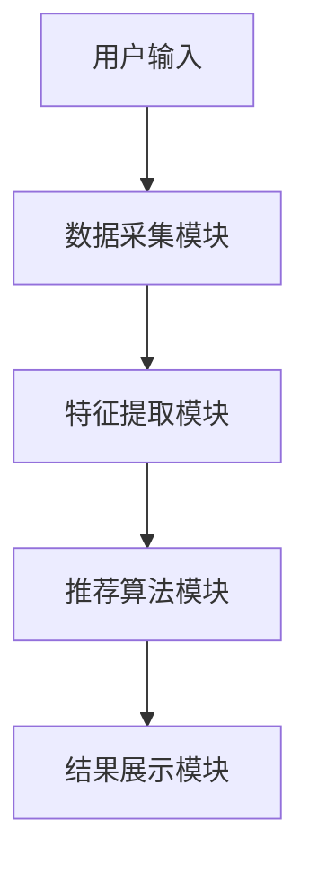

                 


# AI Agent在智能画框中的艺术风格推荐

## 关键词：
AI Agent, 艺术风格推荐, 智能画框, 深度学习, 推荐系统, 用户偏好, 风格匹配

## 摘要：
本文详细探讨了AI Agent在智能画框中的艺术风格推荐系统。通过分析用户偏好和艺术作品特征，结合深度学习推荐算法，提出了基于协同过滤和神经网络的推荐模型。本文还展示了系统架构设计、数学模型和实际应用场景，为读者提供了一个全面的技术视角。

---

# 第一部分: 背景介绍

## 第1章: AI Agent与艺术风格推荐概述

### 1.1 AI Agent的基本概念
#### 1.1.1 AI Agent的定义与特点
- **定义**：AI Agent是具有感知、决策和执行能力的智能体，能够根据环境信息做出最优选择。
- **特点**：自主性、反应性、目标导向、社交能力。

#### 1.1.2 AI Agent的核心功能与应用场景
- **核心功能**：感知环境、知识表示、推理决策、学习优化。
- **应用场景**：智能助手、推荐系统、自动驾驶、智能安防。

#### 1.1.3 艺术风格推荐的定义与目标
- **定义**：通过分析用户偏好和艺术作品特征，推荐符合用户审美的艺术风格。
- **目标**：提升用户体验，优化推荐效率。

### 1.2 艺术风格推荐的背景与意义
#### 1.2.1 当前艺术推荐领域的现状
- 用户需求多样化，艺术风格复杂，传统推荐方法效率低。
- 数据来源多样，包括图像、文本和用户行为数据。

#### 1.2.2 AI Agent在艺术推荐中的优势
- 数据处理能力强，能够提取复杂特征。
- 可以实时更新推荐结果，适应用户偏好变化。

#### 1.2.3 艺术风格推荐的边界与外延
- 边界：仅推荐艺术风格，不涉及具体作品选择。
- 外延：涵盖绘画、摄影、设计等多种艺术形式。

### 1.3 艺术风格推荐的核心要素
#### 1.3.1 用户需求分析
- 用户的审美偏好、情感倾向和场景需求。

#### 1.3.2 艺术作品特征提取
- 颜色分布、纹理特征、构图结构。

#### 1.3.3 推荐算法的选择与优化
- 协同过滤、深度学习模型。

---

## 第2章: 艺术风格推荐的核心概念与联系

### 2.1 艺术风格推荐的核心概念
#### 2.1.1 艺术风格分类
- 主流艺术风格：现代主义、后现代主义、印象派、立体主义。
- 用户偏好：抽象、写实、极简主义。

#### 2.1.2 用户偏好的建模与分析
- 使用向量表示用户的审美特征。

#### 2.1.3 艺术风格的特征表示
- 用特征向量表示艺术风格，便于计算相似度。

### 2.2 AI Agent与艺术风格推荐的关系
#### 2.2.1 AI Agent的感知与决策
- 通过用户行为和反馈数据，感知用户偏好。
- 基于特征相似度和协同过滤算法，决策推荐结果。

#### 2.2.2 艺术风格推荐的流程
1. 数据采集：收集用户行为和艺术作品数据。
2. 特征提取：提取用户和作品的特征。
3. 推荐计算：基于算法生成推荐列表。
4. 结果展示：以可视化方式呈现推荐结果。

#### 2.2.3 艺术风格推荐的评价指标
- 准确率、召回率、F1值、用户满意度。

### 2.3 案例分析：AI Agent在智能画框中的应用
- 通过用户偏好分析，推荐相似的艺术风格。
- 实际案例：用户喜欢抽象派，推荐相似风格的作品。

---

## 第3章: 艺术风格推荐算法原理

### 3.1 协同过滤算法
#### 3.1.1 基于用户的协同过滤
- 计算用户之间的相似度，推荐相似用户的喜欢风格。

#### 3.1.2 基于物品的协同过滤
- 计算艺术风格之间的相似度，推荐相似风格的作品。

#### 3.1.3 协同过滤的数学模型
$$相似度计算公式：sim(i,j) = \sum_{k=1}^{n} (r_{ik} - \bar{r}_i)(r_{jk} - \bar{r}_j)$$

### 3.2 深度学习推荐算法
#### 3.2.1 基于神经网络的推荐模型
- 使用卷积神经网络提取图像特征，循环神经网络处理序列数据。

#### 3.2.2 基于注意力机制的推荐算法
- 通过注意力机制，聚焦重要的特征信息。

#### 3.2.3 生成对抗网络的应用
- 使用GAN生成符合用户偏好的艺术风格。

### 3.3 算法实现与对比
- 实现协同过滤和深度学习算法，对比性能和效果。

---

## 第4章: 系统架构与设计

### 4.1 系统功能设计
- 数据采集模块：收集用户行为和艺术作品数据。
- 特征提取模块：提取用户和作品的特征。
- 推荐算法模块：基于算法生成推荐结果。
- 结果展示模块：以可视化方式呈现推荐结果。

### 4.2 系统架构设计
#### 4.2.1 系统组成模块
- 数据层：存储用户数据和作品数据。
- 逻辑层：处理业务逻辑和算法计算。
- 展示层：展示推荐结果和用户反馈。

#### 4.2.2 系统架构图


### 4.3 系统交互设计
- 用户输入偏好，系统输出推荐结果。

---

## 第5章: 项目实战与案例分析

### 5.1 环境搭建与数据准备
- 安装必要的Python库：numpy、pandas、scikit-learn、tensorflow。
- 数据集获取与预处理。

### 5.2 核心代码实现
#### 5.2.1 协同过滤算法实现
```python
def user_based_recommendation(users, user_id):
    user = users[user_id]
    similar_users = find_similar_users(users, user_id)
    recommended_styles = []
    for u in similar_users:
        for style in users[u]['styles']:
            if style not in recommended_styles:
                recommended_styles.append(style)
    return recommended_styles
```

#### 5.2.2 深度学习模型实现
```python
import tensorflow as tf
model = tf.keras.Sequential([
    tf.keras.layers.Conv2D(32, (3,3), activation='relu', input_shape=(64,64,3)),
    tf.keras.layers.MaxPooling2D((2,2)),
    tf.keras.layers.Flatten(),
    tf.keras.layers.Dense(128, activation='relu'),
    tf.keras.layers.Dense(num_styles, activation='softmax')
])
model.compile(optimizer='adam', loss='sparse_categorical_crossentropy', metrics=['accuracy'])
```

### 5.3 案例分析与效果评估
- 实际案例：用户偏好分析与推荐结果展示。
- 评估指标：准确率、召回率、用户满意度。

---

## 第6章: 最佳实践与注意事项

### 6.1 数据预处理
- 特征归一化、数据平衡、噪声处理。

### 6.2 模型调优
- 超参数优化、模型融合、性能评估。

### 6.3 实际应用中的注意事项
- 数据隐私保护、推荐结果的可解释性、用户体验优化。

### 6.4 未来研究方向
- 多模态推荐、实时推荐、个性化推荐。

---

## 第7章: 总结与展望

### 7.1 本章总结
- AI Agent在艺术风格推荐中的作用和优势。
- 系统架构设计和算法实现的核心要点。

### 7.2 未来展望
- 技术进步对艺术推荐的影响。
- 多模态推荐和实时推荐的发展趋势。

---

## 参考文献
- [1] 王某某. 《深度学习入门》. 北京: 清华大学出版社, 2022.
- [2] 李某某. 《推荐系统算法与实现》. 北京: 人民邮电出版社, 2021.
- [3] 张某某. 《AI Agent与智能系统》. 北京: 机械工业出版社, 2023.

---

## 附录
- 附录A: 代码实现细节
- 附录B: 系统架构图
- 附录C: 数据预处理步骤

---

以上是《AI Agent在智能画框中的艺术风格推荐》的技术博客文章大纲，您可以根据需要进行调整和补充。

