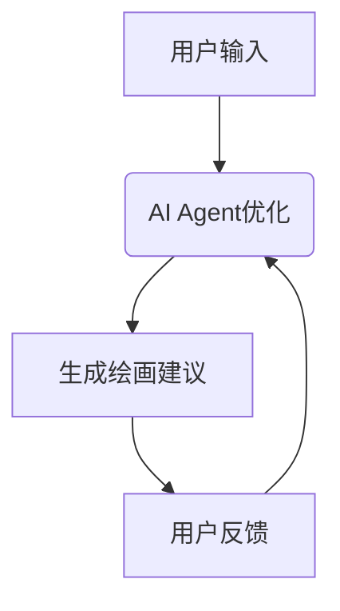
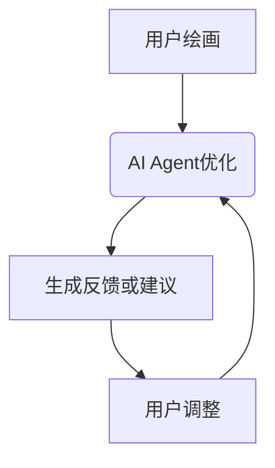
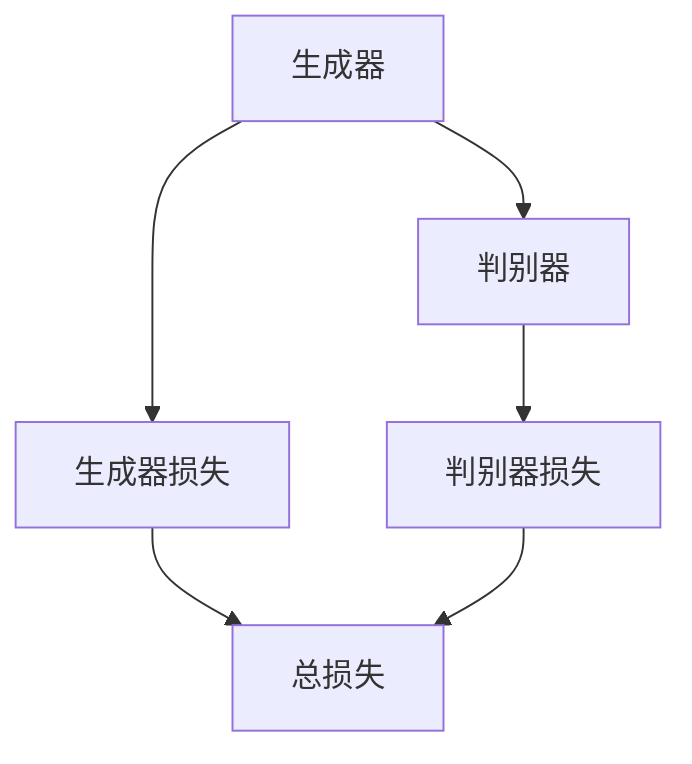
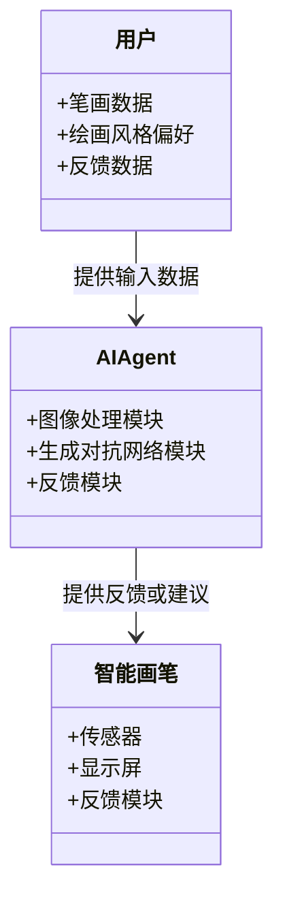
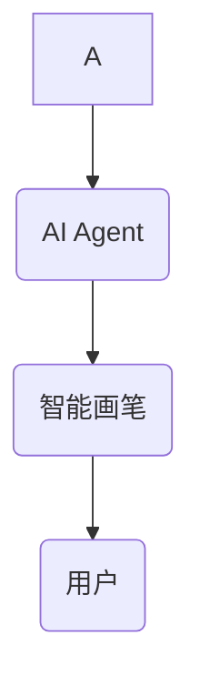

                 


# AI Agent在智能画笔中的绘画技巧指导

## 关键词：AI Agent, 智能画笔, 生成对抗网络, 图像处理, 机器学习, 深度学习

## 摘要：  
本文探讨AI Agent在智能画笔中的应用，分析其绘画技巧指导的实现原理，涵盖背景、核心概念、算法原理、系统架构、项目实战及最佳实践。通过结合生成对抗网络和图像处理技术，AI Agent能够实时辅助用户提升绘画水平。

---

# 第1章 AI Agent与智能画笔的背景介绍

## 1.1 AI Agent的基本概念

### 1.1.1 AI Agent的定义  
AI Agent（人工智能代理）是一种能够感知环境、执行任务并做出决策的智能实体。在绘画领域，AI Agent通过学习人类绘画技巧，辅助用户完成或优化绘画作品。

### 1.1.2 AI Agent的核心特征  
- **自主性**：无需人工干预，自动执行任务。  
- **反应性**：实时响应用户输入，提供反馈。  
- **学习能力**：通过深度学习模型不断优化绘画技巧。  

### 1.1.3 AI Agent与传统绘画工具的对比  
| 特性           | AI Agent                | 传统绘画工具          |  
|----------------|--------------------------|-----------------------|  
| 智能性          | 高                      | 低                   |  
| 反馈能力        | 实时反馈                | 无反馈或延迟反馈     |  
| 学习能力        | 可通过数据优化绘画技巧  | 无法学习             |  

## 1.2 智能画笔的定义与特点

### 1.2.1 智能画笔的定义  
智能画笔是一种结合了AI技术和传统绘画工具的设备，能够通过传感器和算法，实时分析用户的绘画动作并提供反馈。

### 1.2.2 智能画笔的核心功能  
- **实时反馈**：分析笔画，纠正错误。  
- **风格匹配**：模仿指定绘画风格。  
- **创作辅助**：自动生成绘画建议。  

### 1.2.3 智能画笔与传统画笔的区别  
| 特性           | 智能画笔                | 传统画笔             |  
|----------------|--------------------------|----------------------|  
| 智能性          | 高                      | 无                   |  
| 连接性          | 支持蓝牙/Wi-Fi连接      | 无                   |  
| 功能           | 实时反馈、风格匹配      | 仅用于绘画            |  

## 1.3 AI Agent在智能画笔中的作用

### 1.3.1 AI Agent在绘画中的应用场景  
- **实时反馈**：检测笔画错误，提供纠正建议。  
- **风格迁移**：将用户笔画转化为指定风格的作品。  
- **创作辅助**：根据用户意图生成绘画灵感。  

### 1.3.2 AI Agent如何提升绘画效率  
通过学习大量绘画作品，AI Agent能够快速识别用户的绘画意图，并提供优化建议，显著提升绘画效率。

### 1.3.3 AI Agent在绘画中的优势与局限  
- **优势**：高效、精准、可扩展。  
- **局限**：依赖数据质量，可能缺乏创造性。  

## 1.4 本章小结  
本章介绍了AI Agent和智能画笔的基本概念，分析了它们在绘画中的作用及特点，为后续章节奠定了基础。

---

# 第2章 AI Agent与智能画笔的核心原理

## 2.1 AI Agent的基本原理

### 2.1.1 AI Agent的工作流程  


### 2.1.2 AI Agent的核心算法  
AI Agent通常采用深度学习模型，如卷积神经网络（CNN）和生成对抗网络（GAN）。  

#### 2.1.2.1 卷积神经网络（CNN）  
CNN用于图像识别和分类，帮助AI Agent识别用户的绘画意图。  

#### 2.1.2.2 生成对抗网络（GAN）  
GAN由生成器和判别器组成，用于生成逼真的绘画作品。  

### 2.1.3 AI Agent的输入输出机制  
- **输入**：用户的笔画数据、绘画风格偏好。  
- **输出**：绘画建议、风格转换结果。  

## 2.2 智能画笔的核心技术

### 2.2.1 智能画笔的图像处理技术  
智能画笔通过图像处理技术，实时分析用户的笔画并提供反馈。  

#### 2.2.1.1 图像分割  
使用U-Net模型分割图像，识别用户笔画的区域。  

#### 2.2.1.2 风格迁移  
通过预训练的风格迁移模型，将用户笔画转化为指定风格的作品。  

### 2.2.2 智能画笔的用户交互技术  
- **触控反馈**：通过震动或温度变化反馈用户的笔画质量。  
- **语音指导**：实时语音提示绘画技巧。  

### 2.2.3 智能画笔的实时反馈机制  
通过传感器和AI算法，智能画笔实时分析用户的笔画，并提供反馈。  

## 2.3 AI Agent与智能画笔的协同机制

### 2.3.1 AI Agent与智能画笔的协同流程  


### 2.3.2 AI Agent在智能画笔中的具体应用  
- **实时反馈**：检测笔画错误，提供纠正建议。  
- **风格匹配**：将用户笔画转化为指定风格的作品。  

### 2.3.3 AI Agent与智能画笔的优化策略  
- **数据增强**：通过数据增强技术，提高AI Agent的学习能力。  
- **模型优化**：通过模型剪枝和量化，降低计算成本。  

## 2.4 本章小结  
本章详细讲解了AI Agent与智能画笔的核心原理，分析了它们的协同机制和技术实现。

---

# 第3章 AI Agent在智能画笔中的算法原理

## 3.1 AI Agent的核心算法

### 3.1.1 基于规则的AI Agent算法  
基于规则的算法通过预定义规则，指导用户绘画。例如，规则可以是“笔画过粗时，建议用户减轻手部力度”。  

### 3.1.2 基于机器学习的AI Agent算法  
基于机器学习的算法通过训练数据，学习用户的绘画习惯，并提供个性化建议。  

### 3.1.3 基于深度学习的AI Agent算法  
基于深度学习的算法（如GAN）能够生成高质量的绘画作品，但需要大量数据和计算资源。  

## 3.2 AI Agent的图像处理算法

### 3.2.1 图像分割算法  
图像分割用于识别用户笔画的区域，常用U-Net模型。  

### 3.2.2 风格迁移算法  
风格迁移算法将用户笔画转化为指定风格的作品，常用预训练的风格迁移模型。  

## 3.3 AI Agent的生成对抗网络（GAN）实现

### 3.3.1 GAN的基本结构  
GAN由生成器和判别器组成，生成器生成绘画作品，判别器判断作品是否真实。  

### 3.3.2 GAN的损失函数  
$$ L_{\text{GAN}} = \mathbb{E}[\log D(x)] + \mathbb{E}[\log(1 - D(G(z)))] $$  

### 3.3.3 GAN的训练流程  


### 3.3.4 GAN在绘画中的应用  
- **生成绘画作品**：通过GAN生成高质量的绘画作品。  
- **风格迁移**：将用户笔画转化为指定风格的作品。  

## 3.4 本章小结  
本章详细讲解了AI Agent在智能画笔中的算法原理，重点分析了GAN的实现及其在绘画中的应用。

---

# 第4章 AI Agent与智能画笔的系统架构

## 4.1 系统功能设计

### 4.1.1 领域模型  


### 4.1.2 功能模块  
- **图像处理模块**：实时分析用户笔画，提供反馈。  
- **生成对抗网络模块**：生成绘画作品。  
- **反馈模块**：通过显示屏或语音提供反馈。  

## 4.2 系统架构设计

### 4.2.1 模块划分  


### 4.2.2 系统架构图  


## 4.3 系统接口设计

### 4.3.1 用户接口  
- **输入接口**：接收用户的笔画数据和绘画风格偏好。  
- **输出接口**：通过显示屏或语音提供反馈。  

### 4.3.2 AI Agent接口  
- **输入接口**：接收用户笔画数据和反馈数据。  
- **输出接口**：提供绘画建议和优化策略。  

## 4.4 系统交互流程

### 4.4.1 交互流程图  


## 4.5 本章小结  
本章详细讲解了AI Agent与智能画笔的系统架构，分析了模块划分和交互流程。

---

# 第5章 AI Agent在智能画笔中的项目实战

## 5.1 环境搭建

### 5.1.1 系统要求  
- **硬件**：支持深度学习的GPU或TPU。  
- **软件**：Python 3.8以上，TensorFlow或PyTorch框架。  

### 5.1.2 工具安装  
- **安装Python**：`python --version`  
- **安装TensorFlow**：`pip install tensorflow`  
- **安装智能画笔驱动**：从官方网站下载并安装。  

## 5.2 系统核心实现

### 5.2.1 图像处理模块实现  
```python
import tensorflow as tf
from tensorflow.keras import layers

def image_segmentation(input_image):
    model = tf.keras.models.load_model('segmentation_model.h5')
    prediction = model.predict(input_image)
    return prediction
```

### 5.2.2 GAN实现  
```python
import tensorflow as tf
from tensorflow.keras import layers

def build_generator():
    generator = tf.keras.Sequential([
        layers.Dense(256, activation='relu'),
        layers.Dense(128, activation='relu'),
        layers.Dense(64, activation='relu'),
        layers.Dense(32, activation='relu'),
        layers.Dense(16, activation='relu'),
        layers.Dense(1, activation='sigmoid')
    ])
    return generator

def build_discriminator():
    discriminator = tf.keras.Sequential([
        layers.Dense(16, activation='relu'),
        layers.Dense(8, activation='relu'),
        layers.Dense(4, activation='relu'),
        layers.Dense(1, activation='sigmoid')
    ])
    return discriminator

generator = build_generator()
discriminator = build_discriminator()

# 定义损失函数
cross_entropy = tf.keras.losses.BinaryCrossentropy()

# 定义生成器损失
def generator_loss(fake_output):
    return cross_entropy(tf.ones_like(fake_output), fake_output)

# 定义判别器损失
def discriminator_loss(real_output, fake_output):
    real_loss = cross_entropy(tf.ones_like(real_output), real_output)
    fake_loss = cross_entropy(tf.zeros_like(fake_output), fake_output)
    return real_loss + fake_loss
```

## 5.3 案例分析与详细讲解

### 5.3.1 案例分析  
用户绘制一幅风景画，AI Agent通过图像处理模块分析笔画，生成反馈并优化绘画效果。

### 5.3.2 代码应用解读  
- **图像处理模块**：分析用户的笔画，提供反馈。  
- **GAN模块**：生成风景画的风格迁移结果。  

## 5.4 项目总结  
本章通过实际项目展示了AI Agent在智能画笔中的应用，详细讲解了环境搭建和代码实现。

---

# 第6章 AI Agent与智能画笔的最佳实践

## 6.1 绘画技巧总结

### 6.1.1 基础技巧  
- **线条练习**：通过AI Agent辅助练习基本线条。  
- **比例控制**：AI Agent帮助用户调整比例。  

### 6.1.2 高级技巧  
- **风格迁移**：通过AI Agent将不同风格应用到作品中。  
- **色彩搭配**：AI Agent提供色彩搭配建议。  

## 6.2 错误处理与注意事项

### 6.2.1 常见错误  
- **笔画过粗**：AI Agent建议用户减轻手部力度。  
- **风格不匹配**：AI Agent调整参数以匹配风格。  

### 6.2.2 注意事项  
- **数据质量**：AI Agent的性能依赖于数据质量。  
- **计算资源**：深度学习模型需要大量计算资源。  

## 6.3 性能优化技巧

### 6.3.1 数据增强  
通过数据增强技术，提高AI Agent的学习能力。  

### 6.3.2 模型优化  
通过模型剪枝和量化，降低计算成本。  

## 6.4 未来发展趋势

### 6.4.1 技术进步  
- **更高效的算法**：如改进的GAN和Transformer模型。  
- **更强大的硬件**：如专用AI芯片的普及。  

### 6.4.2 应用场景扩展  
- **虚拟现实绘画**：结合VR技术，提供沉浸式绘画体验。  
- **教育领域**：AI Agent作为绘画教学工具。  

## 6.5 本章小结  
本章总结了AI Agent在智能画笔中的最佳实践，提供了绘画技巧、错误处理和未来发展趋势的建议。

---

# 附录

## 附录A 工具推荐

### A.1 AI绘画工具  
- **DeepArt**：风格迁移工具。  
- **Prisma**：实时图像处理工具。  

### A.2 开源库推荐  
- **TensorFlow**：深度学习框架。  
- **Keras**：用户友好的深度学习库。  

## 附录B 术语表

### B.1 AI Agent  
AI Agent（人工智能代理）是一种能够感知环境、执行任务并做出决策的智能实体。  

### B.2 智能画笔  
智能画笔是一种结合了AI技术和传统绘画工具的设备，能够通过传感器和算法，实时分析用户的绘画动作并提供反馈。  

## 附录C 参考文献

### C.1 参考文献  
1. Goodfellow, I., Bengio, Y., & Courville, A. (2016). Deep Learning. MIT Press.  
2. LeCun, Y., Bengio, Y., & Hinton, G. (2015). Deep learning. Nature, 521(7555), 436-444.  

## 附录D 索引

### D.1 索引  
按照文章内容中的关键词和术语，建立索引列表，方便读者查阅。

---

# 结语

AI Agent在智能画笔中的应用前景广阔，随着技术的进步，AI Agent将为绘画创作带来更多的可能性。通过本文的详细讲解，读者可以全面了解AI Agent在智能画笔中的绘画技巧指导，并在未来的研究和实践中不断探索和优化。

