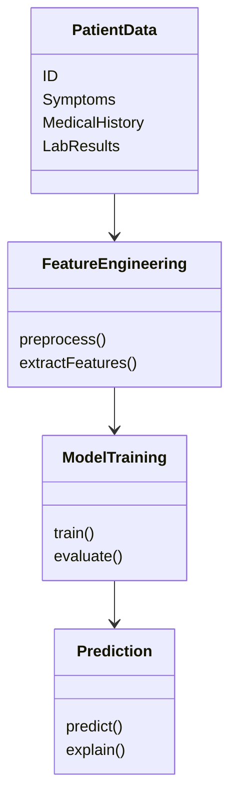
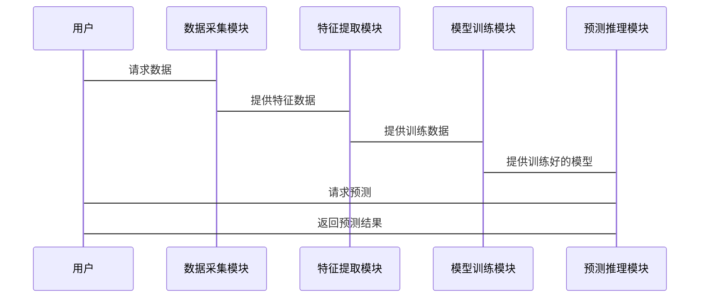

                 


**# AI Agent在智能疾病预测中的角色**

> **关键词**：AI Agent, 智能疾病预测, 机器学习, 深度学习, 疾病预测模型, 逻辑推理

> **摘要**：  
AI Agent在智能疾病预测中扮演着越来越重要的角色。通过结合先进的机器学习、深度学习和自然语言处理技术，AI Agent能够高效地分析大量医疗数据，发现潜在的疾病风险，并提供个性化的预测和建议。本文将从AI Agent的核心概念、算法原理、系统架构到实际应用案例，详细探讨AI Agent在智能疾病预测中的作用，揭示其在医疗健康领域的巨大潜力。

---

## 第一部分: AI Agent与智能疾病预测的背景介绍

### 第1章: AI Agent的基本概念与疾病预测的背景

#### 1.1 AI Agent的定义与核心特征
- **1.1.1 什么是AI Agent**  
AI Agent（人工智能代理）是指能够感知环境、自主决策并执行任务的智能实体。它具备以下核心特征：
  - **自主性**：能够在没有外部干预的情况下执行任务。
  - **反应性**：能够根据环境反馈实时调整行为。
  - **目标导向**：通过设定目标来驱动决策和行动。
  - **学习能力**：能够通过数据和经验不断优化自身性能。

- **1.1.2 AI Agent的核心特征**  
AI Agent的核心特征包括：
  - **知识表示**：通过知识库或知识图谱表示和管理信息。
  - **逻辑推理**：基于知识和规则进行推理和决策。
  - **自然语言处理**：能够理解和生成人类语言。

- **1.1.3 AI Agent的分类与应用场景**  
AI Agent可以分为以下几类：
  - **基于规则的Agent**：通过预定义的规则进行决策，适用于规则明确的任务。
  - **基于模型的Agent**：利用数学模型进行推理和决策，适用于复杂问题。
  - **基于学习的Agent**：通过机器学习算法不断优化自身性能，适用于数据驱动的任务。

#### 1.2 疾病预测的基本概念
- **1.2.1 疾病预测的定义**  
疾病预测是指通过分析患者的临床数据、生活习惯、基因信息等，预测其在未来一段时间内患某种疾病的风险。

- **1.2.2 疾病预测的主要方法**  
疾病预测的主要方法包括：
  - **统计方法**：如线性回归、逻辑回归。
  - **机器学习方法**：如支持向量机（SVM）、随机森林。
  - **深度学习方法**：如卷积神经网络（CNN）、循环神经网络（RNN）。

- **1.2.3 疾病预测的挑战与意义**  
疾病预测的挑战包括数据获取难、数据量大、模型解释性差等问题。其意义在于能够提前发现疾病风险，帮助患者采取预防措施，降低医疗成本。

#### 1.3 AI Agent在疾病预测中的结合点
- **1.3.1 AI Agent与疾病预测的结合背景**  
随着医疗数据的爆炸式增长，传统的疾病预测方法已经难以应对复杂性和实时性要求。AI Agent的引入为疾病预测提供了新的解决方案。

- **1.3.2 AI Agent在疾病预测中的优势**  
AI Agent在疾病预测中的优势包括：
  - **高效性**：能够快速处理和分析海量数据。
  - **准确性**：通过机器学习和深度学习算法提高预测的准确性。
  - **个性化**：能够根据患者个体特征提供个性化预测。

- **1.3.3 AI Agent在疾病预测中的应用场景**  
AI Agent在疾病预测中的应用场景包括：
  - **慢性病预测**：如糖尿病、高血压等慢性疾病的早期预测。
  - **传染病预测**：如流感、COVID-19等传染病的传播趋势预测。
  - **遗传病预测**：通过基因数据分析预测遗传病风险。

---

## 第二部分: AI Agent的核心概念与原理

### 第2章: AI Agent的核心概念与工作原理

#### 2.1 AI Agent的核心概念
- **2.1.1 知识表示**  
知识表示是AI Agent的核心之一，常用的表示方法包括：
  - **规则表示**：通过预定义的规则表示知识。
  - **语义网络**：通过节点和边表示概念及其关系。
  - **知识图谱**：通过图结构表示实体及其关系。

- **2.1.2 逻辑推理**  
逻辑推理是AI Agent进行决策的基础，常用的推理方法包括：
  - **基于规则的推理**：根据预定义的规则进行推理。
  - **基于概率的推理**：基于概率论进行推理，如贝叶斯推理。
  - **基于知识图谱的推理**：通过知识图谱进行推理，发现隐含的知识。

- **2.1.3 自然语言处理**  
自然语言处理（NLP）是AI Agent理解和生成人类语言的关键技术，常用的NLP任务包括：
  - **文本分类**：如情感分析、意图分类。
  - **实体识别**：识别文本中的实体（如人名、地名）。
  - **句法分析**：分析句子的语法结构。

#### 2.2 AI Agent的工作原理
- **2.2.1 数据采集与处理**  
AI Agent通过多种渠道采集数据，如医疗记录、传感器数据、基因测序数据等。采集的数据通常包括：
  - **结构化数据**：如电子健康记录（EHR）。
  - **非结构化数据**：如医生的病历记录、患者的自述。

- **2.2.2 知识库构建**  
AI Agent需要构建知识库，将采集到的数据进行存储和管理。常用的知识库包括：
  - **关系数据库**：如MySQL、PostgreSQL。
  - **知识图谱**：如Neo4j、Ubergraph。

- **2.2.3 逻辑推理与决策**  
AI Agent通过逻辑推理对数据进行分析，生成决策。常用的推理方法包括：
  - **基于规则的推理**：如专家系统。
  - **基于概率的推理**：如贝叶斯网络。
  - **基于知识图谱的推理**：如通过知识图谱进行关联分析。

#### 2.3 AI Agent在疾病预测中的应用
- **2.3.1 疾病预测的数据来源**  
疾病预测的数据来源包括：
  - **临床数据**：如病史、症状、检查结果。
  - **生活习惯数据**：如饮食、运动、睡眠。
  - **基因数据**：如基因型、单核苷酸多态性（SNP）。

- **2.3.2 疾病预测的模型构建**  
疾病预测的模型构建包括：
  - **数据预处理**：如缺失值处理、特征选择。
  - **特征提取**：如从文本数据中提取关键词。
  - **模型训练**：如训练随机森林、神经网络模型。

- **2.3.3 疾病预测的决策优化**  
AI Agent通过优化决策过程，提高疾病预测的准确性。常用的优化方法包括：
  - **超参数优化**：如网格搜索、随机搜索。
  - **模型集成**：如投票法、堆叠模型。

---

## 第三部分: AI Agent在疾病预测中的数学模型与算法原理

### 第3章: 疾病预测的数学模型

#### 3.1 概率论基础
- **3.1.1 概率的基本概念**  
概率是度量事件发生可能性的数值，范围在0到1之间。例如，$P(A)$ 表示事件A发生的概率。

- **3.1.2 条件概率与贝叶斯定理**  
条件概率$P(A|B)$表示在事件B发生的条件下，事件A发生的概率。贝叶斯定理如下：
  $$P(A|B) = \frac{P(B|A)P(A)}{P(B)}$$

- **3.1.3 贝叶斯网络在疾病预测中的应用**  
贝叶斯网络是一种有向无环图，表示变量之间的依赖关系。在疾病预测中，贝叶斯网络可以用于分析多个风险因素之间的关系。

#### 3.2 机器学习模型
- **3.2.1 线性回归模型**  
线性回归模型用于预测连续型变量，其形式为：
  $$y = \beta_0 + \beta_1x_1 + \beta_2x_2 + \dots + \beta_nx_n$$

- **3.2.2 支持向量机模型**  
支持向量机（SVM）是一种监督学习模型，适用于分类和回归任务。SVM的目标是找到一个超平面，使得正负样本被正确分类。

- **3.2.3 随机森林与梯度提升树**  
随机森林是一种基于决策树的集成学习方法，通过构建多棵决策树并取其平均值来提高模型的准确性和鲁棒性。

#### 3.3 深度学习模型
- **3.3.1 神经网络基础**  
神经网络是一种模拟人脑结构和功能的模型，由多个神经元组成，能够通过训练学习数据的特征。

- **3.3.2 卷积神经网络**  
卷积神经网络（CNN）常用于图像处理任务，通过卷积操作提取图像特征。

- **3.3.3 循环神经网络与序列模型**  
循环神经网络（RNN）适用于处理序列数据，如时间序列数据。

### 第4章: AI Agent的算法原理与流程

#### 4.1 AI Agent的算法流程
- **4.1.1 数据采集与处理**  
AI Agent通过多种渠道采集数据，并进行清洗和预处理。

- **4.1.2 特征提取与选择**  
通过特征工程提取有用的特征，并选择对预测影响最大的特征。

- **4.1.3 模型训练与优化**  
训练模型并进行超参数优化，提高模型的准确性和泛化能力。

#### 4.2 AI Agent的逻辑推理算法
- **4.2.1 基于规则的推理**  
基于预定义的规则进行推理，如专家系统。

- **4.2.2 基于概率的推理**  
基于概率论进行推理，如贝叶斯推理。

- **4.2.3 基于知识图谱的推理**  
通过知识图谱进行推理，发现隐含的知识。

#### 4.3 疾病预测的决策优化
- **4.3.1 超参数优化**  
通过网格搜索、随机搜索等方法优化模型的超参数。

- **4.3.2 模型集成**  
通过投票法、堆叠模型等方法集成多个模型的结果，提高预测的准确性。

---

## 第四部分: AI Agent在疾病预测中的系统架构设计

### 第5章: 系统架构设计

#### 5.1 问题场景介绍
AI Agent在疾病预测中的系统架构设计需要考虑数据采集、特征提取、模型训练、预测推理等多个环节。

#### 5.2 系统功能设计
- **领域模型（Mermaid类图）**  


- **系统架构（Mermaid架构图）**  


- **系统接口设计**  
系统接口包括：
  - 数据接口：与数据库、API接口交互。
  - 用户接口：供医生和患者使用的界面。

- **系统交互（Mermaid序列图）**  


---

## 第五部分: AI Agent在疾病预测中的项目实战

### 第6章: 项目实战

#### 6.1 环境安装
- **安装Python**：确保安装了最新版本的Python。
- **安装必要的库**：如NumPy、Pandas、Scikit-learn、TensorFlow等。

#### 6.2 系统核心实现源代码
- **数据预处理**  
```python
import pandas as pd

# 加载数据
data = pd.read_csv('data.csv')

# 数据清洗
data = data.dropna()
data = data.drop_duplicates()

# 特征选择
features = data[['age', 'gender', 'symptoms']]
label = data['disease']
```

- **模型训练**  
```python
from sklearn.ensemble import RandomForestClassifier

# 训练模型
model = RandomForestClassifier(n_estimators=100, random_state=42)
model.fit(features, label)

# 保存模型
import joblib
joblib.dump(model, 'model.pkl')
```

- **模型预测**  
```python
# 加载模型
model = joblib.load('model.pkl')

# 预测新患者
new_patient = [[30, 1, 'fever']]
prediction = model.predict(new_patient)
print(prediction)
```

#### 6.3 代码应用解读与分析
- **数据预处理**：包括数据清洗和特征选择，确保数据质量。
- **模型训练**：使用随机森林算法训练模型，并保存模型以便后续使用。
- **模型预测**：加载训练好的模型，对新患者进行疾病预测。

#### 6.4 实际案例分析
通过实际案例分析，展示AI Agent在疾病预测中的应用效果。例如，预测某患者是否患有糖尿病。

#### 6.5 项目小结
总结项目的关键步骤和成果，强调AI Agent在疾病预测中的优势和不足。

---

## 第六部分: 总结与展望

### 第7章: 总结与展望

#### 7.1 总结
AI Agent在智能疾病预测中具有重要的作用，能够通过高效的数据处理和复杂的逻辑推理，提高疾病预测的准确性和效率。

#### 7.2 未来展望
未来，AI Agent在疾病预测中的应用将更加广泛，可能的发展方向包括：
  - **更强大的模型**：如大语言模型（LLM）的应用。
  - **更高效的数据处理**：如边缘计算的应用。
  - **更个性化的预测**：如基于基因组学的个性化预测。

---

## 第七部分: 最佳实践 tips、注意事项与拓展阅读

### 第8章: 最佳实践 tips、注意事项与拓展阅读

#### 8.1 最佳实践 tips
- **数据隐私保护**：确保患者数据的隐私和安全。
- **模型可解释性**：提高模型的可解释性，便于医生理解和信任。
- **持续优化**：定期更新模型，确保预测的准确性。

#### 8.2 注意事项
- **数据质量问题**：确保数据的准确性和完整性。
- **模型选择**：根据具体任务选择合适的模型。
- **用户体验**：设计友好的用户界面，方便医生和患者使用。

#### 8.3 拓展阅读
- **书籍推荐**：《机器学习实战》、《深度学习》。
- **论文推荐**：关注最新发表在顶级会议上的相关论文。
- **工具推荐**：如TensorFlow、PyTorch等深度学习框架。

---

**# 结语**

AI Agent在智能疾病预测中的应用前景广阔，随着技术的不断发展，AI Agent将帮助医生更准确地预测疾病，为患者提供更好的医疗服务。希望本文能够为读者提供有价值的见解和启发，进一步推动AI Agent在疾病预测中的研究和应用。

--- 

**注**：由于篇幅限制，本文仅为部分内容，完整文章请参考相关技术资料和文献。

