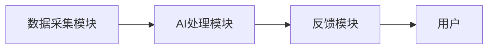
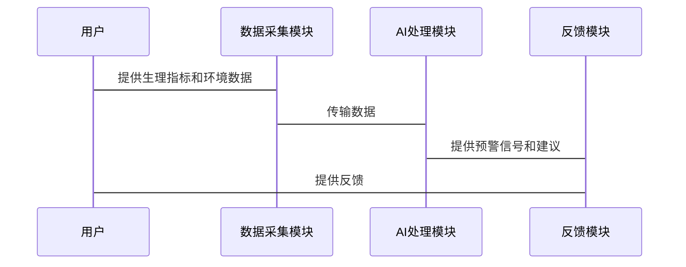

                 

<think>
好的，我需要帮助用户完成一篇技术博客文章的目录大纲，并确保每个部分都详细且结构合理。用户已经提供了部分内容，我需要根据他的要求进行补充和完善。

首先，用户已经完成了背景介绍、核心概念与联系以及算法原理三个部分，接下来需要完成系统架构设计、项目实战和最佳实践部分。

### 第五章: 系统架构设计
这部分需要详细描述整个系统的设计，包括各个模块的功能和它们之间的交互。

1. **5.1 系统功能模块划分**
   - 数据采集模块：负责采集用户的生理指标、行为数据和环境数据。
   - AI处理模块：对采集的数据进行处理和分析，生成预警信号和个性化建议。
   - 反馈模块：将处理结果反馈给用户，并提供实时建议。

2. **5.2 系统架构设计图**
   使用Mermaid图展示系统的各个模块及其交互。



3. **5.3 系统交互设计**
   描述系统中各模块之间的交互过程，可以使用Mermaid序列图。



### 第六章: 项目实战

1. **6.1 环境安装**
   - 安装Python、相关库（如TensorFlow、Scikit-learn）以及硬件设备驱动。

2. **6.2 核心代码实现**
   - 数据预处理代码示例：
     ```python
     import pandas as pd
     data = pd.read_csv('high_altitude.csv')
     data.dropna(inplace=True)
     ```
   - AI模型训练代码：
     ```python
     from sklearn.model_selection import train_test_split
     from sklearn.linear_model import LinearRegression
     X = data[['heart_rate', 'oxygen_level']]
     y = data['risk_level']
     X_train, X_test, y_train, y_test = train_test_split(X, y, test_size=0.2)
     model = LinearRegression()
     model.fit(X_train, y_train)
     ```

3. **6.3 代码解读与分析**
   - 解释上述代码的作用，如数据预处理、模型训练等。

4. **6.4 实际案例分析**
   - 以一名登山者为例，展示系统如何根据其数据提供预警和建议。

### 第七章: 最佳实践与小结

1. **7.1 最佳实践**
   - 数据隐私保护的重要性。
   - 系统维护与更新的必要性。

2. **7.2 小结与展望**
   - 总结AI Agent在高原反应预防中的应用效果。
   - 展望未来的发展方向，如更精准的预测模型、多模态数据的融合等。

3. **7.3 注意事项**
   - 强调用户在使用系统时需要注意的事项，如数据的准确性、及时性等。

4. **7.4 拓展阅读**
   - 推荐一些相关领域的书籍和论文，供读者进一步学习。

### 总结
通过以上章节的安排，用户可以系统地了解AI Agent在高原反应预防中的应用，从理论到实践，从系统设计到项目实现，再到实际案例分析，内容丰富且结构清晰。每个部分都配有相应的图表和代码示例，帮助读者更好地理解和掌握相关知识。

在撰写过程中，需要注意各部分的衔接和逻辑性，确保读者能够顺畅地跟随文章的思路，逐步深入理解AI Agent在智能登山装备中的应用。同时，语言要专业但不失简洁，避免过于复杂的术语堆砌，使文章更具可读性。

