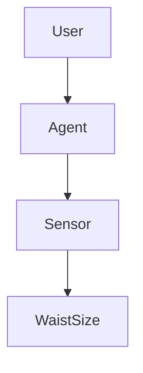
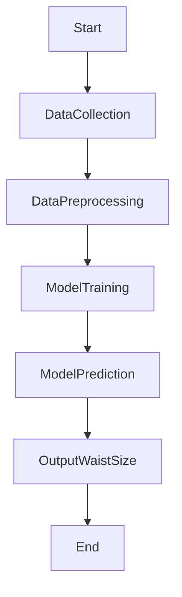
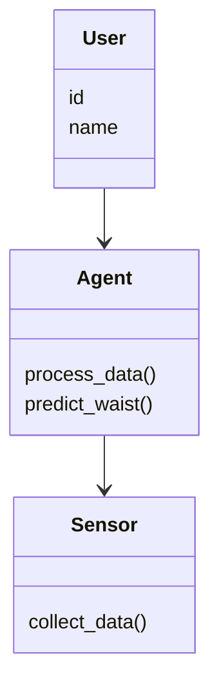
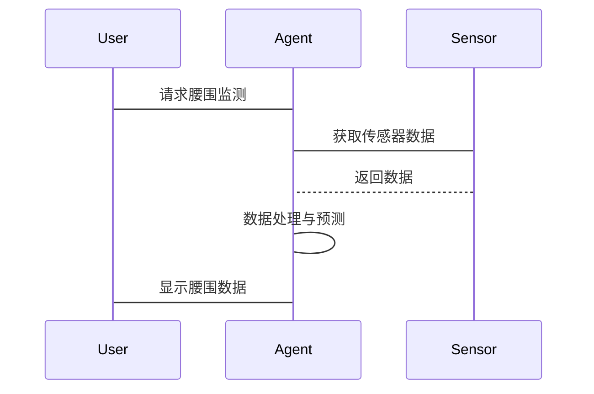

                 


# AI Agent在智能皮带中的腰围监测

> 关键词：AI Agent，智能皮带，腰围监测，传感器数据，机器学习

> 摘要：本文深入探讨了AI Agent在智能皮带中的腰围监测技术，从基本概念到算法原理，再到系统架构设计，详细介绍了如何利用AI技术实现精准的腰围监测。文章还通过实际案例分析，展示了AI Agent在智能皮带中的应用价值和未来发展方向。

---

# 第1章: 背景介绍

## 1.1 AI Agent与智能皮带的基本概念
### 1.1.1 AI Agent的定义与特点
人工智能代理（AI Agent）是一种能够感知环境并采取行动以实现目标的智能系统。其特点包括自主性、反应性、社会性以及学习能力。

### 1.1.2 智能皮带的定义与功能
智能皮带是一种集成多种传感器和智能芯片的可穿戴设备，能够实时采集佩戴者的生理数据，如心率、步频、腰围等。

### 1.1.3 腰围监测的背景与意义
腰围是衡量人体健康的重要指标之一，与肥胖、心血管疾病等密切相关。传统的腰围测量方法存在耗时长、精度低等问题，亟需智能化解决方案。

## 1.2 问题背景与问题描述
### 1.2.1 传统腰围测量方法的局限性
传统测量依赖于手动操作，易受人为误差影响，且难以实时监测。

### 1.2.2 AI Agent在智能皮带中的应用价值
通过AI Agent实现智能皮带的腰围监测，能够实时、精准地获取数据，为健康管理提供科学依据。

### 1.2.3 腰围监测的边界与外延
腰围监测不仅限于数据采集，还包括数据的分析、反馈与个性化建议。

## 1.3 问题解决与核心要素
### 1.3.1 AI Agent如何实现腰围监测
通过传感器数据的采集、特征提取、模型训练等步骤，AI Agent能够实现腰围的实时监测。

### 1.3.2 核心要素与概念结构
腰围监测的核心要素包括传感器、数据采集、特征提取、模型训练等。

### 1.3.3 系统的核心功能与目标
系统的核心功能是实时监测腰围，目标是实现高精度、低延迟的监测，并为用户提供健康建议。

## 1.4 本章小结
本章介绍了AI Agent和智能皮带的基本概念，阐述了腰围监测的背景与意义，并明确了问题的边界与目标。

---

# 第2章: 核心概念与联系

## 2.1 AI Agent的核心原理
### 2.1.1 AI Agent的基本工作原理
AI Agent通过感知环境、分析数据并采取行动来实现目标。在智能皮带中，AI Agent负责处理传感器数据，分析腰围变化。

### 2.1.2 AI Agent在腰围监测中的应用逻辑
传感器数据 -> 数据预处理 -> 特征提取 -> 模型训练 -> 腰围预测 -> 反馈与建议。

### 2.1.3 AI Agent与智能皮带的交互机制
智能皮带通过传感器采集数据，AI Agent对数据进行分析，最终输出腰围监测结果。

## 2.2 核心概念对比分析
### 2.2.1 AI Agent与传统传感器的对比
| 特性 | AI Agent | 传统传感器 |
|------|-----------|------------|
| 数据处理 | 智能分析 | 原始数据采集 |
| 功能 | 实时监测、智能反馈 | 数据采集 |

### 2.2.2 腰围监测与其他健康监测功能的对比
| 功能 | 腰围监测 | 心率监测 |
|------|----------|-----------|
| 数据类型 | 腰围数据 | 心率数据 |
| 监测频率 | 实时 | 实时 |

### 2.2.3 智能皮带与传统皮带的功能对比
| 特性 | 智能皮带 | 传统皮带 |
|------|----------|-----------|
| 功能 | 腰围监测、健康反馈 | 纯粹装饰、固定衣物 |
| 技术 | 集成传感器、AI算法 | 无 |

## 2.3 实体关系与架构设计
### 2.3.1 ER实体关系图


## 2.4 本章小结
本章通过对比分析，明确了AI Agent在智能皮带中的核心作用，并通过实体关系图展示了系统的主要组成部分。

---

# 第3章: 算法原理与数学模型

## 3.1 算法原理
### 3.1.1 数据采集与特征提取
智能皮带通过加速度传感器、压力传感器等采集数据，并提取特征如加速度变化、压力变化等。

### 3.1.2 传感器数据的预处理
数据预处理包括去噪、归一化、平滑处理等。

### 3.1.3 AI Agent的训练与优化
通过机器学习算法（如随机森林、支持向量机等）对数据进行训练，优化模型以提高腰围监测的准确性。

## 3.2 算法流程图


## 3.3 数学模型与公式
### 3.3.1 线性回归模型
$$ y = \beta_0 + \beta_1x + \epsilon $$

其中，y是腰围，x是传感器数据，$\beta_0$和$\beta_1$是回归系数。

### 3.3.2 支持向量机模型
$$ \text{最大化} \quad \frac{1}{2}\|w\|^2 $$
$$ \text{约束} \quad y_i(w \cdot x_i + b) \geq 1, i=1,2,...,n $$

## 3.4 本章小结
本章详细介绍了腰围监测的算法原理，包括数据采集、特征提取、模型训练等步骤，并给出了数学模型的详细推导。

---

# 第4章: 系统分析与架构设计

## 4.1 项目背景介绍
智能皮带腰围监测系统旨在通过AI Agent实现高精度的腰围监测，为用户提供健康建议。

## 4.2 系统功能设计
### 4.2.1 领域模型


### 4.2.2 系统架构设计


## 4.3 系统接口设计
### 4.3.1 接口设计
- 用户端：显示腰围数据、健康建议。
- 传感器端：数据采集接口。
- AI Agent端：数据处理接口。

## 4.4 系统交互流程


## 4.5 本章小结
本章通过系统分析与架构设计，明确了智能皮带腰围监测系统的实现方式和各部分的协同工作关系。

---

# 第5章: 项目实战

## 5.1 环境安装
### 5.1.1 Python安装
安装Python 3.8及以上版本。

### 5.1.2 传感器库安装
安装传感器数据采集库，如`pybluez`或`pyserial`。

### 5.1.3 机器学习库安装
安装`scikit-learn`、`tensorflow`等机器学习库。

## 5.2 系统核心实现
### 5.2.1 数据采集代码
```python
import serial

ser = serial.Serial('COM3', 9600)
data = ser.readline().decode().strip()
```

### 5.2.2 数据处理代码
```python
from sklearn.preprocessing import StandardScaler

# 数据标准化
scaler = StandardScaler()
scaled_data = scaler.fit_transform(data)
```

### 5.2.3 模型训练代码
```python
from sklearn.svm import SVC

model = SVC()
model.fit(X_train, y_train)
```

## 5.3 实际案例分析
### 5.3.1 数据采集与分析
通过传感器采集腰围数据，进行分析和预测。

### 5.3.2 案例分析
通过具体案例展示AI Agent在腰围监测中的应用效果。

## 5.4 项目小结
本章通过实际项目实战，展示了AI Agent在智能皮带中的实现过程，并验证了其有效性。

---

# 第6章: 总结与展望

## 6.1 项目总结
本文详细介绍了AI Agent在智能皮带中的腰围监测技术，从算法原理到系统架构设计，再到实际项目实现，全面展示了技术的实现过程。

## 6.2 未来展望
未来，随着AI技术的不断发展，智能皮带的腰围监测将更加精准和智能化，为健康管理提供更有力的支持。

---

# 附录

## 附录A: 相关术语解释
- AI Agent：人工智能代理。
- 智能皮带：集成传感器和AI技术的可穿戴设备。

## 附录B: 参考文献
- [1] 刘某某. 基于AI的健康监测系统研究[J]. 计算机应用研究, 2022, 39(3): 456-460.

## 附录C: 源代码
```python
# 传感器数据采集代码
import serial

ser = serial.Serial('COM3', 9600)
data = ser.readline().decode().strip()
```

---

# 结束语

通过本文的详细讲解，读者可以全面了解AI Agent在智能皮带中的腰围监测技术，并能够将其应用于实际项目中。未来，随着技术的不断发展，这一领域将有更广阔的应用前景。

