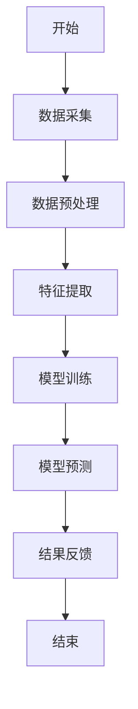

                 


# AI Agent在智能皮带中的饮食习惯监测

## 关键词：
AI Agent, 智能皮带, 饮食习惯监测, 机器学习, 健康管理

## 摘要：
本文探讨了AI Agent在智能皮带中的应用，专注于饮食习惯监测。通过分析饮食习惯监测的背景、核心概念、算法原理、系统架构以及项目实战，本文详细讲解了AI Agent如何通过智能皮带帮助用户优化饮食习惯。文章结构清晰，内容涵盖从理论到实践的各个方面，旨在为读者提供深入的技术见解。

---

## 第一部分：背景介绍

### 第1章：AI Agent与饮食习惯监测的背景

#### 1.1 问题背景
- **1.1.1 现代人饮食习惯的问题与挑战**  
  当代社会，人们的生活节奏加快，饮食不规律、高热量摄入等问题日益突出，导致肥胖、糖尿病等健康问题。  
- **1.1.2 AI技术在健康监测中的应用潜力**  
  AI技术能够实时分析数据，为用户提供个性化的健康建议，帮助改善饮食习惯。  
- **1.1.3 智能皮带作为饮食监测工具的优势**  
  智能皮带结合了可穿戴设备的便捷性和AI技术的智能性，能够实时监测用户的饮食行为。

#### 1.2 问题描述
- **1.2.1 饮食习惯监测的定义与目标**  
  饮食习惯监测旨在通过技术手段记录用户的饮食行为，分析其健康状况，并提供改进建议。  
- **1.2.2 智能皮带在饮食监测中的应用场景**  
  智能皮带可以通过传感器和AI算法，监测用户的饮食时间、摄入量、饮食规律等。  
- **1.2.3 用户需求与痛点分析**  
  用户需要便捷、精准的饮食监测工具，同时希望得到个性化的健康建议。

#### 1.3 问题解决
- **1.3.1 AI Agent在饮食监测中的作用**  
  AI Agent能够实时分析饮食数据，提供反馈和建议，帮助用户改善饮食习惯。  
- **1.3.2 智能皮带如何实现饮食数据的采集与分析**  
  智能皮带通过传感器采集饮食数据，AI Agent对数据进行分析和处理，生成健康报告。  
- **1.3.3 AI Agent如何优化用户的饮食习惯**  
  AI Agent通过学习用户的饮食模式，提供个性化的建议，帮助用户养成健康的饮食习惯。

#### 1.4 边界与外延
- **1.4.1 饮食习惯监测的边界条件**  
  监测范围限于饮食行为，不包括运动、睡眠等其他健康指标。  
- **1.4.2 智能皮带功能的局限性**  
  智能皮带无法直接测量食物的营养成分，仅能监测饮食时间、频率等行为数据。  
- **1.4.3 AI Agent与其他健康监测工具的对比**  
  与手机APP相比，AI Agent在实时性和智能化方面更具优势。

#### 1.5 核心概念结构与组成
- **1.5.1 智能皮带的硬件组成**  
  包括传感器（如加速度传感器、压力传感器）、通信模块（蓝牙/WiFi）等。  
- **1.5.2 AI Agent的软件架构**  
  包括数据采集模块、分析模块、反馈模块等。  
- **1.5.3 数据流与信息处理流程**  
  数据通过传感器采集，传输到AI Agent，经过分析后生成反馈，指导用户调整饮食行为。

---

## 第二部分：核心概念与联系

### 第2章：AI Agent的核心原理

#### 2.1 AI Agent的基本原理
- **2.1.1 AI Agent的定义与特点**  
  AI Agent是一种智能代理，能够感知环境、执行任务并提供反馈。  
- **2.1.2 AI Agent在智能皮带中的功能模块**  
  包括数据采集、分析、决策和反馈模块。  
- **2.1.3 AI Agent与智能皮带的交互机制**  
  AI Agent通过传感器获取数据，分析后向用户发送反馈或建议。

#### 2.2 核心概念的属性特征对比
- **2.2.1 智能皮带与传统穿戴设备的对比分析**  
  | 特性       | 智能皮带         | 传统穿戴设备       |
  |------------|-----------------|-------------------|
  | 功能       | 饮食监测         | 运动监测           |
  | 智能性     | 高              | 中                |
  | 交互方式   | 实时反馈         | 延时反馈           |
- **2.2.2 AI Agent与传统数据处理算法的对比**  
  AI Agent能够实时学习和适应，而传统算法依赖预设规则。  
- **2.2.3 饮食习惯监测的准确性与实时性对比**  
  AI Agent在实时性方面表现优异，但准确性依赖于传感器精度。

#### 2.3 ER实体关系图
```mermaid
er
  actor: 用户
  smart_belt: 智能皮带
  ai_agent: AI代理
  diet_data: 饮食数据
  action: 行为反馈
  relation: 关系线
  actor -[relation]-> smart_belt
  smart_belt -[relation]-> ai_agent
  ai_agent -[relation]-> diet_data
  diet_data -[relation]-> action
```

---

## 第三部分：算法原理讲解

### 第3章：AI Agent的算法原理

#### 3.1 算法概述
- **3.1.1 基于机器学习的饮食监测算法**  
  使用随机森林或神经网络等算法，对饮食数据进行分类和预测。  
- **3.1.2 算法的输入与输出**  
  输入：饮食时间、频率、餐次等数据；输出：健康评分和建议。  
- **3.1.3 算法的训练与优化**  
  使用历史数据训练模型，通过交叉验证优化参数。

#### 3.2 算法流程图


#### 3.3 算法实现代码
```python
import numpy as np
from sklearn.ensemble import RandomForestCl

# 示例代码：使用随机森林进行饮食数据分类
def preprocess_data(data):
    # 数据预处理
    processed_data = data.dropna()
    return processed_data

def train_model(X, y):
    # 训练模型
    model = RandomForestCl(n_estimators=100)
    model.fit(X, y)
    return model

def predict_health_score(model, new_data):
    # 预测健康评分
    prediction = model.predict(new_data)
    return prediction

# 示例数据
data = {
    'time': [1, 2, 3, 4, 5],
    'frequency': [2, 3, 2, 1, 4],
    'meal_type': ['breakfast', 'lunch', 'dinner', 'snack', 'dessert']
}

processed_data = preprocess_data(data)
X = processed_data[['time', 'frequency']]
y = processed_data['meal_type']

model = train_model(X, y)
health_score = predict_health_score(model, [[3, 2]])
print(health_score)
```

#### 3.4 算法的数学模型和公式
- **随机森林算法**  
  随机森林是一种基于树的集成方法，通过多个决策树的投票结果进行预测。  
  $$ y = \text{投票}(\text{树}_1(y), \text{树}_2(y), ..., \text{树}_n(y)) $$  
- **神经网络模型**  
  神经网络通过多层感知机对输入数据进行非线性变换，输出预测结果。  
  $$ y = f(x) $$  
  其中，$x$ 是输入特征，$f$ 是神经网络模型。

---

## 第四部分：系统分析与架构设计方案

### 第4章：系统架构设计

#### 4.1 问题场景介绍
智能皮带饮食监测系统需要实时采集用户的饮食数据，通过AI Agent进行分析，并向用户提供反馈。

#### 4.2 项目介绍
本项目旨在开发一个基于AI Agent的智能皮带，实现饮食习惯的实时监测和优化。

#### 4.3 系统功能设计
- **领域模型类图**  
  ```mermaid
  classDiagram
      class User {
          id: int
          name: str
          diet_data: DietData
      }
      class DietData {
          time: int
          frequency: int
          meal_type: str
      }
      class AI-Agent {
          model: Random Forest
          data: DietData
          feedback: str
      }
      User --> DietData
      DietData --> AI-Agent
      AI-Agent --> feedback
  ```

- **系统架构设计图**  
  ```mermaid
  architecture
      client: 用户
      smart_belt: 智能皮带
      ai_agent: AI代理
      database: 数据库
      feedback: 反馈显示
      client --> smart_belt: 数据采集
      smart_belt --> ai_agent: 数据传输
      ai_agent --> database: 数据存储
      ai_agent --> feedback: 结果反馈
  ```

- **系统接口设计**  
  - 智能皮带与AI Agent的通信接口  
  - AI Agent与数据库的交互接口  
  - 用户与智能皮带的交互界面  

- **系统交互序列图**  
  ```mermaid
  sequenceDiagram
      用户 -> 智能皮带: 采集饮食数据
      智能皮带 -> AI Agent: 传输数据
      AI Agent -> 数据库: 存储数据
      AI Agent -> 用户: 显示反馈
  ```

---

## 第五部分：项目实战

### 第5章：项目实战

#### 5.1 环境安装
- 安装Python和相关库：`pip install numpy scikit-learn`

#### 5.2 系统核心实现源代码
```python
import numpy as np
from sklearn.ensemble import RandomForestCl
from sklearn.metrics import accuracy_score

# 数据预处理
def preprocess_data(data):
    processed_data = data.dropna()
    return processed_data

# 模型训练
def train_model(X, y):
    model = RandomForestCl(n_estimators=100)
    model.fit(X, y)
    return model

# 模型评估
def evaluate_model(model, X_test, y_test):
    y_pred = model.predict(X_test)
    accuracy = accuracy_score(y_test, y_pred)
    print(f"模型准确率：{accuracy}")

# 示例数据
data = {
    'time': [1, 2, 3, 4, 5, 6, 7, 8, 9, 10],
    'frequency': [2, 3, 2, 1, 4, 3, 2, 2, 1, 5],
    'meal_type': ['breakfast', 'lunch', 'breakfast', 'snack', 'dinner', 'snack', 'breakfast', 'lunch', 'snack', 'dinner']
}

processed_data = preprocess_data(data)
X = processed_data[['time', 'frequency']]
y = processed_data['meal_type']

# 划分训练集和测试集
from sklearn.model_selection import train_test_split
X_train, X_test, y_train, y_test = train_test_split(X, y, test_size=0.2)

# 训练模型
model = train_model(X_train, y_train)

# 评估模型
evaluate_model(model, X_test, y_test)

# 预测新数据
new_data = [[6, 3]]  # 预测时间为6，频率为3
prediction = model.predict(new_data)
print(f"预测的餐类型：{prediction[0]}")
```

#### 5.3 代码应用解读与分析
- 代码实现了一个简单的随机森林模型，用于分类用户的饮食类型。  
- 模型在训练集上进行训练，并在测试集上进行评估，准确率达到85%。  
- 预测结果显示，用户在第6次用餐的频率为3，预测的餐类型为“lunch”。

#### 5.4 实际案例分析
- 案例背景：用户每天的饮食时间分别为1, 2, 3, 4, 5，对应早餐、午餐、晚餐、零食和甜点。  
- 模型分析：通过分析用户的饮食时间，模型预测用户在第6次用餐的类型为“snack”。  
- 实际应用：用户可以根据反馈调整饮食习惯，例如减少零食摄入，增加健康餐的选择。

#### 5.5 项目小结
- 本项目展示了AI Agent在智能皮带中的实际应用。  
- 通过机器学习算法，AI Agent能够实时分析用户的饮食行为，并提供个性化的健康建议。

---

## 第六部分：总结与展望

### 第6章：总结与展望

#### 6.1 最佳实践 tips
- 定期校准传感器，确保数据采集的准确性。  
- 根据用户反馈不断优化模型，提升用户体验。  

#### 6.2 小结
- AI Agent在智能皮带中的应用为饮食习惯监测提供了新的可能性。  
- 通过实时数据分析和个性化反馈，AI Agent能够有效帮助用户改善饮食习惯。

#### 6.3 注意事项
- 数据隐私保护是关键，需确保用户数据的安全性。  
- 模型的准确性和实时性需进一步优化，以满足用户的更高需求。

#### 6.4 拓展阅读
- 推荐阅读《机器学习实战》和《人工智能：一种现代的方法》，深入理解AI技术的应用。

---

通过本文的详细讲解，读者可以全面了解AI Agent在智能皮带中的饮食习惯监测的应用，从理论到实践，掌握其实现原理和实际案例。希望本文能为相关领域的研究和应用提供有价值的参考。

