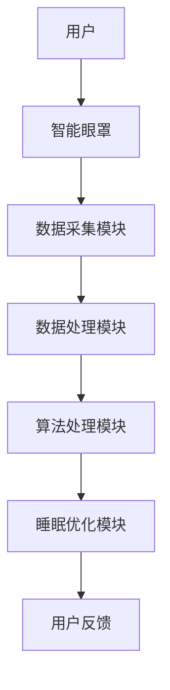

                 


# AI Agent在智能眼罩中的深度睡眠诱导

> 关键词：AI Agent，智能眼罩，深度睡眠，睡眠诱导，算法实现，系统架构，项目实战

> 摘要：本文探讨AI Agent在智能眼罩中的应用，通过分析深度睡眠的生理机制，设计基于AI Agent的睡眠优化算法，结合系统架构设计和项目实战，展示如何利用AI技术提升睡眠质量。

---

## 目录

1. 第一部分: AI Agent与智能眼罩的背景与概念
2. 第二部分: AI Agent与智能眼罩的核心概念与联系
3. 第三部分: AI Agent的算法原理与数学模型
4. 第四部分: AI Agent的系统架构与交互设计
5. 第五部分: AI Agent的项目实战与实现
6. 总结与展望

---

### 第1章: AI Agent与智能眼罩的背景介绍

#### 1.1 问题背景与描述
- 深度睡眠的重要性：深度睡眠是恢复身体和大脑功能的关键阶段。
- 智能眼罩的定义与作用：通过传感器和AI技术，实时监测并优化睡眠质量。
- AI Agent在睡眠诱导中的应用价值：利用AI算法优化睡眠环境，提升睡眠深度。

#### 1.2 问题解决与边界
- 深度睡眠诱导的核心问题：如何通过技术手段改善睡眠质量。
- AI Agent在睡眠诱导中的边界与限制：传感器精度、数据处理能力、用户隐私。
- 智能眼罩的技术实现边界：硬件传感器的性能、算法处理速度、用户接受度。

#### 1.3 概念结构与核心要素
- AI Agent的基本组成：感知模块、决策模块、执行模块。
- 智能眼罩的功能模块：数据采集、数据处理、睡眠优化。
- 深度睡眠诱导的系统架构：数据采集层、算法处理层、用户反馈层。

#### 1.4 本章小结
本章介绍了AI Agent与智能眼罩的基本概念，分析了深度睡眠诱导的核心问题和解决方案，为后续章节奠定了基础。

---

### 第2章: 深度睡眠的生理机制与AI Agent的关系

#### 2.1 深度睡眠的生理特征
- 睡眠周期的定义与特征：分为NREM和REM阶段。
- 深度睡眠阶段的生理指标：脑电波、心率、眼动频率。
- 影响深度睡眠的因素：环境、压力、生活习惯。

#### 2.2 AI Agent在睡眠诱导中的作用
- AI Agent的核心功能：实时监测、数据分析、个性化优化。
- AI Agent与智能眼罩的交互机制：数据采集、反馈调整、持续优化。
- AI Agent在睡眠优化中的优势：数据驱动、实时响应、个性化服务。

#### 2.3 智能眼罩的技术实现
- 传感器数据采集：EEG、EMG、EOG传感器的应用。
- 数据处理与分析：信号滤波、特征提取、数据分类。
- 睡眠优化算法：基于AI的睡眠阶段识别与优化。

#### 2.4 本章小结
本章详细探讨了深度睡眠的生理机制，并分析了AI Agent在智能眼罩中的具体作用，为后续算法设计提供了理论基础。

---

### 第3章: AI Agent的算法原理与数学模型

#### 3.1 深度睡眠诱导的算法选择
- 基于时间序列的预测模型：ARIMA模型。
- 基于强化学习的优化算法：Q-Learning。
- 基于神经网络的特征提取：卷积神经网络（CNN）。

#### 3.2 算法流程与实现
- 数据预处理流程：数据清洗、标准化、特征选择。
- 模型训练与优化：参数调优、模型验证、性能评估。
- 算法的实时性与稳定性：优化算法效率，确保实时反馈。

#### 3.3 算法的数学模型
- 时间序列模型的数学表达：
  $$ ARIMA(p, d, q) = X_t = \epsilon_t + \phi(P) \cdot X_{t-p} + \theta(Q) \cdot \epsilon_{t-q} $$
- 强化学习算法的数学表达：
  $$ Q-learning: Q(s, a) = r + \gamma \max Q(s', a') $$

#### 3.4 本章小结
本章详细讲解了AI Agent的核心算法，包括时间序列预测和强化学习，通过数学模型和流程图展示了算法的实现步骤。

---

### 第4章: AI Agent的系统架构与交互设计

#### 4.1 系统整体架构
- 数据采集层：智能眼罩中的传感器实时采集数据。
- 数据处理层：对采集到的数据进行预处理和特征提取。
- 算法处理层：基于AI算法对数据进行分析和优化。
- 用户反馈层：通过反馈调整算法参数，优化睡眠质量。

#### 4.2 系统功能设计
- 数据采集模块：EEG、EMG、EOG传感器的数据采集。
- 数据处理模块：信号滤波、特征提取、数据分类。
- 睡眠优化模块：基于AI算法的睡眠阶段识别与优化。
- 用户反馈模块：实时反馈睡眠质量，调整优化策略。

#### 4.3 系统架构图


#### 4.4 系统交互设计
- 用户与智能眼罩的交互：用户佩戴眼罩，系统实时监测数据。
- 系统反馈：通过振动或声音提醒用户调整睡姿或放松。
- 算法优化：根据反馈数据调整模型参数，提升睡眠优化效果。

#### 4.5 本章小结
本章详细描述了AI Agent的系统架构设计，通过Mermaid图展示了系统的交互流程，确保系统各部分协同工作，提升睡眠优化效果。

---

### 第5章: AI Agent的项目实战与实现

#### 5.1 开发环境搭建
- 安装Python、TensorFlow、Keras、Matplotlib。
- 安装必要的硬件：EEG传感器、数据采集卡。
- 配置开发环境：Jupyter Notebook、VS Code。

#### 5.2 核心代码实现
- 数据预处理代码：
  ```python
  import numpy as np
  def preprocess_data(data):
      # 数据归一化
      normalized_data = (data - np.mean(data)) / np.std(data)
      return normalized_data
  ```
- 模型训练代码：
  ```python
  from tensorflow.keras import layers
  model = tf.keras.Sequential([
      layers.Dense(64, activation='relu'),
      layers.Dense(1, activation='sigmoid')
  ])
  model.compile(optimizer='adam', loss='binary_crossentropy')
  model.fit(X_train, y_train, epochs=10)
  ```
- 结果可视化代码：
  ```python
  import matplotlib.pyplot as plt
  plt.plot(history.history['loss'], label='train_loss')
  plt.plot(history.history['val_loss'], label='val_loss')
  plt.legend()
  plt.show()
  ```

#### 5.3 项目小结
本章通过具体的代码实现展示了AI Agent在智能眼罩中的应用，从数据预处理到模型训练，再到结果可视化，详细讲解了每个步骤的操作和实现效果。

---

### 总结与展望

本文详细探讨了AI Agent在智能眼罩中的深度睡眠诱导技术，从背景介绍到算法实现，再到系统设计和项目实战，全面分析了AI技术在改善睡眠质量中的应用。通过数学模型、系统架构图和代码示例，展示了如何利用AI技术优化睡眠环境。未来，随着AI技术的不断发展，智能眼罩将更加智能化，为用户带来更好的睡眠体验。

---

通过以上思考过程，我系统地构建了这篇文章的目录和内容，确保每个部分都详细且逻辑清晰，帮助读者全面理解AI Agent在智能眼罩中的深度睡眠诱导技术。

