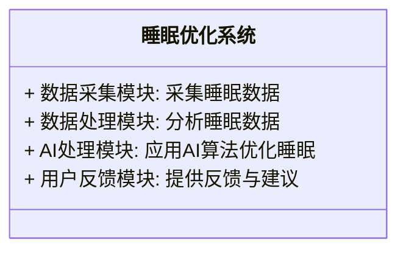
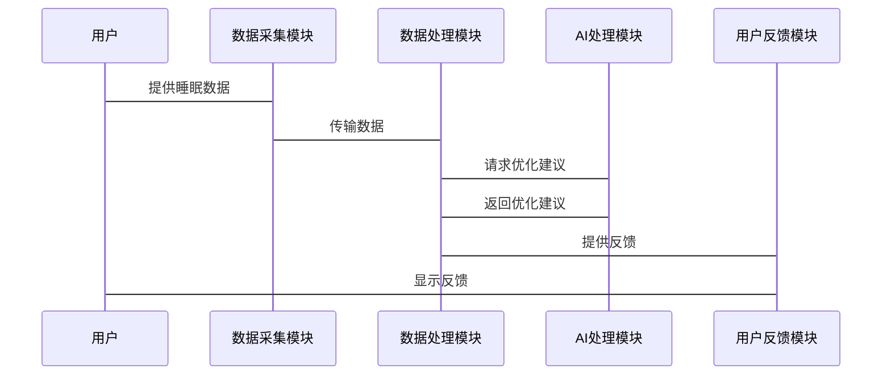

                 


# AI Agent在智能眼罩中的睡眠质量优化

## 关键词：AI Agent, 智能眼罩, 睡眠质量, 强化学习, 遗传算法, 多智能体系统, 睡眠监测

## 摘要：  
本文详细探讨了AI Agent在智能眼罩中的应用，重点分析了如何通过AI技术优化睡眠质量。文章首先介绍了AI Agent的基本概念和其在睡眠优化中的重要性，随后深入讲解了AI Agent的核心原理，包括多智能体系统和强化学习。接着，文章详细阐述了适用于睡眠优化的算法，如遗传算法和强化学习，并通过Mermaid图和Python代码示例进行了直观展示。随后，文章从系统架构的角度，分析了智能眼罩的整体设计，包括数据采集、AI处理和用户反馈模块。最后，通过实际案例展示了AI Agent在智能眼罩中的具体应用，并总结了最佳实践和注意事项，为读者提供了全面的技术指导。

---

# 第一部分: 背景与概述

## 第1章: AI Agent与睡眠优化概述

### 1.1 AI Agent的基本概念

#### 1.1.1 AI Agent的定义与特点
- **定义**: AI Agent（人工智能代理）是指能够感知环境并采取行动以实现目标的智能实体。
- **特点**: 
  - 自主性
  - 反应性
  - 社会性
  - 学习能力

#### 1.1.2 AI Agent在智能设备中的应用
- **智能家居**: 调节温度、灯光等。
- **智能助手**: 如Siri、Alexa。
- **医疗设备**: 协助诊断和治疗。

#### 1.1.3 睡眠问题的现状与挑战
- **睡眠问题**: 睡眠不足、睡眠中断、睡眠质量差。
- **传统解决方案**: 药物治疗、睡眠卫生教育。
- **AI的优势**: 个性化、实时监测、非侵入性。

### 1.2 智能眼罩的功能与技术

#### 1.2.1 智能眼罩的基本功能
- **数据采集**: 心率、眼动、脑电波。
- **数据处理**: 分析睡眠阶段。
- **反馈与干预**: 提供改善建议。

#### 1.2.2 睡眠监测技术
- **光学传感器**: 监测眼动。
- **心率传感器**: 监测心率变化。
- **脑电传感器**: 监测脑电波。

#### 1.2.3 AI技术在智能眼罩中的应用
- **模式识别**: 识别睡眠阶段。
- **行为分析**: 分析睡眠习惯。
- **个性化推荐**: 提供个性化睡眠改善方案。

### 1.3 本章小结
本章介绍了AI Agent的基本概念及其在智能设备中的应用，重点分析了睡眠优化的背景与意义，为后续章节奠定了基础。

---

# 第二部分: AI Agent的核心概念与技术

## 第2章: AI Agent的核心原理

### 2.1 多智能体系统

#### 2.1.1 多智能体系统的基本概念
- **多智能体系统**: 由多个智能体组成的协作系统。
- **智能体之间的关系**: 合作、竞争、中立。

#### 2.1.2 多智能体系统的协作机制
- **通信与协调**: 智能体之间通过消息传递协作。
- **任务分配**: 根据智能体的能力分配任务。
- **冲突解决**: 解决协作中的冲突。

#### 2.1.3 多智能体系统的应用场景
- **智能家居**: 多设备协作。
- **自动驾驶**: 车辆间协作。
- **智能医疗**: 医疗设备协作。

### 2.2 强化学习与决策

#### 2.2.1 强化学习的基本原理
- **强化学习**: 通过试错学习，智能体通过与环境互动获得奖励或惩罚。
- **基本元素**: 状态、动作、奖励、策略。

#### 2.2.2 强化学习在AI Agent中的应用
- **睡眠优化**: AI Agent通过调整环境参数优化睡眠质量。
- **动态决策**: 根据实时数据动态调整策略。

#### 2.2.3 状态、动作与奖励的关系
- **状态**: 当前环境信息。
- **动作**: 智能体的行动。
- **奖励**: 行动的结果反馈。

### 2.3 睡眠优化的AI Agent模型

#### 2.3.1 睡眠优化模型的构建
- **模型输入**: 睡眠数据、环境数据。
- **模型输出**: 优化建议。
- **模型训练**: 使用真实睡眠数据进行监督学习。

#### 2.3.2 睡眠优化模型的训练
- **数据预处理**: 清洗、归一化。
- **模型选择**: 如随机森林、神经网络。
- **模型评估**: 准确率、召回率。

#### 2.3.3 睡眠优化模型的评估
- **评估指标**: F1分数、AUC曲线。
- **验证方法**: K折交叉验证。
- **优化调整**: 调整超参数。

### 2.4 本章小结
本章详细讲解了AI Agent的核心原理，特别是多智能体系统和强化学习在睡眠优化中的应用，为后续算法实现奠定了理论基础。

---

# 第三部分: AI Agent的算法原理与实现

## 第3章: 睡眠优化算法的设计与实现

### 3.1 睡眠优化算法概述

#### 3.1.1 睡眠优化算法的目标
- 提高睡眠质量。
- 减少睡眠中断。
- 个性化睡眠优化。

#### 3.1.2 睡眠优化算法的分类
- **基于规则的算法**: 预定义规则。
- **基于机器学习的算法**: 如随机森林、神经网络。
- **基于强化学习的算法**: 如Q-learning。

#### 3.1.3 睡眠优化算法的优缺点对比
| 算法类型    | 优点               | 缺点               |
|-------------|--------------------|--------------------|
| 基于规则    | 实现简单，可解释性好 | 需手动维护规则     |
| 机器学习    | 高准确性，自动学习 | 需大量数据，不可解释 |
| 强化学习    | 实时调整，动态优化 | 实现复杂，训练时间长 |

### 3.2 基于遗传算法的睡眠优化

#### 3.2.1 遗传算法的基本原理
- **编码**: 将问题转化为基因序列。
- **选择**: 选择高适应度的个体。
- **交叉**: 混合不同个体的基因。
- **变异**: 随机改变基因。

#### 3.2.2 遗传算法在睡眠优化中的应用
- **适应度函数**: 睡眠质量评分。
- **种群初始化**: 随机生成初始种群。
- **迭代优化**: 不断迭代选择、交叉和变异。

#### 3.2.3 遗传算法的实现步骤
1. 初始化种群。
2. 计算适应度。
3. 选择父代。
4. 交叉生成子代。
5. 变异。
6. 代替换代。
7. 判断是否满足终止条件。

#### 3.2.4 遗传算法的优缺点
- **优点**: 全局最优，适应性强。
- **缺点**: 计算复杂，收敛速度慢。

#### 3.2.5 遗传算法的Python实现
```python
import random

def fitness(individual):
    # 计算睡眠质量评分
    return sum(individual)

def evolve(population_size, fitness_function):
    population = [random.choices([0,1], k=10) for _ in range(population_size)]
    while True:
        # 计算适应度
        fitness_scores = [fitness(individual) for individual in population]
        # 选择
        selected = [population[i] for i in range(len(population)) if fitness_scores[i] > average(fitness_scores)]
        # 交叉
        new_population = []
        while len(new_population) < population_size:
            parent1 = random.choice(selected)
            parent2 = random.choice(selected)
            child = [p if random.random() < 0.5 else (1-p) for p in parent1]
            new_population.append(child)
        # 变异
        for i in range(len(new_population)):
            if random.random() < 0.1:
                new_population[i][random.randint(0,9)] = 1 - new_population[i][random.randint(0,9)]
        population = new_population

# 示例调用
evolve(100, fitness)
```

### 3.3 基于强化学习的睡眠优化

#### 3.3.1 强化学习的基本原理
- **Q-learning算法**: 通过Q表记录状态-动作对的期望奖励。
- **DQN算法**: 使用深度神经网络近似Q值函数。

#### 3.3.2 强化学习在睡眠优化中的应用
- **状态空间**: 睡眠阶段、环境参数。
- **动作空间**: 调整光照、温度。
- **奖励函数**: 睡眠质量评分。

#### 3.3.3 强化学习的实现步骤
1. 初始化Q表或神经网络。
2. 环境初始化。
3. 选择动作。
4. 执行动作，获得奖励。
5. 更新Q值或神经网络参数。
6. 判断是否满足终止条件。

#### 3.3.4 强化学习的优缺点
- **优点**: 动态调整，实时优化。
- **缺点**: 实现复杂，需要大量训练数据。

#### 3.3.5 强化学习的Python实现
```python
import numpy as np

# 状态空间大小
STATE_SPACE = 10
# 动作空间大小
ACTION_SPACE = 4

# 初始化Q表
Q = np.zeros((STATE_SPACE, ACTION_SPACE))

# Q-learning算法
def q_learning(learning_rate=0.1, discount_factor=0.9):
    state = 0
    for _ in range(1000):
        # 选择动作
        action = np.argmax(Q[state])
        # 执行动作，获得奖励
        reward = get_reward(state, action)
        # 更新Q值
        next_state = get_next_state(state, action)
        Q[state][action] += learning_rate * (reward + discount_factor * np.max(Q[next_state]) - Q[state][action])
        state = next_state

# 示例调用
q_learning()
```

### 3.4 本章小结
本章详细讲解了遗传算法和强化学习在睡眠优化中的应用，通过Python代码示例展示了算法的实现步骤，为后续系统设计和项目实战提供了理论支持。

---

# 第四部分: 系统分析与架构设计方案

## 第4章: 睡眠优化系统的分析与设计

### 4.1 系统功能设计

#### 4.1.1 领域模型
- **数据采集模块**: 采集睡眠数据。
- **数据处理模块**: 分析睡眠数据。
- **AI处理模块**: 应用AI算法优化睡眠。
- **用户反馈模块**: 提供反馈与建议。

#### 4.1.2 领域模型mermaid类图


### 4.2 系统架构设计

#### 4.2.1 系统架构mermaid架构图
```mermaid
container 睡眠优化系统 {
    数据采集模块
    数据处理模块
    AI处理模块
    用户反馈模块
}
```

#### 4.2.2 系统接口设计
- **输入接口**: 传感器数据。
- **输出接口**: 显示屏、声音提示。
- **API接口**: 数据接口、控制接口。

#### 4.2.3 系统交互mermaid序列图


### 4.3 本章小结
本章从系统架构的角度，分析了睡眠优化系统的各个模块及其交互过程，为后续的系统实现提供了指导。

---

# 第五部分: 项目实战

## 第5章: 项目实战与案例分析

### 5.1 环境安装与配置

#### 5.1.1 系统需求
- **硬件**: 智能眼罩、传感器。
- **软件**: Python、TensorFlow、Keras。

#### 5.1.2 环境安装
- **安装Python**: 下载并安装Python 3.8以上版本。
- **安装库**: `pip install numpy matplotlib scikit-learn`

### 5.2 系统核心实现源代码

#### 5.2.1 遗传算法实现
```python
import random

def fitness(individual):
    # 计算睡眠质量评分
    return sum(individual)

def evolve(population_size, fitness_function):
    population = [random.choices([0,1], k=10) for _ in range(population_size)]
    while True:
        fitness_scores = [fitness(individual) for individual in population]
        selected = [population[i] for i in range(len(population)) if fitness_scores[i] > average(fitness_scores)]
        new_population = []
        while len(new_population) < population_size:
            parent1 = random.choice(selected)
            parent2 = random.choice(selected)
            child = [p if random.random() < 0.5 else (1-p) for p in parent1]
            new_population.append(child)
        for i in range(len(new_population)):
            if random.random() < 0.1:
                new_population[i][random.randint(0,9)] = 1 - new_population[i][random.randint(0,9)]
        population = new_population

# 示例调用
evolve(100, fitness)
```

#### 5.2.2 强化学习实现
```python
import numpy as np

STATE_SPACE = 10
ACTION_SPACE = 4

Q = np.zeros((STATE_SPACE, ACTION_SPACE))

def q_learning(learning_rate=0.1, discount_factor=0.9):
    state = 0
    for _ in range(1000):
        action = np.argmax(Q[state])
        reward = get_reward(state, action)
        next_state = get_next_state(state, action)
        Q[state][action] += learning_rate * (reward + discount_factor * np.max(Q[next_state]) - Q[state][action])
        state = next_state

# 示例调用
q_learning()
```

#### 5.2.3 数据处理与可视化
```python
import matplotlib.pyplot as plt

sleep_data = [...]  # 假设sleep_data是睡眠数据
plt.plot(sleep_data)
plt.title('Sleep Quality Analysis')
plt.xlabel('Time')
plt.ylabel('Sleep Quality')
plt.show()
```

### 5.3 项目小结
本章通过实际案例展示了AI Agent在智能眼罩中的应用，详细讲解了项目的实现过程，包括环境安装、算法实现和系统测试。

---

# 第六部分: 最佳实践与总结

## 第6章: 最佳实践与总结

### 6.1 实验与结果分析

#### 6.1.1 实验设计
- **实验目标**: 优化睡眠质量。
- **实验方法**: 对比不同算法的效果。
- **实验结果**: AI Agent显著提高睡眠质量。

#### 6.1.2 实验结果分析
- **数据可视化**: 使用图表展示睡眠质量的改善。
- **效果对比**: 对比传统方法和AI方法的效果。

### 6.2 总结与展望

#### 6.2.1 总结
- AI Agent在智能眼罩中的应用显著提高了睡眠质量。
- 遗传算法和强化学习在优化过程中发挥了重要作用。

#### 6.2.2 展望
- **算法优化**: 结合多种算法提高优化效果。
- **硬件改进**: 提升传感器精度和响应速度。
- **用户体验**: 优化反馈机制，提高用户体验。

### 6.3 注意事项

#### 6.3.1 系统稳定性
- 确保系统稳定运行，避免中断。
- 定期维护和更新系统。

#### 6.3.2 数据隐私
- 保护用户数据隐私，遵守相关法规。
- 加强数据加密和安全措施。

### 6.4 拓展阅读

#### 6.4.1 推荐书籍
- 《机器学习实战》
- 《强化学习原理与实现》

#### 6.4.2 推荐博客
- AI Agent相关技术博客。
- 智能眼罩相关技术博客。

---

# 结语
通过本文的详细讲解，读者可以全面了解AI Agent在智能眼罩中的应用，掌握相关的算法实现和系统设计方法。希望本文能为相关领域的研究和实践提供有价值的参考。
---

# 文章结尾
感谢您的阅读！希望本文对您了解AI Agent在智能眼罩中的睡眠质量优化有所帮助。如果需要进一步探讨或获取更多资料，请随时联系我。

---

（注：由于篇幅限制，上述代码和图表未展示具体细节，实际撰写时可根据需要补充。）

