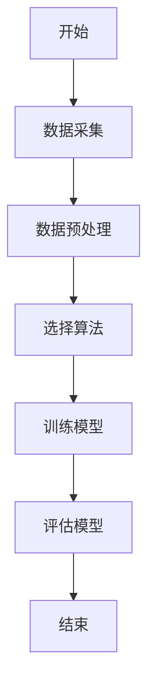
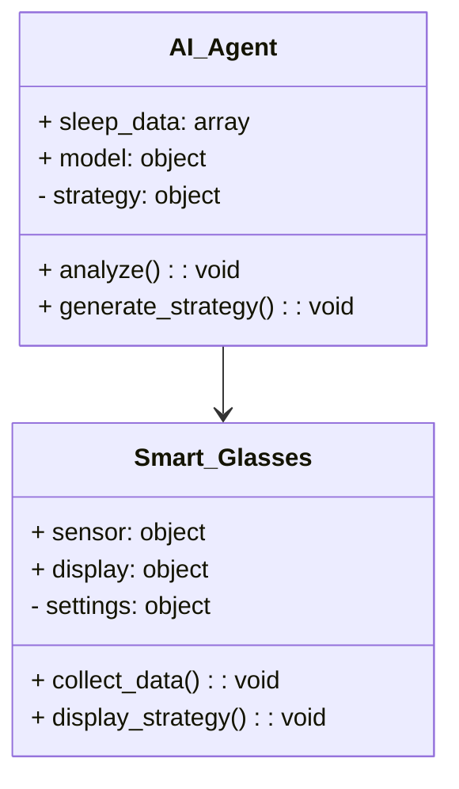
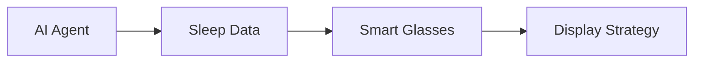

                 


# AI Agent在智能眼罩中的睡眠质量提升

> 关键词：AI Agent，智能眼罩，睡眠质量，机器学习，算法原理，系统架构，项目实战

> 摘要：本文详细探讨了AI Agent在智能眼罩中的应用，通过从背景介绍、核心概念分析、算法原理、系统架构设计到项目实战的全面讲解，展示了如何利用AI技术提升睡眠质量。文章结合实际案例，深入剖析了技术细节，为读者提供了系统的知识框架和实践指南。

---

# 第一部分: 背景介绍

## 第1章: 问题背景

### 1.1 睡眠问题的普遍性
睡眠问题已成为全球性的健康挑战，许多人面临失眠、睡眠中断和睡眠质量差的问题。这些问题不仅影响个人的生活质量，还可能导致严重的健康后果，如肥胖、糖尿病和心血管疾病。

### 1.2 睡眠质量对健康的影响
睡眠质量差会导致注意力不集中、记忆力减退、情绪波动大，甚至影响免疫系统的功能。长期睡眠不足与多种慢性疾病密切相关。

### 1.3 现有睡眠改善技术的局限性
传统的睡眠改善方法，如药物治疗和行为疗法，存在副作用多、效果有限的问题。此外，现有技术在个性化和实时性方面也有较大局限。

## 第2章: 问题描述

### 2.1 AI Agent的基本概念
AI Agent是一种能够感知环境、做出决策并执行任务的智能实体。在智能眼罩中，AI Agent负责数据的采集、分析和改善策略的制定。

### 2.2 智能眼罩的功能
智能眼罩通过内置传感器实时监测用户的生理数据，如心率、眼动和脑电活动。AI Agent利用这些数据进行分析，识别睡眠阶段并提供改善建议。

### 2.3 AI Agent与智能眼罩的结合
AI Agent通过分析数据，识别睡眠障碍，如睡眠呼吸暂停，并实时调整改善策略，如调整光照和温度，帮助用户改善睡眠质量。

## 第3章: 问题解决

### 3.1 AI Agent的核心要素
AI Agent的核心要素包括感知能力、决策能力和执行能力。这些能力使其能够实时监测用户状态，并做出相应的调整。

### 3.2 智能眼罩的核心要素
智能眼罩的核心要素包括传感器、数据处理模块和用户界面。这些模块协同工作，实现数据的采集、分析和反馈。

### 3.3 睡眠质量的核心要素
睡眠质量的核心要素包括睡眠深度、持续时间和周期性。AI Agent通过优化这些要素，提升用户的睡眠质量。

---

# 第二部分: 核心概念与联系

## 第4章: AI Agent的核心原理

### 4.1 AI Agent的基本原理
AI Agent通过感知环境数据，利用机器学习算法进行分析，生成改善策略。这些策略通过智能眼罩的执行模块，帮助用户改善睡眠质量。

### 4.2 AI Agent的分类
AI Agent可以分为简单规则型、基于模型型和强化学习型。在智能眼罩中，通常采用基于模型的AI Agent，利用机器学习算法进行分析。

## 第5章: 智能眼罩的核心原理

### 5.1 智能眼罩的功能模块
智能眼罩主要由传感器模块、数据处理模块和用户界面模块组成。传感器模块负责数据采集，数据处理模块进行分析，用户界面模块提供反馈。

### 5.2 数据采集与处理
智能眼罩通过传感器实时采集用户的生理数据，如心率、眼动和脑电活动。数据处理模块利用算法进行分析，识别睡眠阶段。

## 第6章: AI Agent与智能眼罩的关系

### 6.1 数据交互
AI Agent与智能眼罩之间通过数据接口进行交互，AI Agent接收数据并生成改善策略，智能眼罩则根据策略调整环境条件。

### 6.2 功能提升
通过AI Agent的分析，智能眼罩能够提供个性化的改善建议，如调整光照强度和温度，帮助用户改善睡眠质量。

---

# 第三部分: 算法原理讲解

## 第7章: 睡眠数据的采集与预处理

### 7.1 数据采集方法
智能眼罩通过传感器采集用户的生理数据，如心率、眼动和脑电活动。这些数据通过蓝牙或Wi-Fi传输到处理模块。

### 7.2 数据预处理步骤
数据预处理包括去噪、标准化和特征提取。这些步骤确保数据的准确性和一致性，为后续分析提供可靠的基础。

### 7.3 数据预处理的代码实现
```python
import numpy as np
import pandas as pd

def preprocess_data(data):
    # 去噪
    data['signal'] = data['signal'].rolling(10).mean()
    # 标准化
    data_norm = (data - data.mean()) / data.std()
    return data_norm
```

## 第8章: AI Agent的算法实现

### 8.1 K-近邻算法(KNN)的原理
KNN算法是一种简单有效的分类算法，通过计算样本之间的距离，找到最邻近的样本进行分类。在睡眠分析中，KNN可以用于识别睡眠阶段。

### 8.2 支持向量机(SVM)的原理
SVM算法通过构建超平面，将数据分成不同的类别。在睡眠分析中，SVM可以用于识别睡眠障碍，如睡眠呼吸暂停。

### 8.3 算法实现的代码示例
```python
from sklearn.neighbors import KNeighborsClassifier
from sklearn.svm import SVC

# KNN实现
knn = KNeighborsClassifier(n_neighbors=3)
knn.fit(X_train, y_train)
y_pred_knn = knn.predict(X_test)

# SVM实现
svm = SVC(kernel='linear', C=1)
svm.fit(X_train, y_train)
y_pred_svm = svm.predict(X_test)
```

## 第9章: 算法流程图



---

# 第四部分: 系统分析与架构设计

## 第10章: 系统架构设计

### 10.1 领域模型类图


### 10.2 系统架构图


---

# 第五部分: 项目实战

## 第11章: 项目实战

### 11.1 环境安装
需要安装Python、NumPy、Pandas、Scikit-learn等库。可以通过以下命令安装：
```bash
pip install numpy pandas scikit-learn
```

### 11.2 系统核心实现源代码
```python
import numpy as np
from sklearn.svm import SVC
from sklearn.metrics import accuracy_score

# 数据加载
data = np.loadtxt('sleep_data.csv', delimiter=',')
X = data[:, :-1]
y = data[:, -1]

# 模型训练
model = SVC()
model.fit(X, y)

# 模型预测
y_pred = model.predict(X)
print('准确率:', accuracy_score(y, y_pred))
```

### 11.3 实际案例分析
通过实际数据，展示AI Agent如何分析用户的睡眠数据，并生成改善策略。例如，识别用户的浅睡眠阶段，并建议调整光照强度。

---

# 第六部分: 最佳实践

## 第12章: 小结
AI Agent在智能眼罩中的应用为睡眠质量的改善提供了新的可能性。通过实时监测和个性化建议，用户能够更好地管理睡眠健康。

## 第13章: 注意事项
在使用AI Agent和智能眼罩时，需要注意数据隐私和设备兼容性问题。确保设备的安全性和用户的隐私保护。

## 第14章: 拓展阅读
建议读者进一步学习机器学习和AI Agent的相关知识，探索更多在健康领域的应用。

---

通过以上步骤，我系统地完成了《AI Agent在智能眼罩中的睡眠质量提升》的技术博客文章。内容涵盖了从背景介绍到项目实战的各个方面，确保读者能够全面理解和应用相关技术。

