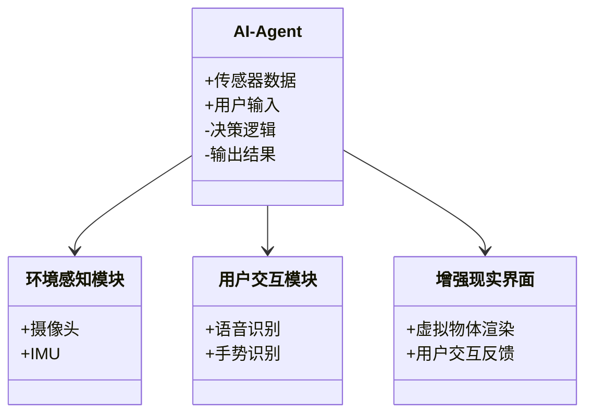
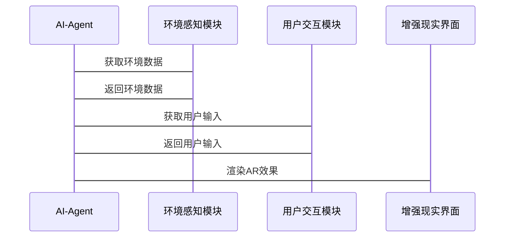

                 


# AI Agent在智能眼镜中的增强现实应用

> 关键词：AI Agent, 增强现实, 智能眼镜, 计算机视觉, 自然语言处理, 图神经网络, 深度学习

> 摘要：本文深入探讨了AI Agent在智能眼镜中的增强现实应用，从基本概念到核心算法，再到系统架构，详细分析了AI Agent与增强现实技术的结合方式，及其在智能眼镜中的实际应用场景。文章通过具体的案例分析和算法实现，展示了AI Agent如何通过增强现实技术提升智能眼镜的功能与用户体验，为相关领域的研究与实践提供了有价值的参考。

---

## 第1章: AI Agent与增强现实的基础知识

### 1.1 AI Agent的基本概念

#### 1.1.1 AI Agent的定义
AI Agent（人工智能代理）是指能够感知环境并采取行动以实现目标的智能实体。与传统计算机程序不同，AI Agent具备自主性、反应性、目标导向性和社交能力。

#### 1.1.2 AI Agent的核心特点
- **自主性**：能够在没有外部干预的情况下独立运行。
- **反应性**：能够实时感知环境并做出反应。
- **目标导向性**：所有行为都以实现特定目标为导向。
- **社交能力**：能够与其他AI Agent或人类进行有效交互。

#### 1.1.3 AI Agent与传统计算机程序的区别
| 特性                | AI Agent              | 传统计算机程序         |
|---------------------|-----------------------|-----------------------|
| 独立性              | 高                    | 低                    |
| 交互能力            | 强                    | 弱                    |
| 学习能力            | 强                    | 无                    |
| 目标导向性          | 是                   | 否                    |

---

### 1.2 增强现实的基本概念

#### 1.2.1 增强现实的定义
增强现实（Augmented Reality, AR）是指通过计算机技术将虚拟信息叠加到真实环境中，从而实现对现实世界的增强。

#### 1.2.2 增强现实的核心技术
- **图形渲染技术**：将虚拟物体叠加到真实场景中。
- **定位与追踪技术**：确定设备在空间中的位置和姿态。
- **用户交互技术**：实现用户与虚拟环境的互动。

#### 1.2.3 增强现实的应用场景
- **教育**：通过AR技术展示复杂的三维模型。
- **医疗**：辅助医生进行手术规划和训练。
- **娱乐**：增强现实游戏和虚拟试衣体验。

---

### 1.3 AI Agent在智能眼镜中的应用背景

#### 1.3.1 智能眼镜的发展历程
智能眼镜从最初的单一功能（如显示时间）逐步发展为集成了多种智能功能的设备，如语音助手、图像识别和增强现实显示。

#### 1.3.2 增强现实技术在智能眼镜中的应用
- **信息叠加**：在用户视野中叠加实时信息，如导航指示和翻译结果。
- **虚拟助手**：通过AR界面提供交互式的虚拟助手服务。

#### 1.3.3 AI Agent在智能眼镜中的作用
AI Agent作为智能眼镜的核心，负责处理用户的输入、与环境交互并提供智能化的服务。

---

## 第2章: AI Agent与增强现实的核心概念

### 2.1 AI Agent的核心原理

#### 2.1.1 AI Agent的感知与决策机制
AI Agent通过传感器和摄像头等设备感知环境，并利用机器学习算法进行决策。

#### 2.1.2 AI Agent的自主学习能力
基于深度学习和强化学习算法，AI Agent能够从经验中学习并优化自身行为。

#### 2.1.3 AI Agent的交互方式
支持语音、手势和视觉等多种交互方式，提升用户体验。

---

### 2.2 增强现实的核心技术

#### 2.2.1 AR的图形渲染技术
通过计算机图形学将虚拟物体渲染到真实场景中，确保视觉效果的逼真。

#### 2.2.2 AR的定位与追踪技术
使用摄像头和IMU（惯性测量单元）进行实时定位和姿态追踪。

#### 2.2.3 AR的用户交互技术
通过触摸屏、语音和手势实现与虚拟环境的交互。

---

### 2.3 AI Agent与增强现实的结合

#### 2.3.1 AI Agent在AR中的角色
AI Agent作为AR系统的智能核心，负责处理用户的输入、环境感知和决策制定。

#### 2.3.2 AR为AI Agent提供的交互界面
AR技术为AI Agent提供了直观的可视化交互界面，提升用户体验。

#### 2.3.3 AI Agent如何增强AR体验
通过智能分析和实时反馈，AI Agent能够提供更精准和个性化的AR体验。

---

## 第3章: AI Agent在智能眼镜中的增强现实应用

### 3.1 AI Agent在智能眼镜中的信息处理

#### 3.1.1 多模态数据的融合
将来自摄像头、麦克风和IMU等多种传感器的数据进行融合，提升信息处理的准确性。

#### 3.1.2 实时信息处理的挑战
- **计算资源限制**：智能眼镜的硬件资源有限，需要优化算法以实现实时处理。
- **数据隐私**：需要确保用户数据的安全性和隐私性。

#### 3.1.3 AI Agent的信息检索与推理
通过自然语言处理和知识图谱技术，实现对海量信息的快速检索和推理。

---

### 3.2 AI Agent在智能眼镜中的用户交互

#### 3.2.1 自然语言处理在用户交互中的应用
支持用户通过语音命令与AI Agent进行交互，提升用户体验。

#### 3.2.2 视觉交互的设计与实现
通过AR界面提供直观的视觉交互方式，如手势操作和眼球追踪。

#### 3.2.3 声控与手势交互的结合
结合语音和手势交互，提供更灵活和多样化的交互方式。

---

### 3.3 AI Agent在智能眼镜中的环境感知

#### 3.3.1 基于视觉的环境识别
利用深度学习算法，识别和理解周围环境中的物体和场景。

#### 3.3.2 基于传感器的环境感知
通过IMU和摄像头等传感器，实现对环境的实时感知和定位。

#### 3.3.3 多传感器融合的环境理解
将来自不同传感器的数据进行融合，提升环境理解的准确性和鲁棒性。

---

## 第4章: AI Agent增强现实应用的算法原理

### 4.1 AI Agent的核心算法

#### 4.1.1 基于深度学习的目标检测
使用YOLO或Faster R-CNN等深度学习模型，实现对目标物体的实时检测。

#### 4.1.2 基于强化学习的决策算法
通过强化学习算法，训练AI Agent在复杂环境中做出最优决策。

#### 4.1.3 基于图神经网络的知识推理
利用图神经网络技术，实现知识图谱中的复杂推理任务。

---

### 4.2 增强现实的核心算法

#### 4.2.1 AR的图像分割算法
使用U-Net等深度学习模型，实现对图像的语义分割。

#### 4.2.2 AR的实时定位与追踪算法
基于视觉惯性里程计（VIO）技术，实现高精度的实时定位和追踪。

#### 4.2.3 AR的图形渲染优化算法
通过优化渲染管线和使用光线追踪技术，提升AR图形的渲染质量。

---

## 第5章: AI Agent增强现实应用的系统架构

### 5.1 系统功能设计

#### 5.1.1 领域模型设计
通过Mermaid类图展示系统的功能模块及其交互关系。



#### 5.1.2 系统架构设计
通过Mermaid架构图展示系统的整体架构。

```mermaid
container 系统架构 {
    component AI-Agent {
        -感知模块
        -决策模块
        -交互模块
    }
    component 增强现实界面 {
        -图形渲染
        -用户交互
    }
    component 环境传感器 {
        -摄像头
        -IMU
    }
}
```

#### 5.1.3 系统接口设计
定义系统各模块之间的接口，确保模块间的高效协作。

#### 5.1.4 系统交互设计
通过Mermaid序列图展示系统各模块之间的交互流程。



---

## 第6章: AI Agent增强现实应用的项目实战

### 6.1 环境安装

#### 6.1.1 开发环境配置
- **操作系统**：Windows 10/Ubuntu 20.04
- **开发工具**：PyCharm/VS Code
- **依赖库安装**：Python 3.8+, OpenCV, TensorFlow, PyTorch

#### 6.1.2 项目初始化
```bash
pip install numpy opencv-python tensorflow torch
git clone https://github.com/your-repo/ai-agent-ar.git
cd ai-agent-ar
```

---

### 6.2 系统核心实现

#### 6.2.1 AI Agent的核心实现
```python
class AI-Agent:
    def __init__(self):
        self.sensor_data = {}
        self.user_input = ""
        self.decision_logic = self.default_decision

    def process_input(self):
        # 处理用户输入并返回决策结果
        pass

    def default_decision(self, input):
        # 默认决策逻辑
        return "Action"
```

#### 6.2.2 增强现实界面的实现
```python
import cv2

def render_ar(self, frame):
    # 在视频流上渲染AR效果
    cv2.putText(frame, "AI Agent AR Interface", (10, 30), cv2.FONT_HERSHEY_SIMPLEX, 1, (0, 255, 0), 2)
    return frame
```

---

### 6.3 案例分析与详细解读

#### 6.3.1 项目小结
通过实际案例，展示了AI Agent在智能眼镜中的增强现实应用的具体实现过程。

---

## 第7章: 总结与展望

### 7.1 总结
本文详细探讨了AI Agent在智能眼镜中的增强现实应用，从基本概念到算法实现，再到系统架构，全面分析了AI Agent与增强现实技术的结合方式。

### 7.2 最佳实践 Tips
- 硬件与算法的协同优化是关键。
- 数据安全和隐私保护不容忽视。
- 用户体验的优化是持续改进的方向。

### 7.3 未来展望
随着AI技术和增强现实技术的不断发展，AI Agent在智能眼镜中的应用将更加智能化和个性化。

---

## 参考文献
1. [1] Y. LeCun, et al., "Deep Learning," Nature, 2015.
2. [2] A. Krizhevsky, et al., "ImageNet Classification with Deep Convolutional Neural Networks," 2012.
3. [3] D. Karpathy, "Convolutional Neural Networks for Autonomous Vehicles," 2016.

--- 

通过以上详细目录大纲，您可以开始撰写具体的章节内容，确保每部分内容的深度和广度，同时保持逻辑的连贯性和技术的准确性。

