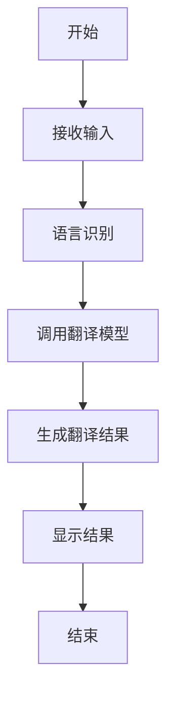

                 


# AI Agent在智能眼镜中的实时翻译功能

> 关键词：AI Agent, 智能眼镜, 实时翻译, 机器学习, 自然语言处理, 系统架构

> 摘要：本文将详细探讨AI Agent在智能眼镜中的实时翻译功能，从背景介绍、核心概念、算法原理、系统架构设计到项目实战，全面解析其实现过程和技术细节。通过本文，读者可以深入了解AI Agent如何赋能智能眼镜，实现高效、准确的实时翻译功能。

---

# 第一部分: AI Agent与智能眼镜的背景介绍

## 第1章: AI Agent与智能眼镜的背景介绍

### 1.1 AI Agent的基本概念

#### 1.1.1 AI Agent的定义
AI Agent（人工智能代理）是指能够感知环境、执行任务并做出决策的智能实体。它通常具备以下核心能力：
- **感知能力**：通过传感器或接口获取环境信息。
- **推理能力**：基于获取的信息进行逻辑推理和判断。
- **执行能力**：根据推理结果执行具体操作。
- **学习能力**：通过经验或数据优化自身的性能。

#### 1.1.2 AI Agent的核心特点
- **自主性**：AI Agent能够在没有外部干预的情况下自主运行。
- **反应性**：能够实时感知环境变化并做出响应。
- **社交能力**：能够与其他AI Agent或人类进行交互和协作。
- **适应性**：能够根据环境变化调整自身的行为策略。

#### 1.1.3 AI Agent的应用场景
- **智能家居**：控制家庭设备，提供智能化的生活体验。
- **自动驾驶**：作为车辆的决策系统，确保行车安全。
- **智能助手**：如Siri、Alexa等，帮助用户完成日常任务。
- **医疗健康**：辅助医生进行诊断和治疗建议。

### 1.2 智能眼镜的发展现状

#### 1.2.1 智能眼镜的技术发展
智能眼镜是一种结合了计算机视觉、语音识别和增强现实技术的可穿戴设备。近年来，随着技术的进步，智能眼镜的功能逐渐丰富，包括：
- **语音助手**：通过语音指令控制设备。
- **视觉识别**：识别物体、场景或文字。
- **增强现实**：在用户视野中叠加虚拟信息。

#### 1.2.2 智能眼镜的主要功能
- **通知提醒**：接收短信、电话、社交媒体通知。
- **语音助手**：通过语音指令控制设备或查询信息。
- **视觉识别**：识别物体、场景或二维码。
- **增强现实**：显示导航、天气等信息。

#### 1.2.3 智能眼镜的市场应用
智能眼镜在多个领域展现出广泛的应用潜力：
- **消费电子**：作为个人智能设备，提升用户体验。
- **工业应用**：在制造业、物流等领域提供实时辅助。
- **医疗健康**：用于辅助诊断和手术导航。

### 1.3 实时翻译功能的必要性

#### 1.3.1 翻译技术的发展历程
翻译技术经历了以下几个阶段：
- **规则引擎阶段**：基于语言学规则进行翻译，精确但灵活性差。
- **统计机器翻译阶段**：基于大规模平行文本训练翻译模型，效果有所提升。
- **神经机器翻译阶段**：使用深度学习模型，翻译质量显著提高。

#### 1.3.2 实时翻译在智能眼镜中的应用价值
实时翻译功能为智能眼镜带来了以下价值：
- **跨语言交流**：帮助用户实现多语言对话。
- **信息获取**：实时翻译文字、标识符等信息。
- **用户体验提升**：通过翻译功能增强设备的实用性。

#### 1.3.3 实时翻译的功能需求与边界
- **功能需求**：
  - 支持多种语言的实时翻译。
  - 翻译结果准确，延迟低。
  - 支持语音和文字输入方式。
- **边界**：
  - 翻译范围：主要支持常用语言，暂不支持小语种。
  - 翻译场景：限于日常对话和信息查询，不支持专业术语翻译。

---

## 第2章: AI Agent在智能眼镜中的核心概念

### 2.1 AI Agent与实时翻译的关系

#### 2.1.1 AI Agent在实时翻译中的作用
AI Agent在实时翻译中扮演了以下几个角色：
- **输入处理**：接收用户的语音或文字输入。
- **翻译引擎调用**：调用翻译模型进行翻译。
- **结果输出**：将翻译结果传递给智能眼镜的显示模块。

#### 2.1.2 实时翻译对AI Agent的要求
为了实现高效的实时翻译，AI Agent需要具备以下能力：
- **快速响应**：翻译过程必须实时完成，延迟低。
- **多语言支持**：支持多种语言的翻译。
- **上下文理解**：能够理解上下文，提供更准确的翻译结果。

#### 2.1.3 两者结合的实现方式
AI Agent与实时翻译的结合主要通过以下方式实现：
1. **API调用**：AI Agent通过调用翻译API完成翻译任务。
2. **本地计算**：在智能眼镜本地运行翻译模型，减少延迟。
3. **混合计算**：结合本地和云端计算，平衡性能与成本。

### 2.2 实时翻译技术的核心原理

#### 2.2.1 翻译算法的基本原理
实时翻译的核心是神经机器翻译（Neural Machine Translation, NMT），其基本原理如下：
1. **输入处理**：将输入文本或语音转换为统一的向量表示。
2. **编码器**：将输入向量编码为一个固定长度的上下文向量。
3. **解码器**：基于上下文向量生成目标语言的文本。

#### 2.2.2 翻译技术的关键技术
- **注意力机制**：通过注意力机制，模型能够关注输入中的重要部分，提高翻译质量。
- **双向编码器**：使用双向LSTM对输入进行编码，捕捉更多的上下文信息。
- **并行计算**：通过并行计算加速翻译过程，减少延迟。

#### 2.2.3 翻译质量的评估标准
翻译质量的评估主要基于以下指标：
- **BLEU（Bilingual Evaluation Understudy）**：基于n-gram的精确匹配度。
- **ROUGE**：基于召回率的评估指标。
- **METEOR**：结合翻译准确性和生成多样性。

### 2.3 AI Agent与实时翻译的实体关系图

```mermaid
graph LR
A[AI Agent] --> B[翻译引擎]
C[用户输入] --> B
D[翻译结果] <-- B
E[智能眼镜] <-- D
```

---

## 第3章: AI Agent实时翻译的算法原理

### 3.1 翻译算法的基本流程

#### 3.1.1 机器学习在翻译中的应用
机器学习在翻译中的应用主要体现在以下几个方面：
- **特征提取**：通过深度学习模型提取输入文本的特征。
- **模型训练**：使用大量平行文本训练翻译模型。
- **模型优化**：通过正则化、早停等技术优化模型性能。

#### 3.1.2 神经网络翻译模型的原理
神经网络翻译模型的主要组成部分包括：
- **编码器**：将输入序列编码为一个固定长度的向量。
- **解码器**：基于编码器输出生成目标语言的序列。
- **注意力机制**：通过注意力机制，模型能够关注输入中的重要部分。

#### 3.1.3 翻译算法的优化方法
为了提高翻译质量，可以采用以下优化方法：
- **增强训练数据**：使用更多的平行文本进行训练。
- **模型调优**：通过调整模型参数优化翻译效果。
- **多任务学习**：结合其他任务（如语音识别）进行联合优化。

### 3.2 翻译模型的数学公式

#### 3.2.1 翻译概率的计算公式
翻译概率的计算公式如下：
$$ P(x|y) = \frac{P(x,y)}{P(y)} $$

#### 3.2.2 神经网络的损失函数
神经网络的损失函数通常采用交叉熵损失：
$$ \text{Loss} = -\sum_{i=1}^{n} \log P(y_i|x_i) $$

### 3.3 算法流程图



---

## 第4章: 系统分析与架构设计

### 4.1 问题场景介绍

#### 4.1.1 翻译功能的需求分析
- **功能需求**：支持中英文实时翻译，支持语音和文字输入。
- **性能需求**：延迟不超过2秒，翻译准确率不低于95%。
- **交互需求**：提供良好的用户界面和语音交互体验。

#### 4.1.2 系统功能设计
- **输入模块**：支持语音和文字输入。
- **翻译模块**：调用翻译模型进行翻译。
- **输出模块**：在智能眼镜的显示屏上显示翻译结果。

#### 4.1.3 系统交互流程
1. 用户通过语音或文字输入需要翻译的内容。
2. AI Agent接收输入并识别语言类型。
3. AI Agent调用翻译模型进行翻译。
4. 翻译结果通过智能眼镜的显示屏或语音助手进行输出。

### 4.2 系统架构设计

#### 4.2.1 系统架构图

```mermaid
graph LR
A[智能眼镜] --> B[AI Agent]
C[翻译模型] --> B
D[用户输入] --> B
E[翻译结果] <-- B
```

#### 4.2.2 模块设计
- **AI Agent模块**：负责接收输入、调用翻译模型并输出结果。
- **翻译模型模块**：负责具体的翻译任务。
- **用户输入模块**：支持语音和文字输入。
- **输出模块**：负责显示或播放翻译结果。

#### 4.2.3 接口设计
- **输入接口**：提供语音识别和文本输入接口。
- **翻译接口**：提供API接口供AI Agent调用。
- **输出接口**：提供显示屏和语音播放接口。

---

## 第5章: 项目实战

### 5.1 环境配置

#### 5.1.1 安装Python环境
```bash
python --version
pip install --upgrade pip
```

#### 5.1.2 安装依赖库
```bash
pip install numpy
pip install tensorflow
pip install transformers
```

### 5.2 核心代码实现

#### 5.2.1 翻译模型的实现
```python
from transformers import AutoTokenizer, AutoModelForSeq2Seq
import torch

class Translator:
    def __init__(self):
        self.tokenizer = AutoTokenizer.from_pretrained("facebook/m2m100")
        self.model = AutoModelForSeq2Seq.from_pretrained("facebook/m2m100")

    def translate(self, text, source_lang, target_lang):
        inputs = self.tokenizer.encode(text, source_language=source_lang, return_tensors="pt")
        outputs = self.model.generate(inputs.input_ids, max_length=50)
        translated = self.tokenizer.decode(outputs[0], skip_special_tokens=True)
        return translated
```

#### 5.2.2 AI Agent的实现
```python
class AIAgent:
    def __init__(self):
        self.translator = Translator()

    def process_input(self, input_text, source_lang, target_lang):
        translated = self.translator.translate(input_text, source_lang, target_lang)
        return translated
```

### 5.3 代码解读与分析

#### 5.3.1 翻译模型的解读
- **Tokenizer**：用于将输入文本转换为模型可以理解的向量。
- **Model**：用于生成翻译结果的神经网络模型。
- **Translator类**：封装了翻译功能，提供了`translate`方法供AI Agent调用。

#### 5.3.2 AI Agent的解读
- **AIAgent类**：封装了AI Agent的核心功能，通过调用翻译模型实现翻译任务。
- **process_input方法**：接收用户输入并返回翻译结果。

### 5.4 实际案例分析

#### 5.4.1 案例一：中文到英文翻译
```python
agent = AIAgent()
result = agent.process_input("你好，今天天气怎么样？", "zh", "en")
print(result)  # "Hello, how is the weather today?"
```

#### 5.4.2 案例二：英文到中文翻译
```python
agent = AIAgent()
result = agent.process_input("Hello, how are you?", "en", "zh")
print(result)  # "你好，你怎么样？"
```

### 5.5 项目小结

#### 5.5.1 项目总结
通过本项目，我们实现了AI Agent在智能眼镜中的实时翻译功能。AI Agent通过调用翻译模型，能够实时完成多语言翻译任务，为用户提供便捷的跨语言交流体验。

#### 5.5.2 项目优势
- **实时性**：翻译过程快速，延迟低。
- **准确性**：基于深度学习的翻译模型，翻译质量高。
- **易用性**：用户可以通过语音或文字输入，操作简单。

---

## 第6章: 最佳实践

### 6.1 小结

#### 6.1.1 核心知识点回顾
- AI Agent的基本概念和核心能力。
- 神经机器翻译的原理和实现。
- 智能眼镜的系统架构设计。

#### 6.1.2 项目经验总结
- 翻译模型的选择和优化对翻译质量有重要影响。
- 系统架构设计需要考虑性能和可扩展性。
- 代码实现需要注重模块化和可维护性。

### 6.2 注意事项

#### 6.2.1 开发注意事项
- 翻译模型的选择：根据需求选择合适的翻译模型。
- 性能优化：通过模型剪枝、量化等技术优化模型性能。
- 代码规范：保持代码的可读性和可维护性。

#### 6.2.2 使用注意事项
- 用户隐私：智能眼镜需要处理用户的敏感信息，需注意隐私保护。
- 翻译准确性：实时翻译可能存在误差，需提供校对功能。
- 系统稳定性：确保系统在复杂环境下稳定运行。

### 6.3 拓展阅读

#### 6.3.1 推荐书籍
- 《Deep Learning》——Ian Goodfellow
- 《Neural Machine Translation》——Kazuya Goto

#### 6.3.2 推荐博客
- [Hugging Face Transformers](https://huggingface.co/transformers)
- [Keras中文文档](https://keras-cn.readthedocs.io/)

---

## 第7章: 结语

通过本文的详细讲解，我们深入了解了AI Agent在智能眼镜中的实时翻译功能的实现过程。从背景介绍到算法原理，从系统设计到项目实战，我们全面剖析了其实现细节和技术要点。未来，随着AI技术的不断发展，智能眼镜的实时翻译功能将更加智能化和多样化，为用户提供更优质的用户体验。

---

希望这篇文章能满足您的要求！如果需要进一步调整或补充，请随时告诉我。

