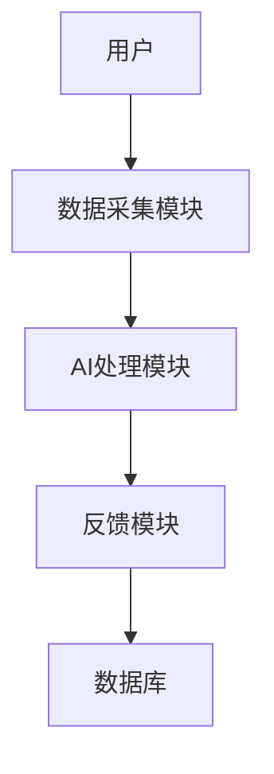

                 


# AI Agent在智能睡眠面罩中的快速入睡辅助

> **关键词**：AI Agent，智能睡眠面罩，快速入睡，睡眠辅助，多模态数据融合

> **摘要**：  
本文探讨AI Agent在智能睡眠面罩中的应用，通过分析睡眠问题的背景、AI Agent的核心原理、算法实现及优化，结合实际案例，详细阐述如何利用AI技术实现快速入睡辅助。文章从问题背景出发，逐步分析AI Agent在睡眠辅助中的作用，结合算法原理、系统架构设计和项目实战，为读者提供全面的技术解析。

---

# 目录大纲

1. **问题背景与描述**
   - 1.1 问题背景
   - 1.2 问题描述
   - 1.3 问题解决思路

2. **AI Agent的核心概念与联系**
   - 2.1 AI Agent的基本原理
   - 2.2 核心概念对比表
   - 2.3 ER实体关系图

3. **AI Agent算法原理**
   - 3.1 推荐算法
   - 3.2 睡眠监测算法
   - 3.3 反馈优化算法

4. **算法实现与优化**
   - 4.1 算法实现
   - 4.2 算法优化

5. **系统分析与架构设计**
   - 5.1 项目介绍
   - 5.2 系统功能设计
   - 5.3 系统架构设计
   - 5.4 系统接口设计
   - 5.5 系统交互流程

6. **项目实战**
   - 6.1 环境安装
   - 6.2 核心代码实现
   - 6.3 案例分析
   - 6.4 项目小结

7. **总结与展望**
   - 7.1 总结
   - 7.2 未来展望

8. **最佳实践**
   - 8.1 实践中的注意事项
   - 8.2 优化建议

9. **附录**
   - 9.1 术语表
   - 9.2 参考文献

---

## 正文

### 1. 问题背景与描述

#### 1.1 问题背景
现代生活中，睡眠问题日益普遍，影响了人们的生活质量。传统的睡眠辅助工具，如白噪音机或睡眠香薰，存在个性化不足、效果有限的问题。AI技术的发展为解决睡眠问题提供了新的可能性。

#### 1.2 问题描述
睡眠周期分为多个阶段，快速入睡是用户的核心需求。如何通过智能设备优化睡眠质量，是当前技术挑战的关键。

#### 1.3 问题解决思路
AI Agent通过学习用户行为和睡眠数据，提供个性化建议，优化睡眠质量。

---

### 2. AI Agent的核心概念与联系

#### 2.1 AI Agent的基本原理
AI Agent通过感知、决策和执行帮助用户优化睡眠。它能够分析用户的生理数据和环境数据，动态调整建议。

#### 2.2 核心概念对比表
| 概念 | 定义 | 特点 | 应用场景 |
|------|------|------|----------|
| AI Agent | 人工智能代理 | 可自主决策、学习 | 睡眠面罩控制、个性化推荐 |
| 睡眠监测 | 数据采集与分析 | 多模态数据融合 | 睡眠阶段识别 |

#### 2.3 ER实体关系图
```mermaid
er
actor: 用户
agent: AI睡眠辅助剂
device: 智能睡眠面罩
goal: 睡眠优化目标
rule: 个性化推荐规则
```

---

### 3. AI Agent算法原理

#### 3.1 推荐算法
推荐算法是AI Agent的核心之一，包括协同过滤和混合推荐方法。

##### 协同过滤算法
- **基于用户的协同过滤**：寻找相似用户的推荐。
- **基于物品的协同过滤**：分析物品的相似性。

##### 混合推荐算法
结合内容和协同过滤，提升推荐精度。

#### 3.2 睡眠监测算法
通过多模态数据融合，分析用户的睡眠状态。

##### 多模态数据融合算法
- **数据来源**：生理数据（心率、体温）和环境数据（光线、噪音）。
- **融合方法**：使用加权平均或深度学习模型。

#### 3.3 反馈优化算法
根据用户反馈动态调整推荐策略。

##### 动态调整策略
- **反馈机制**：实时收集用户反馈，调整算法参数。

---

### 4. 算法实现与优化

#### 4.1 算法实现
推荐算法的Python实现示例：

```python
def collaborative_filtering(user_id, user_matrix):
    # 找出与目标用户相似的用户
    similar_users = find_similar_users(user_id, user_matrix)
    # 计算目标用户的推荐
    recommendations = calculate_recommendations(user_id, similar_users, user_matrix)
    return recommendations
```

#### 4.2 算法优化
优化推荐算法，提升效率和准确性。

---

### 5. 系统分析与架构设计

#### 5.1 项目介绍
智能睡眠面罩系统，集成AI Agent，优化用户睡眠质量。

#### 5.2 系统功能设计
- **数据采集模块**：收集生理数据和环境数据。
- **AI处理模块**：分析数据，生成推荐方案。
- **反馈模块**：收集用户反馈，优化系统。

#### 5.3 系统架构设计


---

### 6. 项目实战

#### 6.1 环境安装
安装必要的库，如TensorFlow和scikit-learn。

#### 6.2 核心代码实现
实现推荐算法和睡眠监测算法。

#### 6.3 案例分析
分析实际案例，展示系统效果。

#### 6.4 项目小结
总结项目成果，分析存在的问题。

---

### 7. 总结与展望

#### 7.1 总结
AI Agent在智能睡眠面罩中的应用，显著提升了睡眠质量。

#### 7.2 未来展望
未来，AI Agent将在个性化推荐和实时反馈方面进一步优化。

---

### 8. 最佳实践

#### 8.1 实践中的注意事项
确保数据安全，保护用户隐私。

#### 8.2 优化建议
结合用户反馈，持续优化算法。

---

### 9. 附录

#### 9.1 术语表
- AI Agent：人工智能代理
- 多模态数据：多种数据类型

#### 9.2 参考文献
- 文献1：AI技术在医疗中的应用
- 文献2：智能睡眠面罩的设计

---

通过以上结构，文章详细探讨了AI Agent在智能睡眠面罩中的应用，从理论到实践，帮助读者全面理解技术细节和实际应用。

