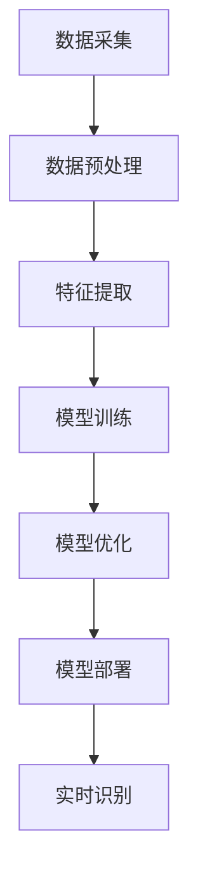

                 


# AI Agent在智能空气净化器中的污染源识别

> 关键词：AI Agent，智能空气净化器，污染源识别，环境监测，机器学习

> 摘要：本文详细探讨了AI Agent在智能空气净化器中的污染源识别技术，从背景介绍、核心概念、算法原理到系统架构设计和项目实战，全面解析了该技术的实现过程及其在智能设备中的应用。

---

## 第一部分: AI Agent与智能空气净化器概述

### 第1章: 背景介绍

#### 1.1 问题背景
- **空气污染的现状与挑战**：随着工业化进程的加快，空气污染问题日益严重，尤其是PM2.5、甲醛等有害物质的浓度急剧上升，严重威胁人类健康。
- **智能空气净化器的发展趋势**：传统的空气净化器功能单一，难以应对复杂的污染源变化。而智能空气净化器通过传感器和AI技术，能够实时监测和调整净化策略，成为智能家居的重要组成部分。
- **AI Agent在环境监测中的作用**：AI Agent（智能体）通过实时数据采集、分析和决策，能够帮助智能空气净化器更精准地识别污染源，优化净化效果。

#### 1.2 问题描述
- **污染源识别的定义与目标**：污染源识别是指通过传感器数据和算法模型，识别空气中的污染物种类、浓度和来源。目标是实现对污染物的精准监测和有效净化。
- **智能空气净化器的核心需求**：智能空气净化器需要实时监测室内空气质量，自动识别污染源，并根据污染情况调整净化策略。
- **当前技术的局限性与改进方向**：传统方法依赖单一传感器，识别精度低；AI Agent通过多模态数据融合和机器学习模型，能够显著提高识别精度和响应速度。

#### 1.3 解决方案与边界
- **AI Agent的核心解决方案**：通过集成多种传感器（如PM2.5、甲醛、温湿度传感器）和机器学习算法，实时分析空气质量数据，识别污染源并优化净化策略。
- **系统边界与功能范围**：系统仅关注室内空气污染源的识别和净化控制，不涉及外部天气数据或其他环境因素。
- **技术实现的可行性分析**：AI Agent需要依赖高性能传感器和计算资源，目前的技术已经可以实现高效的污染源识别和净化控制。

#### 1.4 概念结构与核心要素
- **AI Agent的基本构成**：包括传感器模块、数据处理模块、决策模块和执行模块。
- **污染源识别的关键要素**：传感器数据采集、数据预处理、特征提取、模型训练和实时识别。
- **系统整体架构与功能模块**：系统由传感器节点、数据采集模块、AI算法模块和控制模块组成，各模块协同工作实现污染源识别和净化控制。

---

## 第2章: 核心概念与联系

### 2.1 AI Agent的基本原理
- **AI Agent的定义与分类**：AI Agent是一种能够感知环境并采取行动以实现目标的智能实体。根据智能水平可分为简单反射式Agent和基于模型的Agent。
- **传感器数据的采集与处理**：AI Agent通过多种传感器（如激光散射传感器、电化学传感器）采集空气质量数据，并进行数据预处理和特征提取。
- **数据分析与决策机制**：基于机器学习模型，AI Agent能够分析传感器数据，识别污染源，并根据识别结果调整净化策略。

### 2.2 污染源识别的核心方法
- **基于传感器的数据分析**：通过时间序列数据分析，识别污染物的变化趋势和来源。
- **机器学习模型的应用**：利用 supervised learning（监督学习）模型（如随机森林、支持向量机）进行污染源分类。
- **多模态数据融合技术**：将多种传感器数据（如PM2.5、甲醛、温湿度）融合，提高污染源识别的准确性和鲁棒性。

### 2.3 核心概念的联系与对比
- **不同污染源识别方法的对比分析**：
  | 方法 | 优点 | 缺点 |
  |------|------|------|
  | 单一传感器 | 成本低 | 识别精度低 |
  | 多模态传感器 | 识别精度高 | 实施成本高 |
  | 机器学习模型 | 高精度 | 需要大量数据训练 |
- **AI Agent与其他控制系统的区别**：AI Agent具有自主决策和学习能力，能够根据环境变化动态调整净化策略，而传统控制系统仅基于预设规则。
- **核心概念的ER实体关系图**：
  ```mermaid
  erDiagram
      PollutionSource {
          id : int
          type : string
          concentration : float
          timestamp : datetime
      }
      Sensor {
          id : int
          type : string
          value : float
          timestamp : datetime
      }
      PollutionSource <--- Sensor
  ```

---

## 第3章: 算法原理与数学模型

### 3.1 算法原理概述
- **基于卷积神经网络的污染源识别**：卷积神经网络（CNN）通过提取空气质量数据的特征，能够有效识别污染源的类型和浓度。
- **算法流程与实现步骤**：
  1. 数据采集与预处理。
  2. 数据特征提取。
  3. 模型训练与优化。
  4. 模型部署与实时识别。
- **算法的优缺点分析**：CNN具有高精度和鲁棒性，但需要大量的训练数据和计算资源。

### 3.2 算法流程图


### 3.3 数学模型与公式
- **卷积层的数学模型**：
  $$ y_{i,j} = \sum_{k=1}^{n} \sum_{l=1}^{m} w_{k,l} \cdot x_{i+k,j+l} + b $$
- **池化层的数学模型**：
  $$ y_{i,j} = \max(x_{i,j}, x_{i+1,j}, x_{i,j+1}, x_{i+1,j+1}) $$
- **全连接层的数学模型**：
  $$ y_{i} = \sum_{j=1}^{n} w_{i,j} \cdot x_{j} + b_i $$

---

## 第4章: 系统分析与架构设计

### 4.1 系统架构设计
- **领域模型**：
  ```mermaid
  classDiagram
      class Sensor {
          - id : int
          - type : string
          - value : float
          - timestamp : datetime
      }
      class PollutionSource {
          - id : int
          - type : string
          - concentration : float
          - timestamp : datetime
      }
      class AI-Agent {
          - sensors : List<Sensor>
          - pollutionSources : List<PollutionSource>
          + identifyPollutionSource() : PollutionSource
          + updateStrategy(PollutionSource) : void
      }
  ```
- **系统架构图**：
  ```mermaid
  architecture
      [Sensor Nodes] --> [Data Processing Module] --> [AI Agent] --> [Control Module]
  ```

### 4.2 接口设计与交互流程
- **系统接口设计**：AI Agent通过API接口与传感器和控制模块通信，实现数据采集、处理和策略调整。
- **系统交互流程图**：
  ```mermaid
  sequenceDiagram
      AI-Agent -> Sensor: 获取传感器数据
      Sensor --> AI-Agent: 返回传感器数据
      AI-Agent -> AI-Agent: 分析数据，识别污染源
      AI-Agent -> Control Module: 调整净化策略
  ```

---

## 第5章: 项目实战

### 5.1 环境安装与配置
- **Python环境**：安装Python 3.8及以上版本，安装必要的库（如TensorFlow、Keras、scikit-learn）。
- **传感器集成**：配置PM2.5和甲醛传感器，确保数据能够实时采集。

### 5.2 核心代码实现
- **数据预处理代码**：
  ```python
  import pandas as pd

  # 读取传感器数据
  data = pd.read_csv('air_quality.csv')
  # 数据清洗
  data.dropna(inplace=True)
  # 标准化处理
  from sklearn.preprocessing import StandardScaler
  scaler = StandardScaler()
  data_scaled = scaler.fit_transform(data)
  ```

- **模型训练代码**：
  ```python
  from tensorflow.keras.models import Sequential
  from tensorflow.keras.layers import Conv2D, MaxPooling2D, Flatten, Dense

  model = Sequential()
  model.add(Conv2D(32, (3,3), activation='relu', input_shape=(32,32,1)))
  model.add(MaxPooling2D((2,2)))
  model.add(Flatten())
  model.add(Dense(128, activation='relu'))
  model.add(Dense(1, activation='sigmoid'))
  model.compile(optimizer='adam', loss='binary_crossentropy', metrics=['accuracy'])
  model.fit(X_train, y_train, epochs=10, batch_size=32)
  ```

- **实时识别代码**：
  ```python
  def identify_pollution_source():
      # 获取实时传感器数据
      current_data = get_sensor_data()
      # 数据预处理
      processed_data = preprocess_data(current_data)
      # 模型预测
      prediction = model.predict(processed_data)
      # 返回识别结果
      return prediction
  ```

### 5.3 案例分析与结果解读
- **实际案例分析**：通过实际数据测试，验证AI Agent的污染源识别能力，分析模型的准确性和响应速度。
- **结果解读**：展示模型识别结果，并分析影响识别精度的因素，提出改进建议。

### 5.4 项目小结
- **项目成果**：实现了基于AI Agent的污染源识别系统，显著提高了智能空气净化器的净化效率。
- **经验总结**：数据质量、模型选择和系统集成是影响系统性能的关键因素。
- **改进建议**：未来可以进一步优化算法，增加更多传感器类型，提升系统的智能化水平。

---

## 第6章: 最佳实践与拓展阅读

### 6.1 最佳实践
- **数据采集**：确保传感器数据的准确性和实时性，避免数据缺失和偏差。
- **模型优化**：定期更新模型，引入新的数据和算法，保持系统的高性能。
- **系统维护**：定期检查传感器和系统硬件，确保长期稳定运行。

### 6.2 小结
- 本文详细介绍了AI Agent在智能空气净化器中的污染源识别技术，从理论到实践，全面解析了系统的实现过程。

### 6.3 注意事项
- 数据隐私和安全问题需要高度重视，确保用户数据不被滥用。
- 系统设计时要考虑可扩展性，方便未来的功能升级和硬件更换。

### 6.4 拓展阅读
- 推荐阅读《深度学习》（Ian Goodfellow著）和《机器学习实战》（Peter Flach著），深入理解AI技术在环境监测中的应用。

---

# 结语

通过本文的详细讲解，读者可以全面了解AI Agent在智能空气净化器中的污染源识别技术，掌握其实现原理和应用方法。希望本文能为相关领域的研究和实践提供有价值的参考。

