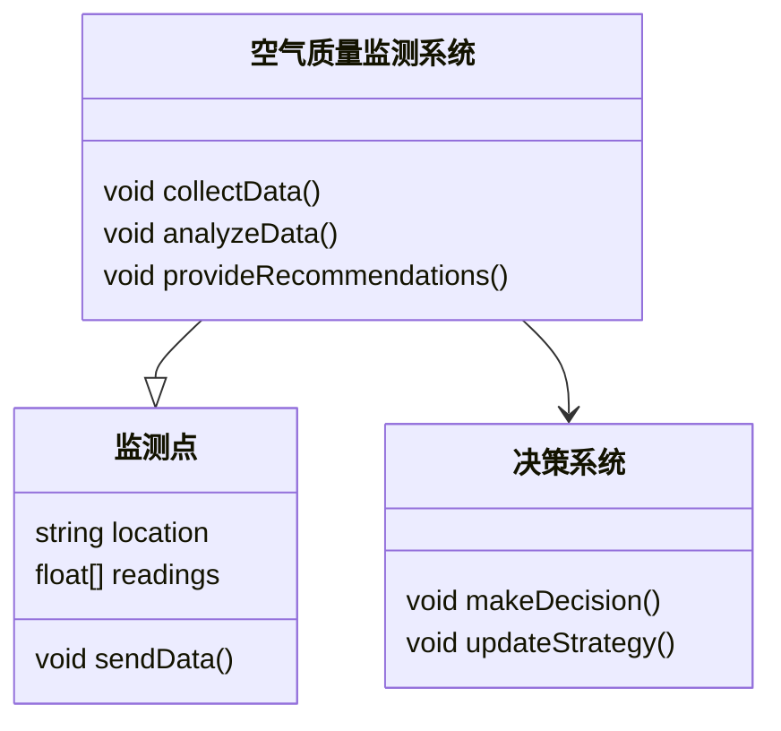
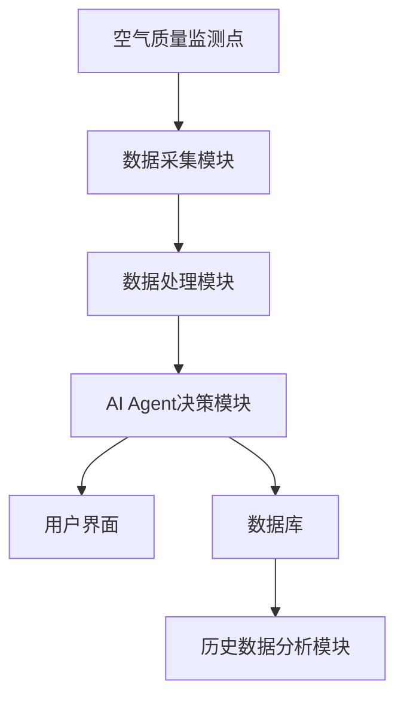
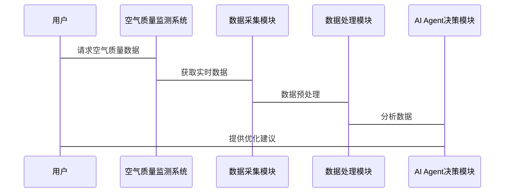

                 


```markdown
# AI Agent在智能空气质量管理中的实践

> 关键词：AI Agent, 智能空气质量管理, 机器学习, 强化学习, 环境监测, 数据分析

> 摘要：本文详细探讨了AI Agent在智能空气质量管理中的应用，从基本概念、核心算法、系统架构到实际项目实现，全面解析了如何利用人工智能技术优化空气质量管理过程。通过理论分析和实践案例，展示了AI Agent在实时监控、智能决策和优化控制中的重要作用。

---

## 第一部分：AI Agent与智能空气质量管理概述

### 第1章：AI Agent的基本概念与背景

#### 1.1 AI Agent的定义与特点
- **1.1.1 什么是AI Agent**
  - AI Agent（智能体）是指能够感知环境、自主决策并执行任务的智能系统。
  
- **1.1.2 AI Agent的核心特点**
  - **能动性**：AI Agent能够主动采取行动，而不仅仅是被动响应。
  - **反应性**：能够实时感知环境变化并做出反应。
  - **智能性**：通过学习和推理，能够做出优化决策。

- **1.1.3 AI Agent与传统自动化的区别**
  - 传统自动化基于固定的规则和程序，而AI Agent具备学习和适应能力。
  - 传统自动化无法处理不确定性，而AI Agent能够应对复杂和动态的环境。

#### 1.2 智能空气质量管理的背景
- **1.2.1 空气质量管理的重要性**
  - 空气质量直接影响公共健康和环境保护，是城市管理和环境保护的重要组成部分。
  
- **1.2.2 传统空气质量管理的局限性**
  - 依赖人工监控，效率低且易出错。
  - 反应速度慢，难以应对突发污染事件。

- **1.2.3 智能化管理的必要性**
  - 利用AI技术实现智能化管理，能够提高效率、降低成本，并实时优化空气质量。

#### 1.3 AI Agent在空气质量管理中的作用
- **1.3.1 数据采集与分析**
  - AI Agent能够实时采集空气质量数据，并通过机器学习算法分析趋势和模式。
  
- **1.3.2 智能决策与优化**
  - 基于分析结果，AI Agent可以制定最优的污染控制策略，例如调整工业排放或交通限行。

- **1.3.3 实时监控与反馈**
  - AI Agent能够实时监控空气质量变化，并根据反馈不断优化决策策略。

### 第2章：AI Agent的核心概念与技术基础

#### 2.1 AI Agent的核心概念
- **2.1.1 知识表示**
  - 知识表示是AI Agent理解环境的基础，常用方法包括规则表示、语义网络和概率表示。
  
- **2.1.2 行为规划**
  - 行为规划是指AI Agent根据当前状态和目标，制定行动序列以实现目标。
  
- **2.1.3 状态感知**
  - 状态感知是AI Agent通过传感器或数据源获取环境信息的过程，是决策的基础。

#### 2.2 AI Agent的技术基础
- **2.2.1 机器学习基础**
  - 机器学习是AI Agent的核心技术，包括监督学习、无监督学习和强化学习。
  
- **2.2.2 自然语言处理**
  - 自然语言处理用于分析与空气质量相关的文本数据，例如新闻报道和政策文件。
  
- **2.2.3 数据挖掘与分析**
  - 数据挖掘技术用于发现数据中的模式和趋势，支持决策优化。

#### 2.3 AI Agent与智能系统的联系
- **2.3.1 系统架构对比**
  - 通过对比不同系统架构的特点和应用场景，理解AI Agent在智能系统中的位置和作用。

- **2.3.2 实体关系图（ER图）分析**
  - 通过ER图展示空气质量管理系统中的实体及其关系，帮助理解系统的整体结构。

---

## 第二部分：AI Agent的算法原理与数学模型

### 第3章：AI Agent的算法原理

#### 3.1 强化学习算法
- **3.1.1 Q-learning算法**
  - Q-learning是一种经典的强化学习算法，适用于离散状态和动作空间。
  - 通过不断更新Q值表，学习最优策略。
  
- **3.1.2 Deep Q-Networks（DQN）**
  - DQN通过深度神经网络近似Q值函数，适用于连续状态空间。
  
- **3.1.3 算法流程图**
  - 使用mermaid绘制Q-learning算法流程图，直观展示算法步骤。

#### 3.2 监督学习与无监督学习
- **3.2.1 监督学习在数据分类中的应用**
  - 使用监督学习算法（如随机森林、支持向量机）对空气质量数据进行分类。
  
- **3.2.2 无监督学习在异常检测中的应用**
  - 使用无监督学习算法（如聚类、主成分分析）发现异常数据点。

#### 3.3 算法对比分析
- 通过对比不同算法的优缺点，选择最适合应用场景的技术。

### 第4章：数学模型与公式

#### 4.1 强化学习的数学模型
- **4.1.1 Q-learning公式**
  $$ Q(s, a) = Q(s, a) + \alpha \left[ r + \gamma \max Q(s', a') - Q(s, a) \right] $$
  
- **4.1.2 状态转移概率**
  $$ P(s' | s, a) $$

#### 4.2 深度学习模型
- **4.2.1 卷积神经网络（CNN）**
  - 适用于图像数据的处理，例如卫星图像中的污染监测。
  
- **4.2.2 循环神经网络（RNN）**
  - 适用于时间序列数据的预测，例如空气质量变化趋势。

---

## 第三部分：系统分析与架构设计方案

### 第5章：系统分析与架构设计方案

#### 5.1 问题场景介绍
- 空气质量监测系统需要实时采集、分析和优化空气质量数据，支持决策者制定有效的污染控制策略。

#### 5.2 项目介绍
- 本项目旨在开发一个基于AI Agent的空气质量管理系统，实现智能化的实时监控和优化控制。

#### 5.3 系统功能设计（领域模型）
- **领域模型类图**
  - 使用mermaid绘制类图，展示系统的主要组件及其关系。



#### 5.4 系统架构设计
- **架构图**
  - 使用mermaid绘制系统架构图，展示各组件的交互和依赖。



#### 5.5 系统交互设计
- **交互序列图**
  - 用mermaid绘制用户与系统的交互流程。



---

## 第四部分：项目实战

### 第6章：项目实战

#### 6.1 环境安装
- **Python环境**
  - 安装必要的库：numpy、pandas、scikit-learn、tensorflow、pymermaid。

#### 6.2 核心实现源代码
- **数据采集模块**
  - 使用API获取空气质量数据。

```python
import requests

def fetch_data(api_key):
    url = f"http://api.airnow.gov/v1/conditions/city?city=Beijing&state=CN&key={api_key}"
    response = requests.get(url)
    return response.json()
```

- **AI Agent决策模块**
  - 实现Q-learning算法进行决策优化。

```python
class QLearningAgent:
    def __init__(self, alpha=0.1, gamma=0.9):
        self.alpha = alpha
        self.gamma = gamma
        self.q_table = {}  # 状态：动作 -> 价值
    
    def choose_action(self, state, epsilon=0.1):
        if np.random.random() < epsilon:
            return 'random'
        else:
            return max(self.q_table.get(state, {}).items(), key=lambda x: x[1])[0]
    
    def update_q(self, state, action, reward, next_state):
        current_q = self.q_table.get(state, {}).get(action, 0)
        next_max_q = max(self.q_table.get(next_state, {}).values(), default=0)
        self.q_table[state] = {
            action: current_q + self.alpha * (reward + self.gamma * next_max_q - current_q)
        }
```

#### 6.3 实际案例分析
- **案例：北京空气质量优化**
  - 数据来源：北京市环保局。
  - 分析污染源分布，制定减排策略。
  - 使用AI Agent优化交通限行措施，降低PM2.5浓度。

#### 6.4 代码应用解读
- **数据处理**
  - 清洗、转换、特征工程。
  - 使用pandas进行数据预处理。

```python
import pandas as pd

data = pd.read_csv('air_quality.csv')
data = data.dropna()
data['date'] = pd.to_datetime(data['date'])
data.set_index('date', inplace=True)
```

- **模型训练**
  - 使用训练数据训练AI Agent。
  - 验证集测试模型性能。

#### 6.5 项目小结
- **项目总结**
  - 成功实现AI Agent在空气质量管理中的应用。
  - 提高了决策效率和准确性。

---

## 第五部分：最佳实践

### 第7章：最佳实践

#### 7.1 小结
- AI Agent在智能空气质量管理中的应用前景广阔。
- 需要结合具体场景优化算法和系统架构。

#### 7.2 注意事项
- **数据质量**：确保数据准确性和完整性。
- **系统安全性**：防止数据泄露和系统攻击。
- **可扩展性**：设计灵活的架构支持未来扩展。

#### 7.3 拓展阅读
- 推荐阅读《强化学习：理论与算法》。
- 关注最新AI在环境科学中的应用研究。

---

## 总结

通过以上详细的内容规划，我们可以看到《AI Agent在智能空气质量管理中的实践》这本书将从理论到实践，全面探讨AI Agent在空气质量管理中的应用。从基础概念、核心算法、系统架构到实际项目实现，每一部分都详细展开，确保读者能够系统地理解和掌握相关知识。

这本书不仅适合技术人员阅读，也适合对环境科学和人工智能感兴趣的读者。通过实际案例和详细代码，读者可以快速上手，将理论应用于实际项目中，推动智能空气质量管理的发展。
```

