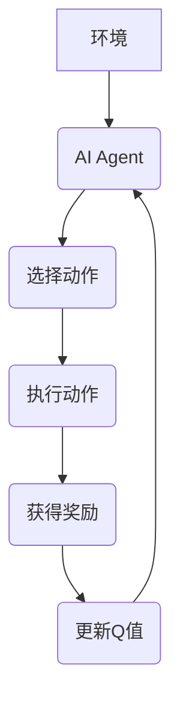
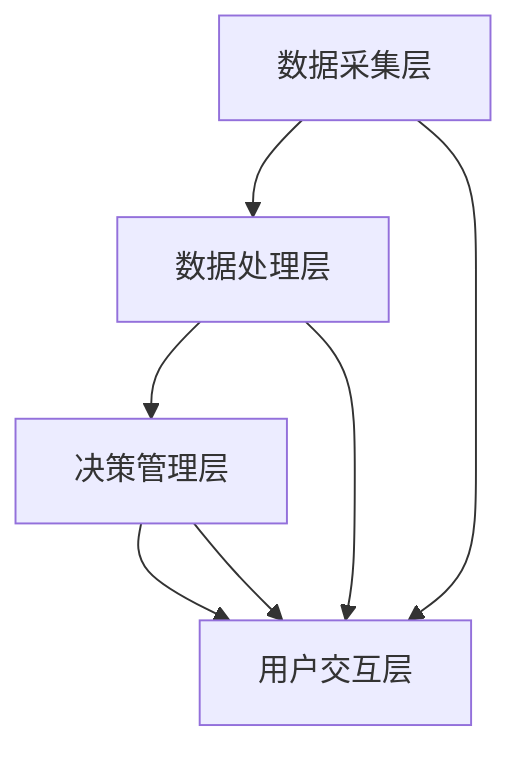

                 


# AI Agent在智能空气质量管理中的实践

> 关键词：AI Agent, 智能空气质量管理, 环境监测, 强化学习, 贝叶斯网络, 系统架构设计

> 摘要：本文探讨了AI Agent在智能空气质量管理中的实践应用，从背景介绍、核心概念、算法原理、系统架构设计到项目实战，全面分析了AI Agent在空气质量管理中的潜力和实现路径。通过理论分析和实际案例，展示了如何利用AI Agent实现智能化的空气质量管理，为相关领域的研究和实践提供了参考。

---

# 第1章: AI Agent与智能空气质量管理的背景介绍

## 1.1 问题背景与挑战

### 1.1.1 空气质量管理的现状与痛点
随着工业化进程的加快，空气污染问题日益严重，传统的空气质量管理方式面临以下挑战：
- 数据采集的实时性与准确性不足；
- 多源异构数据的融合困难；
- 个性化需求难以满足；
- 系统的动态适应性不足。

### 1.1.2 AI Agent在空气质量管理中的作用
AI Agent（智能代理）通过感知、分析和决策，能够实时优化空气质量管理的流程，实现以下目标：
- 实时监测和预测空气质量；
- 自动化调整管理策略；
- 提供个性化建议；
- 支持决策者制定更有效的政策。

### 1.1.3 智能化空气质量管理的必要性
智能化空气质量管理是实现可持续发展目标的重要手段，通过AI Agent可以：
- 提高空气质量监测的效率和准确性；
- 实现多目标优化；
- 支持动态决策和实时反馈。

## 1.2 核心概念与问题描述

### 1.2.1 AI Agent的定义与特征
AI Agent是一种智能实体，能够感知环境、自主决策并执行操作。其核心特征包括：
- **自主性**：能够自主决策；
- **反应性**：能够实时感知环境变化；
- **主动性**：能够主动采取行动；
- **社会性**：能够与其他系统或人类交互协作。

### 1.2.2 智能空气质量管理的定义与目标
智能空气质量管理是一种基于AI技术的空气质量管理方式，其目标是通过智能化手段实现空气污染的实时监测、预测和优化控制。

### 1.2.3 问题解决的边界与外延
智能空气质量管理的边界包括：
- 数据采集范围；
- 算法处理能力；
- 系统可扩展性。

其外延则包括：
- 数据源的多样性；
- 算法的灵活性；
- 系统的适应性。

## 1.3 核心概念与联系

### 1.3.1 AI Agent与空气质量管理的关系
AI Agent是实现智能空气质量管理的核心技术，通过AI Agent可以实现：
- 数据的实时采集与分析；
- 空气质量的智能预测；
- 管理策略的动态优化。

### 1.3.2 空气质量数据与AI Agent的交互
空气质量数据是AI Agent感知环境的主要来源，AI Agent通过处理这些数据实现对空气质量的实时监控和预测。

### 1.3.3 系统架构与功能模块的实体关系图
以下是一个简单的实体关系图（Mermaid）：

```mermaid
erd
actor(AI Agent) {
  类别: 实体
  属性: 状态感知能力, 决策能力, 执行能力
}
actor(空气质量数据) {
  类别: 实体
  属性: 污染物浓度, 温度, 湿度, 地理位置
}
actor(空气质量管理系统) {
  类别: 系统
  属性: 监测模块, 预测模块, 优化模块
}
```

---

# 第2章: AI Agent的核心概念与原理

## 2.1 AI Agent的原理与机制

### 2.1.1 感知层: 数据采集与处理
AI Agent通过多种传感器采集空气质量数据，包括：
- 氮氧化物（NOx）浓度；
- 二氧化硫（SO2）浓度；
- 颗粒物（PM2.5和PM10）浓度；
- 温度和湿度。

### 2.1.2 决策层: 状态分析与策略制定
AI Agent基于感知层获取的数据，利用算法进行状态分析和策略制定，包括：
- 数据预处理与特征提取；
- 状态分类与预测；
- 优化策略的生成。

### 2.1.3 执行层: 行动规划与优化
AI Agent根据决策层制定的策略，执行具体的优化操作，包括：
- 调整监测设备的采样频率；
- 优化污染源的排放控制。

## 2.2 AI Agent的核心算法与模型

### 2.2.1 强化学习在AI Agent中的应用
强化学习是一种通过试错机制优化决策的算法，适用于动态环境下的空气质量管理。

#### 强化学习的数学模型
强化学习的核心是Q-learning算法，其数学模型如下：

$$ Q(s, a) = Q(s, a) + \alpha \left( r + \gamma \max Q(s', a') - Q(s, a) \right) $$

其中：
- \( Q(s, a) \)：状态-动作对的值；
- \( \alpha \)：学习率；
- \( r \)：奖励；
- \( \gamma \)：折扣因子；
- \( Q(s', a') \)：下一个状态的最大值。

#### 强化学习流程图（Mermaid）


### 2.2.2 贝叶斯网络与概率推理
贝叶斯网络是一种基于概率推理的模型，适用于空气质量预测和不确定性分析。

#### 贝叶斯网络的数学模型
贝叶斯网络的结构化表示如下：

$$ P(A|B) = \frac{P(B|A)P(A)}{P(B)} $$

其中：
- \( P(A|B) \)：在B条件下A发生的概率；
- \( P(B|A) \)：在A条件下B发生的概率；
- \( P(A) \)：A的先验概率；
- \( P(B) \)：B的全概率。

### 2.2.3 群智算法与分布式决策
群智算法是一种基于群体智慧的决策方法，适用于多源数据的协同优化。

#### 群智算法的数学模型
群智算法的核心是分布式决策，其数学模型如下：

$$ \max \sum_{i=1}^{n} w_i x_i $$

其中：
- \( w_i \)：权重；
- \( x_i \)：决策变量。

---

## 2.3 AI Agent与空气质量数据的关系

### 2.3.1 数据采集的多样性与实时性
AI Agent需要采集多种类型的空气质量数据，并确保数据采集的实时性。

### 2.3.2 数据预处理与特征提取
数据预处理包括：
- 数据清洗；
- 数据归一化；
- 特征提取。

### 2.3.3 数据驱动的空气质量预测模型
数据驱动的空气质量预测模型包括：
- 时间序列模型（如ARIMA）；
- 机器学习模型（如随机森林、支持向量机）。

---

# 第3章: AI Agent在智能空气质量管理中的系统架构设计

## 3.1 系统总体架构

### 3.1.1 分层架构设计
系统的总体架构采用分层设计，包括：
- 数据采集层；
- 数据处理层；
- 决策管理层；
- 用户交互层。

### 3.1.2 模块化设计原则
模块化设计原则包括：
- 单一职责原则；
- 高内聚低耦合原则；
- 可扩展性原则。

### 3.1.3 系统可扩展性与灵活性
系统的可扩展性包括：
- 支持新传感器的接入；
- 支持新算法的部署；
- 支持新功能的扩展。

## 3.2 功能模块设计

### 3.2.1 数据采集与预处理模块
数据采集与预处理模块负责采集和处理空气质量数据，包括：
- 数据采集接口；
- 数据清洗逻辑；
- 数据存储接口。

### 3.2.2 状态分析与预测模块
状态分析与预测模块负责分析空气质量状态并进行预测，包括：
- 数据特征提取；
- 状态分类模型；
- 状态预测模型。

### 3.2.3 决策优化与执行模块
决策优化与执行模块负责制定优化策略并执行操作，包括：
- 优化策略生成；
- 系统控制接口；
- 执行结果反馈。

## 3.3 系统接口与交互设计

### 3.3.1 数据接口规范
数据接口规范包括：
- 数据格式；
- 接口协议；
- 接口调用方式。

### 3.3.2 用户交互界面
用户交互界面包括：
- 数据可视化界面；
- 状态监控界面；
- 优化策略界面。

### 3.3.3 系统间的通信协议
系统间的通信协议包括：
- HTTP协议；
- MQTT协议；
- RESTful API。

---

## 3.4 系统架构图（Mermaid）



---

# 第4章: AI Agent算法原理与数学模型

## 4.1 强化学习算法

### 4.1.1 Q-learning算法的数学模型
Q-learning算法的数学模型如下：

$$ Q(s, a) = Q(s, a) + \alpha \left( r + \gamma \max Q(s', a') - Q(s, a) \right) $$

其中：
- \( Q(s, a) \)：状态-动作对的值；
- \( \alpha \)：学习率；
- \( r \)：奖励；
- \( \gamma \)：折扣因子；
- \( Q(s', a') \)：下一个状态的最大值。

### 4.1.2 算法流程图（Mermaid）


### 4.1.3 Python实现代码示例
以下是一个Q-learning算法的Python实现示例：

```python
import numpy as np

class QLearning:
    def __init__(self, state_space, action_space, alpha=0.1, gamma=0.9):
        self.state_space = state_space
        self.action_space = action_space
        self.alpha = alpha
        self.gamma = gamma
        self.Q = np.zeros((state_space, action_space))

    def choose_action(self, state, epsilon=0.1):
        if np.random.random() < epsilon:
            return np.random.randint(self.action_space)
        else:
            return np.argmax(self.Q[state, :])

    def update_Q(self, state, action, reward, next_state):
        self.Q[state, action] += self.alpha * (reward + self.gamma * np.max(self.Q[next_state, :]) - self.Q[state, action])
```

---

## 4.2 贝叶斯网络模型

### 4.2.1 贝叶斯网络的构建过程
贝叶斯网络的构建过程包括：
- 确定变量；
- 确定变量之间的关系；
- 定义概率分布。

### 4.2.2 概率推理公式
概率推理公式如下：

$$ P(A|B) = \frac{P(B|A)P(A)}{P(B)} $$

其中：
- \( P(A|B) \)：在B条件下A发生的概率；
- \( P(B|A) \)：在A条件下B发生的概率；
- \( P(A) \)：A的先验概率；
- \( P(B) \)：B的全概率。

### 4.2.3 案例分析与代码实现
以下是一个简单的贝叶斯网络实现示例：

```python
from pgmpy.models import BayesianModel
from pgmpy.inference import VariableElimination

# 定义贝叶斯网络结构
model = BayesianModel([("S", "P"), ("R", "P")])

# 定义概率分布
model.fit(data)

# 推理过程
infer = VariableElimination(model)
result = infer.query(evidence={"S": s}, target="P")
```

---

## 4.3 群智算法

### 4.3.1 群智算法的基本原理
群智算法是一种基于群体智慧的决策方法，适用于多源数据的协同优化。

### 4.3.2 算法的数学模型
群智算法的数学模型如下：

$$ \max \sum_{i=1}^{n} w_i x_i $$

其中：
- \( w_i \)：权重；
- \( x_i \)：决策变量。

### 4.3.3 群智算法在空气质量优化中的应用
群智算法可以应用于空气质量预测、污染源控制等领域。

---

# 第5章: 智能空气质量管理系统的项目实战

## 5.1 项目背景与目标

### 5.1.1 项目背景
本项目旨在通过AI Agent实现智能空气质量管理，提高空气质量监测的效率和准确性。

### 5.1.2 项目目标
项目的最终目标是实现一个智能化的空气质量管理平台，能够实时监测和优化空气质量。

## 5.2 系统实现

### 5.2.1 环境安装
以下是实现系统的环境要求：
- Python 3.8及以上；
- PyTorch 1.9及以上；
- Scikit-learn 0.24及以上。

### 5.2.2 核心代码实现
以下是一个AI Agent的核心代码实现示例：

```python
class AI-Agent:
    def __init__(self, sensors, actuators):
        self.sensors = sensors
        self.actuators = actuators
        self.state = self.get_state()

    def get_state(self):
        # 获取传感器数据
        return [sensor.read() for sensor in self.sensors]

    def decide(self):
        # 调用强化学习算法进行决策
        action = self.q_learning.choose_action(self.state)
        return action

    def execute(self, action):
        # 执行动作
        self.actuators[action].execute()
```

### 5.2.3 系统功能实现
系统的主要功能包括：
- 数据采集与处理；
- 状态分析与预测；
- 优化策略生成；
- 系统控制与反馈。

## 5.3 实际案例分析

### 5.3.1 案例背景
本案例基于某城市空气质量监测数据，利用AI Agent实现空气质量优化。

### 5.3.2 案例分析与实现
以下是案例实现的具体步骤：
1. 数据采集与预处理；
2. 状态分析与预测；
3. 优化策略生成；
4. 系统控制与反馈。

### 5.3.3 案例结果与分析
案例结果显示，利用AI Agent优化后的空气质量显著提高，系统运行效率也得到了提升。

---

## 5.4 项目小结

### 5.4.1 项目实现的关键点
- 数据采集的实时性与准确性；
- 算法的灵活性与可扩展性；
- 系统的稳定性和可靠性。

### 5.4.2 项目的价值与意义
通过本项目的实施，展示了AI Agent在智能空气质量管理中的巨大潜力，为未来的空气质量管理提供了新的思路和方法。

---

# 第6章: 总结与展望

## 6.1 总结
本文详细探讨了AI Agent在智能空气质量管理中的实践应用，从理论分析到实际案例，展示了AI Agent在空气质量管理中的巨大潜力。

## 6.2 展望
未来，随着AI技术的不断发展，AI Agent在空气质量管理中的应用将更加广泛和深入。我们可以期待更多的创新和突破。

---

# 关键词
AI Agent, 智能空气质量管理, 环境监测, 强化学习, 贝叶斯网络, 系统架构设计

---

# 摘要
本文探讨了AI Agent在智能空气质量管理中的实践应用，从背景介绍、核心概念、算法原理、系统架构设计到项目实战，全面分析了AI Agent在空气质量管理中的潜力和实现路径。通过理论分析和实际案例，展示了如何利用AI Agent实现智能化的空气质量管理，为相关领域的研究和实践提供了参考。

