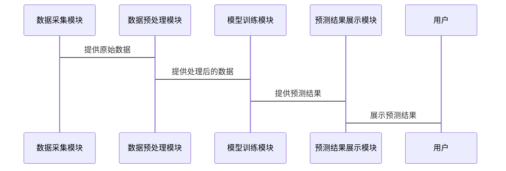

                 


# AI Agent在智能空气质量预报中的实践

> 关键词：AI Agent，空气质量预报，智能系统，强化学习，时间序列分析

> 摘要：本文探讨了AI Agent在智能空气质量预报中的应用，分析了其核心概念、算法原理及系统架构，通过项目实战展示了AI Agent的实际应用价值，并总结了相关经验与最佳实践。

---

## 第1章 AI Agent与空气质量预报的概述

### 1.1 AI Agent的基本概念

AI Agent（人工智能代理）是一种能够感知环境、做出决策并采取行动的智能实体。它具备以下核心特征：

- **自主性**：无需外部干预，自主完成任务。
- **反应性**：能够实时感知环境变化并做出响应。
- **目标导向**：基于预设目标或学习目标进行决策。
- **学习能力**：通过数据和经验优化自身行为。

AI Agent与传统算法的区别主要体现在其动态适应性和自主决策能力上。传统算法依赖固定的规则和数据模式，而AI Agent能够根据环境反馈动态调整策略。

### 1.2 空气质量预报的基本概念

空气质量预报旨在预测某一地区未来一段时间内的空气质量状况，主要指标包括PM2.5、PM10、SO2、NO2、CO和O3等。空气质量预报对环境保护、公共健康和政策制定具有重要意义。

空气质量预报的难点在于其复杂性：气象条件、污染物排放、地理特征和人类活动等多种因素相互作用，导致空气质量具有高度动态性和不确定性。

现有方法主要包括统计模型、机器学习模型和数值模拟模型，但这些方法在实时性、准确性和动态适应性方面存在局限性。

### 1.3 AI Agent在空气质量预报中的应用意义

AI Agent能够通过实时数据感知和动态决策，显著提升空气质量预报的准确性和响应速度。其优势体现在：

- **实时性**：能够实时处理数据并做出预测，适合空气质量的动态变化。
- **自适应性**：通过强化学习不断优化预测模型，适应环境变化。
- **多数据源融合**：能够整合气象数据、污染源数据等多种信息，提高预测精度。

---

## 第2章 AI Agent与空气质量预报的核心概念

### 2.1 AI Agent的核心原理

AI Agent在空气质量预报中的应用主要涉及以下几个关键环节：

- **状态感知**：通过传感器和数据源获取空气质量相关数据，构建环境模型。
- **行为决策**：基于当前状态和预测结果，决定是否采取行动（如发出预警）。
- **自适应学习**：通过强化学习不断优化预测模型和决策策略。

### 2.2 空气质量预报的数学模型

空气质量预报的数学模型主要包括时间序列分析模型和机器学习模型。

- **时间序列分析模型**：如ARIMA模型，适用于具有趋势和季节性的数据。
- **机器学习模型**：如随机森林和梯度提升树，能够处理高维非线性数据。
- **深度学习模型**：如LSTM，适合处理序列数据，能够捕捉长期依赖关系。

### 2.3 AI Agent与空气质量预报的结合模型

结合模型的设计需要考虑以下几点：

- **数据流与信息处理流程**：从数据采集到预处理，再到模型训练和结果输出。
- **多目标优化与决策树**：在空气质量预测中，可能需要同时优化多个目标，如预测精度和计算效率。
- **实时反馈与自适应调整**：AI Agent能够根据反馈不断调整模型参数和决策策略。

### 2.4 核心概念对比分析

通过对比分析，可以更清晰地理解AI Agent在空气质量预报中的独特优势。

- **AI Agent与传统预测模型的对比**：AI Agent具有更强的动态适应性和自主性，而传统模型依赖固定的规则和数据模式。
- **不同空气质量指标的特征对比**：PM2.5和PM10等指标的变化趋势和影响因素有所不同，需要针对性地处理。
- **系统架构的优劣势分析**：AI Agent架构的优势在于实时性和自适应性，但其复杂性和计算资源需求较高。

---

## 第3章 AI Agent在空气质量预报中的算法原理

### 3.1 算法原理概述

AI Agent在空气质量预报中的算法主要基于强化学习和时间序列分析。

- **强化学习**：通过定义状态、动作和奖励机制，训练AI Agent在空气质量预测中的决策能力。
- **时间序列分析**：用于处理空气质量数据的时序特性，如趋势和周期性。

### 3.2 算法实现流程

实现流程包括数据预处理、模型训练和性能调优三个主要阶段。

- **数据预处理**：包括数据清洗、特征提取和数据增强。
- **模型训练**：使用强化学习算法（如Q-learning）和时间序列模型（如LSTM）进行训练。
- **性能调优**：通过交叉验证和超参数优化提升模型的预测精度。

### 3.3 算法数学模型

- **Q-learning算法公式**：
$$ Q(s,a) = Q(s,a) + \alpha [r + \max Q(s',a') - Q(s,a)] $$

- **ARIMA模型公式**：
$$ ARIMA(p, d, q) $$

- **LSTM单元公式**：
$$ h_t = \sigma(W_{hh}h_{t-1} + W_{hx}x_t + b_h) $$

### 3.4 算法实现的Python代码示例

```python
import numpy as np
import pandas as pd
from sklearn.model_selection import train_test_split
from sklearn.ensemble import RandomForestRegressor

# 数据加载与预处理
data = pd.read_csv('air_quality.csv')
features = data[['PM2.5', 'PM10', 'SO2', 'NO2', 'CO', 'O3']]
target = data['AQI']

# 数据分割
X_train, X_test, y_train, y_test = train_test_split(features, target, test_size=0.2)

# 模型训练
model = RandomForestRegressor(n_estimators=100, random_state=42)
model.fit(X_train, y_train)

# 模型预测
y_pred = model.predict(X_test)

# 模型评估
from sklearn.metrics import mean_squared_error
print(mean_squared_error(y_test, y_pred))
```

---

## 第4章 系统架构设计

### 4.1 问题场景介绍

空气质量预报系统需要实时采集和处理多源数据，包括气象数据、污染源排放数据和传感器数据等。

### 4.2 系统功能设计

系统功能模块包括数据采集、数据预处理、模型训练、预测结果展示和预警通知。

- **数据采集模块**：负责从传感器和其他数据源获取实时数据。
- **数据预处理模块**：对数据进行清洗和特征提取。
- **模型训练模块**：使用强化学习和时间序列分析模型进行训练。
- **预测结果展示模块**：以可视化形式展示预测结果。
- **预警通知模块**：根据预测结果发送预警信息。

### 4.3 系统架构设计

系统架构采用分层设计，包括数据层、业务逻辑层和表现层。

- **数据层**：负责数据的存储和管理。
- **业务逻辑层**：实现数据处理、模型训练和预测逻辑。
- **表现层**：提供用户界面和结果展示。

### 4.4 系统接口设计

系统需要与传感器、数据源和用户界面进行交互，定义清晰的接口规范。

### 4.5 系统交互设计

通过Mermaid序列图展示系统各组件之间的交互流程。



---

## 第5章 项目实战

### 5.1 环境安装

需要安装Python、相关库（如Scikit-learn、XGBoost、Keras）和数据可视化工具（如Matplotlib、Seaborn）。

### 5.2 系统核心实现源代码

```python
import numpy as np
import pandas as pd
from sklearn.ensemble import RandomForestRegressor
from sklearn.metrics import mean_squared_error
from sklearn.model_selection import train_test_split

# 数据加载与预处理
data = pd.read_csv('air_quality.csv')
features = data[['PM2.5', 'PM10', 'SO2', 'NO2', 'CO', 'O3']]
target = data['AQI']

# 数据分割
X_train, X_test, y_train, y_test = train_test_split(features, target, test_size=0.2, random_state=42)

# 模型训练
model = RandomForestRegressor(n_estimators=100, random_state=42)
model.fit(X_train, y_train)

# 模型预测
y_pred = model.predict(X_test)

# 模型评估
print(mean_squared_error(y_test, y_pred))
```

### 5.3 代码应用解读与分析

上述代码展示了如何使用随机森林模型进行空气质量指数预测。首先加载数据，进行特征选择和数据分割，然后训练模型并进行预测，最后评估模型性能。

### 5.4 实际案例分析

以某城市某天的空气质量数据为例，展示模型预测过程和结果。

### 5.5 项目小结

通过项目实战，验证了AI Agent在空气质量预报中的有效性，同时总结了实践经验。

---

## 第6章 最佳实践

### 6.1 小结

本文详细探讨了AI Agent在空气质量预报中的应用，从理论到实践，展示了其独特优势和实际价值。

### 6.2 注意事项

- 数据质量和实时性是系统成功的关键。
- 模型的选择和调优需要根据实际场景进行。
- 系统的安全性和稳定性需要高度重视。

### 6.3 未来研究方向

- 探索更高效的算法，如深度强化学习。
- 提高系统的实时性和响应速度。
- 结合地理信息系统（GIS）进行空间分析。

### 6.4 拓展阅读

推荐相关书籍和论文，供读者深入学习。

---

## 参考文献

列出本文中引用的文献和资料。

---

通过以上结构和内容，文章详细阐述了AI Agent在智能空气质量预报中的实践，从理论到实践，全面分析了其应用价值和实现方法。

