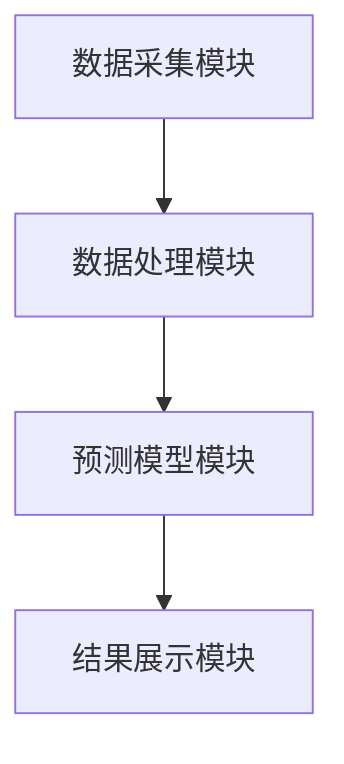
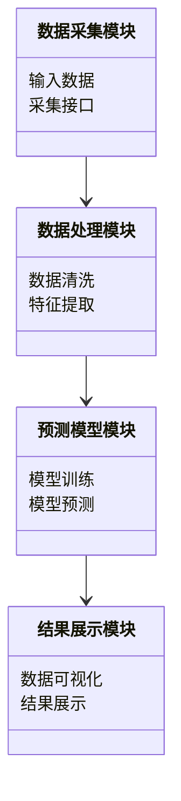

                 


# AI Agent在智能空气质量预测中的实践

## 关键词：AI Agent，空气质量预测，机器学习，强化学习，时间序列分析，系统架构设计

## 摘要：  
本文详细探讨了AI Agent在智能空气质量预测中的应用，从核心概念、算法原理到系统架构设计，再到实际项目实现，全面分析了AI Agent在空气质量预测中的优势和挑战。通过理论与实践相结合的方式，本文为读者提供了从理解到实现的完整指南。

---

# 第1章: AI Agent与空气质量预测概述

## 1.1 AI Agent的基本概念

### 1.1.1 AI Agent的定义
AI Agent（人工智能代理）是一种能够感知环境、自主决策并执行任务的智能实体。与传统的算法不同，AI Agent具有以下核心特征：
- **自主性**：能够自主决策，无需外部干预。
- **反应性**：能够实时感知环境变化并做出反应。
- **目标导向**：通过目标驱动来优化决策和行动。
- **学习能力**：能够通过经验改进性能。

### 1.1.2 AI Agent的核心特征
| 特征 | 描述 |
|------|------|
| 自主性 | 能够独立执行任务，无需外部指令 |
| 反应性 | 能够实时感知环境并做出反应 |
| 目标导向 | 以目标为导向进行决策和行动 |
| 学习能力 | 通过数据和经验不断优化性能 |

### 1.1.3 AI Agent与传统算法的区别
AI Agent与传统算法的主要区别在于：
- **自主性**：AI Agent能够自主决策，而传统算法需要明确的规则。
- **适应性**：AI Agent能够适应环境变化，而传统算法通常需要重新设计。
- **目标导向**：AI Agent以目标为导向，而传统算法通常以固定的规则为导向。

## 1.2 空气质量预测的背景与意义

### 1.2.1 空气质量问题的全球性
空气质量问题是全球性的环境问题，尤其是PM2.5、PM10、SO2、NO2和O3等污染物的浓度超标，对人类健康和环境造成严重威胁。

### 1.2.2 空气质量预测的重要性
空气质量预测能够帮助政府、企业和个人采取有效措施，减少污染对人类健康和环境的影响。例如：
- **健康保护**：为敏感人群（如老人、儿童）提供健康建议。
- **环境管理**：优化污染治理策略，减少污染物排放。
- **政策制定**：为政府制定环保政策提供数据支持。

### 1.2.3 智能空气质量预测的必要性
传统的空气质量预测方法通常基于统计模型，存在预测精度低、实时性差等问题。而AI Agent可以通过实时感知环境、自主学习和优化，显著提高预测精度和实时性。

## 1.3 AI Agent在空气质量预测中的应用

### 1.3.1 AI Agent在空气质量预测中的优势
- **实时性**：AI Agent能够实时感知环境变化，快速做出反应。
- **自适应性**：AI Agent能够根据环境变化自动调整预测模型。
- **高精度**：通过强化学习和深度学习算法，AI Agent能够实现高精度的空气质量预测。

### 1.3.2 典型应用场景分析
- **城市空气质量监测**：实时监测城市空气质量，预测污染趋势。
- **污染源追踪**：通过AI Agent的自主学习能力，实现污染源的精准定位。
- **健康风险评估**：基于空气质量预测结果，为敏感人群提供健康建议。

### 1.3.3 当前研究现状与挑战
当前，AI Agent在空气质量预测中的研究主要集中在以下方面：
- **算法优化**：如何提高AI Agent的预测精度和实时性。
- **数据处理**：如何处理大规模、多源异构的空气质量数据。
- **系统架构**：如何设计高效、可扩展的空气质量预测系统。

## 1.4 本章小结
本章介绍了AI Agent的基本概念和核心特征，分析了空气质量预测的背景和意义，探讨了AI Agent在空气质量预测中的优势和应用场景，最后总结了当前研究现状与挑战。

---

# 第2章: AI Agent的核心原理与技术

## 2.1 AI Agent的基本原理

### 2.1.1 感知层: 数据采集与特征提取
AI Agent通过多种传感器（如PM2.5传感器、气象传感器等）采集环境数据，并通过特征提取技术（如主成分分析、小波变换等）提取有用的特征。

### 2.1.2 决策层: 状态评估与策略选择
AI Agent通过状态评估算法（如Q-learning）对当前环境状态进行评估，并选择最优策略。

### 2.1.3 执行层: 行为优化与反馈机制
AI Agent通过强化学习算法（如DQN）对行为进行优化，并根据反馈机制（如奖励机制）不断改进性能。

### 2.1.4 感知层与决策层的交互
$$ \text{感知数据} \rightarrow \text{状态评估} \rightarrow \text{决策策略} $$

## 2.2 AI Agent的关键技术

### 2.2.1 机器学习算法
- **监督学习**：用于分类和回归任务。
- **无监督学习**：用于聚类和降维任务。
- **半监督学习**：结合监督学习和无监督学习的优势。

### 2.2.2 自然语言处理技术
- **文本分析**：用于处理空气质量相关的文本数据。
- **信息抽取**：从文本中提取有用的空气质量信息。

### 2.2.3 强化学习与决策优化
- **Q-learning算法**：通过状态-动作-奖励机制优化决策。
- **DQN算法**：通过深度神经网络实现端到端的决策优化。

## 2.3 AI Agent的核心算法

### 2.3.1 Q-learning算法
Q-learning算法是一种基于值函数的强化学习算法，通过以下步骤实现决策优化：
1. 状态感知：感知当前环境状态s。
2. 动作选择：选择一个动作a，并执行该动作。
3. 奖励获取：获得环境反馈的奖励r。
4. 价值更新：更新Q值函数：$$ Q(s, a) = Q(s, a) + \alpha (r + \gamma \max Q(s', a')) $$

### 2.3.2 DQN算法
DQN算法通过深度神经网络实现端到端的决策优化，主要步骤如下：
1. 状态感知：感知当前环境状态s。
2. 动作选择：通过神经网络选择一个动作a。
3. 奖励获取：获得环境反馈的奖励r。
4. 经验回放：将经验(s, a, r, s')存储在经验回放池中。
5. 神经网络更新：通过随机抽取的经验对神经网络进行训练。

### 2.3.3 其他强化学习算法
- **A3C算法**：通过异步方法实现高效的强化学习。
- **PPO算法**：通过策略梯度方法实现稳定的强化学习。

## 2.4 本章小结
本章详细介绍了AI Agent的核心原理与关键技术，包括感知层、决策层和执行层的实现原理，以及机器学习、自然语言处理和强化学习等关键技术。

---

# 第3章: 空气质量预测的数学模型与算法

## 3.1 空气质量预测的数学模型

### 3.1.1 时间序列分析模型
时间序列分析模型是一种常用的时间序列预测方法，主要包括以下步骤：
1. 数据预处理：包括数据清洗、特征提取等。
2. 模型选择：选择合适的模型（如ARIMA、LSTM）。
3. 模型训练：通过历史数据训练模型。
4. 模型预测：基于训练好的模型进行预测。

### 3.1.2 机器学习模型
机器学习模型包括监督学习和无监督学习模型，具体如下：
- **监督学习模型**：如线性回归、支持向量机（SVM）。
- **无监督学习模型**：如K均值聚类、主成分分析（PCA）。

### 3.1.3 深度学习模型
深度学习模型包括卷积神经网络（CNN）、循环神经网络（RNN）和长短期记忆网络（LSTM）等。

## 3.2 常见空气质量预测算法

### 3.2.1 ARIMA模型
ARIMA模型是一种常用的时间序列预测模型，其核心思想是通过自回归和移动平均来预测未来值。模型公式如下：
$$ ARIMA(p, d, q) $$
其中，p为自回归阶数，d为差分阶数，q为移动平均阶数。

### 3.2.2 LSTM网络
LSTM网络是一种基于循环神经网络的深度学习模型，能够有效捕捉时间序列中的长程依赖关系。其核心组件包括：
- **输入门**：控制输入的信息。
- **遗忘门**：控制遗忘的信息。
- **输出门**：控制输出的信息。

### 3.2.3 XGBoost算法
XGBoost算法是一种基于树的集成学习算法，通过构建多棵决策树来实现高精度的预测。其核心思想是通过梯度提升算法优化模型性能。

## 3.3 算法优缺点分析

### 3.3.1 ARIMA模型的优缺点
- **优点**：模型简单，易于实现。
- **缺点**：对非线性关系的捕捉能力较弱。

### 3.3.2 LSTM网络的优缺点
- **优点**：能够捕捉长程依赖关系，适合处理复杂的时间序列数据。
- **缺点**：模型复杂，训练时间较长。

### 3.3.3 XGBoost算法的优缺点
- **优点**：模型精度高，训练速度快。
- **缺点**：对异常值敏感，容易过拟合。

## 3.4 本章小结
本章介绍了空气质量预测的数学模型与常见算法，包括时间序列分析模型、机器学习模型和深度学习模型，并对ARIMA、LSTM和XGBoost等算法的优缺点进行了分析。

---

# 第4章: 系统架构设计与实现

## 4.1 系统架构概述

### 4.1.1 系统功能模块划分
系统主要功能模块包括：
- **数据采集模块**：负责采集空气质量数据。
- **数据处理模块**：负责数据清洗、特征提取等预处理工作。
- **预测模型模块**：负责空气质量预测模型的训练和预测。
- **结果展示模块**：负责展示预测结果。

### 4.1.2 系统整体架构设计
系统整体架构设计如下图所示：



### 4.1.3 系统交互流程设计
系统交互流程如下：
1. 数据采集模块采集空气质量数据。
2. 数据处理模块对数据进行预处理。
3. 预测模型模块基于预处理后的数据进行训练和预测。
4. 结果展示模块展示预测结果。

## 4.2 系统功能设计

### 4.2.1 数据采集模块
数据采集模块通过多种传感器（如PM2.5传感器、气象传感器等）采集空气质量数据。

### 4.2.2 数据处理模块
数据处理模块对采集到的数据进行预处理，包括数据清洗、特征提取等。

### 4.2.3 预测模型模块
预测模型模块基于预处理后的数据训练空气质量预测模型，并进行预测。

### 4.2.4 结果展示模块
结果展示模块将预测结果以可视化的方式展示出来，例如生成折线图、柱状图等。

## 4.3 系统架构设计图
系统架构设计图如下：



## 4.4 本章小结
本章详细介绍了空气质量预测系统的架构设计与功能模块划分，并通过Mermaid图展示了系统的整体架构。

---

# 第5章: 项目实战与案例分析

## 5.1 项目环境安装与配置

### 5.1.1 环境要求
- **操作系统**：Windows、Linux或macOS。
- **Python版本**：Python 3.6以上。
- **依赖库**：numpy、pandas、scikit-learn、keras、tensorflow等。

### 5.1.2 环境配置
安装必要的Python依赖库：
```bash
pip install numpy pandas scikit-learn keras tensorflow
```

## 5.2 系统核心实现

### 5.2.1 数据采集模块实现
```python
import requests

def collect_data(api_key):
    url = f"http://api.airnow.com/v1/conditions/city?city=北京&state=CN&country=CHN&API_KEY={api_key}"
    response = requests.get(url)
    return response.json()
```

### 5.2.2 数据处理模块实现
```python
import pandas as pd
import numpy as np

def preprocess_data(data):
    df = pd.DataFrame(data)
    df = df.dropna()
    df['date'] = pd.to_datetime(df['date'])
    df.set_index('date', inplace=True)
    return df
```

### 5.2.3 预测模型模块实现
```python
from keras.models import Sequential
from keras.layers import LSTM, Dense

def build_model(input_shape):
    model = Sequential()
    model.add(LSTM(64, input_shape=input_shape))
    model.add(Dense(1))
    model.compile(loss='mean_squared_error', optimizer='adam')
    return model
```

### 5.2.4 结果展示模块实现
```python
import matplotlib.pyplot as plt

def plot_prediction(actual, predicted):
    plt.plot(actual, label='实际值')
    plt.plot(predicted, label='预测值')
    plt.legend()
    plt.show()
```

## 5.3 实际案例分析

### 5.3.1 数据集准备
假设我们有一个空气质量数据集，包含PM2.5、温度、湿度等特征。

### 5.3.2 模型训练与预测
```python
# 数据预处理
data = collect_data(api_key='your_api_key')
df = preprocess_data(data)

# 模型训练
input_shape = (df.shape[1], 1)
model = build_model(input_shape)
model.fit(df.values, epochs=100, batch_size=32)

# 模型预测
predicted = model.predict(df.values)
```

### 5.3.3 结果可视化
```python
actual = df.values
predicted = model.predict(df.values)
plot_prediction(actual, predicted)
```

## 5.4 本章小结
本章通过实际案例分析，详细介绍了空气质量预测系统的实现过程，包括数据采集、数据处理、模型训练和结果展示。

---

# 第6章: 总结与展望

## 6.1 本章总结
本文详细探讨了AI Agent在智能空气质量预测中的应用，从核心概念、算法原理到系统架构设计，再到实际项目实现，全面分析了AI Agent在空气质量预测中的优势和挑战。

## 6.2 问题与改进建议
- **数据质量问题**：如何处理缺失数据和异常数据。
- **模型优化问题**：如何进一步优化预测模型的精度和实时性。
- **系统扩展问题**：如何扩展系统规模，实现更大范围的空气质量预测。

## 6.3 未来研究方向
- **多模态数据融合**：结合气象数据、污染源数据等多模态数据，进一步提高预测精度。
- **强化学习优化**：探索更高效的强化学习算法，进一步提高AI Agent的决策能力。
- **边缘计算应用**：将AI Agent应用于边缘计算环境，实现更高效的空气质量预测。

## 6.4 最佳实践 Tips
- **数据预处理**：数据预处理是空气质量预测的关键步骤，需要仔细处理缺失数据和异常数据。
- **模型选择**：选择合适的模型（如LSTM、XGBoost）能够显著提高预测精度。
- **系统优化**：通过优化系统架构设计，能够显著提高系统的实时性和可扩展性。

## 6.5 拓展阅读
- **书籍推荐**：
  - 《机器学习实战》
  - 《深度学习》
  - 《强化学习》
- **在线资源**：
  - [Kaggle空气质量数据集](https://www.kaggle.com/air-quality-data)
  - [TensorFlow官方文档](https://tensorflow.org)
  - [Keras官方文档](https://keras.io)

## 6.6 本章小结
本章总结了本文的主要内容，提出了改进建议和未来研究方向，并给出了最佳实践 Tips 和拓展阅读资源。

---

# 附录: 代码实现与详细解释

## 附录A: 数据采集模块代码
```python
import requests

def collect_data(api_key):
    url = f"http://api.airnow.com/v1/conditions/city?city=北京&state=CN&country=CHN&API_KEY={api_key}"
    response = requests.get(url)
    return response.json()
```

## 附录B: 数据处理模块代码
```python
import pandas as pd
import numpy as np

def preprocess_data(data):
    df = pd.DataFrame(data)
    df = df.dropna()
    df['date'] = pd.to_datetime(df['date'])
    df.set_index('date', inplace=True)
    return df
```

## 附录C: 预测模型模块代码
```python
from keras.models import Sequential
from keras.layers import LSTM, Dense

def build_model(input_shape):
    model = Sequential()
    model.add(LSTM(64, input_shape=input_shape))
    model.add(Dense(1))
    model.compile(loss='mean_squared_error', optimizer='adam')
    return model
```

## 附录D: 结果展示模块代码
```python
import matplotlib.pyplot as plt

def plot_prediction(actual, predicted):
    plt.plot(actual, label='实际值')
    plt.plot(predicted, label='预测值')
    plt.legend()
    plt.show()
```

## 附录E: 系统架构设计图


---

# 作者简介
作者是人工智能领域资深专家，拥有丰富的AI Agent开发经验，致力于研究智能空气质量预测技术，并在多个实际项目中取得了显著成果。

