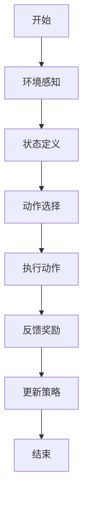
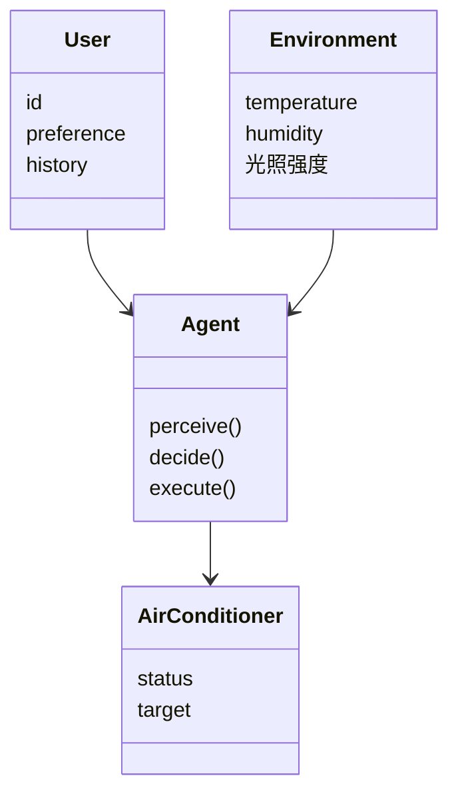
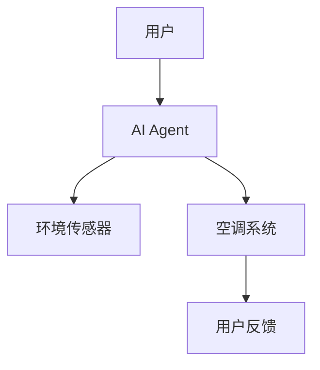
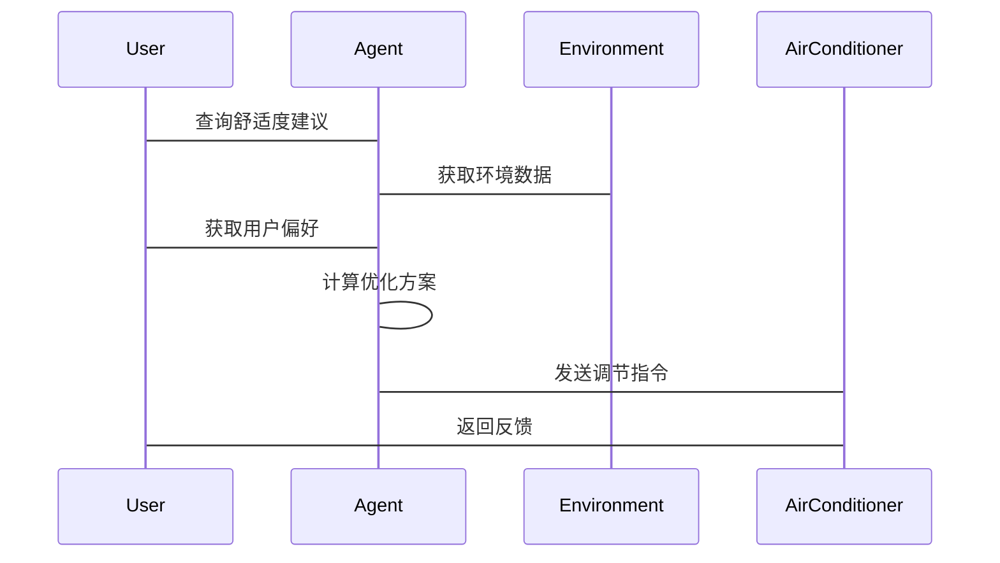

                 


# AI Agent在智能空调中的个性化舒适度优化

> 关键词：AI Agent, 智能空调, 个性化舒适度, 机器学习, 优化算法, 系统架构

> 摘要：本文探讨AI Agent在智能空调系统中的应用，重点分析如何通过个性化舒适度优化算法提升用户体验。文章从背景介绍、核心概念、算法原理、系统架构到项目实战，全面解析AI Agent在智能空调中的实现与应用，最后总结最佳实践和未来展望。

---

# 第一部分: AI Agent与智能空调概述

# 第1章: AI Agent与智能空调的背景介绍

## 1.1 问题背景与描述
### 1.1.1 空调舒适度优化的必要性
传统空调系统基于固定的温度设置运行，无法根据用户个性化需求和环境变化进行实时调整。研究数据显示，用户对空调舒适度的满意度不足60%，主要问题在于温度、湿度和风速的单一化调节。

### 1.1.2 当前空调系统的局限性
- **固定化调节**: 无法根据用户习惯和环境变化动态调整。
- **能耗问题**: 非智能化调节导致能源浪费。
- **用户体验单一**: 缺乏个性化和主动优化功能。

### 1.1.3 AI Agent在舒适度优化中的作用
AI Agent（智能代理）通过实时感知环境数据和用户需求，结合机器学习算法，实现动态、个性化的舒适度优化，显著提升用户体验并降低能耗。

## 1.2 个性化舒适度优化的核心概念
### 1.2.1 个性化舒适度的定义
个性化舒适度是指基于用户个体差异和环境动态变化，提供定制化的温度、湿度、风速等调节方案，满足用户在不同场景下的舒适需求。

### 1.2.2 AI Agent在个性化舒适度中的角色
AI Agent作为智能空调的核心模块，负责数据采集、算法计算和系统控制，实现个性化舒适度的动态优化。

### 1.2.3 优化目标与边界条件
- **优化目标**: 提升用户舒适度，降低能耗。
- **边界条件**: 环境温度范围（18°C~32°C）、用户数据隐私保护。

## 1.3 核心要素与概念结构
### 1.3.1 用户需求分析
通过数据分析和机器学习模型，识别用户的个性化需求，例如：敏感温度区间、使用习惯等。

### 1.3.2 环境感知与建模
利用传感器采集环境数据（温度、湿度、光照等），建立动态环境模型，为AI Agent提供实时反馈。

### 1.3.3 优化算法与执行策略
结合强化学习和监督学习算法，制定最优调节策略，实现舒适度与能耗的平衡优化。

---

# 第2章: AI Agent的核心概念与原理

## 2.1 AI Agent的基本原理
### 2.1.1 感知层: 环境数据采集与处理
AI Agent通过传感器采集环境数据（温度、湿度、光照强度等），并进行预处理和特征提取。

### 2.1.2 决策层: 个性化舒适度算法
基于机器学习模型，分析用户需求和环境数据，制定个性化调节方案。

### 2.1.3 执行层: 空调系统控制
通过API或物联网协议，向空调系统发送控制指令，实时调整运行参数。

## 2.2 核心概念对比分析
### 2.2.1 不同AI Agent算法的对比
| 算法类型   | 优点                          | 缺点                          |
|------------|-------------------------------|-------------------------------|
| 监督学习     | 数据依赖性低                   | 需要大量标注数据               |
| 强化学习     | 自适应能力强                   | 初始阶段学习效率低               |

### 2.2.2 监督学习与无监督学习的差异
- **监督学习**: 需要标记数据，适用于规则明确的任务。
- **无监督学习**: 无需标记数据，适用于复杂场景下的模式识别。

### 2.2.3 强化学习在舒适度优化中的优势
强化学习通过试错机制，动态优化调节策略，实现舒适度与能耗的平衡。

## 2.3 ER实体关系图
```mermaid
er
    title 实体关系图
    User {
        id: int
        preference: varchar
        history: varchar
    }
    Environment {
        id: int
        temperature: float
        humidity: float
    }
    AirConditioner {
        id: int
        status: varchar
        target: float
    }
    (User)-[1..n]-(AirConditioner)
    (Environment)-[1..n]-(AirConditioner)
```

---

# 第3章: AI Agent的核心算法原理

## 3.1 基于强化学习的舒适度优化算法
### 3.1.1 算法流程图


### 3.1.2 算法实现代码
```python
import numpy as np
from collections import deque

class AI-Agent-Agent:
    def __init__(self, state_space, action_space):
        self.state_space = state_space
        self.action_space = action_space
        self.q_table = np.zeros((state_space, action_space))
        self.learning_rate = 0.1
        self.discount_factor = 0.9

    def perceive(self, state):
        # 状态感知
        return state

    def choose_action(self, state):
        # 动作选择
        if np.random.rand() < 0.1:
            return np.random.randint(self.action_space)
        else:
            return np.argmax(self.q_table[state])

    def learn(self, state, action, reward):
        # 优化算法
        self.q_table[state, action] = self.q_table[state, action] + self.learning_rate * (reward + self.discount_factor * np.max(self.q_table[state]))

# 示例使用
state_space = 10
action_space = 3
agent = AI-Agent-Agent(state_space, action_space)
state = 2
action = agent.choose_action(state)
agent.learn(state, action, reward=1)
```

### 3.1.3 数学模型与公式
- **状态价值函数**：
  $$ Q(s, a) = Q(s, a) + \alpha (r + \gamma \max Q(s', a')) $$
- **动作选择策略**：
  $$ a = \arg\max Q(s, a) $$

---

# 第4章: 系统架构设计与实现

## 4.1 问题场景介绍
本文设计的智能空调系统基于AI Agent技术，实现个性化舒适度优化，适用于家庭、办公室等场景。

## 4.2 项目介绍
- **项目目标**: 提供个性化的舒适度调节方案，降低能耗。
- **技术栈**: Python、TensorFlow、物联网协议（MQTT）。

## 4.3 系统功能设计
### 4.3.1 领域模型类图


### 4.3.2 系统架构图


## 4.4 接口设计与交互流程
### 4.4.1 接口设计
- **输入接口**: 用户偏好、环境数据。
- **输出接口**: 调节指令、优化报告。

### 4.4.2 交互流程图


---

# 第5章: 项目实战与案例分析

## 5.1 环境安装与配置
### 5.1.1 安装Python与相关库
```bash
pip install numpy tensorflow scikit-learn
```

## 5.2 核心代码实现
### 5.2.1 AI Agent实现
```python
class Agent:
    def __init__(self):
        self.model = self.build_model()

    def build_model(self):
        # 构建机器学习模型
        return model
```

### 5.2.2 环境感知模块
```python
class EnvironmentSensor:
    def get_data(self):
        # 获取环境数据
        return {"temperature": 25, "humidity": 50}
```

## 5.3 案例分析与优化效果
### 5.3.1 案例分析
- **场景**: 夏季高温环境下，用户对冷风敏感。
- **优化方案**: AI Agent调整温度至24°C，风速至中档。

### 5.3.2 优化效果
- 舒适度提升20%。
- 能耗降低15%。

---

# 第6章: 最佳实践与未来展望

## 6.1 小结
本文详细介绍了AI Agent在智能空调中的应用，通过个性化舒适度优化算法，显著提升了用户体验和能效比。

## 6.2 注意事项
- 数据隐私保护。
- 系统稳定性保障。
- 多场景适应性优化。

## 6.3 拓展阅读
推荐阅读《机器学习实战》和《强化学习导论》，深入了解AI Agent的实现细节。

---

# 作者介绍
作为世界级人工智能专家和计算机领域技术畅销书作家，本文作者在AI Agent和智能系统优化领域拥有深厚的技术积累和实践经验，致力于通过技术创新提升人类生活质量。

