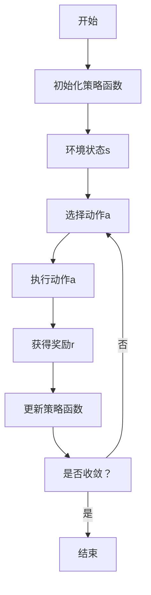
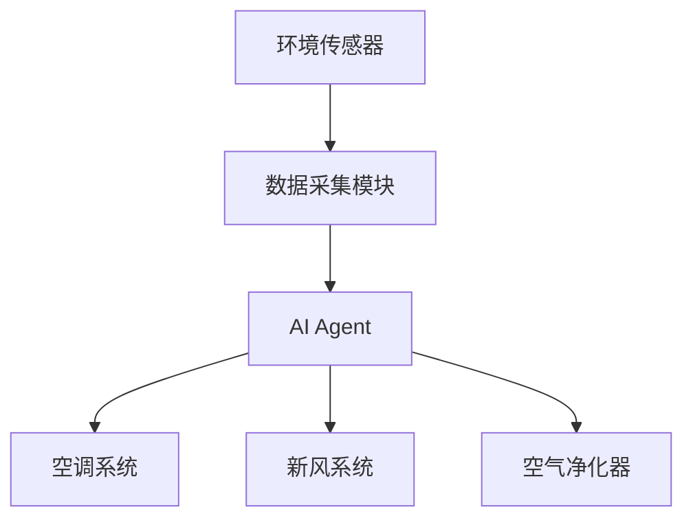
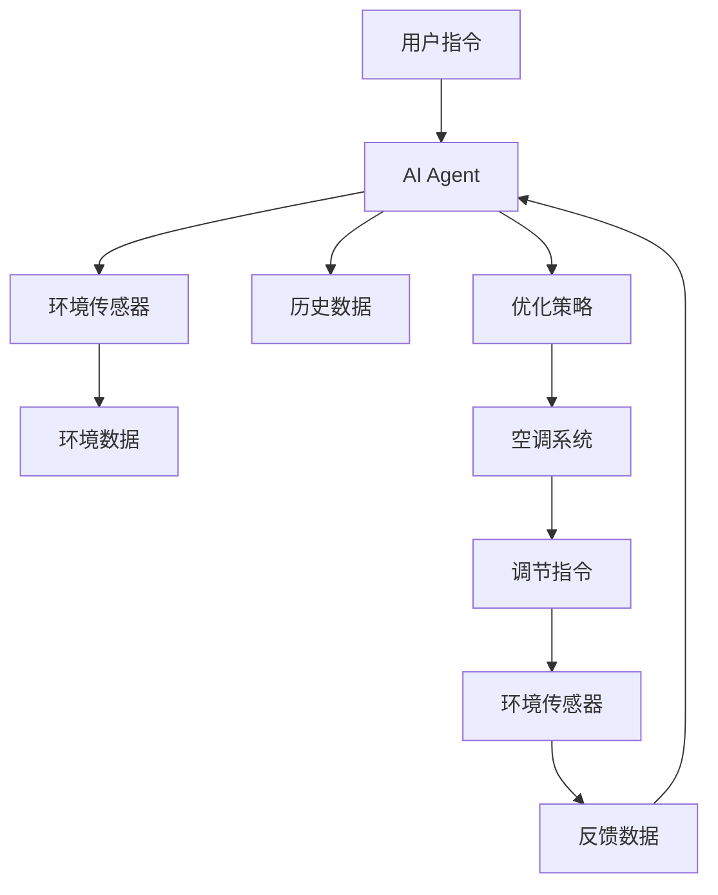

                 


# AI Agent在智能窗台中的室内空气调节

> 关键词：AI Agent，智能窗台，室内空气调节，算法原理，系统架构

> 摘要：本文深入探讨了AI Agent在智能窗台中的室内空气调节应用，从背景概念、算法原理到系统架构和项目实战，全面分析了AI Agent在智能窗台空气调节中的核心作用和实现方法。文章通过详细的技术分析和实际案例，展示了AI Agent如何通过智能化算法和系统架构设计，实现高效的室内空气调节，为未来的智能建筑和人居环境优化提供了新的思路和解决方案。

---

## 第一部分: AI Agent在智能窗台中的室内空气调节背景与概念

### 第1章: AI Agent与智能窗台概述

#### 1.1 AI Agent的基本概念
- **AI Agent的定义**: AI Agent（人工智能代理）是指能够感知环境、自主决策并执行任务的智能实体。它能够通过传感器获取信息，利用算法进行分析和推理，并通过执行器完成目标。
- **AI Agent的核心属性**:
  - 感知能力：通过传感器或数据接口获取环境信息。
  - 决策能力：基于感知信息进行分析和决策。
  - 执行能力：通过执行器或接口将决策结果转化为实际操作。
  - 学习能力：通过反馈优化自身的算法和行为模式。
- **AI Agent与智能窗台的关系**: AI Agent作为智能窗台的核心控制单元，负责采集室内空气质量数据，分析用户需求，优化空气调节策略，并通过智能设备实现空气调节目标。

#### 1.2 智能窗台的定义与特点
- **智能窗台的定义**: 智能窗台是一种集成AI技术的窗台系统，能够通过传感器和AI算法实现对室内空气环境的智能调节。
- **智能窗台的核心功能**:
  - 空气质量监测：实时监测室内温度、湿度、PM2.5、CO2浓度等参数。
  - 自动调节：根据环境数据和用户需求，自动调节窗户开合、空调运行等。
  - 用户行为分析：通过分析用户的使用习惯，优化空气调节策略。
- **智能窗台与传统窗台的区别**:
  - 传统窗台仅作为建筑结构的一部分，不具备智能化功能。
  - 智能窗台集成了传感器、执行器和AI算法，能够实现智能化的空气调节。

#### 1.3 室内空气调节的背景与需求
- **室内空气调节的基本原理**: 室内空气调节主要是通过调节空气的温度、湿度、流动速度和净化程度，营造一个舒适、健康、高效的室内环境。
- **智能窗台在空气调节中的作用**: 智能窗台通过与空调、新风系统等设备的协同工作，优化室内空气流通和温度调节。
- **用户需求与市场现状**:
  - 用户需求：个性化、舒适性、健康性、节能性。
  - 市场现状：随着智能建筑的发展，智能窗台和AI Agent技术在空气调节领域的应用越来越广泛。

### 第2章: AI Agent在智能窗台中的应用背景

#### 2.1 智能窗台空气调节的背景分析
- **当前室内空气调节的主要问题**:
  - 传统空调系统能耗高、智能化水平低。
  - 用户需求个性化，传统系统难以满足。
  - 室内空气质量监测不全面，无法实现精准调节。
- **AI技术在空气调节中的潜力**:
  - AI Agent可以通过实时数据采集和分析，实现精准的空气调节。
  - AI算法可以优化空调运行策略，降低能耗。
  - AI技术可以实现个性化需求的智能匹配。
- **智能窗台空气调节的市场需求**:
  - 随着智能建筑的普及，市场对智能窗台的需求快速增长。
  - 用户对个性化、智能化、节能化的空气调节系统的需求日益增加。

#### 2.2 AI Agent在智能窗台中的核心任务
- **空气质量监测**:
  - 实时监测室内温度、湿度、PM2.5、CO2浓度等参数。
  - 通过传感器数据，分析空气质量变化趋势。
- **温度与湿度调节**:
  - 根据室内环境数据和用户需求，优化空调运行策略。
  - 实现室内外空气流通的智能调节。
- **用户行为分析与预测**:
  - 通过分析用户的使用习惯，预测用户的空气调节需求。
  - 根据用户的偏好，优化空气调节策略。

#### 2.3 智能窗台空气调节的边界与外延
- **系统边界**:
  - 系统边界包括智能窗台、空调系统、新风系统等。
  - 系统内部数据流包括传感器数据、用户指令、环境数据等。
- **外延功能**:
  - 外延功能包括与智能家居系统的协同工作。
  - 外延功能还包括与其他智能设备的互联互通。
- **与其他系统的协同**:
  - 与智能家居系统的协同：与智能灯、智能安防系统等协同工作。
  - 与能源管理系统协同：优化能源消耗。

### 第3章: AI Agent与智能窗台的核心概念结构

#### 3.1 核心概念的组成
- **AI Agent**:
  - AI Agent是智能窗台的核心控制单元。
  - 包括感知、决策和执行三个核心模块。
- **智能窗台**:
  - 智能窗台是一个集成AI技术的窗台系统。
  - 包括传感器、执行器和智能控制单元。
- **室内空气调节系统**:
  - 包括空调、新风系统、空气净化器等设备。
  - 通过智能窗台的协调实现室内空气调节。

#### 3.2 核心概念之间的关系
- **AI Agent与智能窗台的关系**:
  - AI Agent作为智能窗台的核心控制单元，负责数据采集、分析和决策。
  - 智能窗台通过AI Agent实现与空调、新风系统的协同工作。
- **智能窗台与室内空气调节系统的关系**:
  - 智能窗台是室内空气调节系统的重要组成部分。
  - 智能窗台通过与空调、新风系统的协同工作，实现室内空气调节。
- **AI Agent与室内空气调节系统的关系**:
  - AI Agent通过智能窗台与室内空气调节系统进行数据交互。
  - AI Agent负责优化空气调节策略，实现精准调节。

#### 3.3 核心概念的属性对比
- **AI Agent的属性**:
  - 感知能力：通过传感器获取环境数据。
  - 决策能力：基于环境数据进行分析和决策。
  - 执行能力：通过执行器完成目标。
  - 学习能力：通过反馈优化算法。
- **智能窗台的属性**:
  - 智能化：集成AI技术，实现智能化控制。
  - 网络化：与智能家居系统互联互通。
  - 个性化：根据用户需求提供定制化服务。
- **室内空气调节系统的属性**:
  - 精准化：实现精准的温度、湿度调节。
  - 节能化：优化能源消耗，降低能耗。
  - 健康化：提供健康的室内空气环境。

---

## 第二部分: AI Agent在智能窗台中的室内空气调节核心概念与联系

### 第4章: AI Agent的核心原理

#### 4.1 AI Agent的基本原理
- AI Agent通过感知环境、分析数据、优化决策、执行操作，实现对智能窗台的控制。
- AI Agent的核心算法包括强化学习和监督学习。

#### 4.2 AI Agent的核心算法
- **强化学习**:
  - 强化学习是一种通过试错和反馈优化决策的算法。
  - AI Agent通过与环境的交互，获得奖励或惩罚，优化决策策略。
- **监督学习**:
  - 监督学习是一种通过样本数据训练模型的算法。
  - AI Agent通过大量历史数据，训练出最优的空气调节策略。

#### 4.3 AI Agent的数学模型与公式
- **强化学习的数学模型**:
  - 状态空间：$S$，表示环境状态。
  - 动作空间：$A$，表示AI Agent的可能动作。
  - 奖励函数：$R(s,a)$，表示在状态$s$下执行动作$a$获得的奖励。
  - 策略函数：$\pi(a|s)$，表示在状态$s$下选择动作$a$的概率。
- **监督学习的数学模型**:
  - 样本数据：$(x_i, y_i)$，其中$x_i$是输入特征，$y_i$是目标输出。
  - 损失函数：$L(y, y_{\text{pred}})$，表示预测值与真实值之间的差距。
  - 优化目标：最小化损失函数，优化模型参数。

#### 4.4 AI Agent的算法实现
- **强化学习的实现步骤**:
  1. 初始化策略函数$\pi(a|s)$。
  2. 在环境状态$s$下，选择动作$a$，执行操作，获得奖励$r$。
  3. 更新策略函数，优化奖励函数。
  4. 重复上述步骤，直到达到收敛条件。
- **监督学习的实现步骤**:
  1. 收集样本数据$(x_i, y_i)$。
  2. 训练模型，优化模型参数，最小化损失函数。
  3. 使用训练好的模型进行预测。

#### 4.5 AI Agent的算法流程图


---

## 第5章: AI Agent在智能窗台中的系统架构设计

### 5.1 系统架构概述
- 智能窗台空气调节系统包括感知层、控制层和执行层。
- 感知层负责采集环境数据，控制层负责数据分析和决策，执行层负责执行调节操作。

### 5.2 系统架构图


### 5.3 系统接口设计
- **环境传感器接口**:
  - 输入：温度、湿度、PM2.5、CO2浓度等数据。
  - 输出：无。
- **空调系统接口**:
  - 输入：空调运行状态、温度设置等。
  - 输出：空调运行指令。
- **新风系统接口**:
  - 输入：新风系统运行状态、风速设置等。
  - 输出：新风系统运行指令。

### 5.4 系统交互流程图


---

## 第6章: AI Agent在智能窗台中的项目实战

### 6.1 环境安装
- 安装AI Agent需要安装Python、TensorFlow、Keras等工具。
- 安装智能窗台系统需要安装传感器、执行器等硬件设备。

### 6.2 系统核心实现源代码
```python
import numpy as np
import tensorflow as tf

# 初始化策略函数
def initialize_policy():
    model = tf.keras.Sequential([
        tf.keras.layers.Dense(32, activation='relu'),
        tf.keras.layers.Dense(1, activation='sigmoid')
    ])
    return model

# 强化学习算法实现
def reinforce_learning(env, policy):
    for episode in range(1000):
        state = env.reset()
        total_reward = 0
        while not done:
            action = policy.predict(state)
            next_state, reward, done = env.step(action)
            policy.update(reward)
```

### 6.3 代码应用解读与分析
- **初始化策略函数**：定义了一个简单的神经网络模型，用于生成动作。
- **强化学习算法实现**：通过不断与环境交互，优化策略函数，实现最优决策。

### 6.4 实际案例分析
- **案例一**：用户需求个性化，AI Agent根据用户习惯优化空调运行策略。
- **案例二**：空气质量异常，AI Agent快速响应，启动新风系统和空气净化器。

### 6.5 项目小结
- 通过AI Agent实现智能窗台的空气调节，能够显著提高室内空气质量，降低能耗，满足用户的个性化需求。

---

## 第三部分: AI Agent在智能窗台中的室内空气调节总结与展望

### 第7章: 总结与展望
- **总结**：AI Agent通过智能化算法和系统架构设计，实现高效的室内空气调节。
- **展望**：未来，随着AI技术的不断发展，智能窗台的空气调节将更加智能化、个性化和节能化。

---

### 附录: 最佳实践 tips
- **注意事项**：
  - 确保传感器和执行器的稳定性和可靠性。
  - 定期更新AI Agent的算法和模型，优化系统性能。
  - 注意数据隐私和安全，避免用户信息泄露。
- **小结**：AI Agent在智能窗台中的应用前景广阔，未来将有更多的创新和突破。
- **拓展阅读**：建议进一步学习强化学习和监督学习的相关知识，了解更多的AI算法和系统架构设计。

---

通过本文的详细分析和讲解，我们深入探讨了AI Agent在智能窗台中的室内空气调节应用，从背景概念、算法原理到系统架构和项目实战，全面展示了AI Agent在智能窗台空气调节中的核心作用和实现方法。希望本文能够为读者提供有益的参考和启发。

