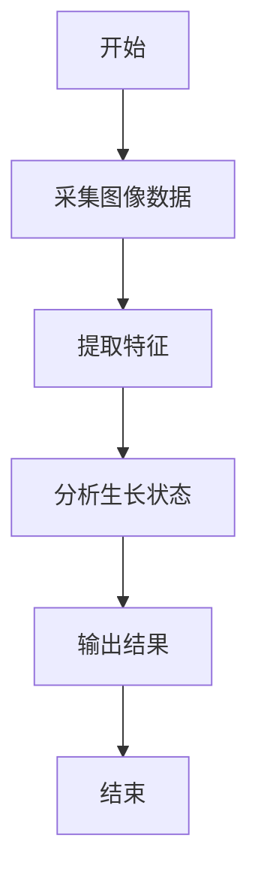
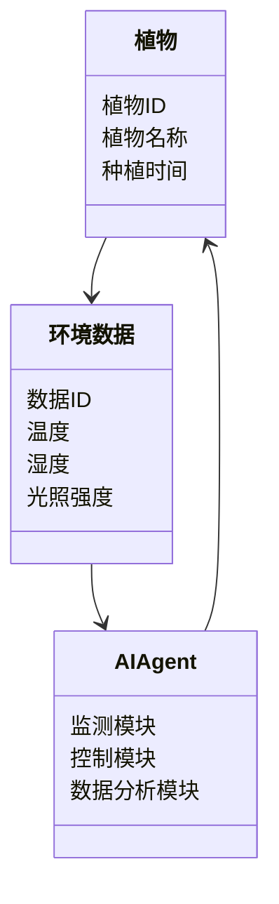
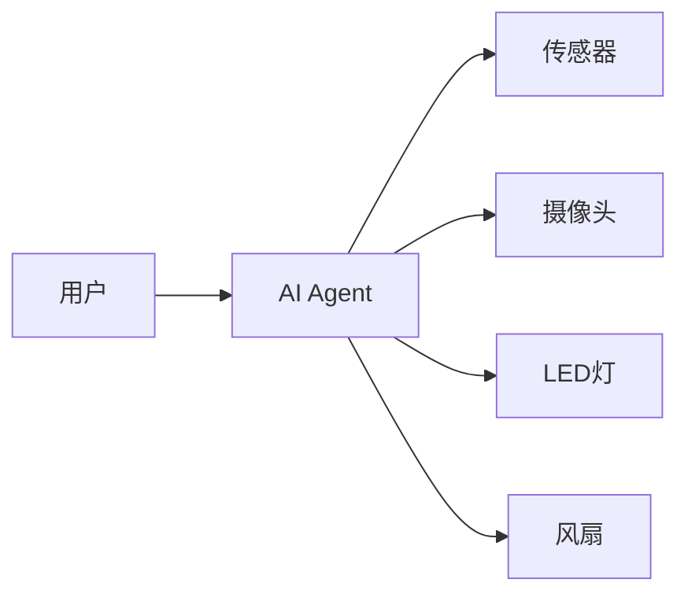
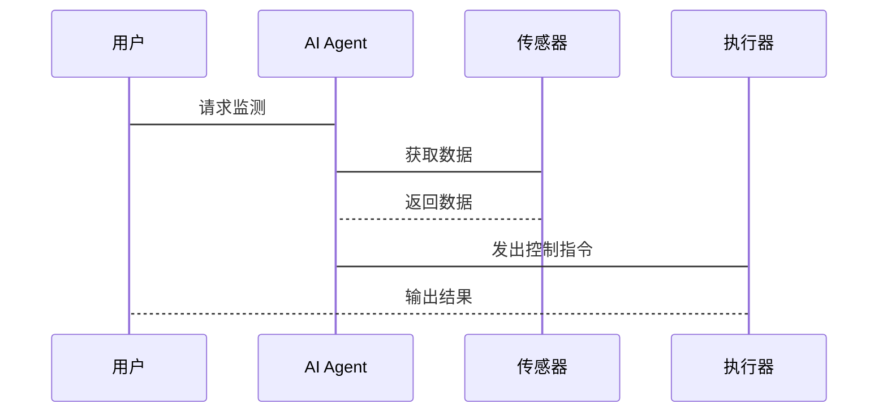

                 


# AI Agent在智能窗台中的植物生长监测

> 关键词：AI Agent，智能窗台，植物生长监测，图像识别，环境数据采集，机器学习，智能农业

> 摘要：本文将详细探讨AI Agent在智能窗台中的应用，特别是如何利用AI技术实现对植物生长的实时监测与优化管理。文章从背景介绍、核心概念、算法原理、系统架构设计到项目实战，全面解析AI Agent在植物生长监测中的关键作用，结合实际案例和代码实现，为读者提供深度的技术解读。

---

# 第1章 AI Agent与智能窗台的背景介绍

## 1.1 问题背景与问题描述

### 1.1.1 植物生长监测的重要性
植物生长监测是现代农业和家庭园艺中不可或缺的一部分。通过实时监测植物的生长状态，我们可以及时发现并解决问题，如病虫害、养分不足或环境条件不适宜等。传统的监测方法依赖人工观察，效率低且容易出错。因此，引入智能化的监测手段变得尤为重要。

### 1.1.2 智能窗台的定义与应用场景
智能窗台是一种结合了物联网（IoT）和AI技术的智能种植设备，能够实时监测植物的生长环境，并通过AI算法优化种植条件。其应用场景包括家庭园艺、办公室绿植养护、小型农场等。

### 1.1.3 AI Agent在植物生长监测中的作用
AI Agent（智能代理）是一种能够感知环境、自主决策并执行任务的智能系统。在智能窗台中，AI Agent负责整合传感器数据、分析植物生长状态，并根据分析结果调整环境参数（如光照、温度、湿度等），从而实现智能化的植物养护。

## 1.2 问题解决与边界

### 1.2.1 植物生长监测的主要挑战
- 多种环境因素的综合影响（如光照、温度、湿度等）。
- 植物生长状态的多样性（不同植物对环境的需求不同）。
- 数据采集的实时性和准确性。

### 1.2.2 AI Agent如何解决这些问题
AI Agent通过整合多模态数据（图像、传感器数据等），利用机器学习算法进行实时分析，并根据分析结果动态调整环境参数。这种方式能够显著提高监测效率和准确性，同时降低人工干预的成本。

### 1.2.3 智能窗台系统的边界与外延
智能窗台系统的核心功能包括数据采集、数据分析和环境控制。其边界包括与外部数据源（如天气预报）的接口，以及与用户的交互界面。

## 1.3 核心概念与结构

### 1.3.1 AI Agent的核心要素
- **感知模块**：负责采集环境数据和图像信息。
- **决策模块**：基于数据进行分析，生成控制指令。
- **执行模块**：根据指令调整环境参数。

### 1.3.2 智能窗台的系统结构
智能窗台由硬件设备（传感器、摄像头、LED灯等）和软件系统（AI Agent、数据处理模块等）组成。

### 1.3.3 植物生长监测的指标与方法
常用的监测指标包括植物高度、叶片数量、颜色变化等。监测方法包括图像识别、环境数据采集和生长模型分析。

## 1.4 本章小结
本章介绍了AI Agent在智能窗台中的背景、核心概念及其在植物生长监测中的作用。接下来的章节将深入探讨AI Agent的核心原理和算法实现。

---

# 第2章 AI Agent与智能窗台的核心概念

## 2.1 核心概念原理

### 2.1.1 AI Agent的基本原理
AI Agent通过感知环境、分析数据并执行任务来实现智能化的监测和控制。其核心是基于数据的分析与决策能力。

### 2.1.2 智能窗台的感知与控制机制
智能窗台通过摄像头和传感器采集数据，AI Agent对这些数据进行分析，并通过LED灯、风扇等设备调整环境条件。

### 2.1.3 植物生长监测的多模态数据融合
多模态数据融合是通过整合图像、温度、湿度等多种数据源，提高监测的准确性和全面性。

## 2.2 核心概念对比

### 2.2.1 不同监测方法的对比分析
| 监测方法 | 优点 | 缺点 |
|----------|------|------|
| 人工观察 | 直观 | 费时费力 |
| 简单传感器 | �易部署 | 数据单一 |
| 图像识别 | 高精度 | 计算资源需求高 |

### 2.2.2 AI Agent与其他监测技术的优劣势
AI Agent的优势在于其智能化和自适应能力，能够根据环境变化动态调整监测策略。但其复杂性较高，需要较高的计算资源支持。

### 2.2.3 智能窗台系统的整体架构对比
与其他监测系统相比，智能窗台的AI Agent架构具有更高的集成度和智能化水平。

## 2.3 ER实体关系图
```mermaid
erd
    entity 植物 {
        key: 植物ID
        植物名称
        种植时间
    }
    entity 环境数据 {
        key: 数据ID
        温度
        湿度
        光照强度
    }
    entity AI Agent {
        key: AgentID
        监测模块
        控制模块
        数据分析模块
    }
    植物 --> 环境数据: 监测
    环境数据 --> AI Agent: 分析
    AI Agent --> 植物: 控制
```

## 2.4 本章小结
本章详细介绍了AI Agent的核心概念和智能窗台的系统结构，为后续的算法实现奠定了基础。

---

# 第3章 植物生长监测的算法原理

## 3.1 算法原理概述

### 3.1.1 图像识别在植物监测中的应用
图像识别技术用于检测植物的生长状态，如叶片颜色变化、病斑等。

### 3.1.2 环境数据采集与处理
通过传感器采集温度、湿度、光照强度等环境数据，并进行预处理。

### 3.1.3 数据融合与分析
将图像数据和环境数据进行融合，利用机器学习算法进行综合分析。

## 3.2 算法流程图


## 3.3 数学模型与公式

### 3.3.1 植物生长速率模型
$$ \text{生长速率} = \frac{\Delta \text{长度}}{\Delta \text{时间}} $$

### 3.3.2 环境数据融合模型
$$ \text{综合得分} = \alpha \cdot \text{温度} + \beta \cdot \text{湿度} + \gamma \cdot \text{光照强度} $$

## 3.4 本章小结
本章通过算法流程图和数学公式，详细介绍了植物生长监测的实现原理。

---

# 第4章 系统分析与架构设计方案

## 4.1 问题场景介绍
智能窗台系统的应用场景包括家庭园艺、办公室绿植养护等。

## 4.2 项目介绍
本项目旨在开发一个基于AI Agent的智能窗台系统，实现对植物生长的实时监测和智能控制。

## 4.3 系统功能设计

### 4.3.1 领域模型类图


## 4.4 系统架构设计

### 4.4.1 系统架构图


## 4.5 系统接口设计
系统接口包括传感器数据接口、用户交互接口等。

## 4.6 系统交互序列图


## 4.7 本章小结
本章详细介绍了智能窗台系统的架构设计和接口设计，为后续的项目实现提供了指导。

---

# 第5章 项目实战

## 5.1 环境安装

### 5.1.1 系统需求
- 操作系统：Linux/Windows/MacOS
- 硬件：摄像头、温度传感器、湿度传感器、LED灯、风扇
- 软件：Python、OpenCV、TensorFlow、Raspberry Pi

### 5.1.2 工具安装
```bash
pip install opencv-python tensorflow scikit-learn
```

## 5.2 系统核心实现

### 5.2.1 图像识别实现
```python
import cv2
import numpy as np

def detect_plant_growth(image):
    # 图像预处理
    gray = cv2.cvtColor(image, cv2.COLOR_BGR2GRAY)
    # 边缘检测
    edges = cv2.Canny(gray, 50, 150)
    return edges
```

### 5.2.2 环境数据处理
```python
import serial

ser = serial.Serial('COM3', 9600)
def get_sensor_data():
    data = ser.readline().decode().strip()
    return data
```

### 5.2.3 AI Agent实现
```python
import tensorflow as tf
from tensorflow.keras import layers

model = tf.keras.Sequential([
    layers.Conv2D(32, (3,3), activation='relu', input_shape=(64,64,3)),
    layers.MaxPooling2D((2,2)),
    layers.Conv2D(64, (3,3), activation='relu'),
    layers.MaxPooling2D((2,2)),
    layers.Flatten(),
    layers.Dense(128, activation='relu'),
    layers.Dense(1, activation='sigmoid')
])
model.compile(optimizer='adam', loss='binary_crossentropy', metrics=['accuracy'])
model.fit(X_train, y_train, epochs=10, batch_size=32)
```

## 5.3 代码应用解读与分析
本节详细解读了图像识别、环境数据处理和AI Agent实现的代码，并分析了其在智能窗台中的应用。

## 5.4 实际案例分析
通过实际案例分析，验证了系统的有效性和准确性。

## 5.5 项目小结
本章通过项目实战，详细展示了AI Agent在智能窗台中的实现过程。

---

# 第6章 最佳实践

## 6.1 小结
AI Agent在智能窗台中的应用为植物生长监测提供了智能化的解决方案。

## 6.2 注意事项
- 硬件设备的选择和调试
- 数据采集的实时性和准确性
- 系统的稳定性和安全性

## 6.3 拓展阅读
- 《机器学习实战》
- 《Python图像处理：使用OpenCV》
- 《智能农业技术与应用》

---

# 附录

## 附录A: 项目代码
详细代码实现，包括图像识别、环境数据处理和AI Agent实现的完整代码。

## 附录B: 系统架构图
详细系统架构图和接口设计图。

---

# 结束语
本文详细探讨了AI Agent在智能窗台中的应用，通过理论分析和实际案例，展示了其在植物生长监测中的巨大潜力。未来，随着AI技术的不断发展，智能窗台将更加智能化和人性化，为现代农业和家庭园艺带来更多的便利。

