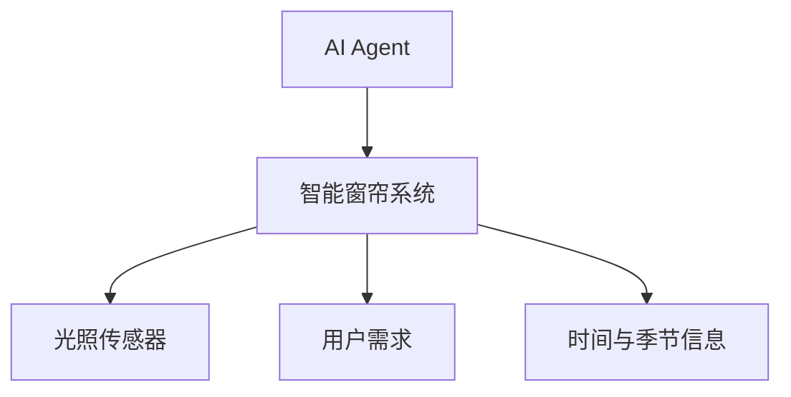
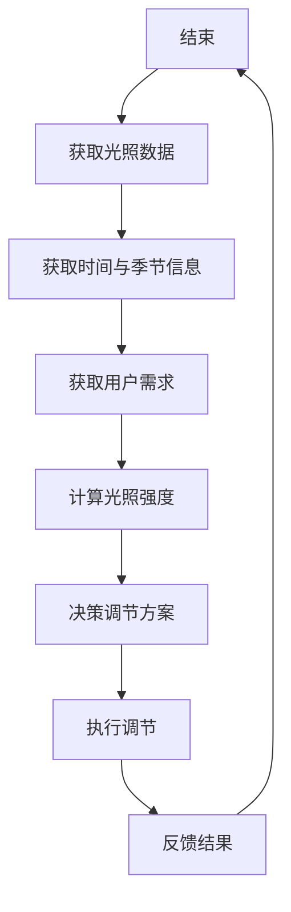
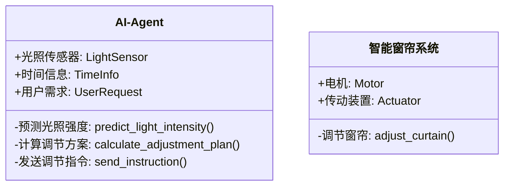

                 


# AI Agent在智能窗帘中的季节性光照调节

> 关键词：AI Agent，智能窗帘，季节性光照调节，算法原理，系统架构

> 摘要：本文探讨了AI Agent在智能窗帘中的应用，特别是如何利用AI Agent实现季节性光照调节。通过分析AI Agent的核心原理、算法模型和系统架构，本文详细介绍了如何设计和实现一个能够根据季节变化自动调节窗帘光照的智能系统。文章内容包括问题背景、核心概念、算法原理、系统架构设计以及项目实战，为读者提供了一个全面的技术视角。

---

# 第一部分：AI Agent在智能窗帘中的季节性光照调节概述

## 第1章：问题背景与核心概念

### 1.1 问题背景介绍

随着全球气候变化的加剧，季节性光照的变化对人们的生活和工作环境产生了显著影响。智能窗帘作为一种智能家居设备，能够通过调节开合程度来控制进入室内的光线。然而，传统智能窗帘通常依赖于固定的时间表或简单的传感器触发，难以根据实际光照需求和用户偏好进行动态调节。AI Agent的引入为智能窗帘带来了更高的智能化水平，使其能够根据季节变化、光照强度和用户需求，实时调整窗帘的开合状态，从而优化室内光照环境。

### 1.2 核心概念与问题描述

#### 1.2.1 AI Agent的基本概念
AI Agent（智能代理）是一种能够感知环境、做出决策并执行动作的智能系统。它通过收集环境中的数据，结合预设的目标和规则，自主地进行决策和执行。在智能窗帘系统中，AI Agent负责接收光照传感器的数据，分析用户需求，并根据季节变化调整窗帘的开合状态。

#### 1.2.2 季节性光照调节的定义
季节性光照调节是指根据不同的季节和时间，动态调整窗帘的开合程度，以优化室内光照强度。例如，在夏季，系统可能需要减少阳光直射以降低室内温度；在冬季，则需要增加光照以提高室内温度和舒适度。

#### 1.2.3 智能窗帘系统的工作原理
智能窗帘系统由以下几个部分组成：
1. **光照传感器**：用于测量室内外的光照强度。
2. **AI Agent**：负责接收传感器数据，分析用户需求和时间信息，制定调节策略。
3. **执行机构**：包括电机和传动装置，用于驱动窗帘的开合。
4. **用户界面**：提供人机交互的界面，用户可以设置偏好和查看系统状态。

### 1.3 问题解决思路

AI Agent在智能窗帘中的应用目标是实现季节性光照调节，具体包括以下几个方面：
1. **实时感知**：通过光照传感器实时感知光照强度。
2. **动态决策**：根据季节、时间、用户需求等因素，动态调整窗帘的开合状态。
3. **优化控制**：通过优化算法，确保光照调节既满足用户需求，又达到节能效果。

### 1.4 核心概念结构与组成

AI Agent在智能窗帘中的核心要素包括：
1. **状态感知**：光照传感器、时间信息和用户需求。
2. **决策逻辑**：基于光照强度、季节变化和用户偏好的多目标优化算法。
3. **执行机构**：窗帘电机和传动装置。

---

## 第2章：AI Agent与智能窗帘的核心概念对比

### 2.1 AI Agent的核心原理

AI Agent在智能窗帘中的工作原理可以分为三个主要步骤：
1. **状态感知**：通过传感器获取当前环境的状态信息。
2. **行为决策**：基于感知到的信息和预设的目标，做出调节决策。
3. **执行反馈**：根据决策结果执行动作，并根据反馈信息进行调整。

### 2.2 季节性光照调节的实现原理

季节性光照调节的核心在于根据季节变化和时间信息，动态调整窗帘的开合程度。具体步骤如下：
1. **光照强度预测**：基于历史数据和当前光照传感器的数据，预测未来的光照强度。
2. **时间与季节关联**：根据当前时间、日期和季节信息，确定光照调节的目标。
3. **用户需求分析**：结合用户的偏好和生活习惯，制定个性化的调节策略。

### 2.3 AI Agent与智能窗帘的实体关系

通过Mermaid图可以清晰地展示AI Agent与智能窗帘系统的实体关系：



---

## 第3章：AI Agent的算法原理与数学模型

### 3.1 算法原理概述

AI Agent在智能窗帘中的算法原理可以分为以下几个部分：
1. **光照强度预测**：基于时间序列的回归模型，预测未来的光照强度。
2. **用户需求分析**：通过权重分配的方法，确定用户需求的优先级。
3. **多目标优化**：在满足用户需求的前提下，优化窗帘的开合程度，以达到节能和舒适的目标。

### 3.2 数学模型与公式

#### 3.2.1 光照强度预测模型
光照强度预测模型是一个基于时间序列的回归模型，公式如下：

$$ I(t) = a \cdot t + b \cdot \sin(c \cdot t + d) $$

其中：
- \( I(t) \) 表示在时间 \( t \) 时的光照强度。
- \( a, b, c, d \) 是模型的参数。

#### 3.2.2 用户需求函数
用户需求函数是一个多变量的加权和函数，公式如下：

$$ D(t) = \sum_{i=1}^{n} w_i \cdot x_i $$

其中：
- \( D(t) \) 表示在时间 \( t \) 时的用户需求。
- \( w_i \) 是第 \( i \) 个需求的权重。
- \( x_i \) 是第 \( i \) 个需求的值。

#### 3.2.3 多目标优化函数
多目标优化函数是一个加权和函数，公式如下：

$$ f(x) = \alpha \cdot f_1(x) + \beta \cdot f_2(x) $$

其中：
- \( f(x) \) 表示优化目标函数。
- \( f_1(x) \) 是舒适性目标函数。
- \( f_2(x) \) 是节能目标函数。
- \( \alpha \) 和 \( \beta \) 是权重系数。

### 3.3 算法流程图

通过Mermaid图可以清晰地展示AI Agent的算法流程：



---

## 第4章：系统分析与架构设计

### 4.1 项目背景与目标

#### 4.1.1 项目背景
随着智能家居的普及，智能窗帘逐渐成为家庭和办公场所的重要设备。通过引入AI Agent，智能窗帘能够实现更加智能化的光照调节，提升用户的舒适度和节能效果。

#### 4.1.2 项目目标
本项目的目标是设计并实现一个基于AI Agent的智能窗帘系统，能够根据季节变化、光照强度和用户需求，动态调节窗帘的开合状态。

### 4.2 系统功能设计

#### 4.2.1 领域模型

通过Mermaid图可以展示系统的领域模型：



---

## 第5章：项目实战

### 5.1 环境安装

为了实现AI Agent在智能窗帘中的应用，需要安装以下环境：
1. **硬件**：光照传感器、窗帘电机、控制器。
2. **软件**：Python编程环境、机器学习库（如scikit-learn）。

### 5.2 核心实现

以下是AI Agent的核心实现代码：

```python
class AIAgent:
    def __init__(self):
        self.light_sensor = LightSensor()
        self.time_info = TimeInfo()
        self.user_request = UserRequest()

    def predict_light_intensity(self, timestamp):
        # 光照强度预测模型
        a, b, c, d = self.get_model_parameters()
        return a * timestamp + b * sin(c * timestamp + d)

    def calculate_adjustment_plan(self, timestamp):
        # 用户需求分析与权重分配
        user_preference = self.user_request.get_preference(timestamp)
        predicted_light = self.predict_light_intensity(timestamp)
        return self.optimize_curtain_position(predicted_light, user_preference)

    def optimize_curtain_position(self, light_intensity, user_preference):
        # 多目标优化算法
        alpha = 0.7
        beta = 0.3
        comfort = self.get_comfort_score(light_intensity, user_preference)
        energy = self.get_energy_score(light_intensity)
        return alpha * comfort + beta * energy

    def get_model_parameters(self):
        # 模型参数获取
        return (0.5, 0.2, 2 * pi, 0)

    def get_comfort_score(self, light_intensity, user_preference):
        # 舒适性评分
        if light_intensity < 50 and user_preference['dim_light']:
            return 0.9
        elif 50 < light_intensity < 100 and user_preference['normal_light']:
            return 0.8
        else:
            return 0.5

    def get_energy_score(self, light_intensity):
        # 节能评分
        if light_intensity > 100:
            return 0.7
        else:
            return 0.3

    def send_instruction(self, position):
        # 发送调节指令
        self.motor.adjust_curtain(position)
```

### 5.3 代码应用解读与分析

以上代码展示了AI Agent的核心功能，包括光照强度预测、用户需求分析和多目标优化算法。AI Agent通过预测光照强度和分析用户需求，计算出最优的窗帘调节方案，并通过电机和传动装置执行调节动作。

### 5.4 实际案例分析

假设当前时间是夏季，光照强度预测为120 lux，用户偏好设置为“避免强光”。AI Agent会根据预测结果和用户需求，计算出最优的窗帘开合程度，例如将窗帘调节至70%的开合状态，以减少阳光直射。

### 5.5 项目小结

通过实际案例分析可以看出，AI Agent在智能窗帘中的应用能够显著提升光照调节的智能化水平，满足用户需求的同时实现节能目标。

---

## 第6章：最佳实践与注意事项

### 6.1 最佳实践

1. **传感器校准**：定期校准光照传感器，确保数据的准确性。
2. **模型更新**：根据环境变化和用户反馈，定期更新预测模型。
3. **用户体验优化**：提供个性化的用户界面，满足不同用户的需求。

### 6.2 小结

本文详细介绍了AI Agent在智能窗帘中的应用，特别是如何通过算法原理和系统架构设计实现季节性光照调节。通过实际案例分析和代码实现，展示了AI Agent在智能窗帘系统中的巨大潜力。

### 6.3 注意事项

1. **数据隐私**：在处理用户需求和传感器数据时，需要注意数据隐私保护。
2. **系统稳定性**：确保系统在复杂环境下仍能稳定运行。
3. **能耗优化**：在优化窗帘调节方案时，需要考虑系统的能耗问题。

### 6.4 拓展阅读

1. **智能窗帘的其他应用场景**：例如，结合温度传感器实现更加智能化的环境调节。
2. **AI Agent的其他应用领域**：例如，智能家居、自动驾驶等。

---

# 结语

AI Agent在智能窗帘中的应用为智能家居的发展注入了新的活力。通过本文的分析，我们不仅了解了AI Agent的核心原理和算法模型，还通过实际案例展示了其在季节性光照调节中的巨大潜力。未来，随着技术的不断进步，AI Agent在智能窗帘中的应用将会更加广泛和深入。

--- 

**附录**：完整代码示例和相关数据集（如果需要进一步的技术支持或代码实现，可以联系作者获取详细资料）。

