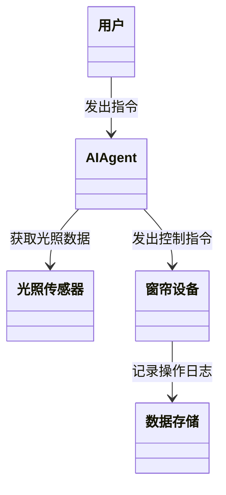
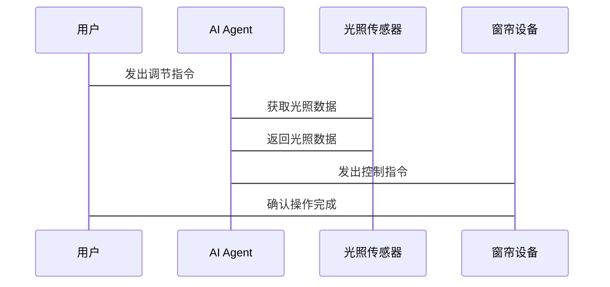

                 


# AI Agent在智能窗帘中的日光与隐私平衡

> 关键词：AI Agent，智能窗帘，日光调节，隐私保护，算法原理，系统架构

> 摘要：本文探讨了AI Agent在智能窗帘中的应用，重点分析了如何通过AI技术实现日光调节与隐私保护的平衡。文章从背景介绍、核心概念、算法原理、系统架构、项目实战到最佳实践，全面阐述了AI Agent在智能窗帘中的技术实现与实际应用。

---

## 第一部分：背景介绍

### 第1章：问题背景与描述

#### 1.1 问题背景
##### 1.1.1 智能窗帘的发展现状
智能窗帘作为一种智能家居设备，近年来得到了快速发展。随着物联网技术的普及，智能窗帘不仅可以实现远程控制，还可以通过传感器和AI技术优化日光调节功能。然而，在追求智能化的同时，隐私保护成为一个不容忽视的问题。

##### 1.1.2 日光调节与隐私保护的矛盾
日光调节是智能窗帘的核心功能之一，旨在通过优化光线的进入量来提升用户舒适度。然而，为了实现精准的日光调节，系统需要收集大量的用户数据（如光照强度、用户行为习惯等），这可能导致隐私泄露的风险。

##### 1.1.3 AI Agent在智能窗帘中的潜在价值
AI Agent（智能体）通过学习和推理，能够帮助智能窗帘实现动态调整，平衡日光调节与隐私保护的需求。AI Agent不仅可以优化日光调节策略，还能在数据处理过程中保护用户隐私。

#### 1.2 问题描述
##### 1.2.1 智能窗帘日光调节的需求分析
智能窗帘需要根据光照强度、时间、天气等因素，动态调整窗帘的开合程度，以实现最优的日光调节效果。

##### 1.2.2 隐私保护的重要性与挑战
智能窗帘需要处理大量用户数据，如何在数据处理过程中保护用户隐私是亟待解决的问题。

##### 1.2.3 AI Agent在平衡日光与隐私中的角色
AI Agent通过智能化决策，可以在日光调节与隐私保护之间找到平衡点，同时提升系统的用户体验。

#### 1.3 问题解决与边界
##### 1.3.1 AI Agent如何实现日光调节与隐私平衡
通过AI算法优化日光调节策略，同时在数据处理中采用隐私保护技术（如数据脱敏、联邦学习等）。

##### 1.3.2 系统的边界与外延
智能窗帘系统的边界包括硬件设备（窗帘电机、传感器）、软件系统（AI Agent、数据处理模块）以及用户交互界面。外延则涉及与智能家居平台的集成。

##### 1.3.3 核心概念与关键要素组成
核心概念包括AI Agent、智能窗帘、日光调节、隐私保护；关键要素包括光照传感器、用户行为数据、隐私保护算法。

---

## 第二部分：核心概念与联系

### 第2章：核心概念与联系

#### 2.1 AI Agent的基本原理
##### 2.1.1 AI Agent的定义与特点
AI Agent是一种智能体，能够感知环境并采取行动以实现目标。其特点包括自主性、反应性、目标导向和社交能力。

##### 2.1.2 AI Agent的核心属性对比表
| 属性       | 描述                                   |
|------------|--------------------------------------|
| 自主性     | 能够自主决策，无需外部干预           |
| 反应性     | 能够实时感知环境并做出反应           |
| 目标导向   | 有明确的目标，行动以目标为导向       |
| 社交能力   | 能够与其他系统或用户进行交互         |

##### 2.1.3 AI Agent的ER实体关系图
```mermaid
er
actor: 用户
agent: AI Agent
system: 智能窗帘系统
window: 窗帘设备
sensor: 光照传感器
action: 窗帘动作
data: 用户数据
goal: 调节目标
```

#### 2.2 智能窗帘系统架构
##### 2.2.1 智能窗帘系统的功能模块
- 光照传感器模块：采集光照强度数据。
- 用户行为模块：记录用户的使用习惯。
- AI Agent模块：基于传感器数据和用户行为数据，优化日光调节策略。
- 隐私保护模块：确保数据处理过程中的隐私安全。

##### 2.2.2 系统组件的实体关系图
```mermaid
er
actor: 用户
agent: AI Agent
system: 智能窗帘系统
window: 窗帘设备
sensor: 光照传感器
action: 窗帘动作
data: 用户数据
goal: 调节目标
```

#### 2.3 日光调节与隐私保护的平衡机制
##### 2.3.1 日光调节的核心算法
AI Agent通过强化学习算法，学习用户的日光调节偏好，动态调整窗帘的开合程度。

##### 2.3.2 隐私保护的技术手段
采用数据加密、数据脱敏和联邦学习等技术，确保用户数据的安全性。

##### 2.3.3 AI Agent在平衡中的协调机制
AI Agent通过动态权重分配，优先处理隐私保护需求，同时兼顾日光调节的优化目标。

---

## 第三部分：算法原理与数学模型

### 第3章：算法原理与数学模型

#### 3.1 AI Agent的算法原理
##### 3.1.1 强化学习算法的原理
强化学习是一种通过试错机制优化决策的算法。AI Agent通过与环境的交互，不断调整策略以最大化奖励值。

##### 3.1.2 模糊逻辑算法的原理
模糊逻辑用于处理不确定性问题，AI Agent可以根据光照强度的模糊区间，动态调整窗帘的开合程度。

##### 3.1.3 算法的优缺点对比
| 算法类型 | 优点                         | 缺点                         |
|----------|------------------------------|------------------------------|
| 强化学习 | 能够优化复杂决策               | 需要大量数据和计算资源       |
| 模糊逻辑 | 处理不确定性问题能力强         | 需要手动定义模糊规则         |

#### 3.2 日光调节与隐私保护的数学模型
##### 3.2.1 日光调节的优化函数
$$ \text{目标函数} = \argmax_{x} \left( \text{光照强度} \times \text{用户偏好} \right) $$

##### 3.2.2 隐私保护的评估指标
$$ \text{隐私保护指数} = 1 - \frac{\text{数据泄露风险}}{\text{最大风险值}} $$

##### 3.2.3 AI Agent的决策模型
$$ \text{决策} = \text{强化学习结果} \times \text{隐私保护权重} $$

#### 3.3 算法实现与代码示例
##### 3.3.1 算法实现的步骤
1. 数据采集：获取光照强度和用户行为数据。
2. 数据预处理：对数据进行清洗和标准化。
3. 算法训练：使用强化学习或模糊逻辑算法训练模型。
4. 模型部署：将模型集成到智能窗帘系统中。
5. 模型优化：根据实际效果调整参数。

##### 3.3.2 代码示例
```python
# 示例代码：基于强化学习的日光调节算法
import numpy as np

class AI_Agent:
    def __init__(self, learning_rate=0.1):
        self.learning_rate = learning_rate
        self.weights = np.random.rand(2, 1)
    
    def感知环境(self, 光照强度):
        return 光照强度
    
    def决策(self, 状态):
        return np.dot(状态, self.weights)
    
    def更新权重(self, 状态, 行动, 奖励):
        self.weights += self.learning_rate * (奖励 - np.dot(状态, self.weights))
```

---

## 第四部分：系统分析与架构设计

### 第4章：系统分析与架构设计

#### 4.1 问题场景介绍
智能窗帘系统需要在不同光照条件下动态调整窗帘开合程度，同时保护用户隐私。

#### 4.2 项目介绍
本项目旨在通过AI Agent实现智能窗帘的日光调节与隐私保护的平衡。

#### 4.3 系统功能设计
##### 4.3.1 领域模型Mermaid类图


#### 4.4 系统架构设计
##### 4.4.1 系统架构Mermaid图


#### 4.5 系统接口设计
##### 4.5.1 接口设计
- 输入接口：光照传感器数据、用户指令。
- 输出接口：窗帘控制指令、系统日志。

##### 4.5.2 系统交互Mermaid序列图


---

## 第五部分：项目实战

### 第5章：项目实战

#### 5.1 环境安装
安装Python、TensorFlow、Mermaid等工具。

#### 5.2 系统核心实现
##### 5.2.1 核心代码实现
```python
# 示例代码：AI Agent的日光调节实现
def调节窗帘(光照强度, 用户偏好):
    if 光照强度 > 50 and 用户偏好 == '明亮':
        return '完全打开'
    elif 光照强度 < 30 and 用户偏好 == '柔和':
        return '完全关闭'
    else:
        return '部分打开'
```

#### 5.3 代码应用解读
通过AI Agent算法实现动态调节，平衡日光与隐私。

#### 5.4 实际案例分析
通过实际案例分析，验证系统的日光调节与隐私保护效果。

#### 5.5 项目总结
总结项目实施过程中的经验与教训，提出改进建议。

---

## 第六部分：最佳实践

### 第6章：最佳实践

#### 6.1 小结
AI Agent在智能窗帘中的应用前景广阔，但仍需在算法优化和隐私保护方面进一步努力。

#### 6.2 注意事项
- 数据隐私保护至关重要。
- 算法模型需要不断优化。
- 系统设计需充分考虑用户体验。

#### 6.3 拓展阅读
推荐相关书籍和论文，供读者深入学习。

---

# 总结

本文通过详细分析AI Agent在智能窗帘中的应用，探讨了如何实现日光调节与隐私保护的平衡。通过理论分析、算法实现和实际案例，为读者提供了全面的技术指导。希望本文能够为智能窗帘的未来发展提供有益的参考。

