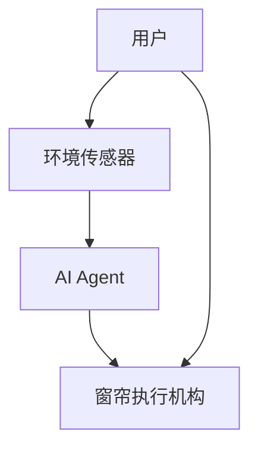
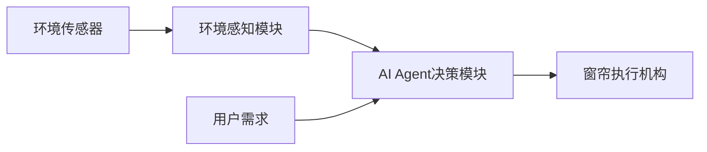
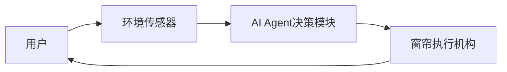

                 


# AI Agent在智能窗帘中的日光优化调节

> 关键词：AI Agent，智能窗帘，日光优化调节，智能调节，智能家居

> 摘要：本文详细探讨了AI Agent在智能窗帘中的日光优化调节的应用，从AI Agent的基本概念、日光优化调节的背景与意义，到具体的算法实现、系统架构设计，再到项目实战与最佳实践，全面分析了如何利用AI Agent实现智能窗帘的日光优化调节。

---

# 第一部分: AI Agent在智能窗帘中的日光优化调节概述

## 第1章: AI Agent与智能窗帘概述

### 1.1 AI Agent的基本概念
#### 1.1.1 AI Agent的定义与特点
AI Agent（人工智能代理）是一种能够感知环境、自主决策并执行任务的智能实体。其特点包括：
- **自主性**：能够在没有外部干预的情况下独立运行。
- **反应性**：能够实时感知环境并做出响应。
- **目标导向**：通过设定目标来优化行为。
- **学习能力**：能够通过数据学习和优化决策策略。

#### 1.1.2 AI Agent在智能系统中的作用
AI Agent在智能系统中充当决策者和执行者的角色，能够通过传感器数据和用户输入，结合预设的优化目标，制定最优的执行策略。

#### 1.1.3 AI Agent与传统自动控制系统的区别
| 特性                | AI Agent                     | 传统控制系统               |
|---------------------|------------------------------|---------------------------|
| 决策方式            | 基于机器学习和优化算法       | 基于固定逻辑和规则         |
| 学习能力            | 具备自适应学习能力           | 无学习能力                 |
| 环境交互能力        | 能够主动感知并适应环境变化    | 通常被动响应预设条件       |
| 执行效率            | 可能存在延迟但更灵活         | 响应速度快但策略固定       |

### 1.2 智能窗帘的发展历程
#### 1.2.1 智能窗帘的基本功能与发展阶段
智能窗帘最初的功能主要是通过电动驱动装置实现开关和调节，后来逐渐加入环境传感器（如光线、温度传感器）和远程控制功能。近年来，随着AI技术的发展，智能窗帘开始具备智能化的日光调节功能。

#### 1.2.2 智能窗帘的市场现状与趋势
当前市场上的智能窗帘主要以手动控制和简单自动化为主，未来的趋势是通过AI Agent实现更智能的环境感知和日光优化调节。

#### 1.2.3 智能窗帘与智能家居的关联
智能窗帘作为智能家居的一部分，通过与家庭其他设备（如智能灯泡、空调等）的联动，能够实现更高效的能源管理和更舒适的居住体验。

### 1.3 日光优化调节的背景与意义
#### 1.3.1 日光调节的基本原理
日光调节是指通过调整窗帘的开合程度，来控制进入室内的光线强度，从而达到节能、舒适和健康的目的。

#### 1.3.2 日光优化调节的定义与目标
日光优化调节的目标是在满足用户舒适度的前提下，最大化能源效率，减少不必要的能源浪费。

#### 1.3.3 日光优化调节在智能窗帘中的应用价值
- **节能**：通过优化日光调节，减少对人工照明的依赖，降低能源消耗。
- **舒适**：根据室内人员的活动需求，动态调整光线强度，提升用户体验。
- **健康**：避免过强或过弱的光线对眼睛造成伤害，促进用户的健康。

## 1.4 本章小结
### 1.4.1 AI Agent在智能窗帘中的核心作用
AI Agent通过感知环境、学习用户需求和优化决策，能够实现智能窗帘的自主调节。

### 1.4.2 日光优化调节的关键技术与挑战
关键技术包括环境感知技术、机器学习算法和自适应控制策略。主要挑战在于如何在复杂多变的环境中实现高效的优化调节。

---

# 第二部分: AI Agent的核心概念与原理

## 第2章: AI Agent的核心概念与联系

### 2.1 AI Agent的核心原理
#### 2.1.1 状态感知与环境交互
AI Agent通过传感器（如光线传感器、温度传感器）获取环境信息，并通过这些信息来判断当前的状态。

#### 2.1.2 决策逻辑与优化算法
AI Agent基于感知到的环境信息，结合预设的目标函数和优化算法（如遗传算法、强化学习等），制定最优的执行策略。

#### 2.1.3 行为执行与反馈机制
AI Agent根据决策结果，通过执行机构（如电机驱动）调整窗帘状态，并通过反馈机制不断优化决策策略。

### 2.2 AI Agent与智能窗帘的日光优化调节
#### 2.2.1 日光优化调节的数学模型
日光优化调节的目标函数可以表示为：
$$ \text{目标函数} = \text{舒适度} \times \alpha + \text{节能效果} \times \beta $$
其中，$\alpha$ 和 $\beta$ 是权重系数，用于平衡舒适度和节能效果。

#### 2.2.2 AI Agent在日光调节中的角色与功能
AI Agent通过以下步骤实现日光优化调节：
1. **感知环境**：获取室内外光线强度、室内人员活动等信息。
2. **分析需求**：根据当前状态和用户需求，确定最优的窗帘调节方案。
3. **执行调节**：通过电机驱动调整窗帘开合程度。
4. **反馈优化**：根据实际效果调整策略，持续优化调节效果。

#### 2.2.3 日光优化调节的目标函数与约束条件
目标函数：
$$ \text{目标函数} = \text{最大化舒适度} + \text{最大化节能效果} $$
约束条件：
1. 窗帘开合范围限制。
2. 人员活动时间表。
3. 外部环境变化（如天气预报）。

### 2.3 AI Agent的核心概念对比
#### 2.3.1 不同类型AI Agent的特点对比（表格）
| 类型          | 基于规则的Agent | 基于机器学习的Agent | 基于强化学习的Agent |
|--------------|------------------|----------------------|----------------------|
| 决策方式      | 预设规则          | 机器学习模型          | 强化学习策略          |
| 适应性        | 低                | 中                    | 高                    |
| 学习能力      | 无                | 有                    | 有                    |
| 适合场景      | 简单任务          | 复杂任务              | 动态变化任务          |

#### 2.3.2 AI Agent与传统控制算法的对比（表格）
| 特性          | AI Agent         | 传统控制算法         |
|--------------|------------------|----------------------|
| 决策方式      | 数据驱动          | 规则驱动              |
| 灵活性        | 高                | 低                    |
| 复杂性        | 高                | 低                    |
| 适应性        | 强                | 弱                    |

#### 2.3.3 AI Agent与边缘计算的关联（表格）
| 特性          | AI Agent         | 边缘计算             |
|--------------|------------------|----------------------|
| 计算位置      | 边缘设备          | 边缘设备              |
| 数据处理      | 数据分析          | 数据存储与处理        |
| 应用场景      | 智能控制          | 设备管理与优化        |

### 2.4 AI Agent的实体关系架构


### 2.5 本章小结
#### 2.5.1 AI Agent的核心概念总结
AI Agent通过感知环境、学习用户需求和优化决策，能够实现智能窗帘的自主调节。

#### 2.5.2 AI Agent与日光优化调节的关联
AI Agent通过动态调整窗帘状态，优化日光调节效果，实现舒适与节能的双重目标。

---

# 第三部分: 日光优化调节的算法实现

## 第3章: 日光优化调节的算法实现

### 3.1 PID控制算法
#### 3.1.1 PID控制算法的基本原理
PID（比例-积分-微分）控制是一种常用的反馈控制算法，适用于线性系统。其公式为：
$$ u(t) = K_p e(t) + K_i \int_0^t e(\tau) d\tau + K_d \frac{d}{dt}e(t) $$
其中，$e(t)$ 是误差，$K_p$、$K_i$、$K_d$ 是比例、积分、微分系数。

#### 3.1.2 PID控制算法在日光调节中的应用
通过PID控制算法，可以根据室内光线强度与目标光线强度的误差，自动调整窗帘的开合程度。

#### 3.1.3 PID控制算法的实现步骤
1. 采集当前光线强度。
2. 计算目标光线强度与当前光线强度的误差。
3. 根据PID公式计算控制量。
4. 调整窗帘开合程度。
5. 循环执行，直到达到目标状态。

### 3.2 强化学习策略
#### 3.2.1 强化学习的基本原理
强化学习是一种通过试错机制学习策略的方法。智能体通过与环境交互，获得奖励或惩罚，逐步优化决策策略。

#### 3.2.2 强化学习在日光调节中的应用
通过强化学习算法（如Q-learning），AI Agent可以学习在不同环境条件下最优的窗帘调节策略。

#### 3.2.3 强化学习的实现步骤
1. 初始化Q表。
2. 采集环境状态（如光线强度、人员活动）。
3. 根据当前状态选择动作（如调整窗帘开合程度）。
4. 执行动作，获得奖励。
5. 更新Q表，记录最优策略。
6. 循环执行，直到达到目标状态。

### 3.3 算法实现的对比与优化
#### 3.3.1 PID控制与强化学习的对比（表格）
| 特性          | PID控制           | 强化学习            |
|--------------|------------------|--------------------|
| 适应性        | 低                | 高                  |
| 学习能力      | 无                | 有                  |
| 优化目标      | 单一目标函数      | 多目标函数          |

#### 3.3.2 算法优化策略
- **PID控制优化**：动态调整PID参数，适应环境变化。
- **强化学习优化**：使用更深的神经网络结构，提升学习效率。

### 3.4 本章小结
#### 3.4.1 PID控制与强化学习的优缺点
PID控制适用于简单线性系统，而强化学习适用于复杂非线性系统。

#### 3.4.2 算法优化的关键点
动态调整参数和多目标优化是实现高效日光调节的核心。

---

# 第四部分: 系统设计与实现

## 第4章: 系统设计与实现

### 4.1 系统架构设计
#### 4.1.1 系统功能模块
1. **环境感知模块**：采集室内光线强度、温度等数据。
2. **用户需求模块**：获取用户的活动时间表和偏好。
3. **AI Agent决策模块**：根据环境数据和用户需求，制定调节策略。
4. **执行机构模块**：根据决策结果调整窗帘状态。

#### 4.1.2 系统架构图


### 4.2 系统实现细节
#### 4.2.1 环境感知模块的实现
通过光线传感器和温度传感器，获取实时环境数据。

#### 4.2.2 AI Agent决策模块的实现
基于强化学习算法，实现多目标优化的日光调节策略。

#### 4.2.3 执行机构模块的实现
通过电机驱动，根据决策结果调整窗帘开合程度。

### 4.3 系统接口设计
#### 4.3.1 系统接口说明
- **环境传感器接口**：提供光线强度和温度数据。
- **用户需求接口**：接收用户的活动时间表和偏好。
- **窗帘执行机构接口**：控制窗帘的开合程度。

#### 4.3.2 系统交互流程图


### 4.4 本章小结
#### 4.4.1 系统架构设计总结
通过模块化设计，实现了智能窗帘的日光优化调节功能。

#### 4.4.2 系统实现的关键点
动态感知、智能决策和高效执行是实现日光优化调节的核心。

---

# 第五部分: 项目实战

## 第5章: 项目实战

### 5.1 环境安装
#### 5.1.1 开发环境
- **硬件**：智能窗帘、光线传感器、电机驱动、单片机。
- **软件**：Python、TensorFlow、强化学习框架。

#### 5.1.2 依赖安装
```bash
pip install numpy tensorflow matplotlib
```

### 5.2 核心代码实现
#### 5.2.1 环境感知模块
```python
import numpy as np

def get_light_intensity():
    # 模拟光线传感器数据
    return np.random.uniform(0, 100)
```

#### 5.2.2 强化学习决策模块
```python
import tensorflow as tf

class AI-Agent:
    def __init__(self):
        self.model = tf.keras.Sequential([
            tf.keras.layers.Dense(32, activation='relu'),
            tf.keras.layers.Dense(1, activation='sigmoid')
        ])
        self.model.compile(optimizer='adam', loss='mse')

    def decide(self, light_intensity):
        prediction = self.model.predict(np.array([light_intensity]))
        return prediction[0][0]

### 5.2.3 执行机构模块
```python
class CurtainDriver:
    def __init__(self):
        self.position = 50  # 初始位置为半开状态

    def adjust(self, target):
        self.position = target
        print(f"Curtain position adjusted to {self.position}%")
```

### 5.3 代码解读与分析
#### 5.3.1 环境感知模块
通过随机数模拟光线传感器数据，实际应用中需要替换为真实的传感器数据。

#### 5.3.2 AI Agent决策模块
使用神经网络模型，根据输入的光线强度，输出目标窗帘位置。

#### 5.3.3 执行机构模块
根据AI Agent的决策结果，调整窗帘的开合程度。

### 5.4 实际案例分析
#### 5.4.1 案例一：晴天模式
- **输入**：光线强度为80，用户需求为办公模式。
- **决策**：窗帘位置调整为30%开合。
- **输出**：窗帘位置调整为30%。

#### 5.4.2 案例二：阴天模式
- **输入**：光线强度为20，用户需求为休息模式。
- **决策**：窗帘位置调整为80%开合。
- **输出**：窗帘位置调整为80%。

### 5.5 本章小结
#### 5.5.1 项目实战的关键点
通过实际案例分析，验证了AI Agent在智能窗帘中的日光优化调节的可行性。

#### 5.5.2 代码实现的优化方向
通过优化神经网络结构和训练数据，进一步提升日光调节的效果。

---

# 第六部分: 最佳实践与总结

## 第6章: 最佳实践与总结

### 6.1 小结
#### 6.1.1 AI Agent在智能窗帘中的核心作用
通过AI Agent实现智能窗帘的日光优化调节，能够显著提升用户体验和能源效率。

### 6.2 注意事项
1. **数据质量**：环境感知数据的准确性直接影响调节效果。
2. **算法选择**：根据具体场景选择合适的算法和模型。
3. **系统稳定性**：确保系统在复杂环境下的稳定运行。

### 6.3 拓展阅读
- 《强化学习入门》
- 《智能系统设计与实现》
- 《物联网技术与应用》

### 6.4 本章小结
#### 6.4.1 AI Agent在智能窗帘中的应用前景
随着AI技术的不断发展，智能窗帘的日光优化调节将更加智能化和个性化。

#### 6.4.2 未来研究方向
研究如何进一步优化AI Agent的决策算法，提升系统的适应性和智能化水平。

---

# 附录

## 附录A: AI Agent相关技术术语表
- **AI Agent**：人工智能代理。
- **PID控制**：比例-积分-微分控制。
- **强化学习**：通过试错机制学习策略的方法。

## 附录B: 算法代码示例
```python
import numpy as np
import tensorflow as tf

class AI-Agent:
    def __init__(self):
        self.model = tf.keras.Sequential([
            tf.keras.layers.Dense(32, activation='relu'),
            tf.keras.layers.Dense(1, activation='sigmoid')
        ])
        self.model.compile(optimizer='adam', loss='mse')

    def decide(self, light_intensity):
        prediction = self.model.predict(np.array([light_intensity]))
        return prediction[0][0]

class CurtainDriver:
    def __init__(self):
        self.position = 50

    def adjust(self, target):
        self.position = target
        print(f"Curtain position adjusted to {self.position}%")
```

## 附录C: 参考文献
1. Russell, S., & Norvig, P. (2010). Artificial Intelligence: A Modern Approach.
2. 周志华. (2016). 机器学习.
3. LeCun, Y., Bengio, Y., & Hinton, G. (2015). Deep learning.

---

通过以上目录结构，我们可以系统地探讨AI Agent在智能窗帘中的日光优化调节的应用，从理论到实践，层层深入，确保内容的完整性和逻辑性。

