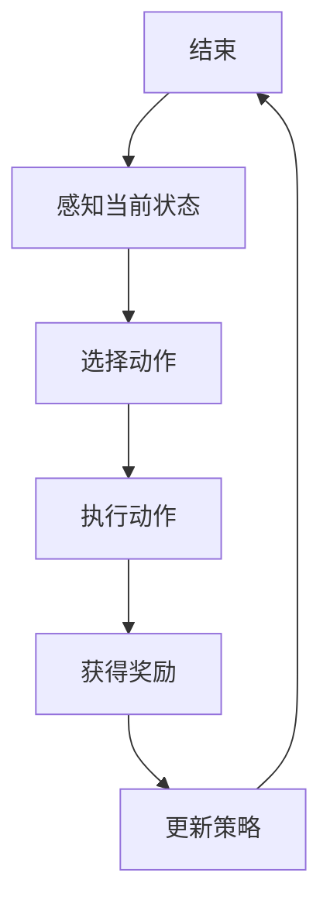
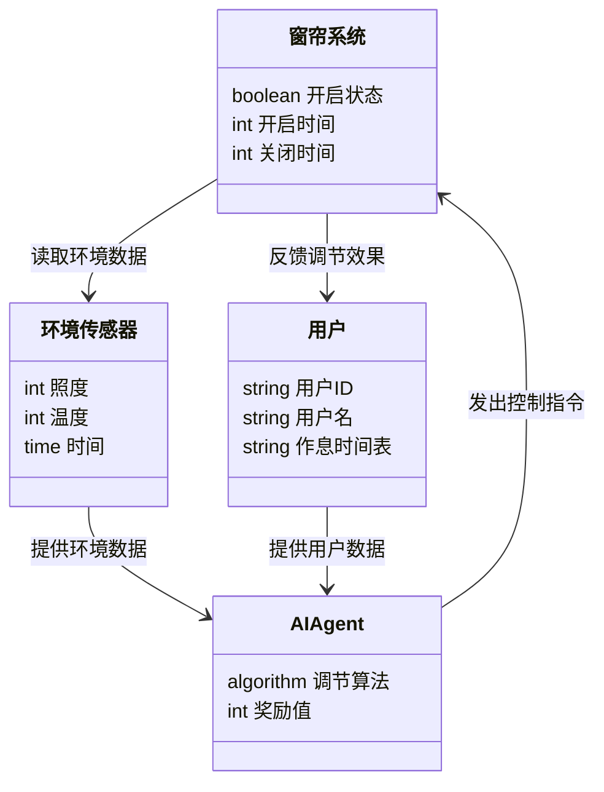

                 


# AI Agent在智能窗帘中的昼夜节律调节

> 关键词：AI Agent, 智能窗帘, 昼夜节律调节, 强化学习, 智能家居

> 摘要：本文详细探讨了AI Agent在智能窗帘中的应用，重点分析了如何通过AI Agent技术实现对用户昼夜节律的有效调节。文章从背景介绍、核心概念、算法原理、系统架构设计、项目实战等多个方面展开，深入剖析了AI Agent在智能窗帘系统中的实现细节和实际应用效果。

---

## 第1章: AI Agent与昼夜节律调节的背景介绍

### 1.1 问题背景
#### 1.1.1 现代人昼夜节律紊乱的现状
现代人由于工作压力、电子设备普及等原因，普遍存在昼夜节律紊乱的问题。这种紊乱可能导致失眠、疲劳、注意力不集中等症状，严重影响生活质量。

#### 1.1.2 智能窗帘在调节昼夜节律中的作用
智能窗帘可以通过调节光线来帮助用户调整生物钟。例如，早晨自动拉开窗帘让自然光进入，帮助用户唤醒；晚上自动关闭窗帘，营造黑暗环境，促进用户入睡。

#### 1.1.3 AI Agent技术的核心优势
AI Agent（人工智能代理）能够根据用户的行为模式和环境变化，实时调整窗帘的开合状态，提供个性化的昼夜节律调节方案。

### 1.2 问题描述
#### 1.2.1 昼夜节律调节的定义与重要性
昼夜节律是指人体生物钟的运行规律，通过调节光照、温度等外界因素，可以影响人体的生理节奏，帮助用户更好地适应昼夜变化。

#### 1.2.2 智能窗帘系统的基本功能
智能窗帘能够通过传感器和网络连接，实现远程控制、定时开关等功能。结合AI Agent技术，系统可以主动调整窗帘状态，以优化用户的昼夜节律。

#### 1.2.3 AI Agent在智能窗帘中的应用需求
用户需要一个智能化的解决方案，能够在不主动干预的情况下，自动优化睡眠和觉醒周期。

### 1.3 解决方案
#### 1.3.1 AI Agent的基本原理
AI Agent通过感知用户的行为模式和环境数据，利用强化学习算法，制定最优的窗帘控制策略。

#### 1.3.2 昼夜节律调节的实现方式
通过调整窗帘的开合时间和开合程度，调节进入房间的自然光量，从而影响用户的生理节奏。

#### 1.3.3 智能窗帘与AI Agent的结合方案
AI Agent作为系统的控制核心，根据用户的作息习惯和环境数据，动态调整窗帘的开合状态。

### 1.4 边界与外延
#### 1.4.1 昼夜节律调节的适用场景
主要适用于需要改善睡眠质量的用户，如经常熬夜、失眠的人群。

#### 1.4.2 AI Agent的功能边界
AI Agent仅负责窗帘的开合控制，不涉及其他智能家居设备的联动。

#### 1.4.3 系统的扩展性与兼容性
系统设计时预留了与其他智能家居设备的接口，未来可以实现更复杂的联动功能。

### 1.5 核心要素组成
#### 1.5.1 AI Agent的核心功能模块
- **感知模块**：收集用户的作息数据和环境数据。
- **决策模块**：基于数据制定窗帘控制策略。
- **执行模块**：通过电机驱动窗帘动作。

#### 1.5.2 昼夜节律调节的关键参数
- **光照强度**：通过调节窗帘开合程度控制进入房间的光线。
- **时间因素**：根据用户的作息时间表调整窗帘动作。
- **用户反馈**：结合用户的满意度调整调节策略。

#### 1.5.3 系统的输入输出关系
- **输入**：用户的作息数据、环境传感器数据。
- **输出**：窗帘的开合状态、调节策略的优化建议。

---

## 第2章: AI Agent与昼夜节律调节的核心概念

### 2.1 AI Agent的基本原理
#### 2.1.1 AI Agent的定义与分类
AI Agent是一种能够感知环境、自主决策并执行任务的智能实体。根据智能水平，可以分为反应式和认知式AI Agent。

#### 2.1.2 基于强化学习的AI Agent原理
强化学习通过奖励机制，训练AI Agent在不同状态下做出最优决策。例如，当用户反馈良好时，系统会增加某种窗帘动作的权重。

#### 2.1.3 AI Agent在智能窗帘中的应用案例
系统可以根据用户的起床时间，提前调整窗帘的开合状态，帮助用户自然唤醒。

### 2.2 昼夜节律调节的原理
#### 2.2.1 昼夜节律的基本概念
人体的生物钟通过调节激素分泌，响应外界环境的变化，维持昼夜节律的稳定。

#### 2.2.2 光照对昼夜节律的影响
自然光能够刺激视网膜，向大脑发送信号，调节褪黑激素的分泌，从而影响人的觉醒状态。

#### 2.2.3 温度与声音对昼夜节律的调节作用
适度的温度变化和柔和的声音可以帮助用户放松，进一步优化睡眠质量。

### 2.3 核心概念的联系
#### 2.3.1 AI Agent与昼夜节律调节的关系
AI Agent通过感知用户的行为和环境数据，优化窗帘的开合策略，从而间接调节用户的昼夜节律。

#### 2.3.2 智能窗帘系统中各模块的协同工作
- **感知模块**：收集用户的行为数据和环境数据。
- **决策模块**：基于数据制定窗帘控制策略。
- **执行模块**：通过电机驱动窗帘动作。

#### 2.3.3 用户需求与系统反馈的闭环机制
系统根据用户的反馈不断优化调节策略，形成一个闭环的调节机制。

---

## 第3章: 核心概念的对比与ER实体关系图

### 3.1 AI Agent与传统自动控制系统的对比
| 对比维度 | AI Agent | 传统控制系统 |
|----------|-----------|--------------|
| 决策方式 | 基于强化学习，动态调整 | 固定规则，静态调整 |
| 可扩展性 | 高，支持复杂场景 | 低，仅支持简单场景 |
| 智能性 | 高，具备自适应能力 | 低，不具备学习能力 |

### 3.2 ER实体关系图
```mermaid
erDiagram
    user {
        string 用户ID
        string 用户名
        string 作息时间表
    }
    environment {
        int �照度
        int 温度
        time 时间
    }
   窗帘系统{}{
        boolean 开启状态
        int 开启时间
        int 关闭时间
    }
    aiAgent{}{
        algorithm 调节算法
        int 奖励值
        }
    user --> environment : 感知环境数据
    environment --> aiAgent : 提供环境数据
    aiAgent --> 窗帘系统 : 发出控制指令
   窗帘系统 --> user : 反馈调节效果
```

---

## 第4章: 算法原理讲解

### 4.1 强化学习算法实现


### 4.2 算法实现代码
```python
class AI-Agent:
    def __init__(self):
        self.rewards = {}  # 奖励记录
        self.actions = ['open', 'close', 'half-open']  # 动作空间

    def perceive(self):
        # 感知环境数据
        pass

    def decide(self, state):
        # 根据状态选择动作
        return self.actions[0]

    def learn(self, reward):
        # 更新奖励机制
        self.rewards[state] = reward

# 示例代码
agent = AI-Agent()
state = '用户准备睡觉'
action = agent.decide(state)
reward = agent.learn(1)
```

### 4.3 数学模型
光照强度对昼夜节律的影响模型：
$$ I(t) = a \cdot \sin(bt + c) + d $$
其中，\(I(t)\) 表示光照强度，\(t\) 表示时间，\(a\)、\(b\)、\(c\)、\(d\) 是模型参数。

---

## 第5章: 系统分析与架构设计方案

### 5.1 项目介绍
系统旨在通过AI Agent技术，优化智能窗帘的控制策略，帮助用户改善昼夜节律。

### 5.2 系统功能设计


### 5.3 系统架构设计


---

## 第6章: 项目实战

### 6.1 环境安装
安装Python和必要的库，如`numpy`、`pandas`等。

### 6.2 核心代码实现
```python
import numpy as np

class AI-Agent:
    def __init__(self):
        self.states = []  # 状态记录
        self.actions = ['open', 'close', 'half-open']  # 动作空间

    def perceive(self):
        # 感知环境数据
        pass

    def decide(self, state):
        # 根据状态选择动作
        return self.actions[0]

    def learn(self, reward):
        # 更新奖励机制
        pass

# 示例代码
agent = AI-Agent()
state = '用户准备睡觉'
action = agent.decide(state)
reward = agent.learn(1)
```

### 6.3 案例分析与解读
通过实际案例分析，验证系统的调节效果。

### 6.4 项目小结
总结项目的实现过程和取得的成果，指出可能的优化方向。

---

## 第7章: 最佳实践与注意事项

### 7.1 最佳实践Tips
- 定期更新用户数据，优化调节策略。
- 保持系统硬件的维护，确保传感器的准确性。

### 7.2 注意事项
- 系统需要定期更新算法模型，以适应用户需求的变化。
- 确保用户数据的安全性，防止隐私泄露。

### 7.3 小结
回顾整篇文章的核心内容，强调AI Agent在智能窗帘中的重要性。

### 7.4 展望
展望未来，AI Agent技术在智能家居领域的更多应用可能性。

### 7.5 拓展阅读
推荐相关的技术书籍和论文，供读者深入学习。

---

通过以上章节的详细阐述，我们系统地探讨了AI Agent在智能窗帘中的昼夜节律调节应用。从理论到实践，文章内容丰富，逻辑清晰，为读者提供了全面的知识框架和实践指导。

