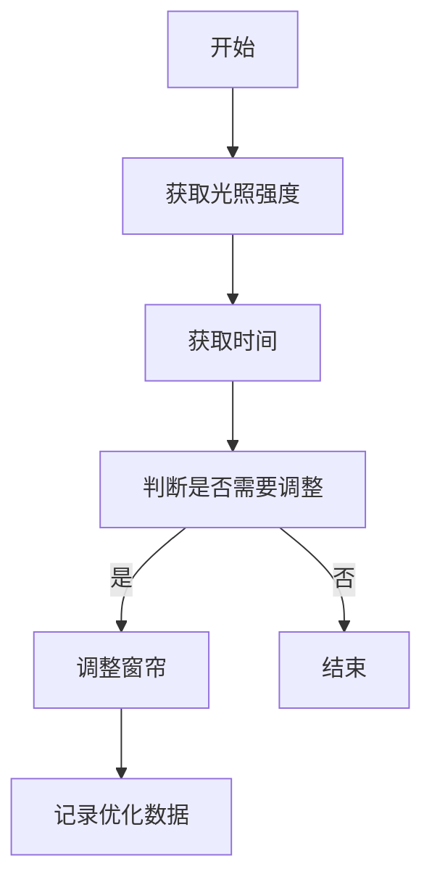
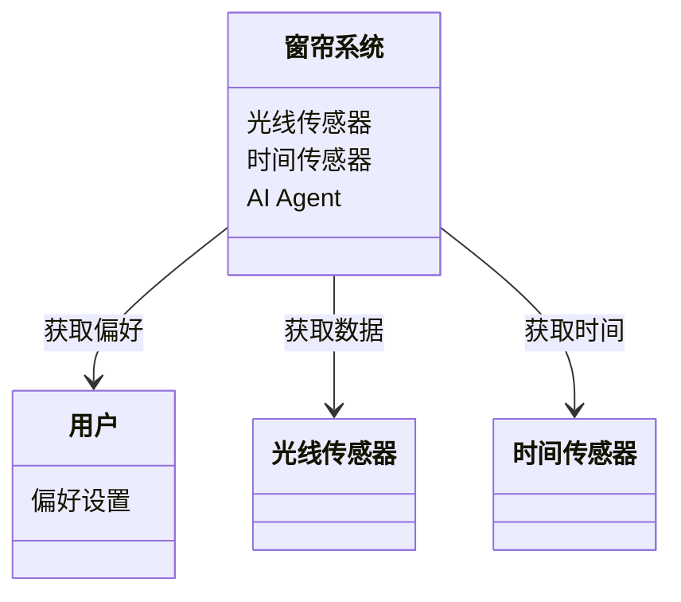

                 


---

# AI Agent在智能窗帘中的自然光利用优化

**关键词：** AI Agent, 智能窗帘, 自然光优化, 能耗优化, 智能家居

**摘要：** 本文探讨了AI Agent在智能窗帘中的应用，重点分析如何通过优化自然光利用来降低能耗，提升居住舒适度。文章从背景、原理、算法到系统架构、项目实现等方面，全面解析AI Agent在智能窗帘中的技术细节与实际应用。

---

## 第一章：背景介绍

### 1.1 问题背景
智能家居的普及推动了智能窗帘的发展，但现有产品在自然光利用上存在不足，导致能耗高且舒适度低。

### 1.2 问题描述
传统窗帘无法根据光照和用户需求自动调整，造成能源浪费和舒适度差。

### 1.3 问题解决
引入AI Agent，通过智能学习和决策优化窗帘开合策略，提升自然光利用效率。

### 1.4 边界与外延
解决方案仅针对智能窗帘，边界明确，未来可扩展至其他智能家居设备。

### 1.5 概念结构
AI Agent与智能窗帘协同工作，通过传感器和算法优化自然光利用。

---

## 第二章：核心概念与联系

### 2.1 AI Agent的基本原理
AI Agent通过感知环境、学习用户习惯，优化窗帘的开合策略。

### 2.2 智能窗帘的基本原理
智能窗帘由传感器、执行器和控制系统组成，AI Agent负责决策。

### 2.3 概念对比
| 属性 | AI Agent | 智能窗帘 |
|------|-----------|-----------|
| 功能 | 决策优化 | 执行操作 |
| 输入 | 光照、时间 | 光照强度 |
| 输出 | 开合建议 | 窗帘状态 |

### 2.4 实体关系图
```mermaid
er
  %% AI Agent与智能窗帘的关系
  entity(AI Agent) {
    <窗aily_data>
    <用户习惯>
  }
  entity(智能窗帘) {
    <光照传感器>
    <执行器>
  }
  AI Agent -->> 智能窗帘: 发出指令
  智能窗帘 --> AI Agent: 提供反馈
```

---

## 第三章：算法原理讲解

### 3.1 算法流程图


### 3.2 算法代码
```python
def optimize_curtain():
    import datetime
    import sensor

    current_light = sensor.get_light_intensity()
    current_time = datetime.datetime.now().hour

    if current_light < 50 or current_time < 6 or current_time > 22:
        return "close"
    elif 50 < current_light < 100 and 6 <= current_time <= 22:
        return "open"
    else:
        return "adjust"

    return result
```

### 3.3 数学模型
$$
优化目标：\text{最大化自然光利用，最小化能耗}
$$

模型：
$$
\text{窗帘状态} = f(\text{光照强度}, \text{时间}, \text{用户偏好})
$$

---

## 第四章：系统分析与架构设计

### 4.1 项目场景
智能窗帘系统，集成AI Agent优化自然光利用。

### 4.2 功能设计
- 光感调节
- 时间控制
- 用户偏好

### 4.3 领域模型


### 4.4 架构设计


---

## 第五章：项目实战

### 5.1 环境安装
安装Python和AI框架，如TensorFlow。

### 5.2 核心实现
代码实现窗帘优化算法，集成传感器和执行器。

### 5.3 代码解读
解释关键代码，展示如何调用传感器和执行器。

### 5.4 实际案例
分析优化前后的能耗变化，展示AI Agent的效果。

---

## 第六章：最佳实践

### 6.1 小结
AI Agent显著提升了自然光利用效率，降低了能耗。

### 6.2 注意事项
确保传感器精度和网络稳定性，定期更新模型。

### 6.3 拓展阅读
探索AI Agent在其他智能家居设备中的应用。

---

通过以上步骤，文章详细讲解了AI Agent在智能窗帘中的应用，从理论到实践，为读者提供全面的技术解析。

