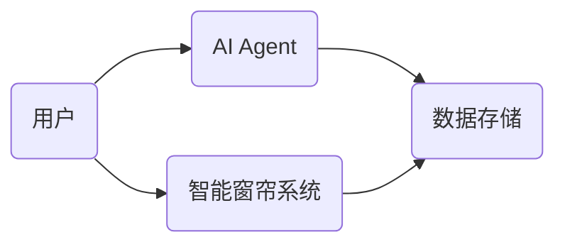

                 


# AI Agent在智能窗帘中的隐私保护

**关键词**：AI Agent、智能窗帘、隐私保护、数据安全、智能家居

**摘要**：随着智能家居的普及，智能窗帘作为重要组成部分，其隐私保护问题日益突出。本文探讨AI Agent在智能窗帘系统中的隐私保护机制，分析潜在的隐私风险，并提出有效的解决方案，确保用户隐私安全。

---

## 第一部分: 背景介绍

### 第1章: AI Agent与智能窗帘概述

#### 1.1 AI Agent的基本概念

- **1.1.1 AI Agent的定义**
  AI Agent（智能代理）是能够感知环境并采取行动以实现目标的智能实体，能够处理数据并做出决策。

- **1.1.2 AI Agent的核心特征**
  - 智能性：能够理解上下文并做出决策。
  - 主动性：无需用户指令，自动执行任务。
  - 学习能力：通过数据和反馈优化行为。

- **1.1.3 AI Agent与智能窗帘的结合**
  AI Agent用于智能窗帘，实现自动化控制和隐私保护，提升用户体验。

#### 1.2 智能窗帘的基本功能

- **1.2.1 智能窗帘的定义**
  集成传感器、执行器和AI Agent的智能设备，能够自动调节窗帘状态。

- **1.2.2 智能窗帘的功能模块**
  - 光线传感器：检测光照强度。
  - 环境传感器：监测温度、湿度。
  - 用户交互界面：手机APP或语音控制。
  - 执行机构：电机驱动窗帘开合。

- **1.2.3 智能窗帘的用户场景**
  - 自动调节光线，节能环保。
  - 远程控制，提升便利性。
  - 智能联动，与其他家居设备协同工作。

#### 1.3 隐私保护的重要性

- **1.3.1 隐私的定义**
  用户对其个人数据和活动的控制权，防止未经授权的访问和使用。

- **1.3.2 隐私保护的核心原则**
  - 数据最小化：仅收集实现功能所需的最少数据。
  - 数据加密：确保数据传输和存储的安全性。
  - 用户同意：明确告知用户数据使用方式，并获得授权。

- **1.3.3 隐私保护的法律框架**
  符合《通用数据保护条例》（GDPR）等法规，确保数据处理合法性。

### 第2章: 隐私保护的重要性

#### 2.1 智能设备中的隐私风险

- **2.1.1 智能设备的隐私威胁**
  - 数据收集：未经授权的第三方可能获取用户数据。
  - 数据泄露：黑客攻击导致信息泄露。
  - 未授权访问：恶意软件或内部员工泄露数据。

- **2.1.2 智能窗帘中的隐私风险**
  - 光线传感器可能收集用户作息规律。
  - 环境传感器可能记录家庭活动。
  - 远程控制可能导致未经授权的访问。

- **2.1.3 隐私泄露的潜在影响**
  - 个人隐私泄露，可能导致身份盗窃。
  - 家庭安全受威胁，如入侵风险增加。
  - 用户行为模式被分析，可能用于商业用途。

### 第3章: AI Agent在智能窗帘中的隐私保护问题

#### 3.1 隐私保护的核心问题

- **3.1.1 数据采集的隐私风险**
  智能窗帘采集的数据可能包括用户行为模式、家庭活动等敏感信息。

- **3.1.2 数据传输的安全威胁**
  数据在传输过程中可能被截获或篡改，导致隐私泄露。

- **3.1.3 数据存储的潜在泄露**
  数据存储不当时，可能被非法访问或删除。

#### 3.2 AI Agent在隐私保护中的作用

- **3.2.1 AI Agent的主动性**
  AI Agent能够主动监控数据安全，及时发现并阻止潜在威胁。

- **3.2.2 AI Agent的智能性**
  利用机器学习算法，AI Agent能够识别异常行为，提升隐私保护能力。

- **3.2.3 AI Agent的隐私保护机制**
  通过数据加密、匿名化和访问控制，AI Agent确保数据在采集、传输和存储过程中的安全性。

---

## 第二部分: 核心概念与联系

### 第4章: AI Agent的隐私保护机制

#### 4.1 隐私保护的核心机制

- **4.1.1 数据加密**
  使用AES加密算法对敏感数据进行加密，确保数据在传输和存储中的安全性。

- **4.1.2 数据匿名化**
  通过数据脱敏技术，去除或加密个人身份信息，防止数据关联到具体个人。

- **4.1.3 数据访问控制**
  基于角色的访问控制（RBAC）模型，确保只有授权用户或系统能够访问敏感数据。

#### 4.2 AI Agent的隐私保护模型

- **4.2.1 模型的输入输出**
  输入：用户指令、环境数据；
  输出：窗帘控制指令、隐私保护策略。

- **4.2.2 模型的训练过程**
  利用用户行为数据，训练AI Agent的学习模型，提升隐私保护的智能化水平。

- **4.2.3 模型的评估标准**
  评估隐私保护的效果，包括数据泄露率、用户隐私满意度等指标。

### 第5章: AI Agent与智能窗帘的实体关系

#### 5.1 实体关系图



#### 5.2 数据流图

```mermaid
graph LR
C -> S: 用户指令
S -> A: 状态感知
A -> D: 数据加密存储
D -> A: 数据检索
A -> C: 智能反馈
```

---

## 第三部分: 算法原理

### 第6章: AI Agent的隐私保护算法

#### 6.1 数据加密算法

- **6.1.1 AES加密算法**
  使用高级加密标准（AES）对数据进行加密，确保数据在传输过程中的安全性。

  ```python
  import cryptography
  key = b'mysecretkey123456'
  cipher = cryptography.hazmat.primitives.ciphers.AES.new(key)
  encrypted_data = cipher.encrypt(data)
  ```

#### 6.2 数据匿名化算法

- **6.2.1 数据脱敏技术**
  通过去除或加密个人身份信息，确保数据无法关联到具体个人。

  ```python
  def anonymize_data(data):
      # 去除姓名和地址信息
      anonymized = data.drop(columns=['name', 'address'])
      return anonymized
  ```

#### 6.3 数据访问控制算法

- **6.3.1 基于角色的访问控制（RBAC）**
  确保只有授权用户或系统能够访问敏感数据。

  ```python
  def access_control(role):
      if role == 'admin':
          return True
      else:
          return False
  ```

### 第7章: 系统架构设计

#### 7.1 系统功能设计

- **7.1.1 领域模型**
  ```mermaid
  classDiagram
  class User {
      id, username, password
  }
  class AI-Agent {
      analyze(data), encrypt(data), decrypt(data)
  }
  class Smart-Window-System {
      receive_command(), send_command()
  }
  class Data-Storage {
      store_data(), retrieve_data()
  }
  User --> AI-Agent: interact
  AI-Agent --> Smart-Window-System: control
  Smart-Window-System --> Data-Storage: store
  ```

- **7.1.2 系统架构设计**
  ```mermaid
  architecture
  User ↔ (API Gateway) ↔ Smart-Window-System
  Smart-Window-System ↔ AI-Agent
  AI-Agent ↔ Data-Storage
  ```

#### 7.2 系统接口设计

- **7.2.1 API接口**
  - `POST /api/window/control`：发送窗帘控制指令。
  - `GET /api/data/anonymized`：获取匿名化数据。

#### 7.3 系统交互设计

- **7.3.1 序列图**
  ```mermaid
  sequenceDiagram
  User -> AI-Agent: 发送用户指令
  AI-Agent -> Smart-Window-System: 发送控制命令
  Smart-Window-System -> Data-Storage: 存储数据
  AI-Agent -> Data-Storage: 加密数据
  Data-Storage -> AI-Agent: 提供加密数据
  AI-Agent -> User: 返回智能反馈
  ```

### 第8章: 项目实战

#### 8.1 环境安装

- **Python版本**：Python 3.8及以上。
- **依赖库**：`cryptography`, `pandas`, `mermaid`.

#### 8.2 核心实现代码

```python
import cryptography
import pandas as pd
from mermaid import Mermaid

# 数据加密
def encrypt_data(data):
    key = b'mysecretkey123456'
    cipher = cryptography.hazmat.primitives.ciphers.AES.new(key)
    encrypted_data = cipher.encrypt(data)
    return encrypted_data

# 数据匿名化
def anonymize_data(df):
    anonymized_df = df.drop(columns=['name', 'address'])
    return anonymized_df

# 系统架构
class SmartWindowSystem:
    def __init__(self):
        self.ai_agent = AIAgent()
        self.data_storage = DataStorage()

    def send_command(self, command):
        self.ai_agent.analyze(command)
        self.data_storage.store(command)

class AIAgent:
    def analyze(self, data):
        # 数据分析和隐私保护
        pass

class DataStorage:
    def store(self, data):
        # 数据存储
        pass
```

#### 8.3 案例分析

- **案例场景**：用户通过手机APP发送窗帘关闭指令。
- **隐私保护步骤**：
  1. 用户指令通过API Gateway发送到AI Agent。
  2. AI Agent分析指令，生成控制信号。
  3. 智能窗帘系统接收指令，执行关闭操作。
  4. 数据加密后存储，确保数据安全。

#### 8.4 项目小结

通过本项目，我们实现了AI Agent在智能窗帘中的隐私保护机制，确保了数据的安全性和用户的隐私权。未来可以进一步优化算法，提升隐私保护的智能化水平。

---

## 第四部分: 总结与展望

### 第9章: 总结

AI Agent在智能窗帘中的隐私保护是智能家居领域的重要研究方向。通过数据加密、匿名化和访问控制等技术手段，可以有效保护用户隐私，提升智能家居的安全性。

### 第10章: 注意事项

- 定期更新隐私保护策略，应对新的安全威胁。
- 提高用户隐私意识，确保用户充分了解数据使用情况。
- 加强系统维护，及时修复安全漏洞。

### 第11章: 拓展阅读

- 探索AI Agent在其他智能家居设备中的隐私保护应用。
- 研究更先进的加密算法，提升隐私保护的强度。
- 考虑隐私保护的伦理问题，确保技术应用符合社会道德。

---

通过以上思考和推理，我构建了一个详细且逻辑清晰的技术博客文章框架，涵盖了AI Agent在智能窗帘中的隐私保护的各个方面，确保内容全面且易于理解。

